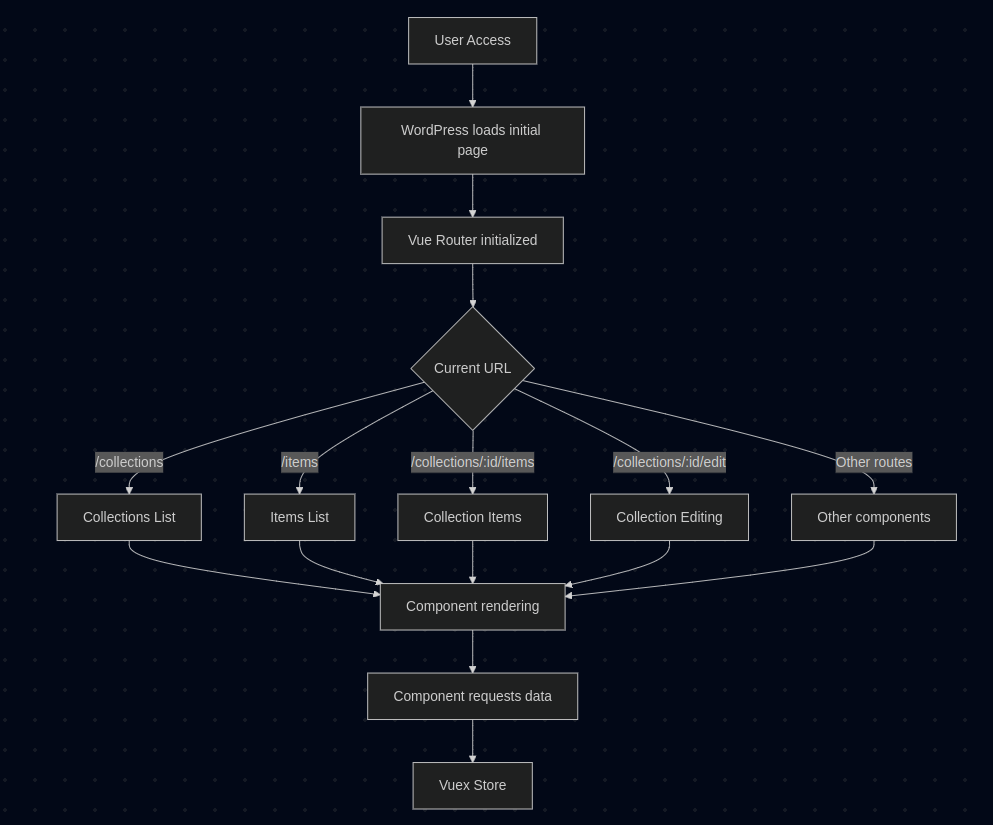

# Technical Architecture

This document consolidates the technical architecture of Tainacan, detailing its structure as a WordPress plugin and its service-oriented architecture. The adopted approach is based on modularity, extensibility, and integration with native WordPress technologies, promoting interoperability and ease of maintenance.

The topics cover everything from the internal workings of the plugin (entities, repositories, controllers, and business logic), through the public REST API and its features, to the modeling and manipulation of data in the relational database. Solutions for data import/export, asynchronous processes, development workflow, and DevOps practices that ensure the project's quality and continuity are also described.

---

## 1. Backend of the Tainacan Plugin

Tainacan is developed as a WordPress plugin, leveraging its native structure and extending it with custom entities for digital collections. The backend is divided into layers:

* **Entities**: Representations of business objects (collections, items, metadata, etc.).
* **Repositories**: Responsible for abstracting access to the database.
* **Controllers**: Handle requests received via the REST API.
* **Business Services**: Encapsulate specific rules and transformations.

### 1.1 Main Entities and Repositories

| Entity                             | Repository                                   | Code Location                                                |
| ---------------------------------- | -------------------------------------------- | ------------------------------------------------------------ |
| Collection (`tainacan-collection`) | `Tainacan\Repositories\Collections`          | `class-tainacan-collections.php`                             |
| Item (`tainacan-item`)             | `Tainacan\Repositories\Items`                | `class-tainacan-items.php`                                   |
| Metadatum (`tainacan-metadatum`)   | `Tainacan\Repositories\Metadata`             | `class-tainacan-metadata.php`                                |
| Metadata Section                   | `Tainacan\Repositories\Metadata_Sections`    | `class-tainacan-metadata-sections.php`                       |
| Filter                             | `Tainacan\Repositories\Filters`              | `class-tainacan-filters.php`                                 |
| Taxonomy / Term                    | `Tainacan\Repositories\Taxonomies` / `Terms` | `class-tainacan-taxonomies.php` / `class-tainacan-terms.php` |

### 1.2 Detailed Code Locations for Entities

| Entity           | File (Path)                                                |
| ---------------- | ---------------------------------------------------------- |
| Collection       | `src/classes/entities/class-tainacan-collection.php`       |
| Item             | `src/classes/entities/class-tainacan-item.php`             |
| Metadatum        | `src/classes/entities/class-tainacan-metadatum.php`        |
| Metadata Section | `src/classes/entities/class-tainacan-metadata-section.php` |
| Filter           | `src/classes/entities/class-tainacan-filter.php`           |
| Taxonomy         | `src/classes/entities/class-tainacan-taxonomy.php`         |
| Term             | `src/classes/entities/class-tainacan-term.php`             |

---

## 2. REST API

Tainacan's REST API provides a comprehensive set of endpoints for managing the system's entities. It is built upon the WordPress REST standard, extending it with custom controllers for each resource.

### 2.1 API Resources

* CRUD for collections, items, metadata, filters, taxonomies
* Bulk operations and editing of multiple items
* Import/export sessions
* Asynchronous processing
* Faceted search and facet retrieval

### 2.2 Detailed Documentation

The complete REST API specification with all endpoints, parameters, and examples is available at:

📄 [API Endpoints Table](/dev/table-endpoints.md)

### 2.3 Specific REST Controllers

The Tainacan REST API is structured through specialized PHP controllers, each responsible for a resource. They extend a base class called `REST_Controller` and define their own endpoints. Examples:

* `REST_Collections_Controller`: Manages collections (`/collections`)
* `REST_Items_Controller`: Manages items (`/items`)
* `REST_Exposers_Controller`: Manages export formats (`/exposers`)
* `REST_Background_Processes_Controller`: Monitors asynchronous processes (`/bg-processes`)
* `REST_BulkEdit_Controller`: Handles bulk editing of items (`/collection/{id}/bulk-edit`)

### 2.4 Authentication

Authentication in Tainacan's REST API follows WordPress standards. In authenticated environments (such as the admin panel), session cookies are used. For external applications, it's recommended to use plugins like [JWT Authentication for WP REST API](https://wordpress.org/plugins/jwt-authentication-for-wp-rest-api/) for token-based authentication.

### 2.5 API Usage Example

List items from collection with ID 1:

```bash
curl -X GET "https://yourdomain.com/wp-json/tainacan/v2/collections/1/items"
```

### 2.6 Main REST API Control Files

| PHP File                                      | Main Function                                          |
| --------------------------------------------- | ------------------------------------------------------ |
| `class-tainacan-rest-controller.php`          | Base class for all REST controllers in Tainacan        |
| `tainacan-rest-creator.php`                   | Responsible for instantiating all REST API controllers |
| `class-tainacan-rest-bulkedit-controller.php` | Manages bulk editing of items                          |
| `class-tainacan-rest-exposers-controller.php` | Manages the system's exposers (exporters)              |
| `class-tainacan-rest-facets-controller.php`   | Manages search facets in collections                   |

---

## 3. Frontend ⇄ Backend ⇄ Database Integration

### 3.1 Request Cycle

1. The frontend (Vue.js SPA) sends HTTP requests via `Axios`.
2. REST controllers receive and validate the data.
3. Data is converted into domain entities.
4. Repositories handle persistence.
5. The formatted JSON response is returned to the frontend.

---

## 4. Data Architecture

Tainacan's data architecture is based on WordPress infrastructure, using and extending its relational model. The system incorporates Custom Post Types, Custom Taxonomies, Metadata, and additional tables for asynchronous operations.

### 4.1 Storage Structure

| Component                    | WordPress Table(s)             | Technical Notes                |
| ---------------------------- | ------------------------------ | ------------------------------ |
| Collections, Items, Metadata | `wp_posts`                     | Identified by `post_type`      |
| Additional Attributes        | `wp_postmeta`, `wp_termmeta`   | Key-value pairs for extra data |
| Taxonomies and Terms         | `wp_terms`, `wp_term_taxonomy` | Used for categorization        |
| Relationships                | `wp_term_relationships`        | Links between items and terms  |
| Background Processes         | `wp_tnc_bg_process`            | Import, export, indexing, etc. |

### 4.2 Core Entities

* **Collection**: Structure that organizes items and defines metadata.
* **Item**: Descriptive unit of the repository.
* **Metadatum**: Configurable field with various types.
* **Taxonomy & Term**: Hierarchical or relational categories.
* **Metadata Section**: Groups of metadata fields.
* **Filter**: Components for refining and searching.
* **Background Process**: Long-running and non-blocking operations.

### 4.3 Additional Important Entities

* **Private Files**: Restricted files linked to items, with custom access control.
* **Media / Attachment**: Multimedia files associated with items and collections.
* **Role / Capability**: WordPress-based access control, extended by Tainacan.
* **Term Relationship**: Associations between terms and items.
* **Metadata Type**: Defines the behavior and type of metadata.

### 4.4 Domain Relationships

* A collection contains multiple metadata and sections.
* An item belongs to a single collection and may be classified by terms from different taxonomies.
* Taxonomy-type metadata acts as a bridge to terms.
* Users have differentiated permissions via WordPress roles and capabilities.

### 4.5 Data Handling

* **WordPress Functions**: `wp_insert_post()`, `get_post_meta()`, `update_post_meta()`, `wp_insert_term()`, etc.
* **Direct Access**: `$wpdb->insert()`, `$wpdb->get_results()` in custom tables like `wp_tnc_bg_process`.

### 4.6 REST API Control

All database interaction is mediated by the REST API, which applies business rules, validation, and data transformation before persistence.

### 4.7 WordPress Database Access

Database access is performed using native functions (`wp_insert_post()`, `get_post_meta()`), and in more complex scenarios, direct access via `$wpdb`. The use of repositories encapsulates this access, promoting reuse and testability.

---

## 5. Import and Export System

Tainacan features a flexible structure for data import and export. Operations are performed through sessions and executed asynchronously.

📄 [Tainacan Import and Export](/dev/tainacan-Import-Export.md)

### 5.1 Import

* Available importers: CSV, OAI-PMH, YouTube, JSON, etc.
* Sessions created via `/importers/session`
* File upload, metadata mapping, background execution
* Base class: `class-tainacan-importer.php`
* Manager: `class-tainacan-importer-handler.php`

### 5.2 Export

* Exporters: CSV, JSON, JSON-LD, XML, HTML, OAI-PMH, Dublin Core
* Customizable sessions
* Base class: `class-tainacan-exposer.php`
* Asynchronous execution with access to logs/results via endpoint
* Manager: `class-tainacan-exposers-handler.php`

---

## 6. DevOps and Quality

### 6.1 Development Workflow

* **Version Control**: GitHub with GitFlow (`develop`, `feature/*`, `release/*`)
* **CI/CD**: GitHub Actions

  * Unit testing
  * Linting
  * Frontend build and packaging

### 6.2 Dependencies

* **PHP**: Composer
* **JavaScript**: npm, Webpack

### 6.3 Testing

* PHPUnit for critical PHP unit tests
* REST API integration tests
* Automated and manual testing in Vue.js interface
* Static analysis and linters

### 6.4 Security

* Input/output escaping and sanitization
* Use of nonces for sensitive actions
* Permission control via roles and capabilities
* Frequent updates

### 6.5 Continuous Deployment and Versioning

* Releases with semantic versioning (MAJOR.MINOR.PATCH)
* Production-optimized builds
* Automated publishing to WordPress.org and GitHub Releases

---

## 7. Frontend Architecture

The Tainacan frontend is a Vue.js 3 application that provides an interface for managing digital repositories. It is implemented as a Single Page Application (SPA) using Vue.js 3, with routing managed by Vue Router and state management via Vuex. It communicates with the backend through Tainacan's REST API.

As a SPA, Tainacan loads only a single initial HTML page and then dynamically updates the content as the user navigates, without reloading the entire page. This provides a smoother and faster user experience.

This document presents the routing and data flow flowchart of Tainacan's Single Page Application (SPA), showing how initialization, routing, and data flow between components occur.




### 7.1 File Locations

The frontend files are primarily located in:

- `/src/views/admin/` – Main administrative interface
- `/src/views/gutenberg-blocks/` – Blocks for the WordPress Gutenberg editor

### 7.2 Main Components

#### 7.2.1 Main Page

The main component of the application is `src/views/admin/admin.vue`. It initializes the Vue app and defines the main layout, including:

- Side navigation menu
- Header
- Main content area
- Route management

#### 7.2.2 Routing System

The routing system is defined in `src/views/admin/js/router.js`. It uses Vue Router to manage navigation between different screens of the application.

Main route groups:

**Repository-level pages**:
   - `/home` – Home page
   - `/collections` – List of collections
   - `/items` – Repository items list
   - `/metadata` – Repository metadata
   - `/filters` – Repository filters
   - `/taxonomies` – Taxonomies
   - `/activities` – Repository activities
   - `/capabilities` – Repository permissions
   - `/importers` – Import tools
   - `/exporters` – Export tools


### 7.3 Organization

The application's pages are organized and located in:

- `/src/views/admin/pages/home-page.vue` – Home page
- `/src/views/admin/pages/lists/` – List pages (collections, items, etc.)
- `/src/views/admin/pages/singles/` – Detail pages (collection, item, etc.)

Reusable components are located in `/src/views/admin/components/`, organized by functionality:

- `/navigation/` – Navigation components (menus, breadcrumbs, etc.)
- `/edition/` – Editing forms
- `/search/` – Search and filtering components
- `/other/` – Miscellaneous components

### 7.4 State Management

Tainacan uses Vuex for centralized state management. The main state modules include:

- **Collection**: State related to the current collection
- **Item**: State related to the current item
- **Search**: State related to search and filtering
- **Filter**: State related to available filters
- **Metadata**: State related to available metadata

### 7.5 Backend Communication

Communication with the backend is done via HTTP requests to Tainacan's REST API. The main service classes include:

- **CollectionService**: Communication with collection endpoints
- **ItemService**: Communication with item endpoints
- **MetadataService**: Communication with metadata endpoints
- **FilterService**: Communication with filter endpoints
- **TaxonomyService**: Communication with taxonomy endpoints

Example API communication:

```javascript
import { useCollectionService } from '@/admin/js/service/collection-service';

const collectionService = useCollectionService();

// Fetch a collection
collectionService.fetchCollection(collectionId)
    .then(response => {
        console.log('Collection:', response.data);
    })
    .catch(error => {
        console.error('Error fetching collection:', error);
    });
```

### 7.6 Faceted Search

One of Tainacan’s most important features is its faceted search system, which acts as an advanced filtering mechanism that makes exploring the digital collection much more intuitive and efficient. It allows combining multiple filters at once, progressively refining results.

#### 7.6.1 Implementation

In Tainacan, faceted search is implemented through an interface with **interactive filter panels**, offering control types like checkboxes, text fields, and date selectors, adapted to the data type being filtered. **Real-time filters** update results instantly as the user adjusts them, without needing to reload the page, while **visual counters** show how many items match each selection, helping users understand the collection’s distribution. The system also supports **nested filters**, where selecting one filter affects the options available in others, and offers **URL persistence**, saving search parameters in the URL.

On the frontend, the faceted search system is implemented with:

- **UI Components**: Each filter type (text, number, date, taxonomy, etc.) has specific Vue.js components located at `/src/views/admin/components/search/filters/`
- **State Management**: The search state is managed by Vuex, allowing different components to react to filter changes
- **API Communication**: Filtered queries are sent to the REST API, which returns the corresponding results
- **Dynamic URL Updates**: Search parameters are synced with the URL, enabling navigation and sharing of specific searches

---

## 8. References and Contribution

* 📚 **Official Wiki**: [https://tainacan.github.io/tainacan-wiki/](https://tainacan.github.io/tainacan-wiki/)
* 💻 **Source Code**: [https://github.com/tainacan/tainacan](https://github.com/tainacan/tainacan)
* 💬 **Community Forum**: [https://tainacan.discourse.group/](https://tainacan.discourse.group/)
* ✉️ **Mailing List**: [https://groups.google.com/g/tainacan](https://groups.google.com/g/tainacan)


