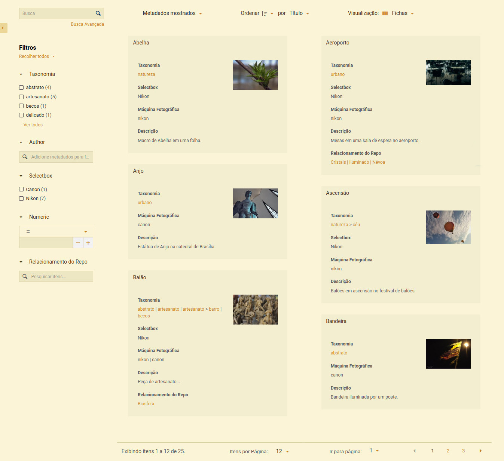
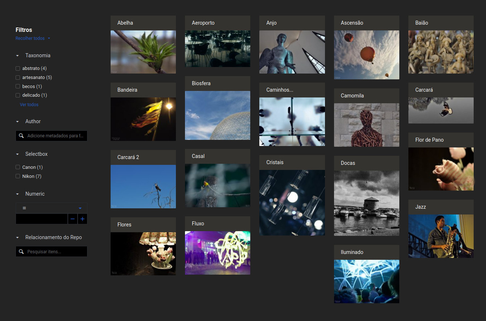

# Customizing the Items List

A lot can be done for adding Tainacan support to your theme using the template hierarchy logic mentioned in the section [Custom Templates](/dev/custom-templates.md). While this might be enough you may be interested in tweaking a bit more of the appearance of the most complex page that Tainacan offers to you: **The Items List Page**. Check the example bellow, of the child theme of [TwentyTwenty](https://wordpress.org/themes/twentytwenty/ ':ignore') that implemented a basic `archive-items.php`:


Looks like a powerful faceted search interface, but we definitely could make some adjustments to match better with our parent theme. It turns out that this page works in a much different strategy, which is explained in detail in [the "Vue Items List Component" section](/dev/the-vue-items-list-component.md). 

> To summarize, **the Items List returned by _tainacan_the_faceted_search()_ is actually a Vue.js component**, rendered on the client-side. Most of its code is shared with the admin panel version of the items list. 

## Playing with some customization variables

Luckily for theme developers, a lot of customization options are offered since Tainacan 0.16. There are two types of customizations that can easily be applied:

* [Passing `php` variables do the template function call](/dev/customizing-the-items-list#passing-php-variables-to-tainacan_the_faceted_search);
* [Passing `css` variables to the items list class](/dev/customizing-the-items-list#passing-css-variables-to-the-items-list-class);

Here are three examples of template results after playing with this variables:

<div style="display: flex; align-items: center; justify-contents: space-evenly;">
<div style="margin: 0 12px">



</div>
<div style="margin: 0 12px">



</div>
<div>


</div>
</div>

Lets see how this is possible:

### Passing `php` variables to _tainacan_the_faceted_search()_

As seen in our introdution of [introduction about creating compatible theme](/dev/creating-compatible-themes). Having a rich faceted search items list is as simple as creating a file with three lines. The magic is done by the `tainacan_the_faceted_search()` helper function, which renders the Vue.js component. Not surprisingly, this function offers several customization variables, that we describe bellow:

| Variable name                                | Type        | Default        | Description                          |
|----------------------------------------------|-------------|-------------|--------------------------------------|
| `$hide_filters`                              | `bool`      | `false`      | Completely hide filter sidebar or modal                                                         |
| `$hide_hide_filters_button`                  | `bool`      | `false`      | Hides the button resonsible for collpasing filters sidebar on desktop                           |   |
| `$hide_search`                               | `bool`      | `false`      | Hides the complete search bar, including advanced search link                                   |   |
| `$hide_advanced_search`                      | `bool`      | `false`      | Hides only the advanced search link                                                             |   |
| `$hide_displayed_metadata_dropdown`          | `bool`      | `false`      | Hides the "Displayed metadata" dropdown even if the current view modes allows it                |   |
| `$hide_sorting_area`                         | `bool`      | `false`      | Completely hides all sorting controls                                                           |   |
| `$hide_sort_by_button`                       | `bool`      | `false`      | Hides the button where user can select the metadata to sort by items (keeps the sort direction) |   |
| `$hide_exposers_button`                      | `bool`      | `false`      | Hides the "View as..." button, a.k.a. Exposers modal                                            |   |
| `$hide_items_per_page_button`                | `bool`      | `false`      | Hides the button for selecting amount of items loaded per page                                  |   |
| `$hide_go_to_page_button`                    | `bool`      | `false`      | Hides the button for skiping to a specific page                                                 |   |
| `$hide_pagination_area`                      | `bool`      | `false`      | Completely hides pagination controls                                                            |   |
| `$default_items_per_page`                    | `int`       | `12`       | Default number of items per page loaded                                                         |   |
| `$show_filters_button_inside_search_control` | `bool`      | `false`      | Display the "hide filters" button inside of the search control instead of floating              |   |
| `$start_with_filters_hidden`                 | `bool`      | `false`      | Loads the filters list hidden from start                                                        |   |
| `$filters_as_modal`                          | `bool`      | `false`      | Display the filters as a modal instead of a collapsable region on desktop                       |   |
| `$show_inline_view_mode_options`             | `bool`      | `false`      | Display view modes as inline icon buttons instead of the dropdown                               |   |
| `$show_fullscreen_with_view_modes`           | `bool`      | `false`      | Lists fullscreen viewmodes alongside with other view modes istead of separatelly                |   |
| `$default_view_mode`                         | `string`    | `masonry`    | The default view mode                                                                           |   |
| `$is_forced_view_mode`                       | `bool`      | `false`      | Ignores user prefs to always render the choosen default view mode                               |   |
| `$enabled_view_modes`                        | `string[]`  | *All registered view modes for repository and terms page. Enabled view modes on the collection settings for collection items list.*  | The list of enable view modes to display                                                        |   |

Notice that `$enabled_view_modes` are overided by collections setting when the items list is a collection items archive.

### Passing `css` variables to the items list class;

Besides that, you can use css variables to override Tainacan's own CSS variables. You can check all the existing ones [in this file](https://github.com/tainacan/tainacan/blob/develop/src/views/admin/scss/_custom_variables.scss). Notice, although, that it wouldn't be interesting to override them directly on the `:root` selector, as this would affect all of your Tainacan Admin styles as well. For themes, a better approach would be to override them directly on the `.theme-items-list` class. Bellow you can see the ones we consider more relevant for this part of the rendered Vue.js content:

```css

.theme-items-list {
    /* Form and Text styling */
    --tainacan-input-color: #1d1d1d; /* Not quite black */
    --tainacan-input-background-color: #fff;
    --tainacan-input-border-color: #dbdbdb; /* Some input borders disabled state colors */
    --tainacan-label-color: #454647;
    --tainacan-info-color: #555758;
    --tainacan-heading-color: #000;

    /* Skeleton loading color */
    --tainacan-skeleton-color: #eee;

    /* Items */
    --tainacan-item-background-color: #fff;
    --tainacan-item-hover-background-color: #f2f2f2;
    --tainacan-item-heading-hover-background-color: #dbdbdb;

    /* Derived colors */
    --tainacan-primary: #d9eced; /* Tooltips and selected dropwdown items background (not really a good name, as secondary is the most important color overall) */
    --tainacan-secondary: #298596; /* Link, active state, accent color! */
    --tainacan-success: #25a189;
    --tainacan-danger: #a23939; 
    --tainacan-warning: #e69810;

    /* Background */
    --tainacan-background-color: #fff;

    /* Font family and size */
    --tainacan-font-family: Roboto, Source Sans, Helvetica, sans-serif;
    --tainacan-base-font-size: 1em; /* 16px on most browsers, but not necessarly in your theme. The items list will get the next parent that has font-size value defined. */

    /* Filter Menu Width when not a modal */
    --tainacan-filter-menu-width-theme: 20%;

    /* One column is 1/24 and it is used a lot in the horizontal space distribution */
    --tainacan-one-column: 4.16667%;

    /* Not really used in EVERY container, but a rather frequent value */
    --tainacan-container-padding: 25px;
}

```

?> If you want to see a more "visual" approach of these variables in play, check the [Faceted Search Block](/blocks-items#busca-facetada) which allows tweaking most of them on the block settings control.

## Further customization

If you want to perform more advanced customization, you should take a look at where is the source code of each part of the list, so that if you need to change CSS for example, you can see where to look for class definitions.

### The Vue component file structure

The file tree bellow contains only the elements that are in somehow imported to the ThemeSearch bundle - other files related to the admin panel are hidden for simplicity:

```
/src/views
    ├── admin
    │   ├── components
    │   │   ├── filter-types
    │   │   │   ├── autocomplete
    │   │   │   │   ├── Autocomplete.vue
    │   │   │   │   └── class-tainacan-autocomplete.php
    │   │   │   ├── checkbox
    │   │   │   │   ├── Checkbox.vue
    │   │   │   │   └── class-tainacan-checkbox.php
    │   │   │   ├── date
    │   │   │   │   ├── class-tainacan-date.php
    │   │   │   │   └── Date.vue
    │   │   │   ├── date-interval
    │   │   │   │   ├── class-tainacan-date-interval.php
    │   │   │   │   └── DateInterval.vue
    │   │   │   ├── filter-type
    │   │   │   │   └── class-tainacan-filter-type.php
    │   │   │   ├── numeric
    │   │   │   │   ├── class-tainacan-numeric.php
    │   │   │   │   └── Numeric.vue
    │   │   │   ├── numeric-interval
    │   │   │   │   ├── class-tainacan-numeric-interval.php
    │   │   │   │   └── NumericInterval.vue
    │   │   │   ├── numeric-list-interval
    │   │   │   │   ├── class-tainacan-numeric-list-interval.php
    │   │   │   │   └── NumericListInterval.vue
    │   │   │   ├── selectbox
    │   │   │   │   ├── class-tainacan-selectbox.php
    │   │   │   │   └── Selectbox.vue
    │   │   │   ├── taginput
    │   │   │   │   ├── class-tainacan-taginput.php
    │   │   │   │   └── Taginput.vue
    │   │   │   ├── tainacan-filter-item.vue
    │   │   │   └── taxonomy
    │   │   │       ├── Checkbox.vue
    │   │   │       ├── class-tainacan-taxonomycheckbox.php
    │   │   │       ├── class-tainacan-taxonomytaginput.php
    │   │   │       └── Taginput.vue
    │   │   ├── modals
    │   │   │   ├── checkbox-radio-modal.vue
    │   │   │   └── exposers-modal.vue
    │   │   ├── other
    │   │   │   └── collection-filter.vue
    │   │   └── search
    │   │       ├── advanced-search.vue
    │   │       ├── filters-items-list.vue
    │   │       ├── filters-tags-list.vue
    │   │       └── pagination.vue
    │   ├── js
    │   │   ├── axios.js
    │   │   ├── event-bus-search.js
    │   │   ├── filter-types-mixin.js
    │   │   ├── mixins.js
    │   │   ├── store
    │   │   │   ├── modules
    │   │   │   │   ├── collection
    │   │   │   │   │   ├── actions.js
    │   │   │   │   │   ├── getters.js
    │   │   │   │   │   ├── index.js
    │   │   │   │   │   └── mutations.js
    │   │   │   │   ├── exposer
    │   │   │   │   │   ├── actions.js
    │   │   │   │   │   ├── getters.js
    │   │   │   │   │   ├── index.js
    │   │   │   │   │   └── mutations.js
    │   │   │   │   ├── filter
    │   │   │   │   │   ├── actions.js
    │   │   │   │   │   ├── getters.js
    │   │   │   │   │   ├── index.js
    │   │   │   │   │   └── mutations.js
    │   │   │   │   ├── item
    │   │   │   │   │   ├── actions.js
    │   │   │   │   │   ├── getters.js
    │   │   │   │   │   ├── index.js
    │   │   │   │   │   └── mutations.js
    │   │   │   │   ├── metadata
    │   │   │   │   │   ├── actions.js
    │   │   │   │   │   ├── getters.js
    │   │   │   │   │   ├── index.js
    │   │   │   │   │   └── mutations.js
    │   │   │   │   ├── search
    │   │   │   │   │   ├── actions.js
    │   │   │   │   │   ├── getters.js
    │   │   │   │   │   ├── index.js
    │   │   │   │   │   └── mutations.js
    │   │   │   │   └── taxonomy
    │   │   │   │       ├── actions.js
    │   │   │   │       ├── getters.js
    │   │   │   │       ├── index.js
    │   │   │   │       └── mutations.js
    │   │   │   └── store.js
    │   │   ├── utilities.js
    │   └── scss
    │       ├── _buttons.scss
    │       ├── _checkboxes.scss
    │       ├── _dropdown-and-autocomplete.scss
    │       ├── _filters-menu-modal.scss
    │       ├── _inputs.scss
    │       ├── _modals.scss
    │       ├── _notices.scss
    │       ├── _pagination.scss
    │       ├── _radios.scss
    │       ├── _repository-level-overrides.scss
    │       ├── _selects.scss
    │       ├── _switches.scss
    │       ├── _tables.scss
    │       ├── _tabs.scss
    │       ├── _tags.scss
    │       ├── _tainacan-form.scss
    │       ├── _tooltips.scss
    │       ├── _variables.scss
    │       ├── _view-mode-cards.scss
    │       ├── _view-mode-grid.scss
    │       ├── _view-mode-masonry.scss
    │       └── _view-mode-records.scss
    └── theme-search
        ├── components
        │   ├── circular-counter.vue
        │   ├── view-mode-cards.vue
        │   ├── view-mode-masonry.vue
        │   ├── view-mode-records.vue
        │   ├── view-mode-slideshow.vue
        │   └── view-mode-table.vue
        ├── js
        │   ├── theme-main.js
        │   └── theme-router.js
        ├── pages
        │   └── theme-items-page.vue
        ├── scss
        │   ├── theme-basics.sass
        │   └── _view-mode-slideshow.scss
        └── theme-search.vue
```

As you can see, there is a similar structure on both `/src/view/theme-search` and `/src/view/admin` folders, but the last one is considerably more complex. The stuff that is used by both is always inside "admin" as it is the main "module" of the plugin. Because of that, if you want to override any css class, for example, you will probably find its definition inside `/src/view/admin/scss/`. But Vue components have a particularity of allowing `scoped css` inside their code, which means you may find what you are looking for inside one of the `.vue` files across the code as well.

Nevertheless, we can mention some of the "main" classes that you may be interested on:
* `.theme-items-list`: the parent container;
  * `.filters-menu`: the sidebar container where textual search and filters list lives in;
  * `.items-list-area`: the container where the search control, the items list itself and the pagination is inside;
    * `.search-control`: the bar where sorting, displayed metadata and view mode options are available;
    * `.filter-tags-list`: a container for the filter tags list, only existing when some is applyied;
    * `.above-search-control`: a container for everything bellow the search control; 
      * `.table-container>.table-wrapper`: where the items list result is rendered with different view modes;
      * `.pagination-area`: the footer bar with pagination-related stuff;

### Advanced CSS Customizations to the Vue component

So here are a few examples of customizations that you can do, now that you understand more of the Items list component:

1. __Hide or change the order of elements__. Let us suppose that you wish to tweak the *pagination* section a bit. You don't want the "Items per Page select" to appear and the "Go to Page" select should probably be after the pagination links. A look into the Pagination [component](https://github.com/tainacan/tainacan/blob/develop/src/views/admin/components/search/pagination.vue ':ignore') and [scss](https://github.com/tainacan/tainacan/blob/develop/src/views/admin/scss/_pagination.scss ':ignore') may give us a hint on what do do:
    ```css
    /* Hide this one, please */
    .pagination-area .items-per-page:not(.go-to-page) {
        display: none;
        visibility: hidden;
    }
    /* Move this to end of .pagination-area */
    .pagination-area .go-to-page {
        order: 2;
    }
    ```
2. __Increase the font size of some element__. *Tainacan Interface* font sizes are rather small due to its formal styling, but you can tweak that too looking for *font-size* definitions of your elements. Here are some adjustments made to Items list Search Control (the region where the Sorting option and View Mode selection are available). We may find definitions that affect this [here](), [here]() and [here]():
    ```css
    /* This shall increase labels */
    .search-control-item .label {
        font-size: 1.5rem;
    }
    /* This will make dropdown buttons and other buttons bigger*/
    .button:not(.is-small):not(.is-medium):not(.is-large) {
        font-size: 1.5rem !important;
    }
    /* This one is for dropdown list items */
    .dropdown .dropdown-menu .dropdown-content .dropdown-item {
        font-size: 1.25rem;
    }
    /* Finally, for the icon font */
    .theme-items-list .search-control .gray-icon i::before, 
    .theme-items-list .search-control .gray-icon .icon i::before {
        font-size: 1.5rem;
    }
    ```
    Of course, you need to take care of margins and paddings here too, depending on how much you are changing these values;
3. __Ajust the list container according to site margin__. In many themes, a page has a lateral margin, that keeps content inside a container of a certain `max-width`, which can leave the items list a bit...tight. The best way to handle this is to have a [Custom Template](/dev/custom-templates.md) for the items list that provides proper container classes for the list section. If you are not able to do that, you can still solve it with negative margins and a bit of work:
    ```css
    /* Replace $max-width by your container max-width. Remember that it may change according to the screen size, which can be adapted with media queries. /*
    /* The items list container */
    .theme-items-list {
        width: 100%;
        margin-left: calc( - (100vw - $max-width) / 2);
        margin-right: calc( - (100vw - $max-width) / 2);
    }
    ```
4. __Change width of filters list__. Here is a more tricky one. Because of its scroll logic, the `#filters-desktop-aside` element has a position absolute (you can check this [here]()). This means that changing its width will alson require an adjustment to `#items-list-area`, which is right aside it:
    ```css
    #filters-desktop-aside {
        min-width: 15%;
        width: 15%;
    }
    #items-list-area {
        margin-left: 15%;
    }
    ```
    We use the *id* `#filters-desktop-aside` instead of the *class* `.filters-menu` because that would also affect the filters modal that appear on the mobile version.