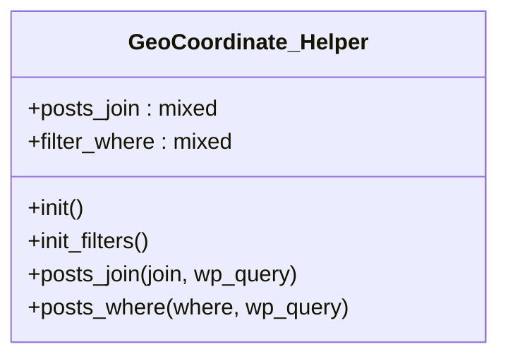

# GeoCoordinate_Helper


Class TainacanFilterType

***

* Full name: `\GeoCoordinate_Helper`

## Class Diagram



## Properties

### posts_join

```php
public static $posts_join
```

* This property is **static**.

***

### filter_where

```php
public static $filter_where
```

* This property is **static**.

***

## Methods

### init

```php
public init(): mixed
```

***

### init_filters

```php
public init_filters(): mixed
```

***

### posts_join

```php
public posts_join(mixed $join, mixed $wp_query): mixed
```

**Parameters:**

| Parameter   | Type      | Description |
|-------------|-----------|-------------|
| `$join`     | **mixed** |             |
| `$wp_query` | **mixed** |             |

***

### posts_where

```php
public posts_where(mixed $where, mixed $wp_query): mixed
```

**Parameters:**

| Parameter   | Type      | Description |
|-------------|-----------|-------------|
| `$where`    | **mixed** |             |
| `$wp_query` | **mixed** |             |

***

## Inherited methods

### get_instance

```php
public static get_instance(): mixed
```

* This method is **static**.
***

### __construct

```php
private __construct(): mixed
```

***
