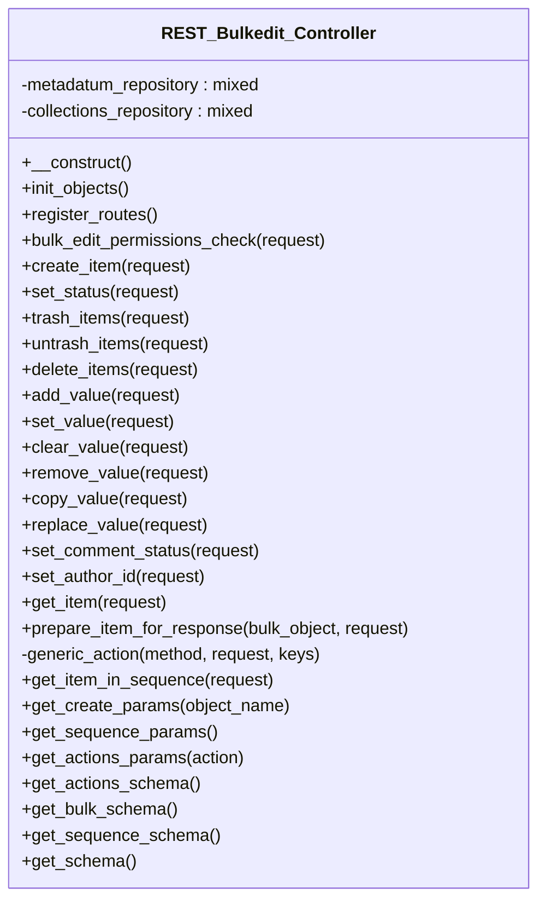

# REST_Bulkedit_Controller


REST API controller for managing Tainacan bulk edit operations.

Handles all REST API endpoints for bulk editing operations including
bulk metadata updates, bulk item modifications, and batch processing.

***

* Full name: `\Tainacan\API\EndPoints\REST_Bulkedit_Controller`
* Parent class: [`\Tainacan\API\REST_Controller`](../REST_Controller)

## Class Diagram



## Properties

### metadatum_repository

```php
private $metadatum_repository
```

***

### collections_repository

```php
private $collections_repository
```

***

## Methods

### __construct

Constructor for the REST_Controller class.

```php
public __construct(): mixed
```

Sets up the namespace and registers routes and filters.

***

### init_objects

```php
public init_objects(): mixed
```

***

### register_routes

```php
public register_routes(): mixed
```

**Throws:**

- [`Exception`](../../../Exception)

***

### bulk_edit_permissions_check

```php
public bulk_edit_permissions_check(mixed $request): mixed
```

**Parameters:**

| Parameter  | Type      | Description |
|------------|-----------|-------------|
| `$request` | **mixed** |             |

***

### create_item

```php
public create_item(mixed $request): mixed
```

**Parameters:**

| Parameter  | Type      | Description |
|------------|-----------|-------------|
| `$request` | **mixed** |             |

***

### set_status

```php
public set_status(mixed $request): mixed
```

**Parameters:**

| Parameter  | Type      | Description |
|------------|-----------|-------------|
| `$request` | **mixed** |             |

***

### trash_items

```php
public trash_items(mixed $request): mixed
```

**Parameters:**

| Parameter  | Type      | Description |
|------------|-----------|-------------|
| `$request` | **mixed** |             |

***

### untrash_items

```php
public untrash_items(mixed $request): mixed
```

**Parameters:**

| Parameter  | Type      | Description |
|------------|-----------|-------------|
| `$request` | **mixed** |             |

***

### delete_items

```php
public delete_items(mixed $request): mixed
```

**Parameters:**

| Parameter  | Type      | Description |
|------------|-----------|-------------|
| `$request` | **mixed** |             |

***

### add_value

```php
public add_value(mixed $request): mixed
```

**Parameters:**

| Parameter  | Type      | Description |
|------------|-----------|-------------|
| `$request` | **mixed** |             |

***

### set_value

```php
public set_value(mixed $request): mixed
```

**Parameters:**

| Parameter  | Type      | Description |
|------------|-----------|-------------|
| `$request` | **mixed** |             |

***

### clear_value

```php
public clear_value(mixed $request): mixed
```

**Parameters:**

| Parameter  | Type      | Description |
|------------|-----------|-------------|
| `$request` | **mixed** |             |

***

### remove_value

```php
public remove_value(mixed $request): mixed
```

**Parameters:**

| Parameter  | Type      | Description |
|------------|-----------|-------------|
| `$request` | **mixed** |             |

***

### copy_value

```php
public copy_value(mixed $request): mixed
```

**Parameters:**

| Parameter  | Type      | Description |
|------------|-----------|-------------|
| `$request` | **mixed** |             |

***

### replace_value

```php
public replace_value(mixed $request): mixed
```

**Parameters:**

| Parameter  | Type      | Description |
|------------|-----------|-------------|
| `$request` | **mixed** |             |

***

### set_comment_status

```php
public set_comment_status(mixed $request): mixed
```

**Parameters:**

| Parameter  | Type      | Description |
|------------|-----------|-------------|
| `$request` | **mixed** |             |

***

### set_author_id

```php
public set_author_id(mixed $request): mixed
```

**Parameters:**

| Parameter  | Type      | Description |
|------------|-----------|-------------|
| `$request` | **mixed** |             |

***

### get_item

```php
public get_item(mixed $request): mixed
```

**Parameters:**

| Parameter  | Type      | Description |
|------------|-----------|-------------|
| `$request` | **mixed** |             |

***

### prepare_item_for_response

```php
public prepare_item_for_response(mixed $bulk_object, mixed $request): mixed
```

**Parameters:**

| Parameter      | Type      | Description |
|----------------|-----------|-------------|
| `$bulk_object` | **mixed** |             |
| `$request`     | **mixed** |             |

***

### generic_action

```php
private generic_action(mixed $method, mixed $request, mixed $keys = ['value']): mixed
```

**Parameters:**

| Parameter  | Type      | Description |
|------------|-----------|-------------|
| `$method`  | **mixed** |             |
| `$request` | **mixed** |             |
| `$keys`    | **mixed** |             |

***

### get_item_in_sequence

```php
public get_item_in_sequence(mixed $request): mixed
```

**Parameters:**

| Parameter  | Type      | Description |
|------------|-----------|-------------|
| `$request` | **mixed** |             |

***

### get_create_params

```php
public get_create_params(null $object_name = null): array|void
```

**Parameters:**

| Parameter      | Type     | Description |
|----------------|----------|-------------|
| `$object_name` | **null** |             |

***

### get_sequence_params

```php
public get_sequence_params(): array|mixed
```

***

### get_actions_params

```php
public get_actions_params(mixed $action = null): array|mixed
```

**Parameters:**

| Parameter | Type      | Description |
|-----------|-----------|-------------|
| `$action` | **mixed** |             |

***

### get_actions_schema

```php
public get_actions_schema(): mixed
```

***

### get_bulk_schema

```php
public get_bulk_schema(): mixed
```

***

### get_sequence_schema

```php
public get_sequence_schema(): mixed
```

***

### get_schema

```php
public get_schema(): mixed
```

***

## Inherited methods

### __construct

Constructor for the REST_Controller class.

```php
public __construct(): mixed
```

Sets up the namespace and registers routes and filters.

***

### filter_object_by_attributes

Filters an object by specified attributes.

```php
protected filter_object_by_attributes(mixed $object, string|array $attributes): array
```

**Parameters:**

| Parameter     | Type              | Description                                       |
|---------------|-------------------|---------------------------------------------------|
| `$object`     | **mixed**         | The object to filter.                             |
| `$attributes` | **string\|array** | The attributes to include in the filtered result. |

**Return Value:**

Filtered object data.

***

### prepare_item_for_updating

Prepares an item for updating with new values.

```php
protected prepare_item_for_updating(mixed $object, array $new_values): \Tainacan\Entities\Entity
```

**Parameters:**

| Parameter     | Type      | Description                      |
|---------------|-----------|----------------------------------|
| `$object`     | **mixed** | The object to update.            |
| `$new_values` | **array** | New values to set on the object. |

**Return Value:**

The updated entity.

***

### prepare_filters

```php
protected prepare_filters(mixed $request): array
```

**Parameters:**

| Parameter  | Type      | Description |
|------------|-----------|-------------|
| `$request` | **mixed** |             |

**Throws:**

- [`Exception`](../../../Exception)

***

### add_support_to_tax_query_like

```php
public add_support_to_tax_query_like(mixed $args): mixed
```

**Parameters:**

| Parameter | Type      | Description |
|-----------|-----------|-------------|
| `$args`   | **mixed** |             |

***

### sanitize_value

```php
protected sanitize_value(mixed $value): mixed
```

**Parameters:**

| Parameter | Type      | Description |
|-----------|-----------|-------------|
| `$value`  | **mixed** |             |

***

### contains_array

```php
protected contains_array(mixed $array, mixed $query): bool
```

**Parameters:**

| Parameter | Type      | Description |
|-----------|-----------|-------------|
| `$array`  | **mixed** |             |
| `$query`  | **mixed** |             |

***

### get_fetch_only_param

Return the fetch_only param

```php
public get_fetch_only_param(): array|void
```

***

### get_wp_query_params

Return the common params

```php
public get_wp_query_params(): array|void
```

***

### get_meta_queries_params

Return the common meta, date and tax queries params

```php
protected get_meta_queries_params(): array
```

***

### get_repository_schema

```php
public get_repository_schema(\Tainacan\Repositories\Repository $repository): mixed
```

**Parameters:**

| Parameter     | Type                                  | Description |
|---------------|---------------------------------------|-------------|
| `$repository` | **\Tainacan\Repositories\Repository** |             |

***

### get_permissions_schema

```php
public get_permissions_schema(): mixed
```

***

### get_base_properties_schema

```php
public get_base_properties_schema(): mixed
```

***

### get_schema

```php
protected get_schema(): mixed
```

* This method is **abstract**.
***

### get_list_schema

```php
public get_list_schema(): mixed
```

***
