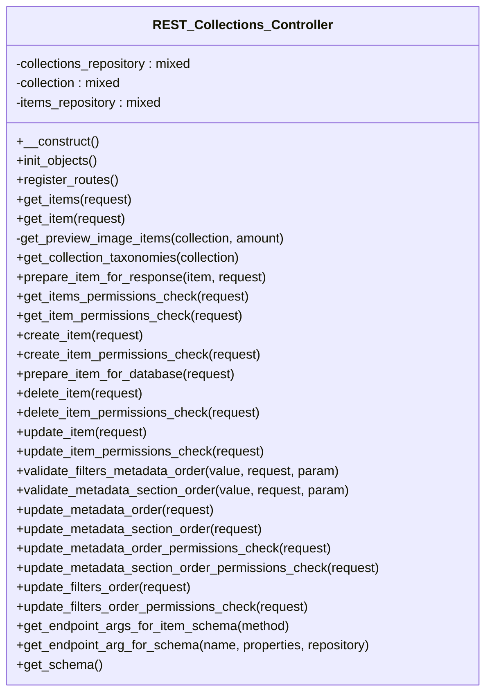

# REST_Collections_Controller


REST API controller for managing Tainacan collections.

Handles all REST API endpoints for collection operations including
creation, updates, deletion, and querying of collections.

***

* Full name: `\Tainacan\API\EndPoints\REST_Collections_Controller`
* Parent class: [`\Tainacan\API\REST_Controller`](../REST_Controller)

## Class Diagram



## Properties

### collections_repository

```php
private $collections_repository
```

***

### collection

```php
private $collection
```

***

### items_repository

```php
private $items_repository
```

***

## Methods

### __construct

REST_Collections_Controller constructor.

```php
public __construct(): mixed
```

Define the namespace, rest base and instantiate your attributes.

***

### init_objects

Initialize objects after post_type register

```php
public init_objects(): mixed
```

***

### register_routes

Register the collections route and their endpoints

```php
public register_routes(): mixed
```

***

### get_items

Return a array of Collections objects in JSON

```php
public get_items(\WP_REST_Request $request): \WP_Error|\WP_REST_Response
```

**Parameters:**

| Parameter  | Type                 | Description |
|------------|----------------------|-------------|
| `$request` | **\WP_REST_Request** |             |

**Throws:**

- [`Exception`](../../../Exception)

***

### get_item

Return a Collection object in JSON

```php
public get_item(\WP_REST_Request $request): \WP_Error|\WP_REST_Response
```

**Parameters:**

| Parameter  | Type                 | Description |
|------------|----------------------|-------------|
| `$request` | **\WP_REST_Request** |             |

***

### get_preview_image_items

```php
private get_preview_image_items(\Tainacan\Entities\Collection $collection, mixed $amount): array
```

**Parameters:**

| Parameter     | Type                              | Description |
|---------------|-----------------------------------|-------------|
| `$collection` | **\Tainacan\Entities\Collection** |             |
| `$amount`     | **mixed**                         |             |

***

### get_collection_taxonomies

```php
public get_collection_taxonomies(\Tainacan\Entities\Collection $collection): array
```

**Parameters:**

| Parameter     | Type                              | Description |
|---------------|-----------------------------------|-------------|
| `$collection` | **\Tainacan\Entities\Collection** |             |

***

### prepare_item_for_response

Receive a \WP_Query or a Collection object and return both in JSON

```php
public prepare_item_for_response(mixed $item, \WP_REST_Request $request): mixed|string|void|\WP_Error|\WP_REST_Response
```

**Parameters:**

| Parameter  | Type                 | Description |
|------------|----------------------|-------------|
| `$item`    | **mixed**            |             |
| `$request` | **\WP_REST_Request** |             |

***

### get_items_permissions_check

```php
public get_items_permissions_check(\WP_REST_Request $request): bool|\WP_Error
```

**Parameters:**

| Parameter  | Type                 | Description |
|------------|----------------------|-------------|
| `$request` | **\WP_REST_Request** |             |

**Throws:**

- [`Exception`](../../../Exception)

***

### get_item_permissions_check

```php
public get_item_permissions_check(\WP_REST_Request $request): bool|\WP_Error
```

**Parameters:**

| Parameter  | Type                 | Description |
|------------|----------------------|-------------|
| `$request` | **\WP_REST_Request** |             |

**Throws:**

- [`Exception`](../../../Exception)

***

### create_item

Receive a JSON with the structure of a Collection and return, in case of success insert
a Collection object in JSON

```php
public create_item(\WP_REST_Request $request): array|\WP_Error|\WP_REST_Response
```

**Parameters:**

| Parameter  | Type                 | Description |
|------------|----------------------|-------------|
| `$request` | **\WP_REST_Request** |             |

***

### create_item_permissions_check

Verify if current has permission to create a item

```php
public create_item_permissions_check(\WP_REST_Request $request): bool|\WP_Error
```

**Parameters:**

| Parameter  | Type                 | Description |
|------------|----------------------|-------------|
| `$request` | **\WP_REST_Request** |             |

**Throws:**

- [`Exception`](../../../Exception)

***

### prepare_item_for_database

Prepare collection for insertion on database

```php
public prepare_item_for_database(\WP_REST_Request $request): object|\Tainacan\Entities\Collection|\WP_Error
```

**Parameters:**

| Parameter  | Type                 | Description |
|------------|----------------------|-------------|
| `$request` | **\WP_REST_Request** |             |

***

### delete_item

Delete a collection

```php
public delete_item(\WP_REST_Request $request): string|\WP_Error|\WP_REST_Response
```

**Parameters:**

| Parameter  | Type                 | Description |
|------------|----------------------|-------------|
| `$request` | **\WP_REST_Request** |             |

***

### delete_item_permissions_check

Verify if current user has permission to delete a collection

```php
public delete_item_permissions_check(\WP_REST_Request $request): bool|\WP_Error
```

**Parameters:**

| Parameter  | Type                 | Description |
|------------|----------------------|-------------|
| `$request` | **\WP_REST_Request** |             |

**Throws:**

- [`Exception`](../../../Exception)

***

### update_item

Update a collection

```php
public update_item(\WP_REST_Request $request): string|\WP_Error|\WP_REST_Response
```

**Parameters:**

| Parameter  | Type                 | Description |
|------------|----------------------|-------------|
| `$request` | **\WP_REST_Request** |             |

***

### update_item_permissions_check

Verify if current user has permission to update a item

```php
public update_item_permissions_check(\WP_REST_Request $request): bool|\WP_Error
```

**Parameters:**

| Parameter  | Type                 | Description |
|------------|----------------------|-------------|
| `$request` | **\WP_REST_Request** |             |

**Throws:**

- [`Exception`](../../../Exception)

***

### validate_filters_metadata_order

```php
public validate_filters_metadata_order(mixed $value, mixed $request, mixed $param): mixed
```

**Parameters:**

| Parameter  | Type      | Description |
|------------|-----------|-------------|
| `$value`   | **mixed** |             |
| `$request` | **mixed** |             |
| `$param`   | **mixed** |             |

***

### validate_metadata_section_order

```php
public validate_metadata_section_order(mixed $value, mixed $request, mixed $param): mixed
```

**Parameters:**

| Parameter  | Type      | Description |
|------------|-----------|-------------|
| `$value`   | **mixed** |             |
| `$request` | **mixed** |             |
| `$param`   | **mixed** |             |

***

### update_metadata_order

Update a collection metadata order

```php
public update_metadata_order(\WP_REST_Request $request): string|\WP_Error|\WP_REST_Response
```

**Parameters:**

| Parameter  | Type                 | Description |
|------------|----------------------|-------------|
| `$request` | **\WP_REST_Request** |             |

***

### update_metadata_section_order

Update a collection metadata section order

```php
public update_metadata_section_order(\WP_REST_Request $request): string|\WP_Error|\WP_REST_Response
```

**Parameters:**

| Parameter  | Type                 | Description |
|------------|----------------------|-------------|
| `$request` | **\WP_REST_Request** |             |

***

### update_metadata_order_permissions_check

Verify if current user has permission to update metadata order

```php
public update_metadata_order_permissions_check(\WP_REST_Request $request): bool|\WP_Error
```

**Parameters:**

| Parameter  | Type                 | Description |
|------------|----------------------|-------------|
| `$request` | **\WP_REST_Request** |             |

**Throws:**

- [`Exception`](../../../Exception)

***

### update_metadata_section_order_permissions_check

Verify if current user has permission to update metadata section order

```php
public update_metadata_section_order_permissions_check(\WP_REST_Request $request): bool|\WP_Error
```

**Parameters:**

| Parameter  | Type                 | Description |
|------------|----------------------|-------------|
| `$request` | **\WP_REST_Request** |             |

**Throws:**

- [`Exception`](../../../Exception)

***

### update_filters_order

Update a collection metadata order

```php
public update_filters_order(\WP_REST_Request $request): string|\WP_Error|\WP_REST_Response
```

**Parameters:**

| Parameter  | Type                 | Description |
|------------|----------------------|-------------|
| `$request` | **\WP_REST_Request** |             |

***

### update_filters_order_permissions_check

Verify if current user has permission to update metadata order

```php
public update_filters_order_permissions_check(\WP_REST_Request $request): bool|\WP_Error
```

**Parameters:**

| Parameter  | Type                 | Description |
|------------|----------------------|-------------|
| `$request` | **\WP_REST_Request** |             |

**Throws:**

- [`Exception`](../../../Exception)

***

### get_endpoint_args_for_item_schema

```php
public get_endpoint_args_for_item_schema(string $method = null): array|mixed
```

**Parameters:**

| Parameter | Type       | Description |
|-----------|------------|-------------|
| `$method` | **string** |             |

***

### get_endpoint_arg_for_schema

```php
public get_endpoint_arg_for_schema(mixed $name, mixed $properties = [], mixed $repository = null): mixed
```

**Parameters:**

| Parameter     | Type      | Description |
|---------------|-----------|-------------|
| `$name`       | **mixed** |             |
| `$properties` | **mixed** |             |
| `$repository` | **mixed** |             |

***

### get_schema

```php
public get_schema(): mixed
```

***

## Inherited methods

### __construct

Constructor for the REST_Controller class.

```php
public __construct(): mixed
```

Sets up the namespace and registers routes and filters.

***

### filter_object_by_attributes

Filters an object by specified attributes.

```php
protected filter_object_by_attributes(mixed $object, string|array $attributes): array
```

**Parameters:**

| Parameter     | Type              | Description                                       |
|---------------|-------------------|---------------------------------------------------|
| `$object`     | **mixed**         | The object to filter.                             |
| `$attributes` | **string\|array** | The attributes to include in the filtered result. |

**Return Value:**

Filtered object data.

***

### prepare_item_for_updating

Prepares an item for updating with new values.

```php
protected prepare_item_for_updating(mixed $object, array $new_values): \Tainacan\Entities\Entity
```

**Parameters:**

| Parameter     | Type      | Description                      |
|---------------|-----------|----------------------------------|
| `$object`     | **mixed** | The object to update.            |
| `$new_values` | **array** | New values to set on the object. |

**Return Value:**

The updated entity.

***

### prepare_filters

```php
protected prepare_filters(mixed $request): array
```

**Parameters:**

| Parameter  | Type      | Description |
|------------|-----------|-------------|
| `$request` | **mixed** |             |

**Throws:**

- [`Exception`](../../../Exception)

***

### add_support_to_tax_query_like

```php
public add_support_to_tax_query_like(mixed $args): mixed
```

**Parameters:**

| Parameter | Type      | Description |
|-----------|-----------|-------------|
| `$args`   | **mixed** |             |

***

### sanitize_value

```php
protected sanitize_value(mixed $value): mixed
```

**Parameters:**

| Parameter | Type      | Description |
|-----------|-----------|-------------|
| `$value`  | **mixed** |             |

***

### contains_array

```php
protected contains_array(mixed $array, mixed $query): bool
```

**Parameters:**

| Parameter | Type      | Description |
|-----------|-----------|-------------|
| `$array`  | **mixed** |             |
| `$query`  | **mixed** |             |

***

### get_fetch_only_param

Return the fetch_only param

```php
public get_fetch_only_param(): array|void
```

***

### get_wp_query_params

Return the common params

```php
public get_wp_query_params(): array|void
```

***

### get_meta_queries_params

Return the common meta, date and tax queries params

```php
protected get_meta_queries_params(): array
```

***

### get_repository_schema

```php
public get_repository_schema(\Tainacan\Repositories\Repository $repository): mixed
```

**Parameters:**

| Parameter     | Type                                  | Description |
|---------------|---------------------------------------|-------------|
| `$repository` | **\Tainacan\Repositories\Repository** |             |

***

### get_permissions_schema

```php
public get_permissions_schema(): mixed
```

***

### get_base_properties_schema

```php
public get_base_properties_schema(): mixed
```

***

### get_schema

```php
protected get_schema(): mixed
```

* This method is **abstract**.
***

### get_list_schema

```php
public get_list_schema(): mixed
```

***
