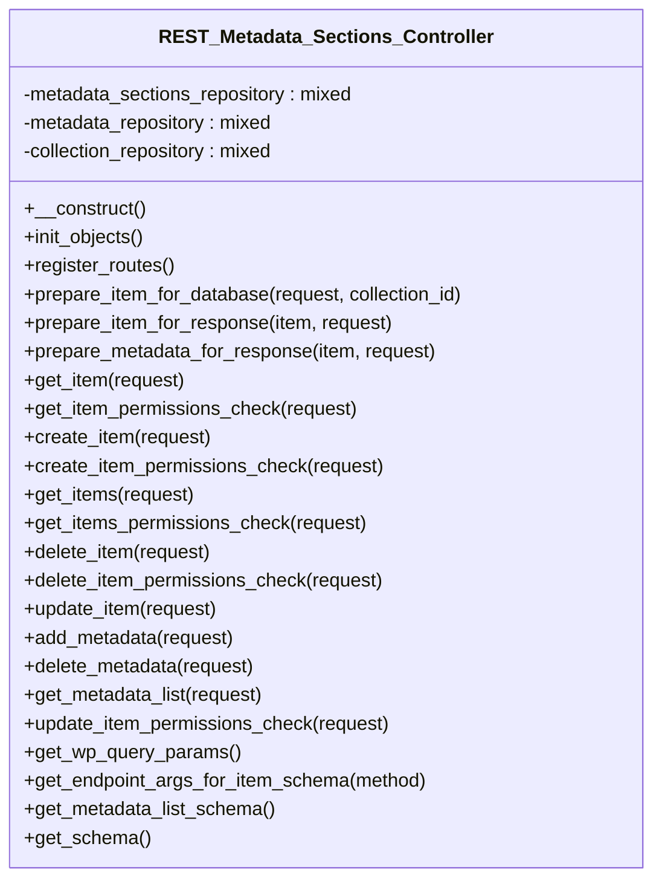

# REST_Metadata_Sections_Controller


REST API controller for managing Tainacan metadata sections.

Handles all REST API endpoints for metadata section operations including
section creation, updates, deletion, and querying within collections.

***

* Full name: `\Tainacan\API\EndPoints\REST_Metadata_Sections_Controller`
* Parent class: [`\Tainacan\API\REST_Controller`](../REST_Controller)

## Class Diagram



## Properties

### metadata_sections_repository

```php
private $metadata_sections_repository
```

***

### metadata_repository

```php
private $metadata_repository
```

***

### collection_repository

```php
private $collection_repository
```

***

## Methods

### __construct

Constructor for the REST_Controller class.

```php
public __construct(): mixed
```

Sets up the namespace and registers routes and filters.

***

### init_objects

Initialize objects after post_type register

```php
public init_objects(): mixed
```

**Throws:**

- [`Exception`](../../../Exception)

***

### register_routes

If POST on metadatum/collection/<collection_id>, then
a metadatum will be created in matched collection and all your item will receive this metadatum

```php
public register_routes(): mixed
```

If POST on metadatum/item/<item_id>, then a value will be added in a metadatum and metadatum passed
id body of requisition

Both of GETs return the metadatum of matched objects

**Throws:**

- [`Exception`](../../../Exception)

***

### prepare_item_for_database

```php
public prepare_item_for_database(\WP_REST_Request|string $request, mixed $collection_id = null): object|void|\WP_Error
```

**Parameters:**

| Parameter        | Type                         | Description |
|------------------|------------------------------|-------------|
| `$request`       | **\WP_REST_Request\|string** |             |
| `$collection_id` | **mixed**                    |             |

**Throws:**

- [`Exception`](../../../Exception)

***

### prepare_item_for_response

```php
public prepare_item_for_response(\Tainacan\Entities\Metadata_Section $item, \WP_REST_Request $request): array|\WP_Error|\WP_REST_Response
```

**Parameters:**

| Parameter  | Type                                    | Description |
|------------|-----------------------------------------|-------------|
| `$item`    | **\Tainacan\Entities\Metadata_Section** |             |
| `$request` | **\WP_REST_Request**                    |             |

***

### prepare_metadata_for_response

```php
public prepare_metadata_for_response(\Tainacan\Entities\Metadata $item, \WP_REST_Request $request): array|\WP_Error|\WP_REST_Response
```

**Parameters:**

| Parameter  | Type                            | Description |
|------------|---------------------------------|-------------|
| `$item`    | **\Tainacan\Entities\Metadata** |             |
| `$request` | **\WP_REST_Request**            |             |

***

### get_item

```php
public get_item(\WP_REST_Request $request): \WP_Error|\WP_REST_Response
```

**Parameters:**

| Parameter  | Type                 | Description |
|------------|----------------------|-------------|
| `$request` | **\WP_REST_Request** |             |

***

### get_item_permissions_check

```php
public get_item_permissions_check(\WP_REST_Request $request): bool|\WP_Error
```

**Parameters:**

| Parameter  | Type                 | Description |
|------------|----------------------|-------------|
| `$request` | **\WP_REST_Request** |             |

**Throws:**

- [`Exception`](../../../Exception)

***

### create_item

```php
public create_item(\WP_REST_Request $request): \WP_Error|\WP_REST_Response
```

**Parameters:**

| Parameter  | Type                 | Description |
|------------|----------------------|-------------|
| `$request` | **\WP_REST_Request** |             |

**Throws:**

- [`Exception`](../../../Exception)

***

### create_item_permissions_check

```php
public create_item_permissions_check(mixed $request): bool|\WP_Error
```

**Parameters:**

| Parameter  | Type      | Description |
|------------|-----------|-------------|
| `$request` | **mixed** |             |

**Throws:**

- [`Exception`](../../../Exception)

***

### get_items

```php
public get_items(\WP_REST_Request $request): \WP_Error|\WP_REST_Response
```

**Parameters:**

| Parameter  | Type                 | Description |
|------------|----------------------|-------------|
| `$request` | **\WP_REST_Request** |             |

**Throws:**

- [`Exception`](../../../Exception)

***

### get_items_permissions_check

```php
public get_items_permissions_check(\WP_REST_Request $request): bool|\WP_Error
```

**Parameters:**

| Parameter  | Type                 | Description |
|------------|----------------------|-------------|
| `$request` | **\WP_REST_Request** |             |

**Throws:**

- [`Exception`](../../../Exception)

***

### delete_item

```php
public delete_item(\WP_REST_Request $request): \WP_Error|\WP_REST_Response
```

**Parameters:**

| Parameter  | Type                 | Description |
|------------|----------------------|-------------|
| `$request` | **\WP_REST_Request** |             |

***

### delete_item_permissions_check

```php
public delete_item_permissions_check(\WP_REST_Request $request): bool|\WP_Error
```

**Parameters:**

| Parameter  | Type                 | Description |
|------------|----------------------|-------------|
| `$request` | **\WP_REST_Request** |             |

**Throws:**

- [`Exception`](../../../Exception)

***

### update_item

```php
public update_item(\WP_REST_Request $request): \WP_Error|\WP_REST_Response
```

**Parameters:**

| Parameter  | Type                 | Description |
|------------|----------------------|-------------|
| `$request` | **\WP_REST_Request** |             |

***

### add_metadata

```php
public add_metadata(mixed $request): mixed
```

**Parameters:**

| Parameter  | Type      | Description |
|------------|-----------|-------------|
| `$request` | **mixed** |             |

***

### delete_metadata

```php
public delete_metadata(mixed $request): mixed
```

**Parameters:**

| Parameter  | Type      | Description |
|------------|-----------|-------------|
| `$request` | **mixed** |             |

***

### get_metadata_list

```php
public get_metadata_list(mixed $request): mixed
```

**Parameters:**

| Parameter  | Type      | Description |
|------------|-----------|-------------|
| `$request` | **mixed** |             |

***

### update_item_permissions_check

```php
public update_item_permissions_check(\WP_REST_Request $request): bool|\WP_Error
```

**Parameters:**

| Parameter  | Type                 | Description |
|------------|----------------------|-------------|
| `$request` | **\WP_REST_Request** |             |

**Throws:**

- [`Exception`](../../../Exception)

***

### get_wp_query_params

Return the common params

```php
public get_wp_query_params(): array|void
```

***

### get_endpoint_args_for_item_schema

```php
public get_endpoint_args_for_item_schema(null $method = null): array
```

**Parameters:**

| Parameter | Type     | Description |
|-----------|----------|-------------|
| `$method` | **null** |             |

**Throws:**

- [`Exception`](../../../Exception)

***

### get_metadata_list_schema

```php
public get_metadata_list_schema(): mixed
```

***

### get_schema

```php
public get_schema(): mixed
```

***

## Inherited methods

### __construct

Constructor for the REST_Controller class.

```php
public __construct(): mixed
```

Sets up the namespace and registers routes and filters.

***

### filter_object_by_attributes

Filters an object by specified attributes.

```php
protected filter_object_by_attributes(mixed $object, string|array $attributes): array
```

**Parameters:**

| Parameter     | Type              | Description                                       |
|---------------|-------------------|---------------------------------------------------|
| `$object`     | **mixed**         | The object to filter.                             |
| `$attributes` | **string\|array** | The attributes to include in the filtered result. |

**Return Value:**

Filtered object data.

***

### prepare_item_for_updating

Prepares an item for updating with new values.

```php
protected prepare_item_for_updating(mixed $object, array $new_values): \Tainacan\Entities\Entity
```

**Parameters:**

| Parameter     | Type      | Description                      |
|---------------|-----------|----------------------------------|
| `$object`     | **mixed** | The object to update.            |
| `$new_values` | **array** | New values to set on the object. |

**Return Value:**

The updated entity.

***

### prepare_filters

```php
protected prepare_filters(mixed $request): array
```

**Parameters:**

| Parameter  | Type      | Description |
|------------|-----------|-------------|
| `$request` | **mixed** |             |

**Throws:**

- [`Exception`](../../../Exception)

***

### add_support_to_tax_query_like

```php
public add_support_to_tax_query_like(mixed $args): mixed
```

**Parameters:**

| Parameter | Type      | Description |
|-----------|-----------|-------------|
| `$args`   | **mixed** |             |

***

### sanitize_value

```php
protected sanitize_value(mixed $value): mixed
```

**Parameters:**

| Parameter | Type      | Description |
|-----------|-----------|-------------|
| `$value`  | **mixed** |             |

***

### contains_array

```php
protected contains_array(mixed $array, mixed $query): bool
```

**Parameters:**

| Parameter | Type      | Description |
|-----------|-----------|-------------|
| `$array`  | **mixed** |             |
| `$query`  | **mixed** |             |

***

### get_fetch_only_param

Return the fetch_only param

```php
public get_fetch_only_param(): array|void
```

***

### get_wp_query_params

Return the common params

```php
public get_wp_query_params(): array|void
```

***

### get_meta_queries_params

Return the common meta, date and tax queries params

```php
protected get_meta_queries_params(): array
```

***

### get_repository_schema

```php
public get_repository_schema(\Tainacan\Repositories\Repository $repository): mixed
```

**Parameters:**

| Parameter     | Type                                  | Description |
|---------------|---------------------------------------|-------------|
| `$repository` | **\Tainacan\Repositories\Repository** |             |

***

### get_permissions_schema

```php
public get_permissions_schema(): mixed
```

***

### get_base_properties_schema

```php
public get_base_properties_schema(): mixed
```

***

### get_schema

```php
protected get_schema(): mixed
```

* This method is **abstract**.
***

### get_list_schema

```php
public get_list_schema(): mixed
```

***
