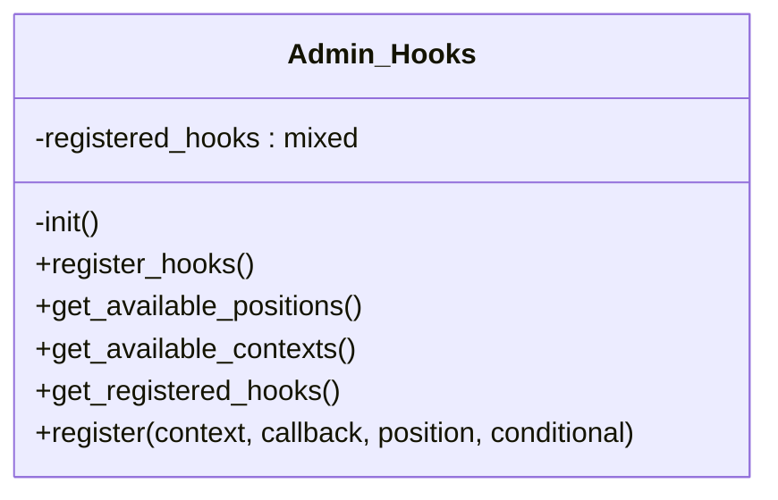

# Admin_Hooks


***

* Full name: `\Tainacan\Admin_Hooks`

## Class Diagram



## Properties

### registered_hooks

```php
private $registered_hooks
```

***

## Methods

### init

```php
private init(): mixed
```

***

### register_hooks

```php
public register_hooks(): mixed
```

***

### get_available_positions

```php
public get_available_positions(): mixed
```

***

### get_available_contexts

```php
public get_available_contexts(): mixed
```

***

### get_registered_hooks

```php
public get_registered_hooks(): mixed
```

***

### register

```php
public register(string $context, callable $callback, string $position = 'end-left', array $conditional = null): mixed
```

**Parameters:**

| Parameter      | Type         | Description                                                                                                                        |
|----------------|--------------|------------------------------------------------------------------------------------------------------------------------------------|
| `$context`     | **string**   | The context to add the hook to (collection, metadatum, item, taxonomy, term or filter)                                             |
| `$callback`    | **callable** | The callback that will output the form HTML                                                                                        |
| `$position`    | **string**   | The position inside the page to hook. (begin, end, begin-left, begin-right, end-left, end-right)                                   |
| `$conditional` | **array**    | Key-named array containing an 'attribute' and a 'value' that will be checked in the context form object before rendering the hook. |

***

## Inherited methods

### get_instance

```php
public static get_instance(): mixed
```

* This method is **static**.
***

### __construct

```php
private __construct(): mixed
```

***
