# Background_Process


Abstract Tainacan\Background_Process class.

Uses modified version of https://github.com/A5hleyRich/wp-background-processing
to handle DB updates in the background.

***

* Full name: `\Tainacan\Background_Process`
* Parent class: [`\Tainacan\Background_Process_Base`](./Background_Process_Base)
* This class is an **Abstract class**

## Class Diagram

```mermaid
classDiagram
    direction TB
    class Async_Request {
        #prefix : string
        #action : string
        #identifier : mixed
        #data : array
        +__construct()
        +data(data)
        +dispatch()
        #get_query_args()
        #get_query_url()
        #get_post_args()
        +maybe_handle()
    }
    class Background_Process {
        #table : string
        +ID : false|int
        #prefix : string
        #action : string
        #name : string
        +__construct()
        +get_id()
        +get_name()
        +set_name(name)
        +save(priority)
        +update(key, batch)
        +open(key)
        +close(key, status)
        +delete(key)
        #is_queue_empty()
        #get_batch()
        #get_batch_by_key(key)
        #handle()
        +delete_all_batches()
        +kill_process()
        #write_log_to_file(key, log, type)
        #write_log(key, log)
        #write_error_log(key, log)
        -recursive_stingify_log_array(log, break)
        -has_errors(key)
    }
    class Background_Process_Base {
        #action : string
        #start_time : int
        #cron_hook_identifier : mixed
        #cron_interval_identifier : mixed
        #cron_hook_check_identifier : string
        #process_lock_in_time : string
        #queue_lock_time : string
        #cron_interval : string
        +__construct()
        +dispatch()
        +push_to_queue(data)
        +save()
        +update(key, data)
        +delete(key)
        #generate_key(length)
        +maybe_handle()
        #is_queue_empty()
        #is_process_running()
        #lock_process()
        #unlock_process()
        #get_batch()
        #handle()
        #memory_exceeded()
        #get_memory_limit()
        #time_exceeded()
        #complete()
        +schedule_cron_healthcheck(schedules)
        +handle_cron_healthcheck()
        +handle_cron_healthcheck_check()
        #schedule_event()
        #clear_scheduled_event()
        +cancel_process()
        +debug(message)
    }
    Async_Request <|-- Background_Process_Base
    Background_Process_Base <|-- Background_Process
```



## Properties

### table

Table name where the queue is stored

```php
protected string $table
```

***

### ID

ID of the process in the database

```php
public false|int $ID
```

***

### prefix

Prefix

```php
protected string $prefix
```

(default value: 'wp')

***

### action

Action

```php
protected string $action
```

(default value: 'process')

***

### name

Name

```php
protected string $name
```

***

## Methods

### __construct

Initiate new background process

```php
public __construct(): mixed
```

***

### get_id

```php
public get_id(): mixed
```

***

### get_name

Gets the name of the process.

```php
public get_name(): string
```

Override this method to set a name to the process

Default "Background Process"

***

### set_name

Set name

```php
public set_name(mixed $name): $this
```

**Parameters:**

| Parameter | Type      | Description |
|-----------|-----------|-------------|
| `$name`   | **mixed** |             |

***

### save

Save queue

```php
public save(mixed $priority = 10): $this
```

**Parameters:**

| Parameter   | Type      | Description |
|-------------|-----------|-------------|
| `$priority` | **mixed** |             |

***

### update

Update queue

```php
public update(string $key, array|object $batch): $this
```

**Parameters:**

| Parameter | Type              | Description |
|-----------|-------------------|-------------|
| `$key`    | **string**        | Key.        |
| `$batch`  | **array\|object** | Data.       |

***

### open

Set batch as running

```php
public open(string $key): $this
```

**Parameters:**

| Parameter | Type       | Description |
|-----------|------------|-------------|
| `$key`    | **string** | Key.        |

***

### close

Mark a process as done

```php
public close(string $key, mixed $status = 'finished'): $this
```

**Parameters:**

| Parameter | Type       | Description |
|-----------|------------|-------------|
| `$key`    | **string** | Key.        |
| `$status` | **mixed**  |             |

***

### delete

Delete queue

```php
public delete(string $key): $this
```

**Parameters:**

| Parameter | Type       | Description |
|-----------|------------|-------------|
| `$key`    | **string** | Key.        |

***

### is_queue_empty

Is queue empty

```php
protected is_queue_empty(): bool
```

***

### get_batch

Get batch

```php
protected get_batch(): \Tainacan\stdClass
```

**Return Value:**

Return the first batch from the queue

***

### get_batch_by_key

Get batch by key ID

```php
protected get_batch_by_key(mixed $key): \Tainacan\stdClass
```

**Parameters:**

| Parameter | Type      | Description |
|-----------|-----------|-------------|
| `$key`    | **mixed** |             |

**Return Value:**

Return the batch

***

### handle

Handle

```php
protected handle(): mixed
```

Pass each queue item to the task handler, while remaining
within server memory and time limit constraints.

Tainacan comments: This is where we changed the mos from otiginal class.
Each batch is a single array of data. There is no queue inside a batch.

***

### delete_all_batches

Delete all batches.

```php
public delete_all_batches(): \Tainacan\WC_Background_Process
```

***

### kill_process

Kill process.

```php
public kill_process(): mixed
```

Stop processing queue items, clear cronjob and delete all batches.

***

### write_log_to_file

LOG

```php
protected write_log_to_file(mixed $key, array $log, mixed $type = ''): mixed
```

**Parameters:**

| Parameter | Type      | Description |
|-----------|-----------|-------------|
| `$key`    | **mixed** |             |
| `$log`    | **array** |             |
| `$type`   | **mixed** |             |

***

### write_log

```php
protected write_log(mixed $key, mixed $log): mixed
```

**Parameters:**

| Parameter | Type      | Description |
|-----------|-----------|-------------|
| `$key`    | **mixed** |             |
| `$log`    | **mixed** |             |

***

### write_error_log

```php
protected write_error_log(mixed $key, mixed $log): mixed
```

**Parameters:**

| Parameter | Type      | Description |
|-----------|-----------|-------------|
| `$key`    | **mixed** |             |
| `$log`    | **mixed** |             |

***

### recursive_stingify_log_array

```php
private recursive_stingify_log_array(array $log, mixed $break = true): mixed
```

**Parameters:**

| Parameter | Type      | Description |
|-----------|-----------|-------------|
| `$log`    | **array** |             |
| `$break`  | **mixed** |             |

***

### has_errors

```php
private has_errors(mixed $key): mixed
```

**Parameters:**

| Parameter | Type      | Description |
|-----------|-----------|-------------|
| `$key`    | **mixed** |             |

***

## Inherited methods

### __construct

Initiate new background process

```php
public __construct(): mixed
```

***

### data

Set data used during the request

```php
public data(array $data): $this
```

**Parameters:**

| Parameter | Type      | Description |
|-----------|-----------|-------------|
| `$data`   | **array** | Data.       |

***

### dispatch

Dispatch

```php
public dispatch(): void
```

***

### get_query_args

Get query args

```php
protected get_query_args(): array
```

***

### get_query_url

Get query URL

```php
protected get_query_url(): string
```

***

### get_post_args

Get post args

```php
protected get_post_args(): array
```

***

### maybe_handle

Maybe process queue

```php
public maybe_handle(): mixed
```

Checks whether data exists within the queue and that
the process is not already running.

***

### handle

Handle

```php
protected handle(): mixed
```

Pass each queue item to the task handler, while remaining
within server memory and time limit constraints.

***

### push_to_queue

Push to queue

```php
public push_to_queue(mixed $data): $this
```

**Parameters:**

| Parameter | Type      | Description |
|-----------|-----------|-------------|
| `$data`   | **mixed** | Data.       |

***

### save

Save queue

```php
public save(): $this
```

***

### update

Update queue

```php
public update(string $key, array $data): $this
```

**Parameters:**

| Parameter | Type       | Description |
|-----------|------------|-------------|
| `$key`    | **string** | Key.        |
| `$data`   | **array**  | Data.       |

***

### delete

Delete queue

```php
public delete(string $key): $this
```

**Parameters:**

| Parameter | Type       | Description |
|-----------|------------|-------------|
| `$key`    | **string** | Key.        |

***

### generate_key

Generate key

```php
protected generate_key(int $length = 64): string
```

Generates a unique key based on microtime. Queue items are
given a unique key so that they can be merged upon save.

**Parameters:**

| Parameter | Type    | Description |
|-----------|---------|-------------|
| `$length` | **int** | Length.     |

***

### is_queue_empty

Is queue empty

```php
protected is_queue_empty(): bool
```

***

### is_process_running

Is process running

```php
protected is_process_running(): mixed
```

Check whether the current process is already running
in a background process.

***

### lock_process

Lock process

```php
protected lock_process(): mixed
```

Lock the process so that multiple instances can't run simultaneously.
Override if applicable, but the duration should be greater than that
defined in the time_exceeded() method.

***

### unlock_process

Unlock process

```php
protected unlock_process(): $this
```

Unlock the process so that other instances can spawn.

***

### get_batch

Get batch

```php
protected get_batch(): \Tainacan\stdClass
```

**Return Value:**

Return the first batch from the queue

***

### memory_exceeded

Memory exceeded

```php
protected memory_exceeded(): bool
```

Ensures the batch process never exceeds 90%%
of the maximum WordPress memory.

***

### get_memory_limit

Get memory limit

```php
protected get_memory_limit(): int
```

***

### time_exceeded

Time exceeded.

```php
protected time_exceeded(): bool
```

Ensures the batch never exceeds a sensible time limit.
A timeout limit of 30s is common on shared hosting.

***

### complete

Complete.

```php
protected complete(): mixed
```

Override if applicable, but ensure that the below actions are
performed, or, call parent::complete().

***

### schedule_cron_healthcheck

Schedule cron healthcheck

```php
public schedule_cron_healthcheck(mixed $schedules): mixed
```

**Parameters:**

| Parameter    | Type      | Description |
|--------------|-----------|-------------|
| `$schedules` | **mixed** | Schedules.  |

***

### handle_cron_healthcheck

Handle cron healthcheck

```php
public handle_cron_healthcheck(): mixed
```

Restart the background process if not already running
and data exists in the queue.

***

### handle_cron_healthcheck_check

Checks the healthcheck

```php
public handle_cron_healthcheck_check(): mixed
```

If there is an open process, not running, and not scheduled. schedule it.

***

### schedule_event

Schedule event

```php
protected schedule_event(): mixed
```

***

### clear_scheduled_event

Clear scheduled event

```php
protected clear_scheduled_event(): mixed
```

***

### cancel_process

Cancel Process

```php
public cancel_process(): mixed
```

Stop processing queue items, clear cronjob and delete batch.

***

### task

Task

```php
protected task(mixed $item): mixed
```

Override this method to perform any actions required on each
queue item. Return the modified item for further processing
in the next pass through. Or, return false to remove the
item from the queue.

* This method is **abstract**.
**Parameters:**

| Parameter | Type      | Description                 |
|-----------|-----------|-----------------------------|
| `$item`   | **mixed** | Queue item to iterate over. |

***

### debug

desperate method to help debug bg processes

```php
public debug(mixed $message): mixed
```

**Parameters:**

| Parameter  | Type      | Description |
|------------|-----------|-------------|
| `$message` | **mixed** |             |

***
