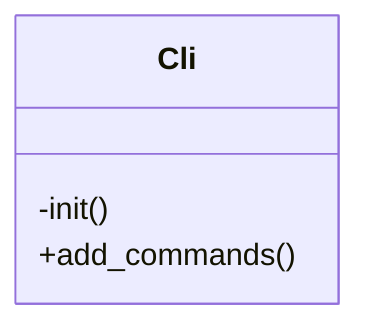

# Cli


Handles WP-CLI command registration for Tainacan.

Registers all available Tainacan WP-CLI commands including
garbage collection, attachment management, and collection operations.

***

* Full name: `\Tainacan\Cli`

## Class Diagram



## Methods

### init

Initializes the CLI functionality.

```php
private init(): void
```

Sets up WP-CLI command registration after WordPress loads.

***

### add_commands

Registers all Tainacan WP-CLI commands.

```php
public add_commands(): void
```

***

## Inherited methods

### get_instance

```php
public static get_instance(): mixed
```

* This method is **static**.
***

### __construct

```php
private __construct(): mixed
```

***
