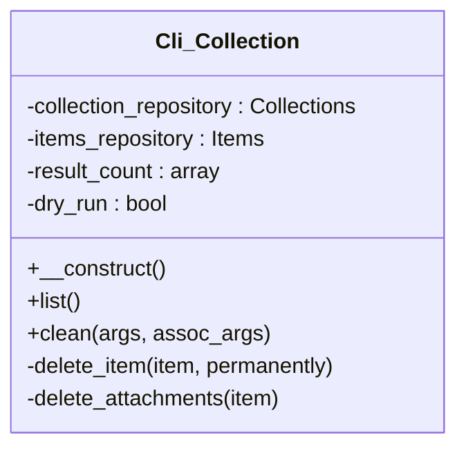

# Cli_Collection


Handles WP-CLI commands for Tainacan collections.

Provides command-line interface for managing collections including
listing, removing items, and other collection operations.

***

* Full name: `\Tainacan\Cli_Collection`

## Class Diagram



## Properties

### collection_repository

Collection repository instance.

```php
private \Tainacan\Repositories\Collections $collection_repository
```

***

### items_repository

Items repository instance.

```php
private \Tainacan\Repositories\Items $items_repository
```

***

### result_count

Result count for operations.

```php
private array $result_count
```

***

### dry_run

Whether to perform a dry run without making changes.

```php
private bool $dry_run
```

***

## Methods

### __construct

Constructor for the Cli_Collection class.

```php
public __construct(): mixed
```

Initializes repository instances and result counters.

***

### list

Shows a list of all collections.

```php
public list(): void
```

Displays a table with collection IDs and titles.

## EXAMPLES

wp tainacan collection list
+------+-------------------+
| ID   | title             |
+------+-------------------+
| 1919 | Collection test 1 |
| 1201 | Collection test 1 |
| 1177 | Livros            |
| 1157 | autores           |
+------+-------------------+

***

### clean

remove items of specific collection.

```php
public clean(mixed $args, mixed $assoc_args): mixed
```

## OPTIONS
<collection_id>
: specifies the collection that will have your items removed.

[--permanently]
: skip trash and permanently delete items.

[--dry-run]
: only count the total of item which will remove, just output a report

## EXAMPLES

wp tainacan collection clean 1201 --permanently

cleaning collection items
100%% [============================================================================================] 0:00 / 0:00
Success:
10 items removed
23 attachments removed

**Parameters:**

| Parameter     | Type      | Description |
|---------------|-----------|-------------|
| `$args`       | **mixed** |             |
| `$assoc_args` | **mixed** |             |

***

### delete_item

```php
private delete_item(mixed $item, mixed $permanently = false): mixed
```

**Parameters:**

| Parameter      | Type      | Description |
|----------------|-----------|-------------|
| `$item`        | **mixed** |             |
| `$permanently` | **mixed** |             |

***

### delete_attachments

```php
private delete_attachments(mixed $item): mixed
```

**Parameters:**

| Parameter | Type      | Description |
|-----------|-----------|-------------|
| `$item`   | **mixed** |             |

***
