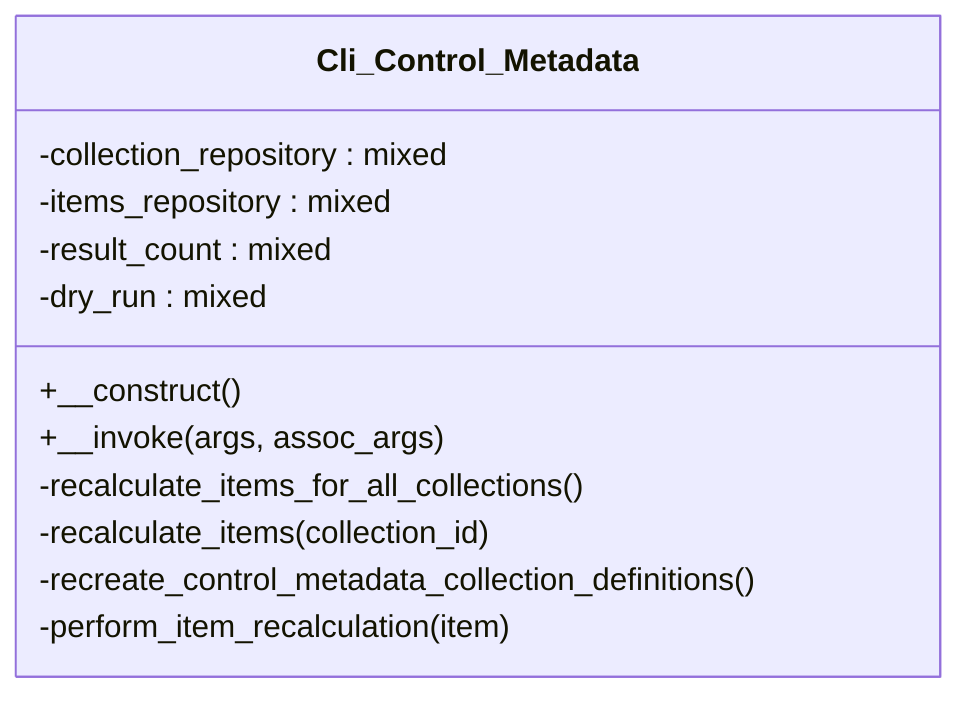

# Cli_Control_Metadata


Handles WP-CLI commands for Tainacan control metadata operations.

Provides command-line interface for managing control metadata including
recalculation of metadata values and metadata validation operations.

***

* Full name: `\Tainacan\Cli_Control_Metadata`

## Class Diagram



## Properties

### collection_repository

```php
private $collection_repository
```

***

### items_repository

```php
private $items_repository
```

***

### result_count

```php
private $result_count
```

***

### dry_run

```php
private $dry_run
```

***

## Methods

### __construct

```php
public __construct(): mixed
```

***

### __invoke

recalculete values of metadata control

```php
public __invoke(mixed $args, mixed $assoc_args): mixed
```

## OPTIONS
[--collection=<value>]
: <value> Collection specific ID into which the control metadata will be recalculated, or 'all' for all collections.

[--dry-run]
: only count the total of item which will recalculated, just output a report

[--recreate-control-metadata-definitions]
: recreate the control metadata collection definitions

## EXAMPLES

wp tainacan control-metadata --collection=416
recalculate control metadata for items to collection 416:  100%% [====================================================] 0:00 / 0:00
Success:
710 items recalculate


wp tainacan control-metadata --collection=all
recalculate control metadata for items to collection 416:  100%% [====================================================] 0:00 / 0:00
Success:
710 items recalculate
recalculate control metadata for items to collection 301:  100%% [====================================================] 0:00 / 0:00
Success:
156 items recalculate

**Parameters:**

| Parameter     | Type      | Description |
|---------------|-----------|-------------|
| `$args`       | **mixed** |             |
| `$assoc_args` | **mixed** |             |

***

### recalculate_items_for_all_collections

```php
private recalculate_items_for_all_collections(): mixed
```

***

### recalculate_items

```php
private recalculate_items(mixed $collection_id): mixed
```

**Parameters:**

| Parameter        | Type      | Description |
|------------------|-----------|-------------|
| `$collection_id` | **mixed** |             |

***

### recreate_control_metadata_collection_definitions

```php
private recreate_control_metadata_collection_definitions(): mixed
```

***

### perform_item_recalculation

```php
private perform_item_recalculation(mixed $item): mixed
```

**Parameters:**

| Parameter | Type      | Description |
|-----------|-----------|-------------|
| `$item`   | **mixed** |             |

***
