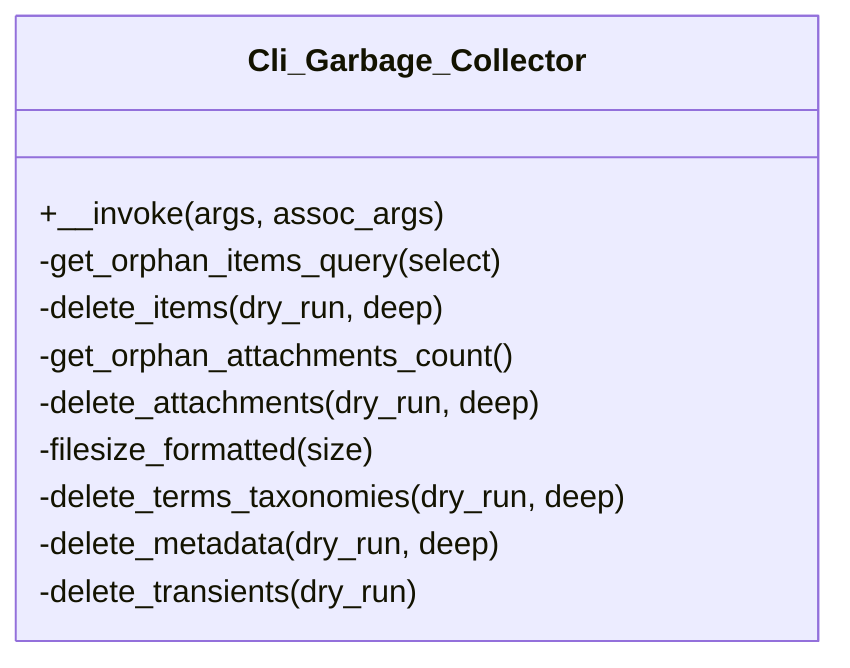

# Cli_Garbage_Collector


Handles WP-CLI commands for Tainacan garbage collection operations.

Provides command-line interface for cleaning up unused files, orphaned
database entries, and maintaining Tainacan installation health.

***

* Full name: `\Tainacan\Cli_Garbage_Collector`

## Class Diagram



## Methods

### __invoke

Clean your Tainacan installation removing unused files and database entries

```php
public __invoke(mixed $args, mixed $assoc_args): mixed
```

## OPTIONS

[--run]
: By default, this command only looks for garbage and output a report, but does not delete anything. If you want to really delete the garbage, pass --run

[--deep]
: More aressive approach finding garbage. In some cases it could delete something related to other parts of the website. Currently, deep mode deletes all attachments with broken parent IDs, regardless whether they were uploaded via tainacan or not

[--skip-attachments]
: Do not try to find orphan and unused attachments

[--skip-items]
: Do not try to find orphan and unused items

[--skip-taxonomies]
: Do not try to find orphan and unused taxonomies

[--skip-metadata]
: Do not try to find orphan and unused metadata

[--skip-transients]
: Do not try to find tainacan transients

[--yes]
: Skip confirmation before execution

**Parameters:**

| Parameter     | Type      | Description |
|---------------|-----------|-------------|
| `$args`       | **mixed** |             |
| `$assoc_args` | **mixed** |             |

***

### get_orphan_items_query

```php
private get_orphan_items_query(mixed $select = 'ID'): mixed
```

**Parameters:**

| Parameter | Type      | Description |
|-----------|-----------|-------------|
| `$select` | **mixed** |             |

***

### delete_items

```php
private delete_items(mixed $dry_run = false, mixed $deep = false): mixed
```

**Parameters:**

| Parameter  | Type      | Description |
|------------|-----------|-------------|
| `$dry_run` | **mixed** |             |
| `$deep`    | **mixed** |             |

***

### get_orphan_attachments_count

```php
private get_orphan_attachments_count(): mixed
```

***

### delete_attachments

```php
private delete_attachments(mixed $dry_run = false, mixed $deep = false): mixed
```

**Parameters:**

| Parameter  | Type      | Description |
|------------|-----------|-------------|
| `$dry_run` | **mixed** |             |
| `$deep`    | **mixed** |             |

***

### filesize_formatted

```php
private filesize_formatted(mixed $size): mixed
```

**Parameters:**

| Parameter | Type      | Description |
|-----------|-----------|-------------|
| `$size`   | **mixed** |             |

***

### delete_terms_taxonomies

```php
private delete_terms_taxonomies(mixed $dry_run = false, mixed $deep = false): mixed
```

**Parameters:**

| Parameter  | Type      | Description |
|------------|-----------|-------------|
| `$dry_run` | **mixed** |             |
| `$deep`    | **mixed** |             |

***

### delete_metadata

```php
private delete_metadata(mixed $dry_run = false, mixed $deep = false): mixed
```

**Parameters:**

| Parameter  | Type      | Description |
|------------|-----------|-------------|
| `$dry_run` | **mixed** |             |
| `$deep`    | **mixed** |             |

***

### delete_transients

```php
private delete_transients(mixed $dry_run): mixed
```

**Parameters:**

| Parameter  | Type      | Description |
|------------|-----------|-------------|
| `$dry_run` | **mixed** |             |

***
