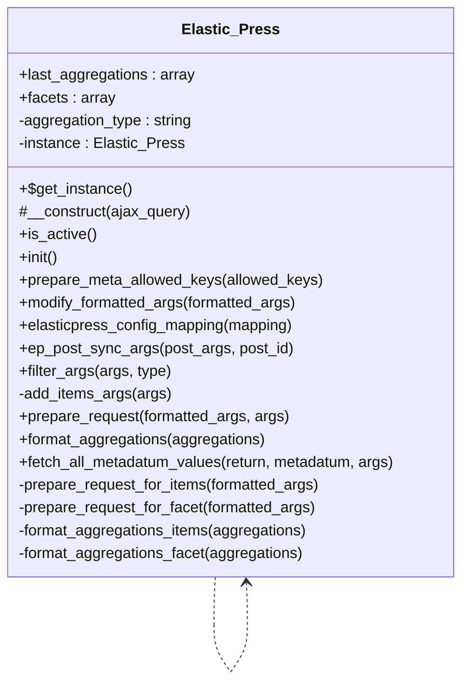

# Elastic_Press


Class Elastic_Press

This class implements the integration of Tainacan with ElasticPress, a WordPress plugin that connects your WordPress installation with Elastic Search

https://github.com/10up/ElasticPress
https://www.elasticpress.io/

***

* Full name: `\Tainacan\Elastic_Press`

## Class Diagram



## Properties

### last_aggregations

Stores the last aggregations result

```php
public array $last_aggregations
```

***

### facets

Stores the facets configuration

```php
public array $facets
```

***

### aggregation_type

Defines the type of aggregation being performed

```php
private string $aggregation_type
```

***

### instance

Singleton instance

```php
private static \Tainacan\Elastic_Press $instance
```

* This property is **static**.

***

## Methods

### get_instance

Get singleton instance

```php
public static get_instance(): \Tainacan\Elastic_Press
```

* This method is **static**.
***

### __construct

Constructor

```php
protected __construct(bool $ajax_query = false): mixed
```

**Parameters:**

| Parameter     | Type     | Description                   |
|---------------|----------|-------------------------------|
| `$ajax_query` | **bool** | Whether this is an AJAX query |

***

### is_active

Check if ElasticPress is active

```php
public is_active(): bool
```

***

### init

Initialize the integration

```php
public init(): mixed
```

***

### prepare_meta_allowed_keys

Define which meta keys should be indexed

```php
public prepare_meta_allowed_keys(array $allowed_keys): array
```

**Parameters:**

| Parameter       | Type      | Description             |
|-----------------|-----------|-------------------------|
| `$allowed_keys` | **array** | Previously allowed keys |

**Return Value:**

Modified allowed keys

The function should return the meta_keys that will be indexed by ElasticPress.
Currently, we are retrieving the list of all metadata IDs for all collections, but this behavior might not be ideal.
Should we instead look at the post being indexed and return only the metadata for the collection it belongs to?

apply_filters( 'ep_prepare_meta_allowed_protected_keys', $keys, $post )
https://10up.github.io/ElasticPress/ep_prepare_meta_allowed_protected_keys.html

***

### modify_formatted_args

Modify the formatted arguments for elasticsearch query

```php
public modify_formatted_args(array $formatted_args): array
```

**Parameters:**

| Parameter         | Type      | Description                                     |
|-------------------|-----------|-------------------------------------------------|
| `$formatted_args` | **array** | The arguments already formatted by ElasticPress |

**Return Value:**

Modified arguments

***

### elasticpress_config_mapping

Configure the mapping for Elasticsearch

```php
public elasticpress_config_mapping(array $mapping): array
```

**Parameters:**

| Parameter  | Type      | Description                   |
|------------|-----------|-------------------------------|
| `$mapping` | **array** | Current mapping configuration |

**Return Value:**

Modified mapping

***

### ep_post_sync_args

Modify post arguments before syncing to Elasticsearch

```php
public ep_post_sync_args(array $post_args, int $post_id): array
```

**Parameters:**

| Parameter    | Type      | Description    |
|--------------|-----------|----------------|
| `$post_args` | **array** | Post arguments |
| `$post_id`   | **int**   | Post ID        |

**Return Value:**

Modified post arguments

***

### filter_args

Filter arguments for Tainacan queries

```php
public filter_args(array $args, string $type): array
```

**Parameters:**

| Parameter | Type       | Description                             |
|-----------|------------|-----------------------------------------|
| `$args`   | **array**  | The original arguments                  |
| `$type`   | **string** | The query type (items, taxonomies, etc) |

**Return Value:**

Modified arguments

***

### add_items_args

Add Tainacan-specific arguments for items queries

```php
private add_items_args(array $args): array
```

**Parameters:**

| Parameter | Type      | Description        |
|-----------|-----------|--------------------|
| `$args`   | **array** | Original arguments |

**Return Value:**

Modified arguments

***

### prepare_request

Prepare the elasticsearch request with aggregations for items or facets

```php
public prepare_request(array $formatted_args, array $args): array
```

**Parameters:**

| Parameter         | Type      | Description                         |
|-------------------|-----------|-------------------------------------|
| `$formatted_args` | **array** | Arguments formatted by ElasticPress |
| `$args`           | **array** | Original WP_Query arguments         |

**Return Value:**

Modified arguments

***

### format_aggregations

Format elasticsearch aggregations response according to aggregation type

```php
public format_aggregations(array $aggregations): array
```

**Parameters:**

| Parameter       | Type      | Description                              |
|-----------------|-----------|------------------------------------------|
| `$aggregations` | **array** | Aggregations from elasticsearch response |

**Return Value:**

Formatted aggregations

***

### fetch_all_metadatum_values

Fetch all values for a metadata

```php
public fetch_all_metadatum_values(mixed $return, \Tainacan\Entities\Metadatum $metadatum, array $args): array|null
```

**Parameters:**

| Parameter    | Type                             | Description             |
|--------------|----------------------------------|-------------------------|
| `$return`    | **mixed**                        | Default return value    |
| `$metadatum` | **\Tainacan\Entities\Metadatum** | The metadatum object    |
| `$args`      | **array**                        | Arguments for the query |

**Return Value:**

The metadatum values

***

### prepare_request_for_items

Prepare the elasticsearch request for items with aggregations for each filter

```php
private prepare_request_for_items(array $formatted_args): array
```

**Parameters:**

| Parameter         | Type      | Description                         |
|-------------------|-----------|-------------------------------------|
| `$formatted_args` | **array** | Arguments formatted by ElasticPress |

**Return Value:**

Modified arguments with aggregations

***

### prepare_request_for_facet

Prepare the elasticsearch request for a single facet

```php
private prepare_request_for_facet(array $formatted_args): array
```

**Parameters:**

| Parameter         | Type      | Description                         |
|-------------------|-----------|-------------------------------------|
| `$formatted_args` | **array** | Arguments formatted by ElasticPress |

**Return Value:**

Modified arguments with aggregations

***

### format_aggregations_items

Format elasticsearch aggregations for items request

```php
private format_aggregations_items(array $aggregations): array
```

**Parameters:**

| Parameter       | Type      | Description                              |
|-----------------|-----------|------------------------------------------|
| `$aggregations` | **array** | Aggregations from elasticsearch response |

**Return Value:**

Formatted aggregations

***

### format_aggregations_facet

Format elasticsearch aggregations for facet request

```php
private format_aggregations_facet(array $aggregations): array
```

**Parameters:**

| Parameter       | Type      | Description                              |
|-----------------|-----------|------------------------------------------|
| `$aggregations` | **array** | Aggregations from elasticsearch response |

**Return Value:**

Formatted aggregations

***
