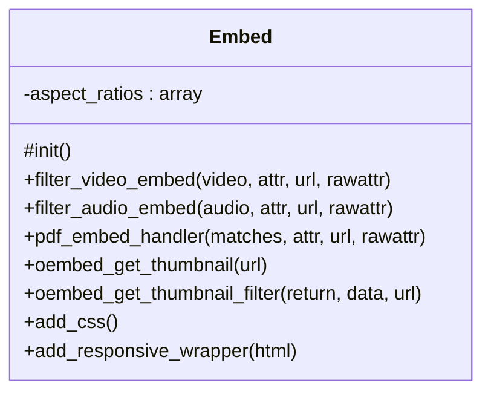

# Embed


Handles media embedding functionality for Tainacan.

Provides enhanced embedding capabilities for various media types including
video, audio, and PDF files with responsive design support.

***

* Full name: `\Tainacan\Embed`

## Class Diagram



## Properties

### aspect_ratios

Available aspect ratios for responsive embeds.

```php
private static array $aspect_ratios
```

* This property is **static**.

***

## Methods

### init

Initializes the embed functionality.

```php
protected init(): void
```

Sets up WordPress hooks for video, audio, and PDF embedding,
and enqueues necessary styles for responsive embeds.

***

### filter_video_embed

Filters video embed output to use HTML5 video tags.

```php
public filter_video_embed(string $video, array $attr, string $url, array $rawattr): string
```

**Parameters:**

| Parameter  | Type       | Description                   |
|------------|------------|-------------------------------|
| `$video`   | **string** | The current video embed HTML. |
| `$attr`    | **array**  | Embed attributes.             |
| `$url`     | **string** | The video URL.                |
| `$rawattr` | **array**  | Raw embed attributes.         |

**Return Value:**

Modified video embed HTML.

***

### filter_audio_embed

Filters audio embed output to use HTML5 audio tags.

```php
public filter_audio_embed(string $audio, array $attr, string $url, array $rawattr): string
```

**Parameters:**

| Parameter  | Type       | Description                   |
|------------|------------|-------------------------------|
| `$audio`   | **string** | The current audio embed HTML. |
| `$attr`    | **array**  | Embed attributes.             |
| `$url`     | **string** | The audio URL.                |
| `$rawattr` | **array**  | Raw embed attributes.         |

**Return Value:**

Modified audio embed HTML.

***

### pdf_embed_handler

Handles PDF file embedding using iframe.

```php
public pdf_embed_handler(array $matches, array $attr, string $url, array $rawattr): string
```

**Parameters:**

| Parameter  | Type       | Description                           |
|------------|------------|---------------------------------------|
| `$matches` | **array**  | Regex matches from the embed handler. |
| `$attr`    | **array**  | Embed attributes.                     |
| `$url`     | **string** | The PDF file URL.                     |
| `$rawattr` | **array**  | Raw embed attributes.                 |

**Return Value:**

PDF embed HTML.

***

### oembed_get_thumbnail

Retrieves the thumbnail URL, if provided, for a given URL.

```php
public oembed_get_thumbnail(string $url): string|null
```

**Parameters:**

| Parameter | Type       | Description              |
|-----------|------------|--------------------------|
| `$url`    | **string** | The URL for the content. |

**Return Value:**

The thumbnail URL or null on failure.

***

### oembed_get_thumbnail_filter

Filters oEmbed data to extract thumbnail URL.

```php
public oembed_get_thumbnail_filter(mixed $return, object $data, string $url): string|null
```

**Parameters:**

| Parameter | Type       | Description             |
|-----------|------------|-------------------------|
| `$return` | **mixed**  | The oEmbed return data. |
| `$data`   | **object** | The oEmbed data object. |
| `$url`    | **string** | The original URL.       |

**Return Value:**

The thumbnail URL or null.

***

### add_css

Enqueues CSS for responsive embeds.

```php
public add_css(): void
```

***

### add_responsive_wrapper

Adds responsive wrapper classes based on aspect ratio.

```php
public add_responsive_wrapper(string $html): string
```

This code is heavily inspired by Gutenberg plugin's "getClassNames" function.
Check their source code for more details: /packages/block-library/src/embed/util.js

**Parameters:**

| Parameter | Type       | Description                                                                  |
|-----------|------------|------------------------------------------------------------------------------|
| `$html`   | **string** | The preview HTML that possibly contains an iframe with width and height set. |

**Return Value:**

HTML with responsive wrapper classes added.

***

## Inherited methods

### get_instance

```php
public static get_instance(): mixed
```

* This method is **static**.
***

### __construct

```php
private __construct(): mixed
```

***
