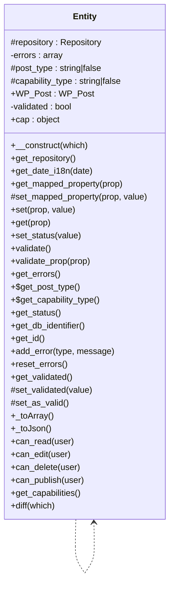

# Entity


Abstract base class for all Tainacan entities.

Provides common functionality for all Tainacan entities including
validation, error handling, and WordPress post type integration.

***

* Full name: `\Tainacan\Entities\Entity`

## Class Diagram



## Properties

### repository

The repository instance for this entity.

```php
protected \Tainacan\Repositories\Repository $repository
```

***

### errors

Array of validation and other errors.

```php
private array $errors
```

***

### post_type

The WordPress post type for storing this entity.

```php
protected static string|false $post_type
```

Set to false if not using WordPress post types.

* This property is **static**.

***

### capability_type

The WordPress capability type for this entity.

```php
protected static string|false $capability_type
```

Defaults to the same value as $post_type.

* This property is **static**.

***

### WP_Post

The WordPress post object associated with this entity.

```php
public \WP_Post $WP_Post
```

***

### validated

Indicates whether this entity has been validated.

```php
private bool $validated
```

Entities MUST be validated before attempting to save.

***

### cap

Capabilities of the post_type, one of:
- edit_posts - Controls whether objects of this post type can be edited.

```php
public object $cap
```

- edit_others_posts - Controls whether objects of this type owned by other users
  can be edited. If the post type does not support an author, then this will
  behave like edit_posts.
- publish_posts - Controls publishing objects of this post type.
- read_private_posts - Controls whether private objects can be read.
- read - Controls whether objects of this post type can be read.
- delete_posts - Controls whether objects of this post type can be deleted.
- delete_private_posts - Controls whether private objects can be deleted.
- delete_published_posts - Controls whether published objects can be deleted.
- delete_others_posts - Controls whether objects owned by other users can be
  can be deleted. If the post type does not support an author, then this will
  behave like delete_posts.
- edit_private_posts - Controls whether private objects can be edited.
- edit_published_posts - Controls whether published objects can be edited.

***

## Methods

### __construct

Create an instance of Entity

```php
public __construct(mixed $which): mixed
```

If ID or WP Post is passed, it retrieves the object from the database

Attention: If the ID or Post provided do not match the Entity post type, an Exception will be thrown

**Parameters:**

| Parameter | Type      | Description |
|-----------|-----------|-------------|
| `$which`  | **mixed** |             |

**Throws:**

- [`Exception`](../../Exception)

***

### get_repository

```php
public get_repository(): mixed
```

***

### get_date_i18n

```php
public get_date_i18n(mixed $date): string
```

**Parameters:**

| Parameter | Type      | Description |
|-----------|-----------|-------------|
| `$date`   | **mixed** |             |

***

### get_mapped_property

return the value for a mapped property

```php
public get_mapped_property(string $prop): mixed
```

**Parameters:**

| Parameter | Type       | Description    |
|-----------|------------|----------------|
| `$prop`   | **string** | id of property |

**Return Value:**

property value

***

### set_mapped_property

set the value of a mapped property

```php
protected set_mapped_property(string $prop, mixed $value): mixed
```

This is a protected method. If you want to set an entity prop
using the prop name dynamically, use the set() method

**Parameters:**

| Parameter | Type       | Description            |
|-----------|------------|------------------------|
| `$prop`   | **string** | id of the property     |
| `$value`  | **mixed**  | the value to be setted |

***

### set

set the value property

```php
public set(string $prop, mixed $value): null|mixed
```

**Parameters:**

| Parameter | Type       | Description            |
|-----------|------------|------------------------|
| `$prop`   | **string** | id of the property     |
| `$value`  | **mixed**  | the value to be setted |

**Return Value:**

Null on failure, the value that was set on success

***

### get

get the value property

```php
public get(string $prop): null|mixed
```

**Parameters:**

| Parameter | Type       | Description        |
|-----------|------------|--------------------|
| `$prop`   | **string** | id of the property |

**Return Value:**

Null on failure, the value that was set on success

***

### set_status

set the status of the entity

```php
public set_status(string $value): mixed
```

**Parameters:**

| Parameter | Type       | Description |
|-----------|------------|-------------|
| `$value`  | **string** |             |

***

### validate

Validate the class values/properties, to be used before insert/save/update

```php
public validate(): bool
```

If Entity is not valid, validation error messages are available via get_errors() method

***

### validate_prop

Validate a single property

```php
public validate_prop(string $prop): bool
```

**Parameters:**

| Parameter | Type       | Description                       |
|-----------|------------|-----------------------------------|
| `$prop`   | **string** | id of the property to be validate |

***

### get_errors

```php
public get_errors(): mixed
```

***

### get_post_type

```php
public static get_post_type(): mixed
```

* This method is **static**.
***

### get_capability_type

```php
public static get_capability_type(): mixed
```

* This method is **static**.
***

### get_status

```php
public get_status(): mixed
```

***

### get_db_identifier

Get entity DB identifier

```php
public get_db_identifier(): string
```

This identifier is used to register the entity on database, ex.: post_type

***

### get_id

Get the entity ID

```php
public get_id(): int
```

***

### add_error

```php
public add_error(mixed $type, mixed $message): mixed
```

**Parameters:**

| Parameter  | Type      | Description |
|------------|-----------|-------------|
| `$type`    | **mixed** |             |
| `$message` | **mixed** |             |

***

### reset_errors

Clear the errors array

```php
public reset_errors(): mixed
```

***

### get_validated

```php
public get_validated(): mixed
```

***

### set_validated

```php
protected set_validated(mixed $value): mixed
```

**Parameters:**

| Parameter | Type      | Description |
|-----------|-----------|-------------|
| `$value`  | **mixed** |             |

***

### set_as_valid

```php
protected set_as_valid(): mixed
```

***

### _toArray

```php
public _toArray(): mixed
```

***

### _toJson

```php
public _toJson(): mixed
```

***

### can_read

Return if user can read this entity

```php
public can_read(int|\WP_User $user = null): bool
```

**Parameters:**

| Parameter | Type              | Description |
|-----------|-------------------|-------------|
| `$user`   | **int\|\WP_User** |             |

***

### can_edit

Return if user can edit this entity

```php
public can_edit(int|\WP_User|null $user = null): bool
```

**Parameters:**

| Parameter | Type                    | Description                                              |
|-----------|-------------------------|----------------------------------------------------------|
| `$user`   | **int\|\WP_User\|null** | the user for capability check, null for the current user |

***

### can_delete

Return if user can delete this entity

```php
public can_delete(int|\WP_User|null $user = null): bool
```

**Parameters:**

| Parameter | Type                    | Description                                              |
|-----------|-------------------------|----------------------------------------------------------|
| `$user`   | **int\|\WP_User\|null** | the user for capability check, null for the current user |

***

### can_publish

Return if user can publish this entity

```php
public can_publish(int|\WP_User|null $user = null): bool
```

**Parameters:**

| Parameter | Type                    | Description                                              |
|-----------|-------------------------|----------------------------------------------------------|
| `$user`   | **int\|\WP_User\|null** | the user for capability check, null for the current user |

***

### get_capabilities

Get the capabilities list for the post type of the entity

```php
public get_capabilities(): object
```

**Return Value:**

Object with all the capabilities as member variables.

***

### diff

Compare this entity props with self old values or with $which other entity

```php
public diff(\Tainacan\Entities\Entity|int|\WP_Post $which): array
```

**Parameters:**

| Parameter | Type                                         | Description                                             |
|-----------|----------------------------------------------|---------------------------------------------------------|
| `$which`  | **\Tainacan\Entities\Entity\|int\|\WP_Post** | default ($which = 0) to self compare with stored entity |

***
