# CSV


***

* Full name: `\Tainacan\Importer\CSV`
* Parent class: [`\Tainacan\Importer\Importer`](./Importer)

## Class Diagram

```mermaid
classDiagram
    class Exporter {
        #id : identifier
        #options : array
        #default_options : array
        #steps : array
        #collections : array
        -output_files : mixed
        -mapping_accept : mixed
        -send_email : mixed
        #mapping_list : mixed
        +mapping_selected : mixed
        #accept_no_mapping : mixed
        #transients : array
        #abort : bool
        #current_step : mixed
        #in_step_count : mixed
        #current_collection : mixed
        #current_collection_item : mixed
        #log : mixed
        #error_log : mixed
        #array_attributes : array
        +__construct(attributes)
        +add_collection(collection)
        +remove_collection(col_id)
        +update_collection(index, collection_definition)
        +update_current_collection(collection_definition)
        +next_item()
        +next_collection()
        +get_id()
        +get_current_step()
        +set_current_step(value)
        +get_in_step_count()
        +set_in_step_count(value)
        +get_current_collection()
        +set_current_collection(value)
        +get_current_collection_item()
        +get_step_length_items()
        +set_current_collection_item(value)
        +get_collections()
        +set_collections(value)
        +get_current_collection_object()
        +get_options()
        +set_options(options)
        +get_option(key)
        #set_default_options(options)
        +set_steps(steps)
        +get_steps()
        #get_transients()
        #set_transients(data)
        +add_transient(key, data)
        +delete_transient(key)
        +get_transient(key)
        +get_log()
        +get_error_log()
        +add_log(message)
        +add_error_log(message)
        +is_finished()
        #cancel_abort()
        #abort()
        +get_abort()
        +get_progress_label()
        +get_progress_value()
        #set_current_step_total(value)
        #set_step_total(step, value)
        #next_step()
        +_to_Array(short)
        +get_current_mapper()
        +options_form()
        +process_collections()
        -process_header(current_collection_item, collection_definition)
        +output_header()
        -process_footer(current_collection_item, collection_definition)
        +output_footer()
        -get_items(index, collection_definition)
        -map_item_metadata(item)
        +add_new_file(key)
        +append_to_file(key, data)
        +set_accepted_mapping_methods(method, default_mapping, list)
        +set_mapping_selected(mapping_selected)
        +get_mapping_selected()
        +set_send_email(email)
        +get_send_email()
        +get_output()
        +finished()
        +begin_exporter()
        +end_exporter()
        -set_output_files(output_files)
        #get_output_files()
        +run()
    }
    class CSV {
        -collection_name : mixed
        +__construct(attributes)
        +filter_multivalue_separator(separator)
        +filter_hierarchy_separator(separator)
        +process_item(item, metadata)
        +output_header()
        +output_footer()
        -get_collections_names()
        +get_output()
        +options_form()
    }
    Exporter <|-- CSV
```



## Properties

### items_repo

```php
private $items_repo
```

***

## Methods

### __construct

```php
public __construct(mixed $attributes = array()): mixed
```

**Parameters:**

| Parameter     | Type      | Description |
|---------------|-----------|-------------|
| `$attributes` | **mixed** |             |

***

### set_option

alter the default options

```php
public set_option(mixed $key, mixed $value): mixed
```

**Parameters:**

| Parameter | Type      | Description |
|-----------|-----------|-------------|
| `$key`    | **mixed** |             |
| `$value`  | **mixed** |             |

***

### get_source_metadata

get the metadata of file/url to allow mapping
should return an array

```php
public get_source_metadata(): array
```

**Return Value:**

$metadata_source the metadata from the source

***

### get_source_special_fields

```php
public get_source_special_fields(): mixed
```

***

### raw_source_metadata

returns all header including special

```php
public raw_source_metadata(): mixed
```

***

### process_item

get values for a single item

```php
public process_item(mixed $index, mixed $collection_definition): array
```

**Parameters:**

| Parameter                | Type      | Description |
|--------------------------|-----------|-------------|
| `$index`                 | **mixed** |             |
| `$collection_definition` | **mixed** |             |

**Return Value:**

with metadatum_source's as the index and values for the
item

Ex: [ 'Metadatum1' => 'value1', 'Metadatum2' => [ 'value2','value3' ]

***

### after_inserted_item

allow importers executes process after item is insertes

```php
public after_inserted_item(mixed $inserted_item, mixed $collection_index): mixed
```

**Parameters:**

| Parameter           | Type      | Description                                                                                  |
|---------------------|-----------|----------------------------------------------------------------------------------------------|
| `$inserted_item`    | **mixed** |                                                                                              |
| `$collection_index` | **mixed** | The index in the $this->collections array of the collection the item is beeing inserted into |

***

### get_source_number_of_items

Method implemented by the child importer class to return the total number of items that will be imported

```php
public get_source_number_of_items(): int
```

***

### options_form

Method implemented by child importer to return the HTML of the Options Form to be rendered in the Importer page

```php
public options_form(): mixed
```

***

### handle_encoding

get the encode option and return as expected

```php
private handle_encoding(mixed $string): mixed
```

**Parameters:**

| Parameter | Type      | Description |
|-----------|-----------|-------------|
| `$string` | **mixed** |             |

***

### handle_document

Method responsible to insert the item document

```php
private handle_document(mixed $column_value, mixed $item_inserted): mixed
```

**Parameters:**

| Parameter        | Type      | Description |
|------------------|-----------|-------------|
| `$column_value`  | **mixed** |             |
| `$item_inserted` | **mixed** |             |

***

### handle_thumbnail

Method responsible to insert the item thumbnail

```php
private handle_thumbnail(mixed $column_value, mixed $item_inserted): mixed
```

**Parameters:**

| Parameter        | Type      | Description |
|------------------|-----------|-------------|
| `$column_value`  | **mixed** |             |
| `$item_inserted` | **mixed** |             |

***

### handle_attachment

Method responsible to insert the item attachments

```php
private handle_attachment(mixed $column_value, mixed $item_inserted): mixed
```

**Parameters:**

| Parameter        | Type      | Description |
|------------------|-----------|-------------|
| `$column_value`  | **mixed** |             |
| `$item_inserted` | **mixed** |             |

***

### handle_enclosure

```php
private handle_enclosure(mixed& $file): mixed
```

**Parameters:**

| Parameter | Type      | Description                    |
|-----------|-----------|--------------------------------|
| `$file`   | **mixed** | resource the csv file uploaded |

***

### handle_item_status

```php
private handle_item_status(mixed $status, mixed $item_inserted): mixed
```

**Parameters:**

| Parameter        | Type      | Description            |
|------------------|-----------|------------------------|
| `$status`        | **mixed** | string the item status |
| `$item_inserted` | **mixed** |                        |

***

### handle_item_comment_status

```php
private handle_item_comment_status(mixed $comment_status, mixed $item_inserted): mixed
```

**Parameters:**

| Parameter         | Type      | Description                    |
|-------------------|-----------|--------------------------------|
| `$comment_status` | **mixed** | string the item comment status |
| `$item_inserted`  | **mixed** |                                |

***

### handle_item_author_id

```php
private handle_item_author_id(mixed $author, mixed $item_inserted): mixed
```

**Parameters:**

| Parameter        | Type      | Description |
|------------------|-----------|-------------|
| `$author`        | **mixed** |             |
| `$item_inserted` | **mixed** |             |

***

### handle_item_slug

```php
private handle_item_slug(mixed $slug, mixed $item_inserted): mixed
```

**Parameters:**

| Parameter        | Type      | Description |
|------------------|-----------|-------------|
| `$slug`          | **mixed** |             |
| `$item_inserted` | **mixed** |             |

***

### handle_item_id

```php
private handle_item_id(mixed $values): mixed
```

**Parameters:**

| Parameter | Type      | Description |
|-----------|-----------|-------------|
| `$values` | **mixed** |             |

***

### insert

insert processed item from source to Tainacan

```php
public insert(array $processed_item, int $collection_index): bool|\Tainacan\Entities\Item
```

**Parameters:**

| Parameter           | Type      | Description                                                                                 |
|---------------------|-----------|---------------------------------------------------------------------------------------------|
| `$processed_item`   | **array** | Associative array with metadatum source's as index with
its value or values                 |
| `$collection_index` | **int**   | The index in the $this->collections array of the collection the item is being inserted into |

**Return Value:**

Item inserted

***

### is_assoc

```php
private is_assoc(array $arr): mixed
```

**Parameters:**

| Parameter | Type      | Description |
|-----------|-----------|-------------|
| `$arr`    | **array** |             |

***

### deleteAllValuesCompoundItemMetadata

```php
private deleteAllValuesCompoundItemMetadata(mixed $item, mixed $compoundMetadataID): mixed
```

**Parameters:**

| Parameter             | Type      | Description |
|-----------------------|-----------|-------------|
| `$item`               | **mixed** |             |
| `$compoundMetadataID` | **mixed** |             |

***

### is_empty_value

```php
public is_empty_value(mixed $value): bool
```

**Parameters:**

| Parameter | Type      | Description |
|-----------|-----------|-------------|
| `$value`  | **mixed** |             |

***

### is_clear_value

```php
private is_clear_value(mixed $value): bool
```

**Parameters:**

| Parameter | Type      | Description |
|-----------|-----------|-------------|
| `$value`  | **mixed** |             |

***

### insert_hierarchy

```php
private insert_hierarchy(mixed $metadatum, mixed $values): bool|array
```

**Parameters:**

| Parameter    | Type      | Description          |
|--------------|-----------|----------------------|
| `$metadatum` | **mixed** | the metadata         |
| `$values`    | **mixed** | the categories names |

**Return Value:**

empty with no category or array with IDs

***

### save_mapping

```php
public save_mapping(mixed $collection_id, mixed $mapping): mixed
```

**Parameters:**

| Parameter        | Type      | Description                        |
|------------------|-----------|------------------------------------|
| `$collection_id` | **mixed** | int the collection id              |
| `$mapping`       | **mixed** | array the headers-metadata mapping |

***

### get_mapping

```php
public get_mapping(mixed $collection_id): array|bool
```

**Parameters:**

| Parameter        | Type      | Description |
|------------------|-----------|-------------|
| `$collection_id` | **mixed** |             |

**Return Value:**

false if has no mapping or associated array with metadata id and header

***

### add_collection

```php
public add_collection(array $collection): mixed
```

**Parameters:**

| Parameter     | Type      | Description |
|---------------|-----------|-------------|
| `$collection` | **array** |             |

***

### get_collections_names

```php
private get_collections_names(): mixed
```

***

### get_output

Called when the process is finished. returns the final message to the user with a
short description of what happened. May contain HTML code and links

```php
public get_output(): string
```

***

### delete_previous_document_imgs

```php
private delete_previous_document_imgs(mixed $item_id, mixed $item_document): mixed
```

**Parameters:**

| Parameter        | Type      | Description |
|------------------|-----------|-------------|
| `$item_id`       | **mixed** |             |
| `$item_document` | **mixed** |             |

***

## Inherited methods

### __construct

```php
public __construct(mixed $attributes = array()): mixed
```

**Parameters:**

| Parameter     | Type      | Description |
|---------------|-----------|-------------|
| `$attributes` | **mixed** |             |

***

### _to_Array

```php
public _to_Array(mixed $short = false): mixed
```

**Parameters:**

| Parameter | Type      | Description |
|-----------|-----------|-------------|
| `$short`  | **mixed** |             |

***

### get_id

```php
public get_id(): string
```

***

### set_url

Set URL

```php
public set_url(mixed $url): bool
```

**Parameters:**

| Parameter | Type      | Description |
|-----------|-----------|-------------|
| `$url`    | **mixed** | string      |

***

### get_url

```php
public get_url(): string
```

**Return Value:**

or bool

***

### get_current_step

```php
public get_current_step(): mixed
```

***

### set_current_step

```php
public set_current_step(mixed $value): mixed
```

**Parameters:**

| Parameter | Type      | Description |
|-----------|-----------|-------------|
| `$value`  | **mixed** |             |

***

### get_in_step_count

```php
public get_in_step_count(): mixed
```

***

### set_in_step_count

```php
public set_in_step_count(mixed $value): mixed
```

**Parameters:**

| Parameter | Type      | Description |
|-----------|-----------|-------------|
| `$value`  | **mixed** |             |

***

### get_current_collection

```php
public get_current_collection(): mixed
```

***

### set_current_collection

```php
public set_current_collection(mixed $value): mixed
```

**Parameters:**

| Parameter | Type      | Description |
|-----------|-----------|-------------|
| `$value`  | **mixed** |             |

***

### get_current_collection_item

```php
public get_current_collection_item(): mixed
```

***

### set_current_collection_item

```php
public set_current_collection_item(mixed $value): mixed
```

**Parameters:**

| Parameter | Type      | Description |
|-----------|-----------|-------------|
| `$value`  | **mixed** |             |

***

### get_tmp_file

```php
public get_tmp_file(): mixed
```

***

### set_tmp_file

```php
public set_tmp_file(mixed $filepath): mixed
```

**Parameters:**

| Parameter   | Type      | Description |
|-------------|-----------|-------------|
| `$filepath` | **mixed** |             |

***

### get_collections

```php
public get_collections(): mixed
```

***

### set_collections

```php
public set_collections(mixed $value): mixed
```

**Parameters:**

| Parameter | Type      | Description |
|-----------|-----------|-------------|
| `$value`  | **mixed** |             |

***

### get_options

Gets the options for this importer, including default values for options
that were not set yet.

```php
public get_options(): array
```

**Return Value:**

Importer options

***

### set_options

Set the options array

```php
public set_options(array $options): mixed
```

**Parameters:**

| Parameter  | Type      | Description |
|------------|-----------|-------------|
| `$options` | **array** |             |

***

### set_default_options

Set the default options values.

```php
protected set_default_options(array $options): mixed
```

Must be called from the __construct method of the child importer class to set default values.

**Parameters:**

| Parameter  | Type      | Description |
|------------|-----------|-------------|
| `$options` | **array** |             |

***

### set_steps

```php
public set_steps(mixed $steps): mixed
```

**Parameters:**

| Parameter | Type      | Description |
|-----------|-----------|-------------|
| `$steps`  | **mixed** |             |

***

### get_steps

```php
public get_steps(): mixed
```

***

### get_log

```php
public get_log(): mixed
```

***

### get_error_log

```php
public get_error_log(): mixed
```

***

### add_file

```php
public add_file(mixed $file): bool
```

**Parameters:**

| Parameter | Type      | Description                    |
|-----------|-----------|--------------------------------|
| `$file`   | **mixed** | File to be managed by importer |

***

### add_log

log the actions from importer

```php
public add_log(mixed $message): mixed
```

**Parameters:**

| Parameter  | Type      | Description |
|------------|-----------|-------------|
| `$message` | **mixed** |             |

***

### add_error_log

```php
public add_error_log(mixed $message): mixed
```

**Parameters:**

| Parameter  | Type      | Description |
|------------|-----------|-------------|
| `$message` | **mixed** |             |

***

### add_collection

```php
public add_collection(array $collection): mixed
```

**Parameters:**

| Parameter     | Type      | Description |
|---------------|-----------|-------------|
| `$collection` | **array** |             |

***

### remove_collection

```php
public remove_collection(mixed $col_id): mixed
```

**Parameters:**

| Parameter | Type      | Description |
|-----------|-----------|-------------|
| `$col_id` | **mixed** |             |

***

### fetch_from_remote

get the content form url and creates a file

```php
public fetch_from_remote(mixed $url): array
```

**Parameters:**

| Parameter | Type      | Description |
|-----------|-----------|-------------|
| `$url`    | **mixed** |             |

***

### get_option

Gets one option from the options array.

```php
public get_option(string $key): mixed
```

Checks if option exist or if it have a default value. Otherwise return an empty string

**Parameters:**

| Parameter | Type       | Description        |
|-----------|------------|--------------------|
| `$key`    | **string** | the desired option |

**Return Value:**

the option value, the default value or an empty string

***

### add_import_method

Adds a new method accepeted by the importer

```php
public add_import_method(string $method): bool
```

Current possible methods are file and url

**Parameters:**

| Parameter | Type       | Description |
|-----------|------------|-------------|
| `$method` | **string** | file or url |

**Return Value:**

true for success, false if method does not exist

***

### remove_import_method

Removes method accepeted by the importer

```php
public remove_import_method(string $method): bool
```

Current possible methods are file and url

**Parameters:**

| Parameter | Type       | Description |
|-----------|------------|-------------|
| `$method` | **string** | file or url |

**Return Value:**

true for success, false if method does not exist

***

### add_transient

```php
public add_transient(mixed $key, mixed $data): mixed
```

**Parameters:**

| Parameter | Type      | Description |
|-----------|-----------|-------------|
| `$key`    | **mixed** |             |
| `$data`   | **mixed** |             |

***

### delete_transient

```php
public delete_transient(mixed $key): mixed
```

**Parameters:**

| Parameter | Type      | Description |
|-----------|-----------|-------------|
| `$key`    | **mixed** |             |

***

### get_transient

```php
public get_transient(mixed $key): mixed
```

**Parameters:**

| Parameter | Type      | Description |
|-----------|-----------|-------------|
| `$key`    | **mixed** |             |

***

### is_finished

```php
public is_finished(): mixed
```

***

### cancel_abort

Cancel Scheduled abortion at the end of run()

```php
protected cancel_abort(): void
```

***

### abort

Schedule importer abortion at the end of run()

```php
protected abort(): void
```

***

### get_abort

Return whether importer should abort execution or not

```php
public get_abort(): bool
```

***

### get_progress_label

Gets the current label to be displayed below the progress bar to give
feedback to the user.

```php
public get_progress_label(): string
```

It automatically gets the attribute progress_label from the current step running.

Importers may change this label whenever they want

***

### get_progress_value

Gets the current value to build the progress bar and give feedback to the user
on the background process that is running the importer.

```php
public get_progress_value(): mixed
```

It does so by comparing the "size" attribute with the $in_step_count class attribute
where size indicates the total size of iterations the step will take and $this->in_step_count
is the current iteration.

For the step with "process_items" as a callback, this method will look for the the $this->collections array
and sum the value of all "total_items" attributes of each collection. Then it will look for
$this->get_current_collection and $this->set_current_collection_item to calculate the progress.

The value must be from 0 to 100

If a negative value is passed, it is assumed that the progress is unknown

***

### set_current_step_total

Sets the total attribute for the current step

```php
protected set_current_step_total(mixed $value): mixed
```

The "total" attribute of a step indicates the number of iterations this step will take to complete.

The iteration is counted using $this->in_step_count attribute, and comparing the two values gives us
the current progress of the process.

**Parameters:**

| Parameter | Type      | Description |
|-----------|-----------|-------------|
| `$value`  | **mixed** |             |

***

### set_step_total

Sets the total attribute for a given step

```php
protected set_step_total(mixed $step, mixed $value): mixed
```

The "total" attribute of a step indicates the number of iterations this step will take to complete.

The iteration is counted using $this->in_step_count attribute, and comparing the two values gives us
the current progress of the process.

**Parameters:**

| Parameter | Type      | Description |
|-----------|-----------|-------------|
| `$step`   | **mixed** |             |
| `$value`  | **mixed** |             |

***

### get_source_metadata

get the metadata of file/url to allow mapping
should return an array

```php
public get_source_metadata(): array
```

Used when $manual_mapping is set to true, to build the mapping interface

**Return Value:**

$metadata_source the metadata from the source

***

### process_item

get values for a single item

```php
public process_item(mixed $index, mixed $collection_id): array
```

* This method is **abstract**.
**Parameters:**

| Parameter        | Type      | Description |
|------------------|-----------|-------------|
| `$index`         | **mixed** |             |
| `$collection_id` | **mixed** |             |

**Return Value:**

with metadatum_source's as the index and values for the
item

Ex: [ 'Metadatum1' => 'value1', 'Metadatum2' => [ 'value2','value3' ]

***

### get_source_number_of_items

Method implemented by the child importer class to return the total number of items that will be imported

```php
public get_source_number_of_items(): int
```

Used to build the progress bar

***

### options_form

Method implemented by child importer to return the HTML of the Options Form to be rendered in the Importer page

```php
public options_form(): mixed
```

***

### get_output

Called when the process is finished. returns the final message to the user with a
short description of what happened. May contain HTML code and links

```php
public get_output(): string
```

***

### process_collections

process an item from the collections queue

```php
public process_collections(): mixed
```

***

### next_item

```php
protected next_item(): mixed
```

***

### next_collection

```php
protected next_collection(): mixed
```

***

### next_step

```php
protected next_step(): mixed
```

***

### insert

insert processed item from source to Tainacan

```php
public insert(array $processed_item, \Tainacan\Importer\integet $collection_index): \Tainacan\Entities\Item
```

**Parameters:**

| Parameter           | Type                           | Description                                                                                  |
|---------------------|--------------------------------|----------------------------------------------------------------------------------------------|
| `$processed_item`   | **array**                      | Associative array with metadatum source's as index with
its value or values                  |
| `$collection_index` | **\Tainacan\Importer\integet** | The index in the $this->collections array of the collection the item is beeing inserted into |

**Return Value:**

Item inserted

***

### after_inserted_item

allow importers executes process after item is insertes

```php
public after_inserted_item(array $insertedItem, int $collection_index): mixed
```

**Parameters:**

| Parameter           | Type      | Description                                                                                  |
|---------------------|-----------|----------------------------------------------------------------------------------------------|
| `$insertedItem`     | **array** | Associative array with inserted item                                                         |
| `$collection_index` | **int**   | The index in the $this->collections array of the collection the item is beeing inserted into |

***

### run

runs one iteration

```php
public run(): mixed
```

***

### create_new_metadata

```php
public create_new_metadata(mixed $metadata_description, mixed $collection_id, mixed $parent_id = null): bool
```

**Parameters:**

| Parameter               | Type      | Description |
|-------------------------|-----------|-------------|
| `$metadata_description` | **mixed** |             |
| `$collection_id`        | **mixed** |             |
| `$parent_id`            | **mixed** |             |

**Throws:**

- [`Exception`](../../Exception)

***
