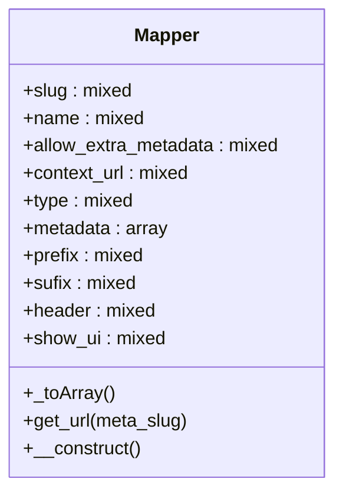

# Mapper


***

* Full name: `\Tainacan\Mappers\Mapper`
* This class is an **Abstract class**

## Class Diagram



## Properties

### slug

```php
public $slug
```

***

### name

```php
public $name
```

***

### allow_extra_metadata

```php
public $allow_extra_metadata
```

***

### context_url

```php
public $context_url
```

***

### type

```php
public $type
```

***

### metadata

array of supported metadata, false for not validade the list format:
['slug'] => [
    'URI' => 'http://...',          // URI of the metadatum description
    'label' => 'Label',             // Label to show on UI
    'metadata_type' => 'date',         // Tainacan recomended metadatum type, default text
    'core_metadatum' => false   // if have a core tainacan metadatum, what?
['date' => [
    	'URI' => 'http://purl.org/dc/elements/1.1/date',
 	'label' => 'Date',
     'metadata_type' => 'date'
 ],
 'description' => [
 	'URI' => 'http://purl.org/dc/elements/1.1/description',
 	'label' => 'Description',
     'core_metadatum' => true
 ]]

```php
public array $metadata
```

***

### prefix

```php
public $prefix
```

***

### sufix

```php
public $sufix
```

***

### header

```php
public $header
```

***

### show_ui

```php
public $show_ui
```

***

## Methods

### _toArray

```php
public _toArray(): mixed
```

***

### get_url

Gets the semantic URL for a given metadatum of this mapper.

```php
public get_url(string $meta_slug): string
```

Basically it identifies the property prefix and replace it with the URL of that prefix

**Parameters:**

| Parameter    | Type       | Description                                                         |
|--------------|------------|---------------------------------------------------------------------|
| `$meta_slug` | **string** | The slug of the metadata present in this mapper to get the URL from |

**Return Value:**

The semantic URL for this metadata. Empty string in case of failure

***

### __construct

```php
public __construct(): mixed
```

***
