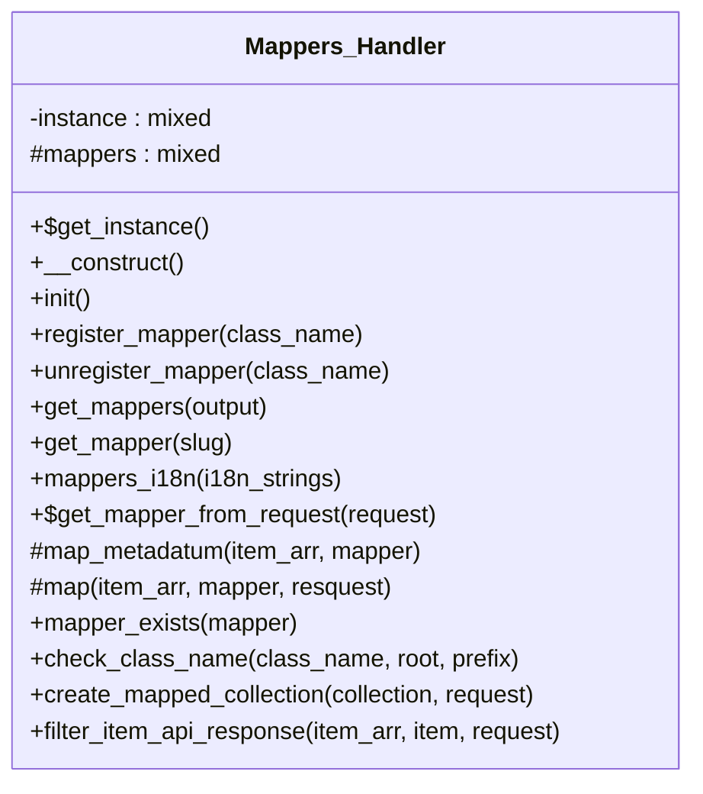

# Mappers_Handler


***

* Full name: `\Tainacan\Mappers_Handler`

## Class Diagram



## Constants

| Constant              | Visibility | Type | Value                |
|-----------------------|------------|------|----------------------|
| `MAPPER_CLASS_PREFIX` | public     |      | 'Tainacan\Mappers\\' |
| `MAPPER_PARAM`        | public     |      | 'mapper'             |

## Properties

### instance

```php
private static $instance
```

* This property is **static**.

***

### mappers

```php
protected $mappers
```

***

## Methods

### get_instance

```php
public static get_instance(): mixed
```

* This method is **static**.
***

### __construct

```php
public __construct(): mixed
```

***

### init

```php
public init(): mixed
```

***

### register_mapper

register mappers class

```php
public register_mapper(mixed $class_name): mixed
```

**Parameters:**

| Parameter     | Type      | Description                                            |
|---------------|-----------|--------------------------------------------------------|
| `$class_name` | **mixed** | string \| object The class name or the object instance |

***

### unregister_mapper

unregister mappers class

```php
public unregister_mapper(mixed $class_name): mixed
```

**Parameters:**

| Parameter     | Type      | Description                                            |
|---------------|-----------|--------------------------------------------------------|
| `$class_name` | **mixed** | string \| object The class name or the object instance |

***

### get_mappers

Return list of registered mappers

```php
public get_mappers(string $output = ARRAY_N): mixed
```

**Parameters:**

| Parameter | Type       | Description                      |
|-----------|------------|----------------------------------|
| `$output` | **string** | output format, ARRAY_N or OBJECT |

***

### get_mapper

Get a mapper object by its slug

```php
public get_mapper(mixed $slug): mixed
```

**Parameters:**

| Parameter | Type      | Description |
|-----------|-----------|-------------|
| `$slug`   | **mixed** |             |

***

### mappers_i18n

Add mappers data to translations

```php
public mappers_i18n(array $i18n_strings): array
```

**Parameters:**

| Parameter       | Type      | Description |
|-----------------|-----------|-------------|
| `$i18n_strings` | **array** |             |

***

### get_mapper_from_request

Check if there is a mapper

```php
public static get_mapper_from_request(\WP_REST_Request $request): \Tainacan\Mappers\Mapper|bool
```

* This method is **static**.
**Parameters:**

| Parameter  | Type                 | Description |
|------------|----------------------|-------------|
| `$request` | **\WP_REST_Request** |             |

**Return Value:**

false

***

### map_metadatum

Return array of mapped metadatum

```php
protected map_metadatum(array $item_arr, \Tainacan\Mappers\Mapper $mapper): array
```

**Parameters:**

| Parameter   | Type                         | Description |
|-------------|------------------------------|-------------|
| `$item_arr` | **array**                    |             |
| `$mapper`   | **\Tainacan\Mappers\Mapper** |             |

***

### map

```php
protected map(array $item_arr, \Tainacan\Mappers\Mapper $mapper, \WP_REST_Request $resquest): array
```

**Parameters:**

| Parameter   | Type                         | Description |
|-------------|------------------------------|-------------|
| `$item_arr` | **array**                    |             |
| `$mapper`   | **\Tainacan\Mappers\Mapper** |             |
| `$resquest` | **\WP_REST_Request**         |             |

***

### mapper_exists

Return if mapper is registered

```php
public mapper_exists(string $mapper): bool
```

**Parameters:**

| Parameter | Type       | Description |
|-----------|------------|-------------|
| `$mapper` | **string** |             |

***

### check_class_name

Return namespaced class name

```php
public check_class_name(string $class_name, bool $root = false, string $prefix = 'TainacanMapper\'): string
```

**Parameters:**

| Parameter     | Type       | Description |
|---------------|------------|-------------|
| `$class_name` | **string** |             |
| `$root`       | **bool**   |             |
| `$prefix`     | **string** |             |

***

### create_mapped_collection

```php
public create_mapped_collection(array $collection, \WP_REST_Request $request): mixed
```

**Parameters:**

| Parameter     | Type                 | Description                                       |
|---------------|----------------------|---------------------------------------------------|
| `$collection` | **array**            | collection passed by the collections API endpoint |
| `$request`    | **\WP_REST_Request** |                                                   |

***

### filter_item_api_response

```php
public filter_item_api_response(mixed $item_arr, mixed $item, mixed $request): mixed
```

**Parameters:**

| Parameter   | Type      | Description |
|-------------|-----------|-------------|
| `$item_arr` | **mixed** |             |
| `$item`     | **mixed** |             |
| `$request`  | **mixed** |             |

***
