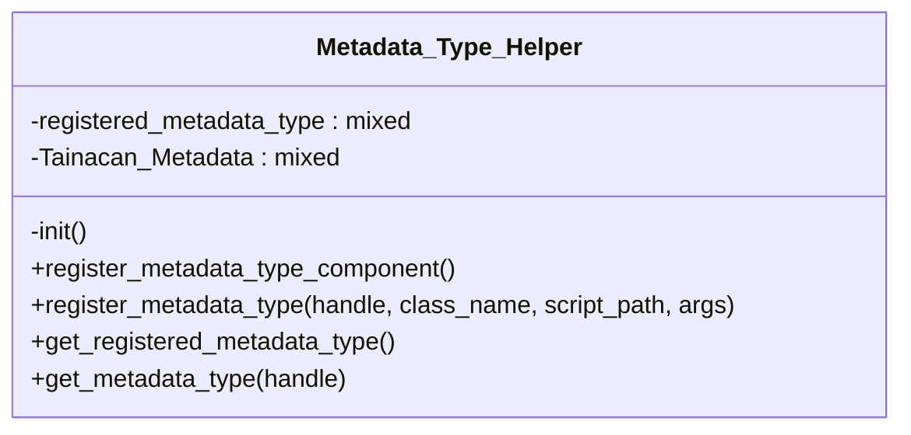

# Metadata_Type_Helper


Class MetadataTypeHelper

***

* Full name: `\Tainacan\Metadata_Types\Metadata_Type_Helper`

## Class Diagram



## Properties

### registered_metadata_type

Stores external metadata type available to be used in Tainacan

```php
private $registered_metadata_type
```

***

### Tainacan_Metadata

```php
private $Tainacan_Metadata
```

***

## Methods

### init

```php
private init(): mixed
```

***

### register_metadata_type_component

```php
public register_metadata_type_component(): mixed
```

***

### register_metadata_type

Register a new Metadata Type

```php
public register_metadata_type(string $handle, mixed $class_name, mixed $script_path, array|string $args = []): mixed
```

**Parameters:**

| Parameter      | Type              | Description                              |
|----------------|-------------------|------------------------------------------|
| `$handle`      | **string**        | name of the component. Should be unique. |
| `$class_name`  | **mixed**         |                                          |
| `$script_path` | **mixed**         |                                          |
| `$args`        | **array\|string** |                                          |

***

### get_registered_metadata_type

Get a list of all registered metadata type

```php
public get_registered_metadata_type(): array
```

**Return Value:**

The list of registered metadata type

***

### get_metadata_type

Get one specific metadata type by its slug

```php
public get_metadata_type(string $handle): array|false
```

**Parameters:**

| Parameter | Type       | Description           |
|-----------|------------|-----------------------|
| `$handle` | **string** | Name of the component |

**Return Value:**

The metadata type definition or false if it is not found

***

## Inherited methods

### get_instance

```php
public static get_instance(): mixed
```

* This method is **static**.
***

### __construct

```php
private __construct(): mixed
```

***
