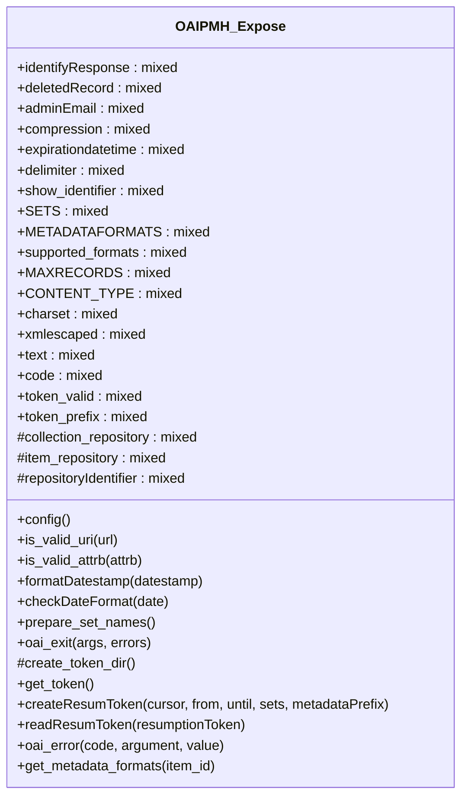

# OAIPMH_Expose


Support Dublin Core Mapping
http://purl.org/dc/elements/1.1/

***

* Full name: `\Tainacan\OAIPMHExpose\OAIPMH_Expose`

## Class Diagram



## Properties

### identifyResponse

```php
public $identifyResponse
```

***

### deletedRecord

```php
public $deletedRecord
```

***

### adminEmail

```php
public $adminEmail
```

***

### compression

```php
public $compression
```

***

### expirationdatetime

```php
public $expirationdatetime
```

***

### delimiter

```php
public $delimiter
```

***

### show_identifier

```php
public $show_identifier
```

***

### SETS

```php
public $SETS
```

***

### METADATAFORMATS

```php
public $METADATAFORMATS
```

***

### supported_formats

```php
public $supported_formats
```

***

### MAXRECORDS

```php
public $MAXRECORDS
```

***

### CONTENT_TYPE

```php
public $CONTENT_TYPE
```

***

### charset

```php
public $charset
```

***

### xmlescaped

```php
public $xmlescaped
```

***

### text

```php
public $text
```

***

### code

```php
public $code
```

***

### token_valid

```php
public $token_valid
```

***

### token_prefix

```php
public $token_prefix
```

***

### collection_repository

```php
protected $collection_repository
```

***

### item_repository

```php
protected $item_repository
```

***

### repositoryIdentifier

```php
protected $repositoryIdentifier
```

***

## Methods

### config

```php
public config(): mixed
```

***

### is_valid_uri

```php
public is_valid_uri(mixed $url): bool
```

**Parameters:**

| Parameter | Type      | Description |
|-----------|-----------|-------------|
| `$url`    | **mixed** |             |

***

### is_valid_attrb

```php
public is_valid_attrb(mixed $attrb): false|int
```

**Parameters:**

| Parameter | Type      | Description |
|-----------|-----------|-------------|
| `$attrb`  | **mixed** |             |

***

### formatDatestamp

```php
public formatDatestamp(mixed $datestamp): false|string
```

**Parameters:**

| Parameter    | Type      | Description |
|--------------|-----------|-------------|
| `$datestamp` | **mixed** |             |

***

### checkDateFormat

```php
public checkDateFormat(mixed $date): bool|false|string
```

**Parameters:**

| Parameter | Type      | Description |
|-----------|-----------|-------------|
| `$date`   | **mixed** |             |

***

### prepare_set_names

```php
public prepare_set_names(): array
```

***

### oai_exit

```php
public oai_exit(mixed $args, mixed $errors): mixed
```

**Parameters:**

| Parameter | Type      | Description |
|-----------|-----------|-------------|
| `$args`   | **mixed** |             |
| `$errors` | **mixed** |             |

***

### create_token_dir

```php
protected create_token_dir(): bool|string
```

***

### get_token

Generate a string based on the current Unix timestamp in microseconds for creating resumToken file name.

```php
public get_token(): mixed
```

***

### createResumToken

Create a token file.

```php
public createResumToken(mixed $cursor, mixed $from, mixed $until, mixed $sets, mixed $metadataPrefix): mixed
```

It has three parts which is separated by '#': cursor, extension of query, metadataPrefix.
Called by listrecords.php.

**Parameters:**

| Parameter         | Type      | Description |
|-------------------|-----------|-------------|
| `$cursor`         | **mixed** |             |
| `$from`           | **mixed** |             |
| `$until`          | **mixed** |             |
| `$sets`           | **mixed** |             |
| `$metadataPrefix` | **mixed** |             |

***

### readResumToken

Read a saved ResumToken

```php
public readResumToken(mixed $resumptionToken): mixed
```

**Parameters:**

| Parameter          | Type      | Description |
|--------------------|-----------|-------------|
| `$resumptionToken` | **mixed** |             |

***

### oai_error

utility funciton to mapping error codes to readable messages

```php
public oai_error(mixed $code, mixed $argument = '', mixed $value = ''): mixed
```

**Parameters:**

| Parameter   | Type      | Description |
|-------------|-----------|-------------|
| `$code`     | **mixed** |             |
| `$argument` | **mixed** |             |
| `$value`    | **mixed** |             |

***

### get_metadata_formats

function get_metadata_formats

```php
public get_metadata_formats(int $item_id = null): bool
```

**Parameters:**

| Parameter  | Type    | Description |
|------------|---------|-------------|
| `$item_id` | **int** |             |

***
