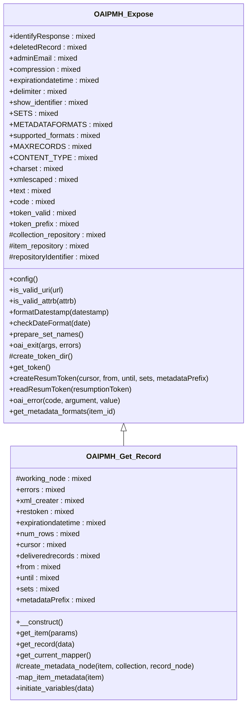

# OAIPMH_Get_Record


Support Dublin Core Mapping
http://purl.org/dc/elements/1.1/

***

* Full name: `\Tainacan\OAIPMHExpose\OAIPMH_Get_Record`
* Parent class: [`\Tainacan\OAIPMHExpose\OAIPMH_Expose`](./OAIPMH_Expose)

## Class Diagram



## Properties

### working_node

```php
protected $working_node
```

***

### errors

```php
public $errors
```

***

### xml_creater

```php
public $xml_creater
```

***

### restoken

```php
public $restoken
```

***

### expirationdatetime

```php
public $expirationdatetime
```

***

### num_rows

```php
public $num_rows
```

***

### cursor

```php
public $cursor
```

***

### deliveredrecords

```php
public $deliveredrecords
```

***

### from

```php
public $from
```

***

### until

```php
public $until
```

***

### sets

```php
public $sets
```

***

### metadataPrefix

```php
public $metadataPrefix
```

***

## Methods

### __construct

```php
public __construct(): mixed
```

***

### get_item

```php
public get_item(mixed $params): bool|\Tainacan\Entities\Item
```

**Parameters:**

| Parameter | Type      | Description |
|-----------|-----------|-------------|
| `$params` | **mixed** |             |

**Throws:**

- [`Exception`](../../Exception)

***

### get_record

```php
public get_record(mixed $data): mixed
```

**Parameters:**

| Parameter | Type      | Description |
|-----------|-----------|-------------|
| `$data`   | **mixed** |             |

**Throws:**

- [`Exception`](../../Exception)

***

### get_current_mapper

Gets the current mapper object, if one was chosen by the user, false Otherwise

```php
public get_current_mapper(): mixed
```

***

### create_metadata_node

```php
protected create_metadata_node(\Tainacan\Entities\Item $item, \Tainacan\OAIPMHExpose\wp_post $collection, mixed $record_node = null): \Tainacan\OAIPMHExpose\Adciona
```

**Parameters:**

| Parameter      | Type                               | Description         |
|----------------|------------------------------------|---------------------|
| `$item`        | **\Tainacan\Entities\Item**        |                     |
| `$collection`  | **\Tainacan\OAIPMHExpose\wp_post** | O objeto da colecao |
| `$record_node` | **mixed**                          |                     |

**Return Value:**

no  noh <metadata> os valores necessarios

***

### map_item_metadata

Gets an Item as input and return an array of ItemMetadataObjects
If a mapper is selected, the array keys will be the slugs of the metadata
declared by the mapper, in the same order.

```php
private map_item_metadata(\Tainacan\Entities\Item $item): mixed
```

Note that if one of the metadata is not mapped, this array item will be null

**Parameters:**

| Parameter | Type                        | Description |
|-----------|-----------------------------|-------------|
| `$item`   | **\Tainacan\Entities\Item** |             |

***

### initiate_variables

```php
public initiate_variables(mixed $data): mixed
```

**Parameters:**

| Parameter | Type      | Description |
|-----------|-----------|-------------|
| `$data`   | **mixed** |             |

***

## Inherited methods

### config

```php
public config(): mixed
```

***

### is_valid_uri

```php
public is_valid_uri(mixed $url): bool
```

**Parameters:**

| Parameter | Type      | Description |
|-----------|-----------|-------------|
| `$url`    | **mixed** |             |

***

### is_valid_attrb

```php
public is_valid_attrb(mixed $attrb): false|int
```

**Parameters:**

| Parameter | Type      | Description |
|-----------|-----------|-------------|
| `$attrb`  | **mixed** |             |

***

### formatDatestamp

```php
public formatDatestamp(mixed $datestamp): false|string
```

**Parameters:**

| Parameter    | Type      | Description |
|--------------|-----------|-------------|
| `$datestamp` | **mixed** |             |

***

### checkDateFormat

```php
public checkDateFormat(mixed $date): bool|false|string
```

**Parameters:**

| Parameter | Type      | Description |
|-----------|-----------|-------------|
| `$date`   | **mixed** |             |

***

### prepare_set_names

```php
public prepare_set_names(): array
```

***

### oai_exit

```php
public oai_exit(mixed $args, mixed $errors): mixed
```

**Parameters:**

| Parameter | Type      | Description |
|-----------|-----------|-------------|
| `$args`   | **mixed** |             |
| `$errors` | **mixed** |             |

***

### create_token_dir

```php
protected create_token_dir(): bool|string
```

***

### get_token

Generate a string based on the current Unix timestamp in microseconds for creating resumToken file name.

```php
public get_token(): mixed
```

***

### createResumToken

Create a token file.

```php
public createResumToken(mixed $cursor, mixed $from, mixed $until, mixed $sets, mixed $metadataPrefix): mixed
```

It has three parts which is separated by '#': cursor, extension of query, metadataPrefix.
Called by listrecords.php.

**Parameters:**

| Parameter         | Type      | Description |
|-------------------|-----------|-------------|
| `$cursor`         | **mixed** |             |
| `$from`           | **mixed** |             |
| `$until`          | **mixed** |             |
| `$sets`           | **mixed** |             |
| `$metadataPrefix` | **mixed** |             |

***

### readResumToken

Read a saved ResumToken

```php
public readResumToken(mixed $resumptionToken): mixed
```

**Parameters:**

| Parameter          | Type      | Description |
|--------------------|-----------|-------------|
| `$resumptionToken` | **mixed** |             |

***

### oai_error

utility funciton to mapping error codes to readable messages

```php
public oai_error(mixed $code, mixed $argument = '', mixed $value = ''): mixed
```

**Parameters:**

| Parameter   | Type      | Description |
|-------------|-----------|-------------|
| `$code`     | **mixed** |             |
| `$argument` | **mixed** |             |
| `$value`    | **mixed** |             |

***

### get_metadata_formats

function get_metadata_formats

```php
public get_metadata_formats(int $item_id = null): bool
```

**Parameters:**

| Parameter  | Type    | Description |
|------------|---------|-------------|
| `$item_id` | **int** |             |

***
