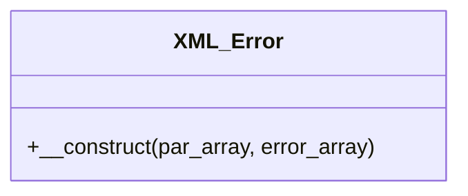

# XML_Error


Generate an XML response when a request cannot be finished

It has only one derived member function

***

* Full name: `\Tainacan\OAIPMHExpose\XML_Error`
* Parent class: [`XML_Create`](./XML_Create)

## Class Diagram



## Methods

### __construct

```php
public __construct(mixed $par_array, mixed $error_array): mixed
```

**Parameters:**

| Parameter      | Type      | Description |
|----------------|-----------|-------------|
| `$par_array`   | **mixed** |             |
| `$error_array` | **mixed** |             |

***
