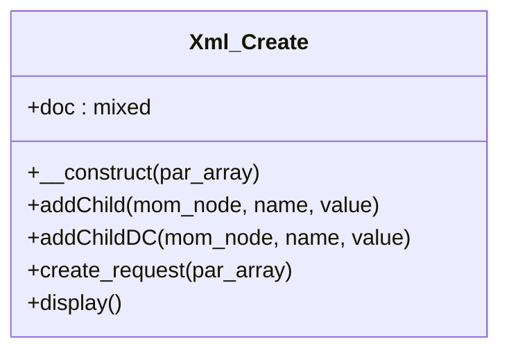

# Xml_Create


A wraper of DOMDocument for data provider

***

* Full name: `\Tainacan\OAIPMHExpose\Xml_Create`

## Class Diagram



## Properties

### doc

```php
public $doc
```

***

## Methods

### __construct

Constructs an Xml_Create object.

```php
public __construct(mixed $par_array): mixed
```

**Parameters:**

| Parameter    | Type      | Description                                                                                      |
|--------------|-----------|--------------------------------------------------------------------------------------------------|
| `$par_array` | **mixed** | Type: array.
  Array of request parameters for creating an ANDS_XML object.
\see create_request. |

***

### addChild

Add a child node to a parent node on a XML Doc: a worker function.

```php
public addChild(mixed $mom_node, mixed $name, mixed $value = ''): \Tainacan\OAIPMHExpose\DOMElement
```

**Parameters:**

| Parameter   | Type      | Description                                                   |
|-------------|-----------|---------------------------------------------------------------|
| `$mom_node` | **mixed** | 
Type: DOMNode. The target node.                              |
| `$name`     | **mixed** | 
Type: string. The name of child nade is being added          |
| `$value`    | **mixed** | 
Type: string. Text for the adding node if it is a text node. |

**Return Value:**

$added_node
The newly created node, can be used for further expansion.
If no further expansion is expected, return value can be igored.

***

### addChildDC

Add a child node to a parent node on a XML Doc: a worker function.

```php
public addChildDC(mixed $mom_node, mixed $name, mixed $value = ''): \Tainacan\OAIPMHExpose\DOMElement
```

**Parameters:**

| Parameter   | Type      | Description                                                   |
|-------------|-----------|---------------------------------------------------------------|
| `$mom_node` | **mixed** | 
Type: DOMNode. The target node.                              |
| `$name`     | **mixed** | 
Type: string. The name of child nade is being added          |
| `$value`    | **mixed** | 
Type: string. Text for the adding node if it is a text node. |

**Return Value:**

$added_node
The newly created node, can be used for further expansion.
If no further expansion is expected, return value can be igored.

***

### create_request

Create an OAI request node.

```php
public create_request(mixed $par_array): mixed
```

**Parameters:**

| Parameter    | Type      | Description                                                                                                                                                                                                   |
|--------------|-----------|---------------------------------------------------------------------------------------------------------------------------------------------------------------------------------------------------------------|
| `$par_array` | **mixed** | Type: array
  The attributes of a request node. They describe the verb of the request and other associated parameters used in the request.
Keys of the array define attributes, and values are their content. |

***

### display

Display a doc in a readable, well-formatted way for display or saving

```php
public display(): mixed
```

***
