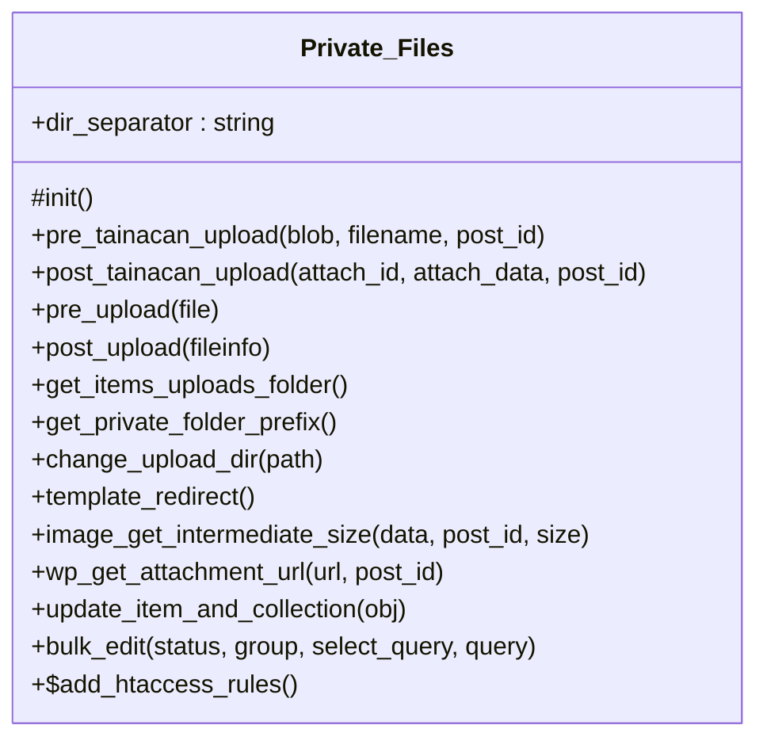

# Private_Files


Handles private file management for Tainacan.

Provides methods for managing private file uploads, access control,
and file organization within Tainacan collections and items.

***

* Full name: `\Tainacan\Private_Files`

## Class Diagram



## Properties

### dir_separator

Directory separator for file paths.

```php
public string $dir_separator
```

***

## Methods

### init

Initializes the private files functionality.

```php
protected init(): void
```

Sets up WordPress hooks for file upload handling, access control,
and template redirection for private files.

***

### pre_tainacan_upload

Handles pre-upload processing for Tainacan attachments.

```php
public pre_tainacan_upload(mixed $blob, string $filename, int $post_id): void
```

**Parameters:**

| Parameter   | Type       | Description    |
|-------------|------------|----------------|
| `$blob`     | **mixed**  | The file data. |
| `$filename` | **string** | The filename.  |
| `$post_id`  | **int**    | The post ID.   |

***

### post_tainacan_upload

Handles post-upload processing for Tainacan attachments.

```php
public post_tainacan_upload(int $attach_id, array $attach_data, int $post_id): void
```

**Parameters:**

| Parameter      | Type      | Description          |
|----------------|-----------|----------------------|
| `$attach_id`   | **int**   | The attachment ID.   |
| `$attach_data` | **array** | The attachment data. |
| `$post_id`     | **int**   | The post ID.         |

***

### pre_upload

Adds a filter to the upload_dir hook when uploading a new file

```php
public pre_upload(mixed $file): mixed
```

**Parameters:**

| Parameter | Type      | Description |
|-----------|-----------|-------------|
| `$file`   | **mixed** |             |

***

### post_upload

Removes a filter to the upload_dir hook after uploading a new file

```php
public post_upload(mixed $fileinfo): mixed
```

**Parameters:**

| Parameter   | Type      | Description |
|-------------|-----------|-------------|
| `$fileinfo` | **mixed** |             |

***

### get_items_uploads_folder

Gets the base directory inside the uploads folder where
attachments and documents for items will be uploaded

```php
public get_items_uploads_folder(): string
```

**Return Value:**

The folder name

***

### get_private_folder_prefix

Gets the directory prefix to be added to folders holding
attachments and documents for private items or collections

```php
public get_private_folder_prefix(): string
```

**Return Value:**

The folder prefix

***

### change_upload_dir

Change the upload directory for items attachments and documents

```php
public change_upload_dir(mixed $path): mixed
```

It replaces the default WordPress strucutre, which is YYYY/MM/file
with a path containing the collection id and the item id inside the @see get_items_uploads_folder():
ex: * tainacan-items/$collection_id/$item_id

It also add a prefix in the folder name of private items or collections:
tainacan-items/$collection_id/_x_$item_id ($item_id is a private item)

**Parameters:**

| Parameter | Type      | Description |
|-----------|-----------|-------------|
| `$path`   | **mixed** |             |

***

### template_redirect

Handles 404 returns looking for attachments inside the tainacan items uploads folder

```php
public template_redirect(): mixed
```

When looking for a file that does not exists, it checks for relative prefixed folders.
If it finds the file, it then checks to see if current user have permission to see this file, based on
the permission he/she have to read the related item.

***

### image_get_intermediate_size

Filters the image_get_intermediate_size hook to strip out the
private uploads folder prefix from the attachments URLs

```php
public image_get_intermediate_size(mixed $data, mixed $post_id, mixed $size): mixed
```

**Parameters:**

| Parameter  | Type      | Description |
|------------|-----------|-------------|
| `$data`    | **mixed** |             |
| `$post_id` | **mixed** |             |
| `$size`    | **mixed** |             |

***

### wp_get_attachment_url

Filters the wp_get_attachment_url hook to strip out the
private uploads folder prefix from the attachments URLs

```php
public wp_get_attachment_url(mixed $url, mixed $post_id): mixed
```

**Parameters:**

| Parameter  | Type      | Description |
|------------|-----------|-------------|
| `$url`     | **mixed** |             |
| `$post_id` | **mixed** |             |

***

### update_item_and_collection

When an item or collection is saved, it checks if the satus was changed and
if the items upload directory mus be renamed to add or remove the
private folder prefix

```php
public update_item_and_collection(mixed $obj): mixed
```

**Parameters:**

| Parameter | Type      | Description |
|-----------|-----------|-------------|
| `$obj`    | **mixed** |             |

***

### bulk_edit

Rename all folders from items after a bulk edit operation move their statuses

```php
public bulk_edit(mixed $status, mixed $group, mixed $select_query, mixed $query): mixed
```

TODO: In the upcoming bulk edit refactor this must be handled as there are performance issues

**Parameters:**

| Parameter       | Type      | Description |
|-----------------|-----------|-------------|
| `$status`       | **mixed** |             |
| `$group`        | **mixed** |             |
| `$select_query` | **mixed** |             |
| `$query`        | **mixed** |             |

***

### add_htaccess_rules

Function to add rules to [upload_dir]/tainacan/.htaccess

```php
public static add_htaccess_rules(): mixed
```

This function is used as callback for the register_activation_hook

* This method is **static**.
***

## Inherited methods

### get_instance

```php
public static get_instance(): mixed
```

* This method is **static**.
***

### __construct

```php
private __construct(): mixed
```

***
