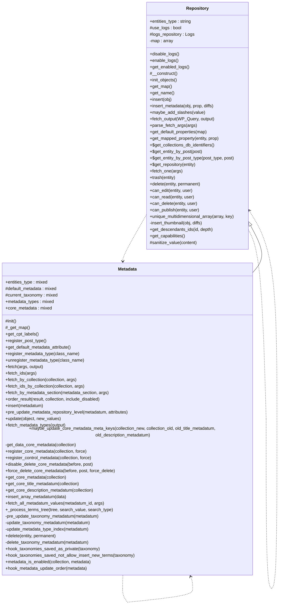

# Metadata


Repository for managing Tainacan metadata definitions.

Handles all database operations for metadata including creation,
updates, deletion, and querying with proper validation and logging.

***

* Full name: `\Tainacan\Repositories\Metadata`
* Parent class: [`\Tainacan\Repositories\Repository`](./Repository)

## Class Diagram



## Properties

### entities_type

The entity type this repository manages.

```php
public string $entities_type
```

***

### default_metadata

```php
protected $default_metadata
```

***

### current_taxonomy

```php
protected $current_taxonomy
```

***

### metadata_types

```php
public $metadata_types
```

***

### core_metadata

```php
public $core_metadata
```

***

## Methods

### init

```php
protected init(): mixed
```

***

### _get_map

return properties map

```php
protected _get_map(): array
```

**Return Value:**

properties map array, format like:
  'id'             => [
    'map'        => 'ID',
    'title'       => __('ID', 'tainacan'),
    'type'       => 'integer',
    'description'=> __('Unique identifier', 'tainacan'),
    'validation' => v::numeric(),
],
'name'           =>  [
    'map'        => 'post_title',
    'title'       => __('Name', 'tainacan'),
    'type'       => 'string',
    'description'=> __('Name of the collection', 'tainacan'),
    'validation' => v::stringType(),
    'default'     => ''
],
'slug'           =>  [
    'map'        => 'post_name',
    'title'       => __('Slug', 'tainacan'),
    'type'       => 'string',
    'description'=> __('A unique and sanitized string representation of the collection, used to build the collection URL', 'tainacan'),
    'validation' => v::stringType(),
],

**See Also:**

* \Tainacan\Repositories\Repository::get_map()

***

### get_cpt_labels

Get the labels for the custom post type of this repository

```php
public get_cpt_labels(): array
```

**Return Value:**

Labels in the format expected by register_post_type()

***

### register_post_type

```php
public register_post_type(): mixed
```

***

### get_default_metadata_attribute

constant used in default metadatum in attribute collection_id

```php
public get_default_metadata_attribute(): string
```

**Return Value:**

the value of constant

***

### register_metadata_type

register metadatum types class on array of types

```php
public register_metadata_type(mixed $class_name): mixed
```

**Parameters:**

| Parameter     | Type      | Description                                     |
|---------------|-----------|-------------------------------------------------|
| `$class_name` | **mixed** | string \| object The class name or the instance |

***

### unregister_metadata_type

register metadatum types class on array of types

```php
public unregister_metadata_type(mixed $class_name): mixed
```

**Parameters:**

| Parameter     | Type      | Description                                     |
|---------------|-----------|-------------------------------------------------|
| `$class_name` | **mixed** | string \| object The class name or the instance |

***

### fetch

fetch metadatum based on ID or WP_Query args

```php
public fetch(array $args = [], string $output = null): \Tainacan\Entities\Metadatum|\WP_Query|array
```

metadatum are stored as posts. Check WP_Query docs
to learn all args accepted in the $args parameter (@see https://developer.wordpress.org/reference/classes/wp_query/)
You can also use a mapped property, such as name and description, as an argument and it will be mapped to the
appropriate WP_Query argument

If a number is passed to $args, it will return a \Tainacan\Entities\Metadatum object.  But if the post is not found or
does not match the entity post type, it will return an empty array

**Parameters:**

| Parameter | Type       | Description                                                                                            |
|-----------|------------|--------------------------------------------------------------------------------------------------------|
| `$args`   | **array**  | WP_Query args \|\| int $args the metadatum id                                                          |
| `$output` | **string** | The desired output format (@see \Tainacan\Repositories\Repository::fetch_output() for possible values) |

**Return Value:**

an instance of wp query OR array of entities;

**Throws:**

- [`Exception`](../../Exception)

***

### fetch_ids

fetch metadata IDs based on WP_Query args

```php
public fetch_ids(array $args = []): array
```

to learn all args accepted in the $args parameter (@see https://developer.wordpress.org/reference/classes/wp_query/)
You can also use a mapped property, such as name and description, as an argument and it will be mapped to the
appropriate WP_Query argument

**Parameters:**

| Parameter | Type      | Description                              |
|-----------|-----------|------------------------------------------|
| `$args`   | **array** | WP_Query args \|\| int $args the item id |

**Return Value:**

array of IDs;

**Throws:**

- [`Exception`](../../Exception)

***

### fetch_by_collection

fetch metadatum by collection, considering inheritance and order

```php
public fetch_by_collection(\Tainacan\Entities\Collection $collection, array $args = []): array
```

**Parameters:**

| Parameter     | Type                              | Description                          |
|---------------|-----------------------------------|--------------------------------------|
| `$collection` | **\Tainacan\Entities\Collection** |                                      |
| `$args`       | **array**                         | WP_Query args plus disabled_metadata |

**Return Value:**

Entities\Metadatum

**Throws:**

- [`Exception`](../../Exception)

***

### fetch_ids_by_collection

fetch metadata IDs by collection, considering inheritance

```php
public fetch_ids_by_collection(\Tainacan\Entities\Collection|int $collection, array $args = []): array
```

**Parameters:**

| Parameter     | Type                                   | Description                          |
|---------------|----------------------------------------|--------------------------------------|
| `$collection` | **\Tainacan\Entities\Collection\|int** | object or ID                         |
| `$args`       | **array**                              | WP_Query args plus disabled_metadata |

**Return Value:**

List of metadata IDs

**Throws:**

- [`Exception`](../../Exception)

***

### fetch_by_metadata_section

fetch metadatum by metadata section, considering order

```php
public fetch_by_metadata_section(\Tainacan\Entities\Metadata_Section $metadata_section, array $args = []): array
```

**Parameters:**

| Parameter           | Type                                    | Description                          |
|---------------------|-----------------------------------------|--------------------------------------|
| `$metadata_section` | **\Tainacan\Entities\Metadata_Section** |                                      |
| `$args`             | **array**                               | WP_Query args plus disabled_metadata |

**Return Value:**

Entities\Metadatum

**Throws:**

- [`Exception`](../../Exception)

***

### order_result

Ordinate the result from fetch response if $collection has an ordination,
metadata not ordinated appear on the end of the list

```php
public order_result(array $result, \Tainacan\Entities\Collection $collection, bool $include_disabled = false): array
```

**Parameters:**

| Parameter           | Type                              | Description                                                |
|---------------------|-----------------------------------|------------------------------------------------------------|
| `$result`           | **array**                         | Response from method fetch_by_collection                   |
| `$collection`       | **\Tainacan\Entities\Collection** |                                                            |
| `$include_disabled` | **bool**                          | Whether to include disabled metadata in the results or not |

***

### insert

```php
public insert(\Tainacan\Entities\Metadatum $metadatum): \Tainacan\Entities\Metadatum
```

**Parameters:**

| Parameter    | Type                             | Description |
|--------------|----------------------------------|-------------|
| `$metadatum` | **\Tainacan\Entities\Metadatum** |             |

**Return Value:**


- **See:** 

**See Also:**

* \Tainacan\Repositories\Repository::insert()

***

### pre_update_metadata_repository_level

```php
public pre_update_metadata_repository_level(mixed $metadatum, mixed $attributes): mixed
```

**Parameters:**

| Parameter     | Type      | Description |
|---------------|-----------|-------------|
| `$metadatum`  | **mixed** |             |
| `$attributes` | **mixed** |             |

***

### update

```php
public update(mixed $object, mixed $new_values = null): mixed|string|\Tainacan\Entities\Entity
```

**Parameters:**

| Parameter     | Type      | Description |
|---------------|-----------|-------------|
| `$object`     | **mixed** |             |
| `$new_values` | **mixed** |             |

**Throws:**

- [`Exception`](../../Exception)

***

### fetch_metadata_types

fetch all registered metadatum type classes

```php
public fetch_metadata_types(mixed $output = 'CLASS'): array
```

Possible outputs are:
CLASS (default) - returns the Class name of of metadatum types registered
NAME - return an Array of the names of metadatum types registered

**Parameters:**

| Parameter | Type      | Description          |
|-----------|-----------|----------------------|
| `$output` | **mixed** | string CLASS \| NAME |

**Return Value:**

of Entities\Metadata_Types\Metadata_Type classes path name

***

### maybe_update_core_metadata_meta_keys

That function update the core metadatum meta key, in case of changing the collection parent

```php
public maybe_update_core_metadata_meta_keys(\Tainacan\Entities\Collection $collection_new, \Tainacan\Entities\Collection $collection_old, \Tainacan\Entities\Metadatum $old_title_metadatum, \Tainacan\Entities\Metadatum $old_description_metadatum): void
```

**Parameters:**

| Parameter                    | Type                              | Description |
|------------------------------|-----------------------------------|-------------|
| `$collection_new`            | **\Tainacan\Entities\Collection** |             |
| `$collection_old`            | **\Tainacan\Entities\Collection** |             |
| `$old_title_metadatum`       | **\Tainacan\Entities\Metadatum**  |             |
| `$old_description_metadatum` | **\Tainacan\Entities\Metadatum**  |             |

**Throws:**

- [`Exception`](../../Exception)

***

### get_data_core_metadata

```php
private get_data_core_metadata(\Tainacan\Entities\Collection $collection): array
```

**Parameters:**

| Parameter     | Type                              | Description |
|---------------|-----------------------------------|-------------|
| `$collection` | **\Tainacan\Entities\Collection** |             |

***

### register_core_metadata

```php
public register_core_metadata(\Tainacan\Entities\Collection $collection, bool $force = false): bool
```

**Parameters:**

| Parameter     | Type                              | Description                                                          |
|---------------|-----------------------------------|----------------------------------------------------------------------|
| `$collection` | **\Tainacan\Entities\Collection** |                                                                      |
| `$force`      | **bool**                          | if true will register core metadata even if collection is auto draft |

**Throws:**

- [`ErrorException`](../../ErrorException)
- [`Exception`](../../Exception)

***

### register_control_metadata

```php
public register_control_metadata(\Tainacan\Entities\Collection $collection, bool $force = false): bool
```

**Parameters:**

| Parameter     | Type                              | Description                                                             |
|---------------|-----------------------------------|-------------------------------------------------------------------------|
| `$collection` | **\Tainacan\Entities\Collection** |                                                                         |
| `$force`      | **bool**                          | if true will register control metadata even if collection is auto draft |

**Throws:**

- [`ErrorException`](../../ErrorException)
- [`Exception`](../../Exception)

***

### disable_delete_core_metadata

block user from remove core metadata

```php
public disable_delete_core_metadata(mixed $before, mixed $post): mixed
```

**Parameters:**

| Parameter | Type      | Description                       |
|-----------|-----------|-----------------------------------|
| `$before` | **mixed** | wordpress pass a null value       |
| `$post`   | **mixed** | the post which is moving to trash |

**Throws:**

- [`Exception`](../../Exception)

***

### get_core_metadata

returns all core metadata from a specific collection

```php
public get_core_metadata(\Tainacan\Entities\Collection $collection): array|\WP_Query
```

**Parameters:**

| Parameter     | Type                              | Description |
|---------------|-----------------------------------|-------------|
| `$collection` | **\Tainacan\Entities\Collection** |             |

**Throws:**

- [`Exception`](../../Exception)

***

### get_core_title_metadatum

Get the Core Title Metadatum for a collection

```php
public get_core_title_metadatum(\Tainacan\Entities\Collection $collection): \Tainacan\Entities\Metadatum
```

**Parameters:**

| Parameter     | Type                              | Description |
|---------------|-----------------------------------|-------------|
| `$collection` | **\Tainacan\Entities\Collection** |             |

**Return Value:**

The Core Title Metadatum

**Throws:**

- [`Exception`](../../Exception)

***

### get_core_description_metadatum

Get the Core Description Metadatum for a collection

```php
public get_core_description_metadatum(\Tainacan\Entities\Collection $collection): \Tainacan\Entities\Metadatum
```

**Parameters:**

| Parameter     | Type                              | Description |
|---------------|-----------------------------------|-------------|
| `$collection` | **\Tainacan\Entities\Collection** |             |

**Return Value:**

The Core Description Metadatum

**Throws:**

- [`Exception`](../../Exception)

***

### insert_array_metadatum

create a metadatum entity and insert by an associative array ( attribute => value )

```php
public insert_array_metadatum(array $data): int
```

**Parameters:**

| Parameter | Type      | Description                                   |
|-----------|-----------|-----------------------------------------------|
| `$data`   | **array** | the array of attributes to insert a metadatum |

**Return Value:**

the metadatum id inserted

**Throws:**

- [`ErrorException`](../../ErrorException)
- [`Exception`](../../Exception)

***

### fetch_all_metadatum_values

Return all possible values for a metadatum

```php
public fetch_all_metadatum_values(int $metadatum_id, array|string $args = []): array
```

Each metadata is a label with the metadatum name and the value.

If an ID, a slug or a Tainacan\Entities\Metadatum object is passed in the 'metadata' argument, it returns only one metadata, otherwise
it returns all metadata

**Parameters:**

| Parameter       | Type              | Description                                                                                                                                                                                                                                                                                                                                                                                                                                                                                                                                                                                                                                                                                                                                                                                                                                                                                                                                                                                                                                                                                                                                                                                                                                                                                                                                    |
|-----------------|-------------------|------------------------------------------------------------------------------------------------------------------------------------------------------------------------------------------------------------------------------------------------------------------------------------------------------------------------------------------------------------------------------------------------------------------------------------------------------------------------------------------------------------------------------------------------------------------------------------------------------------------------------------------------------------------------------------------------------------------------------------------------------------------------------------------------------------------------------------------------------------------------------------------------------------------------------------------------------------------------------------------------------------------------------------------------------------------------------------------------------------------------------------------------------------------------------------------------------------------------------------------------------------------------------------------------------------------------------------------------|
| `$metadatum_id` | **int**           | The ID of the metadata to fetch values from                                                                                                                                                                                                                                                                                                                                                                                                                                                                                                                                                                                                                                                                                                                                                                                                                                                                                                                                                                                                                                                                                                                                                                                                                                                                                                    |
| `$args`         | **array\|string** | {
    Optional. Array or string of arguments.

	@type mixed		 $collection_id				The collection ID you want to consider or null for all collections. If a collectoin is set
												then only values applied to items in this collection will be returned

    @type int		 $number					The number of values to return (for pagination). Default empty (unlimited)

    @type int		 $offset					The offset (for pagination). Default 0

    @type array\|bool $items_filter				Array in the same format used in @see \Tainacan\Repositories\Items::fetch(). It will filter the results to only return values used in the items inside this criteria. If false, it will return all values, even unused ones. Defatul [] (all items)

    @type array		 $include					Array if ids to be included in the result. Default [] (nothing)

    @type array		 $search					String to search. It will only return values that has this string. Default '' (nothing)

    @type array		 $parent_id					Used by taxonomy metadata. The ID of the parent term to retrieve terms from. Default 0

    @type bool		 $count_items				Include the count of items that can be found in each value (uses $items_filter as well). Default false

    @type string   $last_term				The last term returned when using a elasticsearch for calculates the facet.

} |

**Return Value:**

Array with the total number of values found. The total number of pages with the current number and the results with id and label for each value. Terms also include parent, taxonomy and number of children.

***

### _process_terms_tree

This method processes the result of the query for all terms in a taxonomy done in get_all_metadatum_values()
It efficiently runs through all the terms and checks what terms with a given $parent have items in itself or any of
its descendants, keeping the order they originally came.

```php
public _process_terms_tree(mixed $tree, mixed $search_value, mixed $search_type = 'parent'): mixed
```

It returns an array with the term objects with the given $parent that have items considering items in its descendants. The objects are
in the same format they came, as expected by the rest of the method.

This method is public only for tests purposes, it should not be used anywhere else

**Parameters:**

| Parameter       | Type      | Description |
|-----------------|-----------|-------------|
| `$tree`         | **mixed** |             |
| `$search_value` | **mixed** |             |
| `$search_type`  | **mixed** |             |

***

### pre_update_taxonomy_metadatum

Stores the value of the taxonomy_id option to use on update_taxonomy_metadatum method.

```php
private pre_update_taxonomy_metadatum(mixed $metadatum): mixed
```

**Parameters:**

| Parameter    | Type      | Description |
|--------------|-----------|-------------|
| `$metadatum` | **mixed** |             |

***

### update_taxonomy_metadatum

Triggers hooks when saving a Taxonomy Metadatum, indicating wich taxonomy was added or removed from a collection.

```php
private update_taxonomy_metadatum(mixed $metadatum): void
```

This is used by Taxonomies repository to update the collections_ids property of the taxonomy as
a metadatum type taxonomy is inserted or removed

**Parameters:**

| Parameter    | Type      | Description |
|--------------|-----------|-------------|
| `$metadatum` | **mixed** |             |

**Return Value:**

[type]        [description]

***

### update_metadata_type_index

Creates an index with the exploded values of metadata_type_options array. Each option is prefixed with '_option_'
This is useful to allow metadata to be queried based on a specific value of a metadata type option.

```php
private update_metadata_type_index(\Tainacan\Entities\Metadatum $metadatum): mixed
```

For example, fetch all taxonomy metadata which the taxonomy_id metadata type option is equal to 4

$metadata_repository->fetch([
		'meta_query' => [
			[
				'key' => '_option_taxonomy_id',
				'value' => 4
			]
		]
])

**Parameters:**

| Parameter    | Type                             | Description |
|--------------|----------------------------------|-------------|
| `$metadatum` | **\Tainacan\Entities\Metadatum** |             |

***

### delete

```php
public delete(\Tainacan\Entities\Entity $entity, mixed $permanent = true): mixed|\Tainacan\Entities\Entity
```

**Parameters:**

| Parameter    | Type                          | Description                                                         |
|--------------|-------------------------------|---------------------------------------------------------------------|
| `$entity`    | **\Tainacan\Entities\Entity** |                                                                     |
| `$permanent` | **mixed**                     | If false, sendo to trash, if true, permanently delete. Default true |

**Return Value:**

@see https://developer.wordpress.org/reference/functions/wp_delete_post/

***

### delete_taxonomy_metadatum

```php
private delete_taxonomy_metadatum(mixed $metadatum): mixed
```

**Parameters:**

| Parameter    | Type      | Description |
|--------------|-----------|-------------|
| `$metadatum` | **mixed** |             |

***

### hook_taxonomies_saved_as_private

When a private taxonomy is saved, check if there are any public metadata and set them to private

```php
public hook_taxonomies_saved_as_private(\Tainacan\Entities\Taxonomy $taxonomy): void
```

**Parameters:**

| Parameter   | Type                            | Description |
|-------------|---------------------------------|-------------|
| `$taxonomy` | **\Tainacan\Entities\Taxonomy** |             |

***

### hook_taxonomies_saved_not_allow_insert_new_terms

When a taxonomy is saved disabling allow_insert. All related metadata should set allow_new_terms to 'no'

```php
public hook_taxonomies_saved_not_allow_insert_new_terms(\Tainacan\Entities\Taxonomy $taxonomy): void
```

**Parameters:**

| Parameter   | Type                            | Description |
|-------------|---------------------------------|-------------|
| `$taxonomy` | **\Tainacan\Entities\Taxonomy** |             |

***

### metadata_is_enabled

Test if a metadata is enabled on collection.

```php
public metadata_is_enabled(\Tainacan\Entities\Collection $collection, \Tainacan\Entities\Metadatum $metadata): bool
```

**Parameters:**

| Parameter     | Type                              | Description |
|---------------|-----------------------------------|-------------|
| `$collection` | **\Tainacan\Entities\Collection** |             |
| `$metadata`   | **\Tainacan\Entities\Metadatum**  |             |

***

### hook_metadata_update_order

When a metadata is saved, if the metadata section changes, the ordering needs to be updated

```php
public hook_metadata_update_order(\Tainacan\Entities\Metadatum $metadata): void
```

**Parameters:**

| Parameter   | Type                             | Description |
|-------------|----------------------------------|-------------|
| `$metadata` | **\Tainacan\Entities\Metadatum** |             |

***

## Inherited methods

### disable_logs

Disables creation of logs while inserting and updating entities.

```php
public disable_logs(): void
```

***

### enable_logs

Enables creation of logs while inserting and updating entities.

```php
public enable_logs(): void
```

***

### get_enabled_logs

Gets whether creation of logs while inserting and updating entities is enabled.

```php
public get_enabled_logs(): bool
```

**Return Value:**

True if logging is enabled, false otherwise.

***

### __construct

```php
private __construct(): mixed
```

***

### init_objects

```php
public init_objects(): mixed
```

***

### _get_map

return properties map

```php
protected _get_map(): array
```

* This method is **abstract**.
**Return Value:**

properties map array, format like:
  'id'             => [
    'map'        => 'ID',
    'title'       => __('ID', 'tainacan'),
    'type'       => 'integer',
    'description'=> __('Unique identifier', 'tainacan'),
    'validation' => v::numeric(),
],
'name'           =>  [
    'map'        => 'post_title',
    'title'       => __('Name', 'tainacan'),
    'type'       => 'string',
    'description'=> __('Name of the collection', 'tainacan'),
    'validation' => v::stringType(),
    'default'     => ''
],
'slug'           =>  [
    'map'        => 'post_name',
    'title'       => __('Slug', 'tainacan'),
    'type'       => 'string',
    'description'=> __('A unique and sanitized string representation of the collection, used to build the collection URL', 'tainacan'),
    'validation' => v::stringType(),
],

***

### get_map

```php
public get_map(): mixed
```

***

### get_name

Return repository name

```php
public get_name(): string
```

**Return Value:**

The repository name

***

### insert

```php
public insert(\Tainacan\Entities\Entity $obj): \Tainacan\Entities\Entity|bool
```

**Parameters:**

| Parameter | Type                          | Description |
|-----------|-------------------------------|-------------|
| `$obj`    | **\Tainacan\Entities\Entity** |             |

**Throws:**

- [`Exception`](../../Exception)

***

### insert_metadata

Insert object property stored as postmeta into the database

```php
public insert_metadata(\Tainacan\Entities $obj, string $prop, mixed $diffs): null|false
```

**Parameters:**

| Parameter | Type                   | Description                                                 |
|-----------|------------------------|-------------------------------------------------------------|
| `$obj`    | **\Tainacan\Entities** | The entity object                                           |
| `$prop`   | **string**             | the property name, as declared in the map of the repository |
| `$diffs`  | **mixed**              |                                                             |

**Return Value:**

on error

***

### maybe_add_slashes

```php
public maybe_add_slashes(mixed $value): mixed
```

**Parameters:**

| Parameter | Type      | Description |
|-----------|-----------|-------------|
| `$value`  | **mixed** |             |

***

### fetch_output

Prepare the output for the fetch() methods.

```php
public fetch_output(\WP_Query $WP_Query, string $output = 'WP_Query'): array|\WP_Query
```

Possible outputs are:
WP_Query (default) - returns the WP_Object itself
OBJECT - return an Array of Tainacan\Entities

**Parameters:**

| Parameter   | Type          | Description                                                                           |
|-------------|---------------|---------------------------------------------------------------------------------------|
| `$WP_Query` | **\WP_Query** |                                                                                       |
| `$output`   | **string**    | `WP_Query` for a single WP_Query object or `OBJECT` for an array of Tainacan\Entities |

***

### parse_fetch_args

Maps repository mapped properties to WP_Query arguments.

```php
public parse_fetch_args(array $args = []): array
```

This allows to build fetch arguments using both WP_Query arguments
and the mapped properties for the repository.

For example, you can use any of the following methods to browse collections by name:
$TainacanCollections->fetch(['title' => 'test']);
$TainacanCollections->fetch(['name' => 'test']);

The property `name` is transformed into the native WordPress property `post_title`. (actually only title for query purpouses)

Example 2, this also works with properties mapped to postmeta. The following methods are the same:
$TainacanMetadatas->fetch(['required' => 'yes']);
$TainacanMetadatas->fetch(['meta_query' => [
    [
        'key' => 'required',
        'value' => 'yes'
    ]
]]);

**Parameters:**

| Parameter | Type      | Description   |
|-----------|-----------|---------------|
| `$args`   | **array** | [description] |

**Return Value:**

$args new $args array with mapped properties

***

### get_default_properties

Return default properties

```php
public get_default_properties(array $map): array
```

**Parameters:**

| Parameter | Type      | Description |
|-----------|-----------|-------------|
| `$map`    | **array** |             |

***

### get_mapped_property

return the value for a mapped property from database

```php
public get_mapped_property(\Tainacan\Entities\Entity $entity, string $prop): mixed
```

**Parameters:**

| Parameter | Type                          | Description    |
|-----------|-------------------------------|----------------|
| `$entity` | **\Tainacan\Entities\Entity** |                |
| `$prop`   | **string**                    | id of property |

**Return Value:**

property value

***

### get_collections_db_identifiers

Return array of collections db identifiers

```php
public static get_collections_db_identifiers(): array[]
```

* This method is **static**.
***

### get_entity_by_post

```php
public static get_entity_by_post(int|\WP_Post $post): \Tainacan\Entities\Entity|bool
```

* This method is **static**.
**Parameters:**

| Parameter | Type              | Description |
|-----------|-------------------|-------------|
| `$post`   | **int\|\WP_Post** | \|Entity    |

**Throws:**

- [`Exception`](../../Exception)

***

### get_entity_by_post_type

```php
public static get_entity_by_post_type(string $post_type, int|\WP_Post $post): \Tainacan\Entities\Entity|bool
```

* This method is **static**.
**Parameters:**

| Parameter    | Type              | Description                                                    |
|--------------|-------------------|----------------------------------------------------------------|
| `$post_type` | **string**        |                                                                |
| `$post`      | **int\|\WP_Post** | optional post ID or WordPress post data for creation of Entity |

**Return Value:**

the entity for post_type, with data if $post is given or false

**Throws:**

- [`Exception`](../../Exception)

***

### get_repository

Return Entity's Repository

```php
public static get_repository(\Tainacan\Entities\Entity $entity): \Tainacan\Repositories\Repository|bool
```

* This method is **static**.
**Parameters:**

| Parameter | Type                          | Description |
|-----------|-------------------------------|-------------|
| `$entity` | **\Tainacan\Entities\Entity** |             |

**Return Value:**

return the entity Repository or false

***

### fetch_one

Fetch one Entity based on query args.

```php
public fetch_one(array $args): false|\Tainacan\Entities
```

Note: Does not work with Item_Metadata Repository

**Parameters:**

| Parameter | Type      | Description                     |
|-----------|-----------|---------------------------------|
| `$args`   | **array** | Query Args as expected by fetch |

**Return Value:**

The entity or false if none was found

***

### trash

Shortcut to delete($entity, false)

```php
public trash(\Tainacan\Entities\Entity $entity): mixed|\Tainacan\Entities\Entity
```

**Parameters:**

| Parameter | Type                          | Description |
|-----------|-------------------------------|-------------|
| `$entity` | **\Tainacan\Entities\Entity** |             |

**Return Value:**

@see https://developer.wordpress.org/reference/functions/wp_delete_post/

***

### delete

```php
public delete(\Tainacan\Entities\Entity $entity, bool $permanent = true): mixed|\Tainacan\Entities\Entity
```

**Parameters:**

| Parameter    | Type                          | Description                                                         |
|--------------|-------------------------------|---------------------------------------------------------------------|
| `$entity`    | **\Tainacan\Entities\Entity** |                                                                     |
| `$permanent` | **bool**                      | If false, sendo to trash, if true, permanently delete. Default true |

**Return Value:**

@see https://developer.wordpress.org/reference/functions/wp_delete_post/

***

### fetch

```php
public fetch(mixed $args, mixed $output = null): mixed
```

* This method is **abstract**.
**Parameters:**

| Parameter | Type      | Description |
|-----------|-----------|-------------|
| `$args`   | **mixed** |             |
| `$output` | **mixed** |             |

***

### update

```php
public update(mixed $object, mixed $new_values = null): mixed
```

* This method is **abstract**.
**Parameters:**

| Parameter     | Type      | Description |
|---------------|-----------|-------------|
| `$object`     | **mixed** |             |
| `$new_values` | **mixed** |             |

***

### register_post_type

```php
public register_post_type(): mixed
```

* This method is **abstract**.
***

### can_edit

Check if $user can edit/create a entity

```php
public can_edit(\Tainacan\Entities\Entity $entity, int|\WP_User|null $user = null): bool
```

**Parameters:**

| Parameter | Type                          | Description                          |
|-----------|-------------------------------|--------------------------------------|
| `$entity` | **\Tainacan\Entities\Entity** |                                      |
| `$user`   | **int\|\WP_User\|null**       | default is null for the current user |

**Throws:**

- [`Exception`](../../Exception)

***

### can_read

Check if $user can read the entity

```php
public can_read(\Tainacan\Entities\Entity $entity, int|\WP_User|null $user = null): bool
```

**Parameters:**

| Parameter | Type                          | Description                          |
|-----------|-------------------------------|--------------------------------------|
| `$entity` | **\Tainacan\Entities\Entity** |                                      |
| `$user`   | **int\|\WP_User\|null**       | default is null for the current user |

**Throws:**

- [`Exception`](../../Exception)

***

### can_delete

Check if $user can delete the entity

```php
public can_delete(\Tainacan\Entities\Entity $entity, int|\WP_User|null $user = null): bool
```

**Parameters:**

| Parameter | Type                          | Description                          |
|-----------|-------------------------------|--------------------------------------|
| `$entity` | **\Tainacan\Entities\Entity** |                                      |
| `$user`   | **int\|\WP_User\|null**       | default is null for the current user |

**Throws:**

- [`Exception`](../../Exception)

***

### can_publish

Check if $user can publish entity

```php
public can_publish(\Tainacan\Entities\Entity $entity, int|\WP_User|null $user = null): bool
```

**Parameters:**

| Parameter | Type                          | Description                          |
|-----------|-------------------------------|--------------------------------------|
| `$entity` | **\Tainacan\Entities\Entity** |                                      |
| `$user`   | **int\|\WP_User\|null**       | default is null for the current user |

**Throws:**

- [`Exception`](../../Exception)

***

### unique_multidimensional_array

Removes duplicates from multidimensional array

```php
public unique_multidimensional_array(mixed $array, mixed $key): array
```

**Parameters:**

| Parameter | Type      | Description |
|-----------|-----------|-------------|
| `$array`  | **mixed** |             |
| `$key`    | **mixed** |             |

***

### get_descendants_ids

Get IDs for all children, grand children till the depth parameter is reached

```php
public get_descendants_ids(int|\Tainacan\Entities\Entity $id, bool|int $depth = false): array
```

**Parameters:**

| Parameter | Type                               | Description                                                            |
|-----------|------------------------------------|------------------------------------------------------------------------|
| `$id`     | **int\|\Tainacan\Entities\Entity** | The Entity ID or object                                                |
| `$depth`  | **bool\|int**                      | The maximum depth to llok for descendants. default is false = no limit |

**Return Value:**

Array of IDs

***

### get_capabilities

Get the capabilities list for the post type of the entity

```php
public get_capabilities(): object
```

**Return Value:**

Object with all the capabilities as member variables.

***

### sanitize_value

```php
protected sanitize_value(mixed $content): mixed
```

**Parameters:**

| Parameter  | Type      | Description |
|------------|-----------|-------------|
| `$content` | **mixed** |             |

***

### get_instance

```php
public static get_instance(): mixed
```

* This method is **static**.
***
