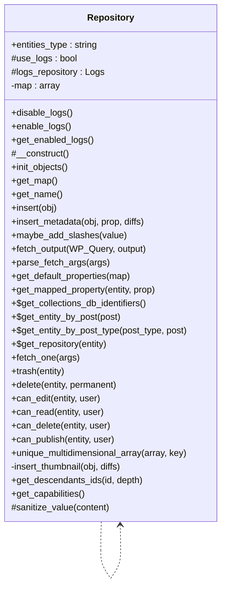

# Repository


Abstract base class for all Tainacan repositories.

Provides common functionality for data access and manipulation
including logging, validation, and entity management.

***

* Full name: `\Tainacan\Repositories\Repository`
* This class is an **Abstract class**

## Class Diagram



## Properties

### entities_type

The entity type this repository manages.

```php
public string $entities_type
```

***

### use_logs

Whether to generate logs for insertions and updates.

```php
protected bool $use_logs
```

Use enable_logs() and disable_logs() to control this setting.

***

### logs_repository

Instance of the logs repository.

```php
protected \Tainacan\Repositories\Logs $logs_repository
```

***

### map

Internal mapping cache.

```php
private array $map
```

***

## Methods

### disable_logs

Disables creation of logs while inserting and updating entities.

```php
public disable_logs(): void
```

***

### enable_logs

Enables creation of logs while inserting and updating entities.

```php
public enable_logs(): void
```

***

### get_enabled_logs

Gets whether creation of logs while inserting and updating entities is enabled.

```php
public get_enabled_logs(): bool
```

**Return Value:**

True if logging is enabled, false otherwise.

***

### __construct

Register hooks

```php
protected __construct(): mixed
```

***

### init_objects

```php
public init_objects(): mixed
```

***

### _get_map

return properties map

```php
protected _get_map(): array
```

* This method is **abstract**.
**Return Value:**

properties map array, format like:
  'id'             => [
    'map'        => 'ID',
    'title'       => __('ID', 'tainacan'),
    'type'       => 'integer',
    'description'=> __('Unique identifier', 'tainacan'),
    'validation' => v::numeric(),
],
'name'           =>  [
    'map'        => 'post_title',
    'title'       => __('Name', 'tainacan'),
    'type'       => 'string',
    'description'=> __('Name of the collection', 'tainacan'),
    'validation' => v::stringType(),
    'default'     => ''
],
'slug'           =>  [
    'map'        => 'post_name',
    'title'       => __('Slug', 'tainacan'),
    'type'       => 'string',
    'description'=> __('A unique and sanitized string representation of the collection, used to build the collection URL', 'tainacan'),
    'validation' => v::stringType(),
],

***

### get_map

```php
public get_map(): mixed
```

***

### get_name

Return repository name

```php
public get_name(): string
```

**Return Value:**

The repository name

***

### insert

```php
public insert(\Tainacan\Entities\Entity $obj): \Tainacan\Entities\Entity|bool
```

**Parameters:**

| Parameter | Type                          | Description |
|-----------|-------------------------------|-------------|
| `$obj`    | **\Tainacan\Entities\Entity** |             |

**Throws:**

- [`Exception`](../../Exception)

***

### insert_metadata

Insert object property stored as postmeta into the database

```php
public insert_metadata(\Tainacan\Entities $obj, string $prop, mixed $diffs): null|false
```

**Parameters:**

| Parameter | Type                   | Description                                                 |
|-----------|------------------------|-------------------------------------------------------------|
| `$obj`    | **\Tainacan\Entities** | The entity object                                           |
| `$prop`   | **string**             | the property name, as declared in the map of the repository |
| `$diffs`  | **mixed**              |                                                             |

**Return Value:**

on error

***

### maybe_add_slashes

```php
public maybe_add_slashes(mixed $value): mixed
```

**Parameters:**

| Parameter | Type      | Description |
|-----------|-----------|-------------|
| `$value`  | **mixed** |             |

***

### fetch_output

Prepare the output for the fetch() methods.

```php
public fetch_output(\WP_Query $WP_Query, string $output = 'WP_Query'): array|\WP_Query
```

Possible outputs are:
WP_Query (default) - returns the WP_Object itself
OBJECT - return an Array of Tainacan\Entities

**Parameters:**

| Parameter   | Type          | Description                                                                           |
|-------------|---------------|---------------------------------------------------------------------------------------|
| `$WP_Query` | **\WP_Query** |                                                                                       |
| `$output`   | **string**    | `WP_Query` for a single WP_Query object or `OBJECT` for an array of Tainacan\Entities |

***

### parse_fetch_args

Maps repository mapped properties to WP_Query arguments.

```php
public parse_fetch_args(array $args = []): array
```

This allows to build fetch arguments using both WP_Query arguments
and the mapped properties for the repository.

For example, you can use any of the following methods to browse collections by name:
$TainacanCollections->fetch(['title' => 'test']);
$TainacanCollections->fetch(['name' => 'test']);

The property `name` is transformed into the native WordPress property `post_title`. (actually only title for query purpouses)

Example 2, this also works with properties mapped to postmeta. The following methods are the same:
$TainacanMetadatas->fetch(['required' => 'yes']);
$TainacanMetadatas->fetch(['meta_query' => [
    [
        'key' => 'required',
        'value' => 'yes'
    ]
]]);

**Parameters:**

| Parameter | Type      | Description   |
|-----------|-----------|---------------|
| `$args`   | **array** | [description] |

**Return Value:**

$args new $args array with mapped properties

***

### get_default_properties

Return default properties

```php
public get_default_properties(array $map): array
```

**Parameters:**

| Parameter | Type      | Description |
|-----------|-----------|-------------|
| `$map`    | **array** |             |

***

### get_mapped_property

return the value for a mapped property from database

```php
public get_mapped_property(\Tainacan\Entities\Entity $entity, string $prop): mixed
```

**Parameters:**

| Parameter | Type                          | Description    |
|-----------|-------------------------------|----------------|
| `$entity` | **\Tainacan\Entities\Entity** |                |
| `$prop`   | **string**                    | id of property |

**Return Value:**

property value

***

### get_collections_db_identifiers

Return array of collections db identifiers

```php
public static get_collections_db_identifiers(): array[]
```

* This method is **static**.
***

### get_entity_by_post

```php
public static get_entity_by_post(int|\WP_Post $post): \Tainacan\Entities\Entity|bool
```

* This method is **static**.
**Parameters:**

| Parameter | Type              | Description |
|-----------|-------------------|-------------|
| `$post`   | **int\|\WP_Post** | \|Entity    |

**Throws:**

- [`Exception`](../../Exception)

***

### get_entity_by_post_type

```php
public static get_entity_by_post_type(string $post_type, int|\WP_Post $post): \Tainacan\Entities\Entity|bool
```

* This method is **static**.
**Parameters:**

| Parameter    | Type              | Description                                                    |
|--------------|-------------------|----------------------------------------------------------------|
| `$post_type` | **string**        |                                                                |
| `$post`      | **int\|\WP_Post** | optional post ID or WordPress post data for creation of Entity |

**Return Value:**

the entity for post_type, with data if $post is given or false

**Throws:**

- [`Exception`](../../Exception)

***

### get_repository

Return Entity's Repository

```php
public static get_repository(\Tainacan\Entities\Entity $entity): \Tainacan\Repositories\Repository|bool
```

* This method is **static**.
**Parameters:**

| Parameter | Type                          | Description |
|-----------|-------------------------------|-------------|
| `$entity` | **\Tainacan\Entities\Entity** |             |

**Return Value:**

return the entity Repository or false

***

### fetch_one

Fetch one Entity based on query args.

```php
public fetch_one(array $args): false|\Tainacan\Entities
```

Note: Does not work with Item_Metadata Repository

**Parameters:**

| Parameter | Type      | Description                     |
|-----------|-----------|---------------------------------|
| `$args`   | **array** | Query Args as expected by fetch |

**Return Value:**

The entity or false if none was found

***

### trash

Shortcut to delete($entity, false)

```php
public trash(\Tainacan\Entities\Entity $entity): mixed|\Tainacan\Entities\Entity
```

**Parameters:**

| Parameter | Type                          | Description |
|-----------|-------------------------------|-------------|
| `$entity` | **\Tainacan\Entities\Entity** |             |

**Return Value:**

@see https://developer.wordpress.org/reference/functions/wp_delete_post/

***

### delete

```php
public delete(\Tainacan\Entities\Entity $entity, bool $permanent = true): mixed|\Tainacan\Entities\Entity
```

**Parameters:**

| Parameter    | Type                          | Description                                                         |
|--------------|-------------------------------|---------------------------------------------------------------------|
| `$entity`    | **\Tainacan\Entities\Entity** |                                                                     |
| `$permanent` | **bool**                      | If false, sendo to trash, if true, permanently delete. Default true |

**Return Value:**

@see https://developer.wordpress.org/reference/functions/wp_delete_post/

***

### fetch

```php
public fetch(mixed $args, mixed $output = null): mixed
```

* This method is **abstract**.
**Parameters:**

| Parameter | Type      | Description |
|-----------|-----------|-------------|
| `$args`   | **mixed** |             |
| `$output` | **mixed** |             |

***

### update

```php
public update(mixed $object, mixed $new_values = null): mixed
```

* This method is **abstract**.
**Parameters:**

| Parameter     | Type      | Description |
|---------------|-----------|-------------|
| `$object`     | **mixed** |             |
| `$new_values` | **mixed** |             |

***

### register_post_type

```php
public register_post_type(): mixed
```

* This method is **abstract**.
***

### can_edit

Check if $user can edit/create a entity

```php
public can_edit(\Tainacan\Entities\Entity $entity, int|\WP_User|null $user = null): bool
```

**Parameters:**

| Parameter | Type                          | Description                          |
|-----------|-------------------------------|--------------------------------------|
| `$entity` | **\Tainacan\Entities\Entity** |                                      |
| `$user`   | **int\|\WP_User\|null**       | default is null for the current user |

**Throws:**

- [`Exception`](../../Exception)

***

### can_read

Check if $user can read the entity

```php
public can_read(\Tainacan\Entities\Entity $entity, int|\WP_User|null $user = null): bool
```

**Parameters:**

| Parameter | Type                          | Description                          |
|-----------|-------------------------------|--------------------------------------|
| `$entity` | **\Tainacan\Entities\Entity** |                                      |
| `$user`   | **int\|\WP_User\|null**       | default is null for the current user |

**Throws:**

- [`Exception`](../../Exception)

***

### can_delete

Check if $user can delete the entity

```php
public can_delete(\Tainacan\Entities\Entity $entity, int|\WP_User|null $user = null): bool
```

**Parameters:**

| Parameter | Type                          | Description                          |
|-----------|-------------------------------|--------------------------------------|
| `$entity` | **\Tainacan\Entities\Entity** |                                      |
| `$user`   | **int\|\WP_User\|null**       | default is null for the current user |

**Throws:**

- [`Exception`](../../Exception)

***

### can_publish

Check if $user can publish entity

```php
public can_publish(\Tainacan\Entities\Entity $entity, int|\WP_User|null $user = null): bool
```

**Parameters:**

| Parameter | Type                          | Description                          |
|-----------|-------------------------------|--------------------------------------|
| `$entity` | **\Tainacan\Entities\Entity** |                                      |
| `$user`   | **int\|\WP_User\|null**       | default is null for the current user |

**Throws:**

- [`Exception`](../../Exception)

***

### unique_multidimensional_array

Removes duplicates from multidimensional array

```php
public unique_multidimensional_array(mixed $array, mixed $key): array
```

**Parameters:**

| Parameter | Type      | Description |
|-----------|-----------|-------------|
| `$array`  | **mixed** |             |
| `$key`    | **mixed** |             |

***

### insert_thumbnail

Inserts or update thumbnail for items and collections and return an array
with old thumbnail and new thumbnail

```php
private insert_thumbnail(mixed $obj, mixed $diffs): mixed
```

**Parameters:**

| Parameter | Type      | Description |
|-----------|-----------|-------------|
| `$obj`    | **mixed** |             |
| `$diffs`  | **mixed** |             |

***

### get_descendants_ids

Get IDs for all children, grand children till the depth parameter is reached

```php
public get_descendants_ids(int|\Tainacan\Entities\Entity $id, bool|int $depth = false): array
```

**Parameters:**

| Parameter | Type                               | Description                                                            |
|-----------|------------------------------------|------------------------------------------------------------------------|
| `$id`     | **int\|\Tainacan\Entities\Entity** | The Entity ID or object                                                |
| `$depth`  | **bool\|int**                      | The maximum depth to llok for descendants. default is false = no limit |

**Return Value:**

Array of IDs

***

### get_capabilities

Get the capabilities list for the post type of the entity

```php
public get_capabilities(): object
```

**Return Value:**

Object with all the capabilities as member variables.

***

### sanitize_value

```php
protected sanitize_value(mixed $content): mixed
```

**Parameters:**

| Parameter  | Type      | Description |
|------------|-----------|-------------|
| `$content` | **mixed** |             |

***
