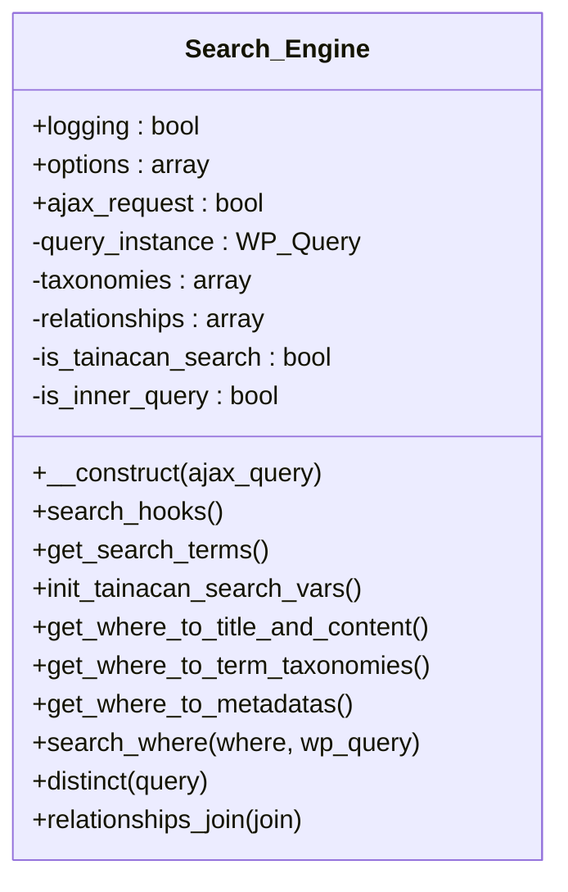

# Search_Engine


Implements the default Tainacan search engine.

Replaces the default WordPress search behavior to search through item metadata
in addition to titles and content. This is a basic implementation that can be
disabled in favor of more performant solutions like Elasticsearch.

This class is based on the Search Everything plugin by Sovrn, zemanta.
Original plugin: http://wordpress.org/plugins/search-everything/

***

* Full name: `\Tainacan\Search_Engine`

## Class Diagram



## Properties

### logging

Whether to enable logging for search operations.

```php
public bool $logging
```

***

### options

Search engine options.

```php
public array $options
```

***

### ajax_request

Whether this is an AJAX request.

```php
public bool $ajax_request
```

***

### query_instance

Current query instance.

```php
private \WP_Query $query_instance
```

***

### taxonomies

Taxonomies to search in.

```php
private array $taxonomies
```

***

### relationships

Relationships to search in.

```php
private array $relationships
```

***

### is_tainacan_search

Whether this is a Tainacan-specific search.

```php
private bool $is_tainacan_search
```

***

### is_inner_query

Whether this is an inner query.

```php
private bool $is_inner_query
```

***

## Methods

### __construct

Constructor for the Search_Engine class.

```php
public __construct(bool $ajax_query = false): mixed
```

**Parameters:**

| Parameter     | Type     | Description                    |
|---------------|----------|--------------------------------|
| `$ajax_query` | **bool** | Whether this is an AJAX query. |

***

### search_hooks

Sets up WordPress hooks for search functionality.

```php
public search_hooks(): void
```

***

### get_search_terms

```php
public get_search_terms(): mixed
```

***

### init_tainacan_search_vars

```php
public init_tainacan_search_vars(): mixed
```

***

### get_where_to_title_and_content

```php
public get_where_to_title_and_content(): mixed
```

***

### get_where_to_term_taxonomies

```php
public get_where_to_term_taxonomies(): mixed
```

***

### get_where_to_metadatas

```php
public get_where_to_metadatas(): mixed
```

***

### search_where

```php
public search_where(mixed $where, mixed $wp_query): mixed
```

**Parameters:**

| Parameter   | Type      | Description |
|-------------|-----------|-------------|
| `$where`    | **mixed** |             |
| `$wp_query` | **mixed** |             |

***

### distinct

```php
public distinct(mixed $query): mixed
```

**Parameters:**

| Parameter | Type      | Description |
|-----------|-----------|-------------|
| `$query`  | **mixed** |             |

***

### relationships_join

```php
public relationships_join(mixed $join): mixed
```

**Parameters:**

| Parameter | Type      | Description |
|-----------|-----------|-------------|
| `$join`   | **mixed** |             |

***
