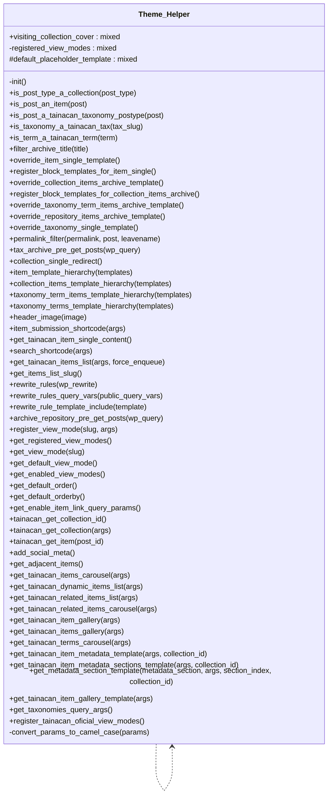

# Theme_Helper


Theme helper class for Tainacan.

Provides theme integration functionality including template overrides,
view modes, template tags, and theme compatibility features.

***

* Full name: `\Tainacan\Theme_Helper`

## Class Diagram



## Properties

### visiting_collection_cover

```php
public $visiting_collection_cover
```

***

### registered_view_modes

Stores view modes available to be used by the theme

```php
private $registered_view_modes
```

***

### default_placeholder_template

```php
protected $default_placeholder_template
```

***

## Methods

### init

```php
private init(): mixed
```

***

### is_post_type_a_collection

```php
public is_post_type_a_collection(mixed $post_type): mixed
```

**Parameters:**

| Parameter    | Type      | Description |
|--------------|-----------|-------------|
| `$post_type` | **mixed** |             |

***

### is_post_an_item

```php
public is_post_an_item(\WP_Post $post): mixed
```

**Parameters:**

| Parameter | Type         | Description |
|-----------|--------------|-------------|
| `$post`   | **\WP_Post** |             |

***

### is_post_a_tainacan_taxonomy_postype

```php
public is_post_a_tainacan_taxonomy_postype(\WP_Post $post): mixed
```

**Parameters:**

| Parameter | Type         | Description |
|-----------|--------------|-------------|
| `$post`   | **\WP_Post** |             |

***

### is_taxonomy_a_tainacan_tax

```php
public is_taxonomy_a_tainacan_tax(mixed $tax_slug): mixed
```

**Parameters:**

| Parameter   | Type      | Description |
|-------------|-----------|-------------|
| `$tax_slug` | **mixed** |             |

***

### is_term_a_tainacan_term

```php
public is_term_a_tainacan_term(\WP_Term $term): mixed
```

**Parameters:**

| Parameter | Type         | Description |
|-----------|--------------|-------------|
| `$term`   | **\WP_Term** |             |

***

### filter_archive_title

```php
public filter_archive_title(mixed $title): mixed
```

**Parameters:**

| Parameter | Type      | Description |
|-----------|-----------|-------------|
| `$title`  | **mixed** |             |

***

### override_item_single_template

Overrides the WordPress post single to display a Tainacan item
basic structure with Media Gallery, Metadata Sections and Attachments

```php
public override_item_single_template(): mixed
```

***

### register_block_templates_for_item_single

Uses register_block_template to define a default block-based template
for the item single page in FSE themes

```php
public register_block_templates_for_item_single(): mixed
```

***

### override_collection_items_archive_template

Overrides the WordPress blog-like archive to display collection
items list using the faceted search block.

```php
public override_collection_items_archive_template(): string
```

**Return Value:**

HTML containing the faceted search block for items

***

### register_block_templates_for_collection_items_archive

Uses register_block_template to define a default block-based template
for the collection items archive page in FSE themes

```php
public register_block_templates_for_collection_items_archive(): mixed
```

***

### override_taxonomy_term_items_archive_template

Overrides the WordPress blog-like archive to display taxonomy term
items list using the faceted search block.

```php
public override_taxonomy_term_items_archive_template(): string
```

**Return Value:**

HTML containing the faceted search block for items

***

### override_repository_items_archive_template

Overrides the WordPress blog-like archive to display repository-level
items lists using the faceted search block

```php
public override_repository_items_archive_template(): string
```

**Return Value:**

HTML containing the faceted search block for items

***

### override_taxonomy_single_template

Overrides the WordPress post single to display a Tainacan taxonomy
basic structure with a list of terms. Filters the post content to
create Tainacan default taxonomy single, which works as a "terms archive"

```php
public override_taxonomy_single_template(): mixed
```

***

### permalink_filter

Filters the permalink for posts to:

```php
public permalink_filter(mixed $permalink, mixed $post, mixed $leavename): string
```

* Replace Collection single permalink with the link to the post type archive for items of that collection

**Parameters:**

| Parameter    | Type      | Description |
|--------------|-----------|-------------|
| `$permalink` | **mixed** |             |
| `$post`      | **mixed** |             |
| `$leavename` | **mixed** |             |

**Return Value:**

new permalink

***

### tax_archive_pre_get_posts

```php
public tax_archive_pre_get_posts(mixed $wp_query): mixed
```

**Parameters:**

| Parameter   | Type      | Description |
|-------------|-----------|-------------|
| `$wp_query` | **mixed** |             |

***

### collection_single_redirect

```php
public collection_single_redirect(): mixed
```

***

### item_template_hierarchy

Allows themes to create a tainacan/single-items.php file which will
be used to represent all items single page.

```php
public item_template_hierarchy(mixed $templates): mixed
```

**Parameters:**

| Parameter    | Type      | Description |
|--------------|-----------|-------------|
| `$templates` | **mixed** |             |

***

### collection_items_template_hierarchy

Allows themes to create a tainacan/archive-items.php file which will
be used to represent all collection items archive page (the list of items
of a collection).

```php
public collection_items_template_hierarchy(mixed $templates): mixed
```

**Parameters:**

| Parameter    | Type      | Description |
|--------------|-----------|-------------|
| `$templates` | **mixed** |             |

***

### taxonomy_term_items_template_hierarchy

Allows themes to create a tainacan/taxonomy-items.php file which will
be used to represent all taxonomy term items archive page (the list of
items of a taxonomy term).

```php
public taxonomy_term_items_template_hierarchy(mixed $templates): mixed
```

**Parameters:**

| Parameter    | Type      | Description |
|--------------|-----------|-------------|
| `$templates` | **mixed** |             |

***

### taxonomy_terms_template_hierarchy

Allows themes to create a tainacan/archive-terms.php file which will
be used to represent all taxonomies single (the list or terms of a taxonomy)

```php
public taxonomy_terms_template_hierarchy(mixed $templates): mixed
```

**Parameters:**

| Parameter    | Type      | Description |
|--------------|-----------|-------------|
| `$templates` | **mixed** |             |

***

### header_image

```php
public header_image(mixed $image): mixed
```

**Parameters:**

| Parameter | Type      | Description |
|-----------|-----------|-------------|
| `$image`  | **mixed** |             |

***

### item_submission_shortcode

```php
public item_submission_shortcode(mixed $args): mixed
```

**Parameters:**

| Parameter | Type      | Description |
|-----------|-----------|-------------|
| `$args`   | **mixed** |             |

***

### get_tainacan_item_single_content

A basic content for a Tainacan Single page content.

```php
public get_tainacan_item_single_content(): mixed
```

This may be used as an example for theme developers who
will implement their own tainacan/single-items.php template

***

### search_shortcode

Returns the div used by Vue to render the Items List with a powerful faceted search

```php
public search_shortcode(array $args): string
```

The items list bellong to a collection, to the whole repository or a taxonomy term, according to where
it is used on the loop, or to given params

The following params are all optional for customizing the rendered vue component

**Parameters:**

| Parameter | Type      | Description                                                                                                                                                                                                                                                                                                                                                                                                                                                                                                                                                                                                                                                                                                                                                                                                                                                                                                                                                                                                                                                                                                                                                                                                                                                                                                                                                                                                                                                                                                                                                                                                                                                                                                                                                                                                                                                                                                                                                                                                                                                                                                                                                                                                                                                                                                                                                                                                                                                                                                                                                                                                                                                                                                                                                                                                                                                  |
|-----------|-----------|--------------------------------------------------------------------------------------------------------------------------------------------------------------------------------------------------------------------------------------------------------------------------------------------------------------------------------------------------------------------------------------------------------------------------------------------------------------------------------------------------------------------------------------------------------------------------------------------------------------------------------------------------------------------------------------------------------------------------------------------------------------------------------------------------------------------------------------------------------------------------------------------------------------------------------------------------------------------------------------------------------------------------------------------------------------------------------------------------------------------------------------------------------------------------------------------------------------------------------------------------------------------------------------------------------------------------------------------------------------------------------------------------------------------------------------------------------------------------------------------------------------------------------------------------------------------------------------------------------------------------------------------------------------------------------------------------------------------------------------------------------------------------------------------------------------------------------------------------------------------------------------------------------------------------------------------------------------------------------------------------------------------------------------------------------------------------------------------------------------------------------------------------------------------------------------------------------------------------------------------------------------------------------------------------------------------------------------------------------------------------------------------------------------------------------------------------------------------------------------------------------------------------------------------------------------------------------------------------------------------------------------------------------------------------------------------------------------------------------------------------------------------------------------------------------------------------------------------------------------|
| `$args`   | **array** | {
Optional. Array of arguments.
@type string $collection_id								Collection ID for a collection items list
@type string $term_id									Term ID for a taxonomy term items list
@type bool 	$hide_filters								Completely hide filter sidebar or modal
@type bool 	$hide_hide_filters_button					Hides the button resonsible for collpasing filters sidebar on desktop
@type bool 	$hide_search								Hides the complete search bar, including advanced search link
@type bool 	$hide_advanced_search						Hides only the advanced search link
@type bool	$hide_displayed_metadata_button			Hides the "Displayed metadata" dropdown even if the current view modes allows it
@type bool	$hide_sorting_area							Completely hides all sorting controls
@type bool 	$hide_sort_by_button						Hides the button where user can select the metadata to sort by items (keeps the sort direction)
@type bool 	$hide_items_thumbnail						Forces the thumbnail to be hiden on every listing. This setting also disables view modes that contain the 'requires-thumbnail' attr. By default is false or inherited from collection setting
@type bool	$hide_exposers_button						Hides the "View as..." button, a.k.a. Exposers modal
@type bool 	$hide_items_per_page_button					Hides the button for selecting amount of items loaded per page
@type bool 	$hide_go_to_page_button						Hides the button for skiping to a specific page
@type bool	$hide_pagination_area						Completely hides pagination controls
@type int	$default_items_per_page						Default number of items per page loaded
@type bool 	$show_filters_button_inside_search_control	Display the "hide filters" button inside of the search control instead of floating
@type bool 	$start_with_filters_hidden					Loads the filters list hidden from start
@type bool 	$filters_as_modal							Display the filters as a modal instead of a collapsible region on desktop
@type bool 	$show_inline_view_mode_options				Display view modes as inline icon buttons instead of the dropdown
@type bool 	$show_fullscreen_with_view_modes			Lists fullscreen viewmodes alongside with other view modes istead of separatelly
@type string $default_view_mode							The default view mode
@type bool	$is_forced_view_mode						Ignores user prefs to always render the choosen default view mode
@type string[] $enabled_view_modes						The list os enable view modes to display
@type bool 	$should_not_hide_filters_on_mobile			Disables the default behavior of automatically collapsing the filters inside a modal when in small screen sizes
@type bool 	$display_filters_horizontally				Display the filters in an horizontal panel above search control instead of a sidebar
@type bool 	$hide_filter_collapses			Hides the button that collapses all filters inside the filters panel |

**Return Value:**

The HTML div to be used for rendering the items list vue component

***

### get_tainacan_items_list

```php
public get_tainacan_items_list(mixed $args, mixed $force_enqueue = false): mixed
```

**Parameters:**

| Parameter        | Type      | Description |
|------------------|-----------|-------------|
| `$args`          | **mixed** |             |
| `$force_enqueue` | **mixed** |             |

***

### get_items_list_slug

```php
public get_items_list_slug(): mixed
```

***

### rewrite_rules

```php
public rewrite_rules(mixed& $wp_rewrite): mixed
```

**Parameters:**

| Parameter     | Type      | Description |
|---------------|-----------|-------------|
| `$wp_rewrite` | **mixed** |             |

***

### rewrite_rules_query_vars

```php
public rewrite_rules_query_vars(mixed $public_query_vars): mixed
```

**Parameters:**

| Parameter            | Type      | Description |
|----------------------|-----------|-------------|
| `$public_query_vars` | **mixed** |             |

***

### rewrite_rule_template_include

```php
public rewrite_rule_template_include(mixed $template): mixed
```

**Parameters:**

| Parameter   | Type      | Description |
|-------------|-----------|-------------|
| `$template` | **mixed** |             |

***

### archive_repository_pre_get_posts

```php
public archive_repository_pre_get_posts(mixed $wp_query): mixed
```

**Parameters:**

| Parameter   | Type      | Description |
|-------------|-----------|-------------|
| `$wp_query` | **mixed** |             |

***

### register_view_mode

Register a new View Mode

```php
public register_view_mode(string $slug, array|string $args = []): void
```

View Modes are used to display items in the faceted search when browsing a collection using
the current active theme. It can be a php/html template or a web component.

Collection managers can choose from registered view modes which will be the default mode and what others modes will be available
for the visitors to choose from for each collection

**Parameters:**

| Parameter | Type              | Description                                                                                                                                                                                                                                                                                                                                                                                                                                                                                                                                                                                                                                                                                                                                                                                                                                                                                                                                                                                                                                                                                                                                                                                                                                                                                                                                                                                                                                                                                                                                                                                                                                                                                                                                                                                                                                                                             |
|-----------|-------------------|-----------------------------------------------------------------------------------------------------------------------------------------------------------------------------------------------------------------------------------------------------------------------------------------------------------------------------------------------------------------------------------------------------------------------------------------------------------------------------------------------------------------------------------------------------------------------------------------------------------------------------------------------------------------------------------------------------------------------------------------------------------------------------------------------------------------------------------------------------------------------------------------------------------------------------------------------------------------------------------------------------------------------------------------------------------------------------------------------------------------------------------------------------------------------------------------------------------------------------------------------------------------------------------------------------------------------------------------------------------------------------------------------------------------------------------------------------------------------------------------------------------------------------------------------------------------------------------------------------------------------------------------------------------------------------------------------------------------------------------------------------------------------------------------------------------------------------------------------------------------------------------------|
| `$slug`   | **string**        | a unique slug for the view mode                                                                                                                                                                                                                                                                                                                                                                                                                                                                                                                                                                                                                                                                                                                                                                                                                                                                                                                                                                                                                                                                                                                                                                                                                                                                                                                                                                                                                                                                                                                                                                                                                                                                                                                                                                                                                                                         |
| `$args`   | **array\|string** | {
		Optional. Array of arguments

		@type string 	$label				 	Label, visible to users. Default to $slug
		@type string	$description		 	Description, visible only to editors in the admin. Default none.
		@type string	$type 				 	Type. Accepted values are 'template' or 'component'. Default 'template'
		@type string	$template			 	Full path  to the template file to be used. Required if $type is set to template.
											 	Default: theme-path/tainacan/view-mode-{$slug}.php
		@type string	$component			 	Component tag name. The web component js must be included and must accept two props:
													 	*													 	* items - the list of items to be rendered
													 	*													 	* displayed-metadata - list of metadata to be displayed
													 Default view-mode-{$slug}
		@type string	$thumbnail			 	Full URL to an thumbnail that represents the view mode. Displayed in admin.
		@type string	$icon 				 	HTML that outputs an icon that represents the view mode. Displayed in front end.
		@type bool		$show_pagination	 	Whether to display or not pagination controls. Default true.
		@type bool		$full_screen		 	Whether the view mode will display full screen or not. Default false.
		@type bool		$dynamic_metadata	 	Whether to display or not (and use or not) the "displayed metadata" selector. Default false.
		@type bool		$implements_skeleton 	Whether the view mode has its own strategy for disaplying loading state.
		@type string	$skeleton_template	 	If the view mode is a template, this is the html of its loading state.
		@type string	$placeholder_template 	The placeholder template is rendered in Gutenberg blocks to demo the view mode appearance.
		@type bool		$required_thumbnail		Whether the view mode considers essential that the item thumbnail is available, even if it is a placeholder.
} |

***

### get_registered_view_modes

Get a list of all registered view modes

```php
public get_registered_view_modes(): array
```

**Return Value:**

The list of registered view modes

***

### get_view_mode

Get one specific view mode by its slug

```php
public get_view_mode(string $slug): array|false
```

**Parameters:**

| Parameter | Type       | Description        |
|-----------|------------|--------------------|
| `$slug`   | **string** | The view mode slug |

**Return Value:**

The view mode definition or false if it is not found

***

### get_default_view_mode

Get the default view mode which can be tweaked in the settings page.

```php
public get_default_view_mode(): string
```

**Return Value:**

The default view mode slug

***

### get_enabled_view_modes

Get the enabled view modes which can be tweaked in the settings page.

```php
public get_enabled_view_modes(): string[]
```

**Return Value:**

The list of enabled view mode slugs

***

### get_default_order

Get the default order for items lists, which can be tweaked in the settings page.

```php
public get_default_order(): string
```

**Return Value:**

The default order slug

***

### get_default_orderby

Get the default order by for items lists, which can be tweaked in the settings page.

```php
public get_default_orderby(): string
```

**Return Value:**

The default orderby slug

***

### get_enable_item_link_query_params

Get whether query parameters should be included in item links from faceted search.

```php
public get_enable_item_link_query_params(): bool
```

This can be tweaked in the settings page.

**Return Value:**

Whether to include query parameters in item links

***

### tainacan_get_collection_id

When visiting a collection archive or single, returns the current collection id

```php
public tainacan_get_collection_id(): mixed
```

***

### tainacan_get_collection

When visiting a collection archive or single, returns the current collection object

```php
public tainacan_get_collection(mixed $args = []): \Tainacan\Entities\Collection|false
```

**Parameters:**

| Parameter | Type      | Description |
|-----------|-----------|-------------|
| `$args`   | **mixed** |             |

***

### tainacan_get_item

Gets the Tainacan Item Entity object

```php
public tainacan_get_item(mixed $post_id): mixed
```

If used inside the Loop of items, will get the Item object for the current post

**Parameters:**

| Parameter  | Type      | Description |
|------------|-----------|-------------|
| `$post_id` | **mixed** |             |

***

### add_social_meta

Adds meta tags to the header to improve social sharing

```php
public add_social_meta(): mixed
```

***

### get_adjacent_items

Get previous and next item according to current search query

```php
public get_adjacent_items(): array
```

**Return Value:**

containing the next and previous item

***

### get_tainacan_items_carousel

Returns the div used by Vue to render the Carousel of Related Items

```php
public get_tainacan_items_carousel(array $args = []): string
```

**Parameters:**

| Parameter | Type      | Description                                                                                                                                                                                                                                                                                                                                                                                                                                                                                                                                                                                                                                                                                                                                                                                                                                                                                                                                                                                                                                                                                                                                                                                                                                                                                                                                                                                                                                                                                                                                                                                                                                                                                                                                                                                                                                                                                                                                                                                                                                                                                             |
|-----------|-----------|---------------------------------------------------------------------------------------------------------------------------------------------------------------------------------------------------------------------------------------------------------------------------------------------------------------------------------------------------------------------------------------------------------------------------------------------------------------------------------------------------------------------------------------------------------------------------------------------------------------------------------------------------------------------------------------------------------------------------------------------------------------------------------------------------------------------------------------------------------------------------------------------------------------------------------------------------------------------------------------------------------------------------------------------------------------------------------------------------------------------------------------------------------------------------------------------------------------------------------------------------------------------------------------------------------------------------------------------------------------------------------------------------------------------------------------------------------------------------------------------------------------------------------------------------------------------------------------------------------------------------------------------------------------------------------------------------------------------------------------------------------------------------------------------------------------------------------------------------------------------------------------------------------------------------------------------------------------------------------------------------------------------------------------------------------------------------------------------------------|
| `$args`   | **array** | {
Optional. Array of arguments.
@type string  $collection_id					The Collection ID
@type string  $search_URL					A query string to fetch items from, if load strategy is 'search'
@type array   $selected_items				An array of item IDs to fetch items from, if load strategy is 'selection' and an array of items, if the load strategy is 'parent'
@type string  $load_strategy					Either 'search' or 'selection', to determine how items will be fetch
@type integer $max_items_number				Maximum number of items to be fetch
@type integer $max_tems_per_screen			Maximum columns of items to be displayed on a row of the carousel
@type string  $arrows_position				How the arrows will be positioned regarding the carousel ('around', 'left', 'right')
@type bool    $large_arrows					Should large arrows be displayed?
@type bool    $auto_play						Should the Caroulsel start automatically to slide?
@type integer $auto_play_speed				The time in s to translate to the next slide automatically
@type bool    $loop_slides					Should slides loop when reached the end of the Carousel?
@type bool    $hide_title					Should the title of the items be displayed?
@type string  $image_size					Item image size. Defaults to 'tainacan-medium'
@type bool	 $variable_items_width			Should the carousel items be only as large as their natural width?
@type bool    $show_collection_header		Should it display a small version of the collection header?
@type bool    $show_collection_label			Should it displar a 'Collection' label before the collection name on the collection header?
@type string  $collection_background_color	Color of the collection header background
@type string  $collection_text_color			Color of the collection header text
@type string  $tainacan_api_root				Path of the Tainacan api root (to make the items request)
@type string  $tainacan_base_url				Path of the Tainacan base URL (to make the links to the items)
@type string  $class_name					Extra class to add to the wrapper, besides the default wp-block-tainacan-carousel-items-list |

**Return Value:**

The HTML div to be used for rendering the items carousel vue component

***

### get_tainacan_dynamic_items_list

Returns the div used by Vue to render the Dynamic List of Related Items

```php
public get_tainacan_dynamic_items_list(array $args = []): string
```

**Parameters:**

| Parameter | Type      | Description                                                                                                                                                                                                                                                                                                                                                                                                                                                                                                                                                                                                                                                                                                                                                                                                                                                                                                                                                                                                                                                                                                                                                                                                                                                                                                                                                                                                                                                                                                                                                                                                                                                                                                                                                                                                                                                                                                                                       |
|-----------|-----------|---------------------------------------------------------------------------------------------------------------------------------------------------------------------------------------------------------------------------------------------------------------------------------------------------------------------------------------------------------------------------------------------------------------------------------------------------------------------------------------------------------------------------------------------------------------------------------------------------------------------------------------------------------------------------------------------------------------------------------------------------------------------------------------------------------------------------------------------------------------------------------------------------------------------------------------------------------------------------------------------------------------------------------------------------------------------------------------------------------------------------------------------------------------------------------------------------------------------------------------------------------------------------------------------------------------------------------------------------------------------------------------------------------------------------------------------------------------------------------------------------------------------------------------------------------------------------------------------------------------------------------------------------------------------------------------------------------------------------------------------------------------------------------------------------------------------------------------------------------------------------------------------------------------------------------------------------|
| `$args`   | **array** | {
Optional. Array of arguments.
@type string  $collection_id					The Collection ID
@type string  $search_URL					A query string to fetch items from, if load strategy is 'search'
@type array   $selected_items				An array of item IDs to fetch items from, if load strategy is 'selection' and an array of items, if the load strategy is 'parent'
@type string  $load_strategy					Either 'search' or 'selection', to determine how items will be fetch
@type integer $max_items_number				Maximum number of items to be fetch
@type integer $max_columns_count				Maximum columns cound (used by grid and list layouts)
@type integer $grid_margin					Margin around items in every layout
@type string  $show_name						Show the item title
@type string  $show_image					Show the item thumbnail
@type string  $layout						Either 'grid', 'list' or 'mosaic'
@type string  $image_size					Item image size. Defaults to 'tainacan-medium'
@type bool    $show_collection_header		Should it display a small version of the collection header?
@type bool    $show_collection_label			Should it displar a 'Collection' label before the collection name on the collection header?
@type string  $collection_background_color	Color of the collection header background
@type string  $collection_text_color			Color of the collection header text
@type string  $tainacan_api_root				Path of the Tainacan api root (to make the items request)
@type string  $tainacan_base_url				Path of the Tainacan base URL (to make the links to the items)
@type string  $class_name					Extra class to add to the wrapper, besides the default wp-block-tainacan-carousel-items-list
@type string  $mosaic_height					Height of the panel in the 'mosaic' layout
@type string  $mosaic_density
@type string  $mosaic_grid_rows
@type string  $mosaic_grid_columns
@type string  $mosaic_item_focal_point_x
@type string  $mosaic_item_focal_point_y |

**Return Value:**

The HTML div to be used for rendering the items list vue component

***

### get_tainacan_related_items_list

Returns a group of related items list
For each metatada, the collection name, the metadata name and a button linking
the items list filtered is presented

```php
public get_tainacan_related_items_list(array $args = []): string
```

**Parameters:**

| Parameter | Type      | Description                                                                                                                                                                                                                                                                                                                                                                                                                                                                                                                                                                                                                                                                                                                                                                                                                                                                                                                                                                                                                                                                                                                                                                                                                                                                                                                                                                                                                                                                                                                                                                                                                                                                                                                                                                                                                                                                                                                                                                                                                                                                                                                                                                                                                                                                                                                                                                           |
|-----------|-----------|---------------------------------------------------------------------------------------------------------------------------------------------------------------------------------------------------------------------------------------------------------------------------------------------------------------------------------------------------------------------------------------------------------------------------------------------------------------------------------------------------------------------------------------------------------------------------------------------------------------------------------------------------------------------------------------------------------------------------------------------------------------------------------------------------------------------------------------------------------------------------------------------------------------------------------------------------------------------------------------------------------------------------------------------------------------------------------------------------------------------------------------------------------------------------------------------------------------------------------------------------------------------------------------------------------------------------------------------------------------------------------------------------------------------------------------------------------------------------------------------------------------------------------------------------------------------------------------------------------------------------------------------------------------------------------------------------------------------------------------------------------------------------------------------------------------------------------------------------------------------------------------------------------------------------------------------------------------------------------------------------------------------------------------------------------------------------------------------------------------------------------------------------------------------------------------------------------------------------------------------------------------------------------------------------------------------------------------------------------------------------------------|
| `$args`   | **array** | {
 Optional. Array of arguments.
 @type string  $itemId                            The Item ID
 @type string  $itemsListLayout                   The type of list to be rendered. Accepts 'grid', 'list', 'mosaic', 'carousel', 'gallery' and 'tainacan-view-mode.
 @type string  $order                             Sorting direction to the related items query. Either 'desc' or 'asc'.
 @type string  $orderby                           Sortby metadata. By now we're accepting only 'title' and 'date'.
 @type string  $className                         Extra class to add to the wrapper, besides the default wp-block-tainacan-carousel-related-items
 @type string  $collectionHeadingClassName        Extra class to add to the collection name wrapper. Defaults to ''
 @type string  $collectionHeadingTag              Tag to be used as wrapper of the collection name. Defaults to h2
 @type boolean $hideCollectionHeading             Whether to hide the collection name or not. Defaults to false
 @type string  $metadataLabelClassName            Extra class to add to the metadata label wrapper. Defaults to ''
 @type string  $metadataLabelTag                  Tag to be used as wrapper of the metadata label. Defaults to p
 @type boolean $hideMetadataLabel                 Whether to hide the metadata label or not. Defaults to false
 @type array   $carouselArgs                      Array of arguments to be passed to the get_tainacan_items_carousel function if $itemsListLayout == carousel
 @type array   $dynamicItemsArgs                  Array of arguments to be passed to the get_tainacan_dynamic_items function if $itemsListLayout != carousel && layout != gallery
 @type array   $itemsGalleryArgs                  Array of arguments to be passed to the get_tainacan_items_gallery function if $itemsListLayout == gallery
 @type string  $viewMoreLinkStyle                 Appearance of the "View all %s related items" link. Either 'button' or 'link'. Defaults to 'button'
 @type string  $viewMoreLinkPosition              Placement of the "View all %s related items" link. Either 'top-right', 'bottom-left' or 'bottom-right'. Defaults to 'bottom-left'
@type string  $viewMoreLinkText                  Inner text content of the "View all %s related items" link. Defaults to 'View all %s related items'. |

**Return Value:**

The HTML div to be used for rendering the related items vue component

***

### get_tainacan_related_items_carousel

Returns a group of related items list carousel
This is just a pre-set version of the get_tainacan_related_items function kept for
compatibility with previous versions.

```php
public get_tainacan_related_items_carousel(mixed $args = []): mixed
```

**Parameters:**

| Parameter | Type      | Description |
|-----------|-----------|-------------|
| `$args`   | **mixed** |             |

***

### get_tainacan_item_gallery

Returns an item gallery, containing document,
attachments and other information in a slider, carousel and lightbox

```php
public get_tainacan_item_gallery(array $args = []): string
```

**Parameters:**

| Parameter | Type      | Description                                                                                                                                                                                                                                                                                                                                                                                                                                                                                                                                                                                                                                                                                                                                                                                                                                                                                                                                                                                                                                                                                                                                                                                                                                                                                                                                                                                                                                                                                                                                                                                                                                                                                                                                                                                                                                                                                                                                                                                                                                                                            |
|-----------|-----------|----------------------------------------------------------------------------------------------------------------------------------------------------------------------------------------------------------------------------------------------------------------------------------------------------------------------------------------------------------------------------------------------------------------------------------------------------------------------------------------------------------------------------------------------------------------------------------------------------------------------------------------------------------------------------------------------------------------------------------------------------------------------------------------------------------------------------------------------------------------------------------------------------------------------------------------------------------------------------------------------------------------------------------------------------------------------------------------------------------------------------------------------------------------------------------------------------------------------------------------------------------------------------------------------------------------------------------------------------------------------------------------------------------------------------------------------------------------------------------------------------------------------------------------------------------------------------------------------------------------------------------------------------------------------------------------------------------------------------------------------------------------------------------------------------------------------------------------------------------------------------------------------------------------------------------------------------------------------------------------------------------------------------------------------------------------------------------------|
| `$args`   | **array** | {
    Optional. Array of arguments.
     @type string  $item_id						  The Item ID
	   @type string	 $blockId 						  A unique identifier for the gallery, will be generated automatically if not provided,
   @type bool    $isBlock						  An identifier if we're comming from a block renderer, to avois using functions not available outside of the gutenberg scope;
	   @type array 	 $layoutElements 				  Array of elements present in the gallery. Possible values are 'main' and 'carousel'
	   @type array 	 $mediaSources 					  Array of sources for the gallery. Possible values are 'document' and 'attachments'
	   @type bool 	 $hideFileNameMain 				  Hides the Main slider file name
	   @type bool 	 $hideFileCaptionMain 			  Hides the Main slider file caption
	   @type bool 	 $hideFileDescriptionMain		  Hides the Main slider file description
	   @type bool 	 $hideFileNameThumbnails 		  Hides the Thumbnails carousel file name
	   @type bool 	 $hideFileCaptionThumbnails 	  Hides the Thumbnails carousel file caption
	   @type bool 	 $hideFileDescriptionThumbnails   Hides the Thumbnails carousel file description
	   @type bool 	 $hideFileNameLightbox 			  Hides the Lightbox file name
	   @type bool 	 $hideFileCaptionLightbox 		  Hides the Lightbox file caption
	   @type bool 	 $hideFileDescriptionLightbox	  Hides the Lightbox file description
	   @type bool 	 $openLightboxOnClick 			  Enables the behaviour of opening a lightbox with zoom when clicking on the media item
   @type bool	 $showDownloadButtonMain		  Displays a download button below the Main slider
   @type bool	 $lightboxHasLightBackground      Show a light background instead of dark in the lightbox
   @type bool    $showArrowsAsSVG				  Decides if the swiper carousel arrows will be an SVG icon or font icon
   @type string  $thumbnailsSize				  Media size for the thumbnail images. Defaults to 'tainacan-medium'
   @type bool  	 $thumbsHaveFixedHeight			  If thumbs should have a fixed height and auto widht. Defaults to false.
} |

**Return Value:**

The HTML div to be used for rendering the item galery component

***

### get_tainacan_items_gallery

Returns an items gallery, displaying a list of items in a slider, carousel and lightbox

```php
public get_tainacan_items_gallery(array $args = []): string
```

**Parameters:**

| Parameter | Type      | Description                                                                                                                                                                                                                                                                                                                                                                                                                                                                                                                                                                                                                                                                                                                                                                                                                                                                                                                                                                                                                                                                                                                                                                                                                                                                                                                                                                                                                                                                                                                                                                                                                                                                                                                                                                                                                                                                                                                                                                                                                                                                                                                                                                                                                                     |
|-----------|-----------|-------------------------------------------------------------------------------------------------------------------------------------------------------------------------------------------------------------------------------------------------------------------------------------------------------------------------------------------------------------------------------------------------------------------------------------------------------------------------------------------------------------------------------------------------------------------------------------------------------------------------------------------------------------------------------------------------------------------------------------------------------------------------------------------------------------------------------------------------------------------------------------------------------------------------------------------------------------------------------------------------------------------------------------------------------------------------------------------------------------------------------------------------------------------------------------------------------------------------------------------------------------------------------------------------------------------------------------------------------------------------------------------------------------------------------------------------------------------------------------------------------------------------------------------------------------------------------------------------------------------------------------------------------------------------------------------------------------------------------------------------------------------------------------------------------------------------------------------------------------------------------------------------------------------------------------------------------------------------------------------------------------------------------------------------------------------------------------------------------------------------------------------------------------------------------------------------------------------------------------------------|
| `$args`   | **array** | {
    Optional. Array of arguments.
  @type string   $collectionId					  The Collection ID
  @type string   $searchURL						  A query string to fetch items from, if load strategy is 'search'
  @type array    $searchParams					  An array of query params to fetch items from, if load strategy is 'search'
  @type array    $selectedItems					  An array of item IDs to fetch items from, if load strategy is 'selection' and an array of items, if the load strategy is 'parent'
  @type string   $loadStrategy					  Either 'search' or 'selection', to determine how items will be fetch
  @type integer  $maxItemsNumber				  Maximum number of items to be fetch
  @type string	 $blockId 						  A unique identifier for the gallery, will be generated automatically if not provided,
  @type bool     $isBlock						  An identifier if we're comming from a block renderer, to avois using functions not available outside of the gutenberg scope;
	  @type array 	 $layoutElements 				  Array of elements present in the gallery. Possible values are 'main' and 'carousel'
	  @type bool 	 $hideItemTitleMain 			  Hides the Main slider item title
	  @type bool 	 $hideItemLinkMain 			  	  Hides the Main slider item link
	  @type bool 	 $hideItemDescriptionMain		  Hides the Main slider item description
	  @type bool 	 $hideItemTitleThumbnails 		  Hides the Thumbnails carousel item title
	  @type bool 	 $hideItemTitleLightbox 		  Hides the Lightbox item title
	  @type bool 	 $hideItemLinkLightbox 		  	  Hides the Lightbox item link
	  @type bool 	 $hideItemDescriptionLightbox	  Hides the Lightbox file description
	  @type bool 	 $openLightboxOnClick 			  Enables the behaviour of opening a lightbox with zoom when clicking on the media item
  @type bool	 $lightboxHasLightBackground      Show a light background instead of dark in the lightbox
  @type bool     $showArrowsAsSVG				  Decides if the swiper carousel arrows will be an SVG icon or font icon
  @type string   $thumbnailsSize				  Media size for the thumbnail images. Defaults to 'tainacan-medium'
  @type bool  	 $thumbsHaveFixedHeight			  If thumbs should have a fixed height and auto widht. Defaults to false.
} |

**Return Value:**

The HTML div to be used for rendering the items galery component

***

### get_tainacan_terms_carousel

Returns the div used by Vue to render the Carousel of Terms

```php
public get_tainacan_terms_carousel(array $args = []): string
```

**Parameters:**

| Parameter | Type      | Description                                                                                                                                                                                                                                                                                                                                                                                                                                                                                                                                                                                                                                                                                                                                                                                                                                                                                                                                                                                                                                                                                                                                                                                                                                                                                                                                                                                                                                                                                                                                                                                                                                                                                                                                                    |
|-----------|-----------|----------------------------------------------------------------------------------------------------------------------------------------------------------------------------------------------------------------------------------------------------------------------------------------------------------------------------------------------------------------------------------------------------------------------------------------------------------------------------------------------------------------------------------------------------------------------------------------------------------------------------------------------------------------------------------------------------------------------------------------------------------------------------------------------------------------------------------------------------------------------------------------------------------------------------------------------------------------------------------------------------------------------------------------------------------------------------------------------------------------------------------------------------------------------------------------------------------------------------------------------------------------------------------------------------------------------------------------------------------------------------------------------------------------------------------------------------------------------------------------------------------------------------------------------------------------------------------------------------------------------------------------------------------------------------------------------------------------------------------------------------------------|
| `$args`   | **array** | {
Optional. Array of arguments.
@type string  $taxonomy_id					The Taxonomy ID
@type array   $selected_terms				An array of term IDs to fetch terms from, if load strategy is 'selection' and an array of terms, if the load strategy is 'parent'
@type integer $max_terms_number				Maximum number of terms to be fetch
@type integer $max_terms_per_screen			Maximum columns of terms to be displayed on a row of the carousel
@type bool    $show_term_thumbnail			Show term thumbnail instead of a grid with items terms
@type string  $arrows_position				How the arrows will be positioned regarding the carousel ('around', 'left', 'right')
@type bool    $large_arrows					Should large arrows be displayed?
@type bool    $auto_play						Should the Caroulsel start automatically to slide?
@type integer $auto_play_speed				The time in s to translate to the next slide automatically
@type integer $space_between_terms			The space in px between each term in the carousel
@type integer $space_around_carousel			The space in px between around the carousel
@type bool    $loop_slides					Should slides loop when reached the end of the Carousel?
@type bool    $hide_name						Should the name of the terms be displayed?
@type string  $image_size					term image size. Defaults to 'tainacan-medium'
@type bool	 $variable_terms_width			Should the carousel terms be only as large as their natural width?
@type string  $tainacan_api_root				Path of the Tainacan api root (to make the terms request)
@type string  $tainacan_base_url				Path of the Tainacan base URL (to make the links to the terms)
@type string  $class_name					Extra class to add to the wrapper, besides the default wp-block-tainacan-carousel-terms-list |

**Return Value:**

The HTML div to be used for rendering the terms carousel vue component

***

### get_tainacan_item_metadata_template

To be used inside Gutenberg editor side preview of template blocks

```php
public get_tainacan_item_metadata_template(array|string $args = array(), mixed $collection_id): string
```

Return the metadata with placeholder item metadata values as a HTML string to be used as output.

Each metadata is a label with the metadatum name and the placeholder value.

If an ID, a slug or a Tainacan\Entities\Metadatum object is passed in 'metadata' parameter, it returns only one metadata, otherwise
it returns all metadata

**Parameters:**

| Parameter        | Type              | Description                                                                                                                                                                                                                                                                                                                                                                                                                                                                                                                                                                                                                                                                                                                                                                                                                                                                                                                                                                                                                                                                                                                                                                                                                                                                                                                                                                                                                                                                                                                                                                                                                                                                                                                                                                                                                                                                                                                                                                                                                                                                           |
|------------------|-------------------|---------------------------------------------------------------------------------------------------------------------------------------------------------------------------------------------------------------------------------------------------------------------------------------------------------------------------------------------------------------------------------------------------------------------------------------------------------------------------------------------------------------------------------------------------------------------------------------------------------------------------------------------------------------------------------------------------------------------------------------------------------------------------------------------------------------------------------------------------------------------------------------------------------------------------------------------------------------------------------------------------------------------------------------------------------------------------------------------------------------------------------------------------------------------------------------------------------------------------------------------------------------------------------------------------------------------------------------------------------------------------------------------------------------------------------------------------------------------------------------------------------------------------------------------------------------------------------------------------------------------------------------------------------------------------------------------------------------------------------------------------------------------------------------------------------------------------------------------------------------------------------------------------------------------------------------------------------------------------------------------------------------------------------------------------------------------------------------|
| `$args`          | **array\|string** | {
    Optional. Array or string of arguments.

	   @type mixed		 $metadata					Metadatum object, ID or slug to retrieve only one metadatum. empty returns all metadata
    @type array		 $metadata__in				Array of metadata IDs or Slugs to be retrieved. Default none
    @type array		 $metadata__not_in			Array of metadata IDs (slugs not accepted) to excluded. Default none
    @type bool		 $exclude_title				Exclude the Core Title Metadata from result. Default false
    @type bool		 $exclude_description		Exclude the Core Description Metadata from result. Default false
    @type bool		 $exclude_core				Exclude Core Metadata (title and description) from result. Default false
    @type bool        $hide_empty                Whether to hide or not metadata the item has no value to
                                                 Default: true
    @type string      $empty_value_message       Message string to display if $hide_empty is false and there is not metadata value. Default ''
    @type string      $before                    String to be added before each metadata block
                                                 Default '<div class="metadata-type-$type">' where $type is the metadata type slug
    @type string      $after		                String to be added after each metadata block
                                                 Default '</div>'
    @type string      $before_title              String to be added before each metadata title
                                                 Default '<h3>'
    @type string      $after_title               String to be added after each metadata title
                                                 Default '</h3>'
    @type string      $before_value              String to be added before each metadata value
                                                 Default '<p>'
    @type string      $after_value               String to be added after each metadata value
                                                 Default '</p>'
} |
| `$collection_id` | **mixed**         |                                                                                                                                                                                                                                                                                                                                                                                                                                                                                                                                                                                                                                                                                                                                                                                                                                                                                                                                                                                                                                                                                                                                                                                                                                                                                                                                                                                                                                                                                                                                                                                                                                                                                                                                                                                                                                                                                                                                                                                                                                                                                       |

**Return Value:**

The HTML output

***

### get_tainacan_item_metadata_sections_template

```php
public get_tainacan_item_metadata_sections_template(mixed $args = array(), mixed $collection_id): mixed
```

**Parameters:**

| Parameter        | Type      | Description |
|------------------|-----------|-------------|
| `$args`          | **mixed** |             |
| `$collection_id` | **mixed** |             |

***

### get_metadata_section_template

```php
public get_metadata_section_template(mixed $metadata_section, mixed $args = array(), mixed $section_index = null, mixed $collection_id): mixed
```

**Parameters:**

| Parameter           | Type      | Description |
|---------------------|-----------|-------------|
| `$metadata_section` | **mixed** |             |
| `$args`             | **mixed** |             |
| `$section_index`    | **mixed** |             |
| `$collection_id`    | **mixed** |             |

***

### get_tainacan_item_gallery_template

Returns a placeholder for the item gallery, to be
used in the block editor.

```php
public get_tainacan_item_gallery_template(array $args = []): string
```

**Parameters:**

| Parameter | Type      | Description                                                                                                                                                                                                                                                                                                                                                                                                                                                                                                                                                                                                                                                                                                                                                                                                                                                                                                                                                                                                                                                                                                                                                                                                                                                                                                                                                                                                                                                                                                                                                                                                                                                                                                                                                                                                                                                                                                                                                                                                               |
|-----------|-----------|---------------------------------------------------------------------------------------------------------------------------------------------------------------------------------------------------------------------------------------------------------------------------------------------------------------------------------------------------------------------------------------------------------------------------------------------------------------------------------------------------------------------------------------------------------------------------------------------------------------------------------------------------------------------------------------------------------------------------------------------------------------------------------------------------------------------------------------------------------------------------------------------------------------------------------------------------------------------------------------------------------------------------------------------------------------------------------------------------------------------------------------------------------------------------------------------------------------------------------------------------------------------------------------------------------------------------------------------------------------------------------------------------------------------------------------------------------------------------------------------------------------------------------------------------------------------------------------------------------------------------------------------------------------------------------------------------------------------------------------------------------------------------------------------------------------------------------------------------------------------------------------------------------------------------------------------------------------------------------------------------------------------------|
| `$args`   | **array** | {
 Optional. Array of arguments.
  @type string  $item_id						  The Item ID
 @type string	 $blockId 						  A unique identifier for the gallery, will be generated automatically if not provided,
@type bool    $isBlock						  An identifier if we're comming from a block renderer, to avois using functions not available outside of the gutenberg scope;
 @type array 	 $layoutElements 				  Array of elements present in the gallery. Possible values are 'main' and 'carousel'
 @type array 	 $mediaSources 					  Array of sources for the gallery. Possible values are 'document' and 'attachments'
 @type bool 	 $hideFileNameMain 				  Hides the Main slider file name
 @type bool 	 $hideFileCaptionMain 			  Hides the Main slider file caption
 @type bool 	 $hideFileDescriptionMain		  Hides the Main slider file description
 @type bool 	 $hideFileNameThumbnails 		  Hides the Thumbnails carousel file name
 @type bool 	 $hideFileCaptionThumbnails 	  Hides the Thumbnails carousel file caption
 @type bool 	 $hideFileDescriptionThumbnails   Hides the Thumbnails carousel file description
 @type bool 	 $hideFileNameLightbox 			  Hides the Lightbox file name
 @type bool 	 $hideFileCaptionLightbox 		  Hides the Lightbox file caption
 @type bool 	 $hideFileDescriptionLightbox	  Hides the Lightbox file description
 @type bool 	 $openLightboxOnClick 			  Enables the behaviour of opening a lightbox with zoom when clicking on the media item
@type bool	 $showDownloadButtonMain		  Displays a download button below the Main slider
@type bool	 $lightboxHasLightBackground      Show a light background instead of dark in the lightbox
@type bool    $showArrowsAsSVG				  Decides if the swiper carousel arrows will be an SVG icon or font icon
@type string  $thumbnailsSize	 		      Media size for the thumbnail images. Defaults to 'tainacan-medium'
@type bool  	 $thumbsHaveFixedHeight			  If thumbs should have a fixed height and auto widht. Defaults to false. |

**Return Value:**

The HTML div to be used for rendering the item galery component

***

### get_taxonomies_query_args

```php
public get_taxonomies_query_args(): mixed
```

***

### register_tainacan_oficial_view_modes

Registers Tainacan oficial View Modes and their placeholders

```php
public register_tainacan_oficial_view_modes(): mixed
```

***

### convert_params_to_camel_case

Converts snake_case keys to camelCase

```php
private convert_params_to_camel_case(mixed $params): mixed
```

**Parameters:**

| Parameter | Type      | Description |
|-----------|-----------|-------------|
| `$params` | **mixed** |             |

***

## Inherited methods

### get_instance

```php
public static get_instance(): mixed
```

* This method is **static**.
***

### __construct

```php
private __construct(): mixed
```

***
