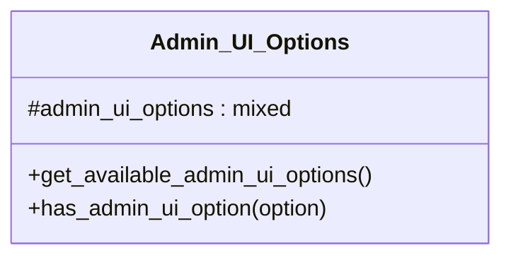

# Admin_UI_Options


Class for getting Admin UI options passed either via query string in
the URL or via the 'tainacan-admin-ui-options' filter.

***

* Full name: `\Tainacan\Traits\Admin_UI_Options`

## Class Diagram



## Properties

### admin_ui_options

```php
protected static $admin_ui_options
```

* This property is **static**.

***

## Methods

### get_available_admin_ui_options

Lists a translatable and grouped version of the available admin ui options

```php
public get_available_admin_ui_options(): array
```

**Return Value:**

of available admin ui options

***
### has_admin_ui_option

```php
public has_admin_ui_option(mixed $option): string
```

**Parameters:**

| Parameter | Type      | Description |
|-----------|-----------|-------------|
| `$option` | **mixed** |             |

**Return Value:**

option value for the given setting

***
