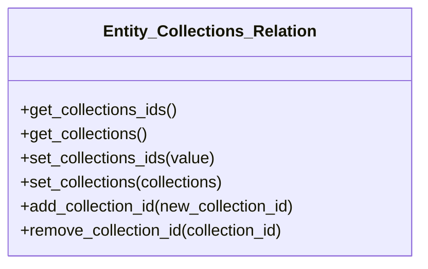

# Entity_Collections_Relation


***

* Full name: `\Tainacan\Traits\Entity_Collections_Relation`

## Class Diagram



## Methods

### get_collections_ids

```php
public get_collections_ids(): mixed
```

***
### get_collections

```php
public get_collections(): mixed
```

***
### set_collections_ids

```php
public set_collections_ids(array $value): mixed
```

**Parameters:**

| Parameter | Type      | Description |
|-----------|-----------|-------------|
| `$value`  | **array** |             |

***
### set_collections

```php
public set_collections(array $collections): mixed
```

**Parameters:**

| Parameter      | Type      | Description |
|----------------|-----------|-------------|
| `$collections` | **array** |             |

***
### add_collection_id

```php
public add_collection_id(mixed $new_collection_id): mixed
```

**Parameters:**

| Parameter            | Type      | Description |
|----------------------|-----------|-------------|
| `$new_collection_id` | **mixed** |             |

***
### remove_collection_id

```php
public remove_collection_id(mixed $collection_id): mixed
```

**Parameters:**

| Parameter        | Type      | Description |
|------------------|-----------|-------------|
| `$collection_id` | **mixed** |             |

***
