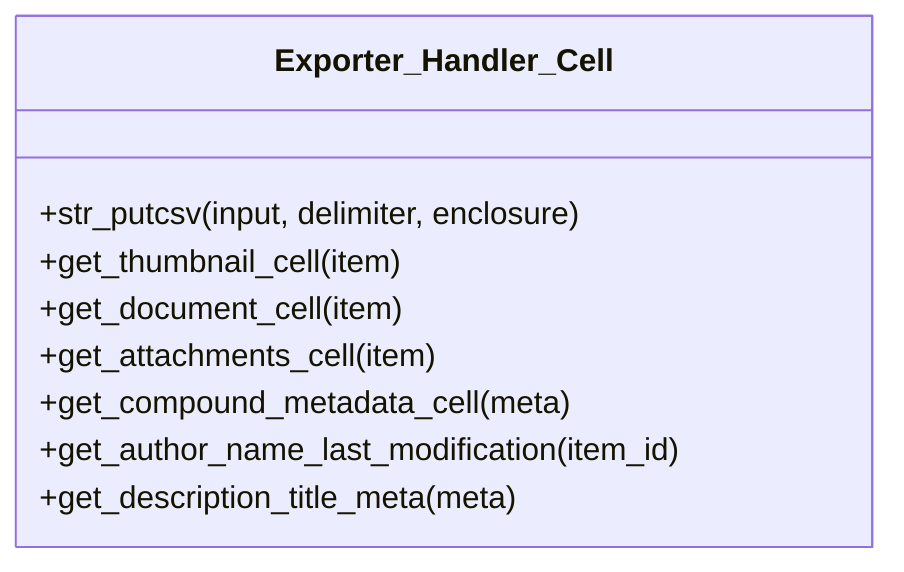

# Exporter_Handler_Cell


***

* Full name: `\Tainacan\Traits\Exporter_Handler_Cell`

## Class Diagram



## Methods

### str_putcsv

```php
public str_putcsv(mixed $input, mixed $delimiter = ',', mixed $enclosure = '"'): mixed
```

**Parameters:**

| Parameter    | Type      | Description |
|--------------|-----------|-------------|
| `$input`     | **mixed** |             |
| `$delimiter` | **mixed** |             |
| `$enclosure` | **mixed** |             |

***
### get_thumbnail_cell

```php
public get_thumbnail_cell(mixed $item): mixed
```

**Parameters:**

| Parameter | Type      | Description |
|-----------|-----------|-------------|
| `$item`   | **mixed** |             |

***
### get_document_cell

```php
public get_document_cell(mixed $item): mixed
```

**Parameters:**

| Parameter | Type      | Description |
|-----------|-----------|-------------|
| `$item`   | **mixed** |             |

***
### get_attachments_cell

```php
public get_attachments_cell(mixed $item): mixed
```

**Parameters:**

| Parameter | Type      | Description |
|-----------|-----------|-------------|
| `$item`   | **mixed** |             |

***
### get_compound_metadata_cell

```php
public get_compound_metadata_cell(mixed $meta): mixed
```

**Parameters:**

| Parameter | Type      | Description |
|-----------|-----------|-------------|
| `$meta`   | **mixed** |             |

***
### get_author_name_last_modification

```php
public get_author_name_last_modification(mixed $item_id): mixed
```

**Parameters:**

| Parameter  | Type      | Description |
|------------|-----------|-------------|
| `$item_id` | **mixed** |             |

***
### get_description_title_meta

```php
public get_description_title_meta(mixed $meta): mixed
```

**Parameters:**

| Parameter | Type      | Description |
|-----------|-----------|-------------|
| `$meta`   | **mixed** |             |

***
