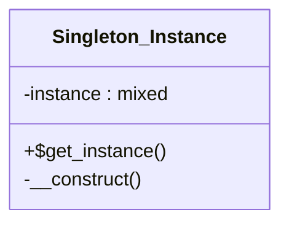

# Singleton_Instance


Class for Singleton pattern

***

* Full name: `\Tainacan\Traits\Singleton_Instance`

## Class Diagram



## Properties

### instance

```php
private static $instance
```

* This property is **static**.

***

## Methods

### get_instance

```php
public static get_instance(): mixed
```

* This method is **static**.
***
### __construct

```php
private __construct(): mixed
```

***
