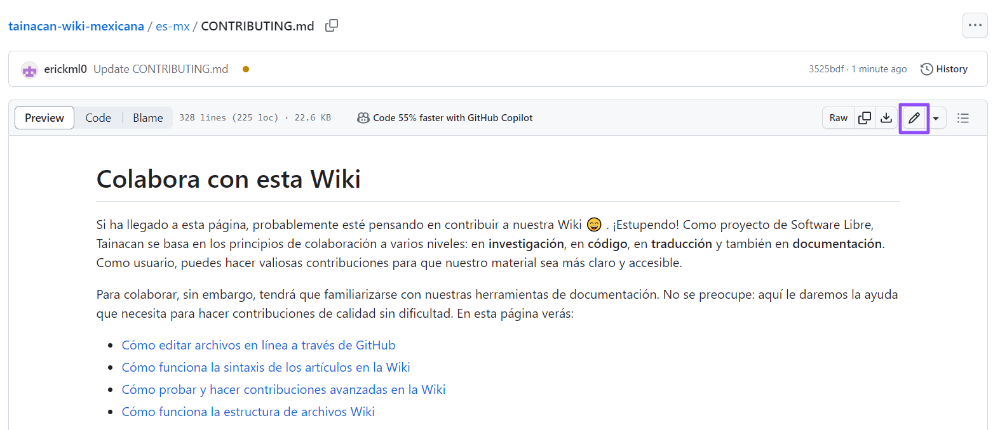

# Colabora con esta Wiki

Si ha llegado a esta página, probablemente esté pensando en contribuir a nuestra Wiki :smile: . ¡Estupendo! Como proyecto de Software Libre, Tainacan se basa en los principios de colaboración a varios niveles: en **investigación**, en **código**, en **traducción** y también en **documentación**. Como usuario, puedes hacer valiosas contribuciones para que nuestro material sea más claro y accesible.

Para colaborar, sin embargo, tendrá que familiarizarse con nuestras herramientas de documentación. No se preocupe: aquí le daremos la ayuda que necesita para hacer contribuciones de calidad sin dificultad. En esta página verás:

- [Cómo editar archivos en línea a través de GitHub](#editar-archivos-directamente-en-github)
- [Cómo funciona la sintaxis de los artículos en la Wiki](#familiarizandose-con-el-formato-markdown)
- [Cómo probar y hacer contribuciones avanzadas en la Wiki](#contribución-avanzada-con-Docsify)
- [Cómo funciona la estructura de archivos Wiki](#comprender-la-estructura-de-la-wiki)

## Editar archivos directamente en GitHub

Nuestra Wiki está alojada íntegramente en GitHub, en el siguiente repositorio: https://github.com/tainacan/tainacan-wiki. No es necesario tener mucha experiencia con Git para hacer contribuciones ocasionales; la propia plataforma simplifica gran parte del proceso. Por ejemplo, si ves un error ortográfico en un artículo, haz clic en el botón **Editar en github** que aparece en la esquina superior derecha de la página. Se le redirigirá al "código fuente" de esta página:



Haciendo clic en el botón de edición con forma de pincel, puedes hacer los cambios que quieras y, al final del formulario, explicar qué cambios se proponen. Al enviar una propuesta de cambio, GitHub está, entre bastidores, creando un _Fork_ para ustedes y aplicando un _Pull-Request_.

Para contribuciones más complejas, que impliquen crear páginas, insertar imágenes, pestañas, vídeos o incluso cambios en la estructura de navegación de la Wiki, le sugerimos que siga nuestras instrucciones. [instrucciones para ejecutar Docsify](#contribución-avanzada-con-Docsify).

## Familiarizandose con el formato Markdown

Muchos sistemas colaborativos adoptan ciertas convenciones de formato para facilitar el trabajo de los editores. En nuestra wiki, utilizamos el lenguaje **`markdown``** para ello, pero también algunas características adicionales. Este sistema consta de sintaxis y palabras clave específicas para comunicar al software cómo debe mostrarse determinado texto.

### Funcionan en cualquier parte del texto:

| Qué es                                     | Lo que escribe                                                               | Lo que ve                                                                  |
| ------------------------------------------- | -------------------------------------------------------------------------------- | ------------------------------------------------------------------------------ |
| Texto en cursiva, negrita o ambas          | `*cursiva*, **negrita** o ***ambos***`                                          | _cursiva_, **negrita** o **_ambos_**                                          |
| Texto pre-formateado                         | `Aquí va el nombre de una función`                                                  | `Aquí va el nombre de una función`                                                |
| Enlaces a las páginas de la wiki                  | `[Página principal](/es-mx/README.md)`                                           | [Página principal](/es-mx/README.md)                                           |
| Enlaces a una sección                        | `[Editando colecciones](/es-mx/collections#crear-colecciones)`                         | [Editando colecciones](/es-mx/collections#crear-colecciones)                         |
| Referencia a la dirección de un sitio web      | `https://tainacan.org`                                                           | https://tainacan.org                                                           |
| Referencia a un enlace con un nombre personalizado | `[Sitio oficial de Tainacan](https://www.wikipedia.org/)`                         | [Sitio oficial de Tainacan](https://www.wikipedia.org/)                         |
| Comentarios de texto                        | `<!--Este comentario no se mostrará en la página, sólo en su código fuente-->` | <!--Este comentario no se mostrará en la página, sólo en su código fuente--> |

### Sólo funcionan al principio de las líneas:

| Qué es               | Lo que escribe                                                                                    | Lo que ve                                                                                                                                                                                                                                                                                                                                                                 |
| --------------------- | ----------------------------------------------------------------------------------------------------- | ----------------------------------------------------------------------------------------------------------------------------------------------------------------------------------------------------------------------------------------------------------------------------------------------------------------------------------------------------------------------------- |
| Encabezado de sección    | `## Nivel 2`                                                                                          | <h2>Nivel 2</h2>                                                                                                                                                                                                                                                                                                                                                              |
| Encabezado de sección    | `### Nivel 3`                                                                                         | <h3>Nivel 3</h3>                                                                                                                                                                                                                                                                                                                                                              |
| Encabezado de sección    | `#### Nivel 4`                                                                                        | <h4>Nivel 4</h4>                                                                                                                                                                                                                                                                                                                                                              |
| Encabezado de sección    | `##### Nivel 5`                                                                                       | <h5>Nivel 5</h5>                                                                                                                                                                                                                                                                                                                                                              |
| Encabezado de sección    | `###### Nivel 6`                                                                                      | <h6>Nivel 6</h6>                                                                                                                                                                                                                                                                                                                                                              |
| Listas de marcadores | `* Este es un punto `<br>`* Este es otro punto`<br>&nbsp;&nbsp;`* Punto dentro de un punto`             | <ul><li>Este es un punto</li><li>Este es otro punto<ul><li>Punto dentro de un punto</li></ul></li></ul>                                                                                                                                                                                                                                                                        |
| Listas numeradas     | `1. Este es un punto`<br>`2. Este es otro punto`<br>&nbsp;&nbsp;`1. Puntro dentro de un punto`          | <ol><li>Este es un punto</li><li>Este es otro punto<ol><li>Punto dentro de un punto</li></ol></li></ol>                                                                                                                                                                                                                                                                        |
| Lista de verificación       | `- [ ] Este es un punto`<br>`- [x] Este es otro punto`<br>&nbsp;&nbsp;`- [ ] Punto dentro de un punto` | <ul class="task-list"><li class="task-list-item"><label><input disabled="" type="checkbox">Este es un punto</label></li><li class="task-list-item"><label><input checked disabled="" type="checkbox">Este es otro punto</label><ul class="task-list"><li class="task-list-item"><label><input disabled="" type="checkbox">Ponto dentro de um ponto</label></li></ul></li></ul> |
| Destacados             | `> Esta es una observación importante.`                                                                 | <blockquote><p>Esta es una observación importante.</p></blockquote>                                                                                                                                                                                                                                                                                                             |
| Alertas               | `!> Esta es una observación delicada.`                                                                | <p class="tip">Esta es una observación delicada.</p>                                                                                                                                                                                                                                                                                                                          |
| Notas                 | `?> Esta es una observación secundaria.`                                                                | <p class="warn">Esta es una observación secundaria.</p>                                                                                                                                                                                                                                                                                                                         |

### Líneas

Para separar simplemente las sesiones con una línea, utilice:

```
------
```

Que se traducirá como:

---

> Obs: deje al menos una línea en blanco entre este símbolo y cualquier otro texto, de lo contrario se entenderá como un encabezado.

### Imagenes

| Qué es                            | Lo que escribe                                                    | Lo que ve                                                       |
| ---------------------------------- | --------------------------------------------------------------------- | ------------------------------------------------------------------- |
| Imagen y descripción                 | ``            |             |
| Imagen y descripción, redimensionada | `` |  |

### Vídeos

Usamos un `iframe` para insertar medios, que es la alternativa estándar para la mayoría de las plataformas de vídeo en línea. Por ejemplo, para insertar un vídeo de YouTube:

```html
<iframe
  width="560"
  height="513"
  src="https://www.youtube.com/embed/gFJfyHRKaE0?start=18"
  frameborder="0"
  allow="accelerometer; 
    autoplay; encrypted-media; gyroscope; picture-in-picture"
  allowfullscreen
></iframe>
```

> Observe que se han establecido la anchura (560px), la altura (513px) y el tiempo de inicio del vídeo (18s).

El resultado será el siguiente:

<iframe width="560" height="513" src="https://www.youtube.com/embed/gFJfyHRKaE0?start=18" frameborder="0" allow="accelerometer; autoplay; encrypted-media; gyroscope; picture-in-picture" allowfullscreen></iframe>

### Fragmentos de código

Para mostrar fragmentos de código preformateados, el propio `markdown` ya lo hace posible, pero también podemos añadir directivas para resaltar determinados idiomas, simplemente rodeando el código deseado con tres comillas ` ``` ` antes y después de su contenido. Si se trata de un código en `php`, por ejemplo, simplemente empieza con ` ```php `. El resultado será el siguiente:

```php
<?php
function foo($arg_1, $arg_2, /* ..., */ $arg_n)
{
    echo "Example function.\n";
    return $retval;
}
?>
```

### Pestañas

Una de las cosas adicionales que nuestra Wiki puede hacer además de `markdown` mostrar pestañas. Pueden ser útiles para segmentar el contenido en secciones dentro de la misma página. Por ejemplo, el código siguiente:

```markdown
<!-- tabs:start -->

#### ** Pestaña 1 **

Contenido de prestaña 1

#### ** Pestaña 2 **

Contenido de prestaña 2

#### ** Pestaña 3 **

Contenido de prestaña 3

<!-- tabs:end -->
```

Será renderizado como:

<!-- tabs:start -->

#### ** Pestaña 1 **

Contenido de prestaña 1

#### ** Pestaña 2 **

Contenido de prestaña 2

#### ** Pestaña 3 **

Contenido de prestaña 3

<!-- tabs:end -->

### Colapsos

Para ocultar algunos contenidos largos en regiones plegables, utilizamos la etiqueta `HTML` `<description></description>` y `<summary></summary>`. Por ejemplo:

```
<details>
<summary>Un colapso (Haga clic para ampliar)</summary>

- Contenido markdown aqui dentro
- Y cualquier otra cosa que se necesite

</details>
```

El resultado será:

<details>
<summary>Un colapso (Haga clic para ampliar)</summary>

- Contenido markdown aqui dentro
- Y cualquier otra cosa que se necesite

</details>

> Observe que hay una línea de espacio entre lo que es código `HTML` y lo que es `markdown`.

### Tablas

La forma de crear tablas es algo limitada en `markdown`. He aquí un ejemplo:

```
| Encabezado 1   | Encabezado 2   |
|---------------|---------------|
| Datos 1       | Datos 2       |
| Datos 3       | Datos 4       |
```

Lo que genera la siguiente tabla:

| Encabezado 1 | Encabezado 2 |
| ----------- | ----------- |
| Datos 1     | Datos 2     |
| Datos 3     | Datos 4     |

Para insertar saltos de línea en las tablas `markdown`, usamos la etiqueta `HTML` `<br>`:

```
| Encabezado 1   | Encabezado 2        |
|---------------|--------------------|
| Datos 1       | Datos 2            |
| Datos 3       | Datos 4<br>Datos 5 |
```

El resultado es la siguiente tabla:

| Encabezado 1 | Encabezado 2        |
| ----------- | ------------------ |
| Datos 1     | Datos 2            |
| Datos 3     | Datos 4<br>Datos 5 |

## Contribución avanzada con Docsify

Todo lo que se ha mostrado hasta ahora podría ser [editado directamente mediante GitHub](#editando-archivos-directamente-en-github), pero es difícil predecir cómo se verán algunas características más avanzadas, como las imágenes o las pestañas, que sólo pueden verse aunque ya se hayan enviado a la Wiki. Para estas y otras contribuciones más avanzadas, como modificar la estructura de navegación, le sugerimos que pruebe el contenido en su equipo local, lo que requerirá algunos conocimientos adicionales..

### Preparando el ambiente

En su máquina, necesita tener:

- Git
- NodeJS

En primer lugar, haga un _Fork_ de nuestro repositorio en GitHub:


Clone y acceda a su copia local. Suponemos que ya ha realizado la operación [configuración inicial de Git](https://git-scm.com/book/es-mx/v1/Primeiros-passos-Configura%C3%A7%C3%A3o-Inicial-do-Git), utilizando una cuenta creada en GitHub:

```
git clone https://github.com/SEU_NOME_DE_USUARIO/tainacan-wiki
cd tainacan-wiki
```

El siguiente comando garantiza que su _Fork_ puede sincronizarse en el futuro con las actualizaciones del repositorio Wiki original:

```
git remote add upstream https://github.com/tainacan/tainacan-wiki.git
```

Ahora instala globalmente la `CLI' de Docsify, nuestro framework que te ayuda a crear un Wiki:

```
npm i docsify-cli -g
```

Asegúrate de que estás en el directorio de la respuesta (`cd tainacan-wiki`, o la ruta que necesites) e inicia el servidor de Docsify:

```
docsify serve
```

Esto instanciará un servidor de pruebas local, normalmente en el puerto `http://localhost:3000`. Accediendo a esta dirección en tu navegador, obtendrás una vista previa de cómo quedará el Wiki después de las ediciones que hayas hecho en tu copia local. Cualquier cambio en un archivo dentro del repositorio se reflejará automáticamente en esta dirección tan pronto como se guarde el archivo.

### Realice su primera contribución a través de Pull-Request

El procedimiento anterior, excepto el último comando, sólo debe realizarse una vez. A continuación explicaremos cómo proponer un cambio en un archivo Wiki. Supongamos que desea añadir más información sobre [Alojamiento](/es-mx/hosting). Este expediente, en portugués, puede consultarse en `/es-mx/hosting.md`, como puede verse en la dirección de la barra del navegador.

Una buena práctica es empezar actualizando su repositorio local con los cambios que se hayan podido realizar en el repositorio wiki oficial:

```
git fetch upstream
git merge upstream/master
```

A continuación, realice los cambios que desee y guarde el archivo. Actualice su _Fork_:

```
git add .
git commit -m "Actualiza el contenido de la página de alojamiento con más opciones."
git push
```

Deberías poder ver los cambios en tu repositorio de GitHub. A continuación, vaya a [repositorio oficial de la Wiki](https://github.com/tainacan/tainacan-wiki) y haga clic en la opción "Crear Pull Request":


Usted elegirá su _Fork_ como origen del _Pull Request_ y puedes escribir una descripción que resuma tus cambios.


Una vez creada la solicitud, espere a que el equipo la revise.

## Comprender la estructura de la wiki

Ahora que ya puedes colaborar y probar cambios en nuestro Wiki, es hora de entender un poco mejor cómo funciona Docsify, que se encarga de transformar los archivos `markdown` existentes en nuestro repositorio en el sitio que ves alojado en https://tainacan.github.io/tainacan-wiki/#/es-mx/.

Si observamos la estructura de archivos del repositorio, tenemos, entre otras, las siguientes páginas y archivos:

```
/_assets
/dev
    README.md
    _sidebar.md
/es-mx
    /_assets
    /dev
        README.md
        _sidebar.md
    CONTRIBUTING.md
    README.md
    _coverpage.md
    _navbar.md
    _sidebar.md
    collections.md
CONTRIBUTING.md
README.md
_coverpage.md
_navbar.md
_sidebar.md
collections.md
index.html
style.css
```

Comentemos algunas cosas:

- **/\_assets**: es la carpeta donde almacenamos imágenes y otros archivos multimedia. Existirá en más niveles internos de la Wiki para almacenar archivos relacionados con ese ámbito;
- **/dev**: es la carpeta que contiene la parte de la Wiki relativa a la documentación para desarrolladores. Esta separación ayuda a organizar el extenso contenido de la Wiki. En el futuro se podrán crear otras carpetas específicas para una parte de la Wiki, siempre que se ajusten las referencias a los archivos que contienen;
- **/es-mx**: es la carpeta donde se almacena la documentación de la Wiki traducida al portugués de Brasil. Tenga en cuenta que casi todos los archivos y carpetas en el resto de la Wiki se replican aquí. Cuando no haya una versión traducida de un archivo dentro de esta carpeta, el usuario será redirigido al archivo correspondiente en la carpeta raíz;
- **CONTRIBUTING.md**: Instrucciones para quienes deseen colaborar con la Wiki. Está leyendo la versión traducida de este archivo, que se encuentra en `/es-mx/CONTRIBUTING.md`;
- **README.md**: Página de inicio del wiki, que se carga accediendo a `/`. Utilizamos el nombre README para que GitHub también reconozca este archivo como el archivo de presentación. La versión traducida está en `/es-mx/README.md` y se carga accediendo a `/es-mx`. Dentro de las carpetas `/dev` también hay una versión de este archivo, que será la página de inicio de la sesión de desarrolladores;
- **\_coverpage.md**: Página de portada, que se carga encima de la página de inicio;
- **\_navbar.md**: Barra superior de la Wiki, que actualmente contiene un enlace al sitio oficial y un desplegable para elegir el idioma del sitio. Se trata de una página especial que es renderizada por Docsify, convirtiendo las sublistas, por ejemplo, en desplegables;
- **\_sidebar.md**: Lista de enlaces que se muestran en la barra lateral. Tenga en cuenta que hay uno de ellos en la carpeta `/es-mx` con su contenido traducido, pero también hay versiones en las carpetas `/dev` y `/dev/es-mx`. De este modo, al navegar por los archivos en la sesión de desarrollador, se muestra una lista de enlaces dedicada al tema.
- **collections.md**: Un ejemplo de una de las muchas páginas comunes que existen en Wiki. Estas páginas suelen tener su propia jerarquía definida por las cabeceras de sesión, que también se muestran en la barra lateral al entrar en ella;
- **index.html**: Archivo utilizado para configurar Docsify, plugins e importaciones. ¡No recomendamos hacer cambios aquí a menos que sepas lo que estás haciendo!
- **style.css**: La hoja de estilos CSS del sitio, que personaliza la apariencia del Wiki.

Le recomendamos encarecidamente que explore esta estructura y los cambios a través del servidor de pruebas local de Docsify para familiarizarse con los conceptos. Para más detalles, consulte la página [documentación de Docsify](https://docsify.js.org/).
