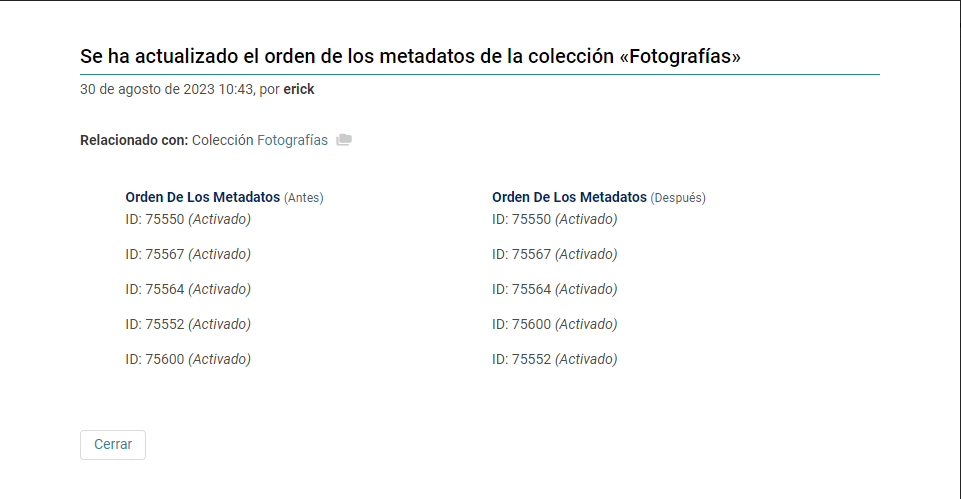
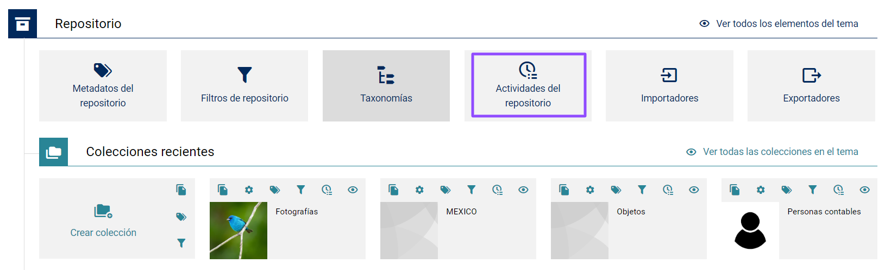
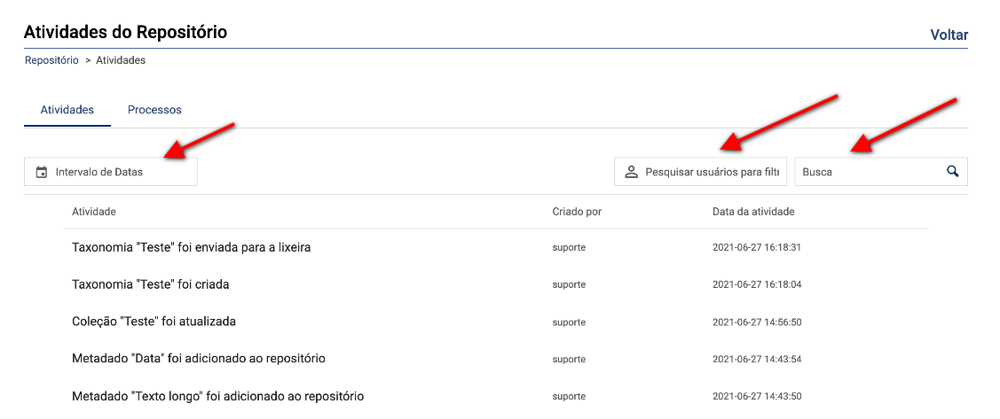
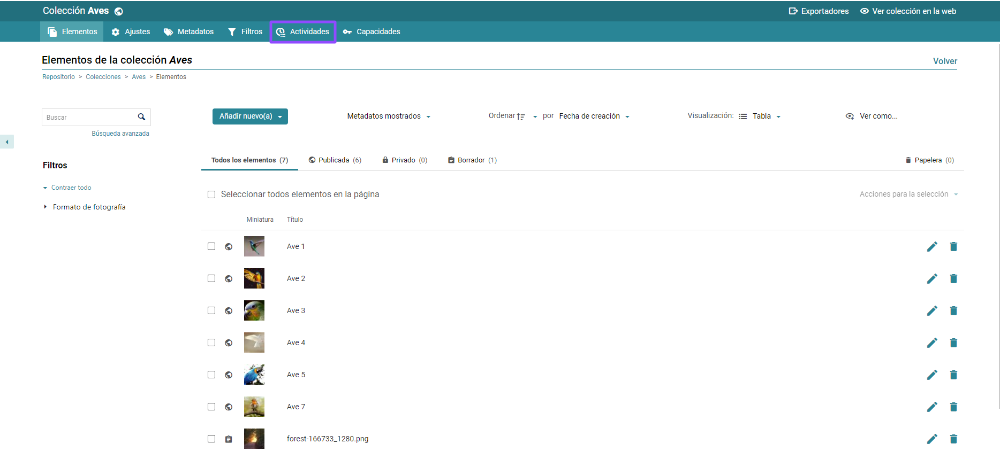
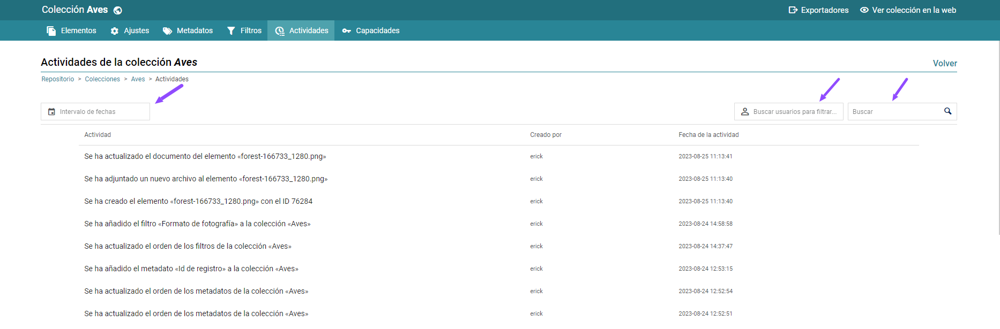
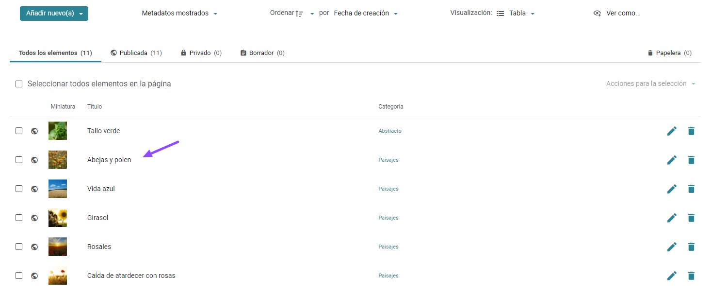
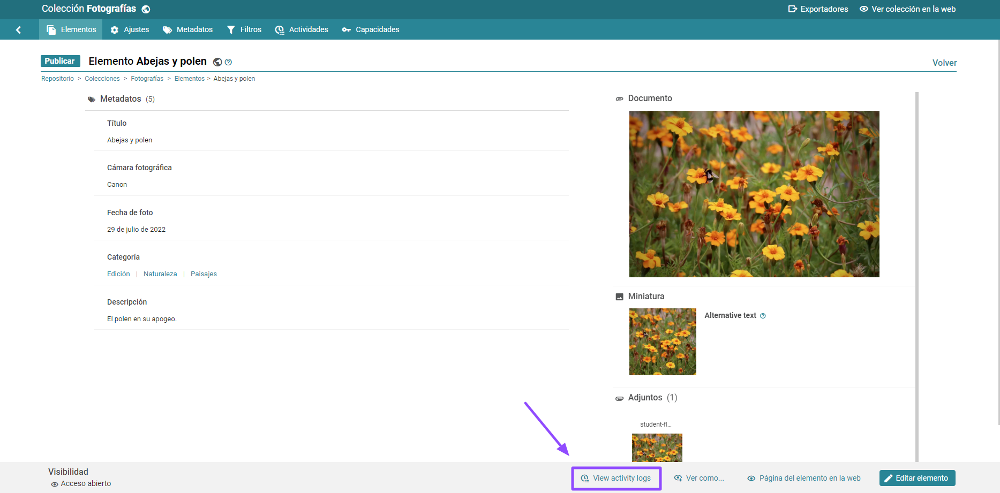
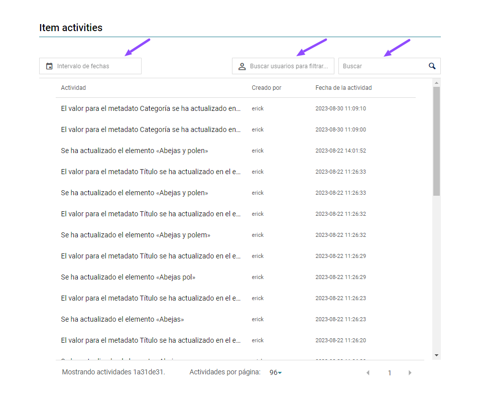

	

# Registro de actividades

Todas las acciones realizadas en Tainacan quedan registradas y pueden ser consultadas a nivel de “repositorio”, “colección” y en cada “elemento”.

Al hacer clic en una Colección >> Actividades >> Actividad, se abre una ventana con la siguiente información:

​ a. “**Descripción de la actividad”**;

​ b. **“Fecha y hora de la actividad”**;

​ c. **“Autor de la actividad”**;

​ d. **“Dos listas”**:

​ ○ La de la izquierda muestra la información antes del cambio;

​ ○ La de la derecha muestra la información después del cambio.

​ e. Los administradores pueden revertir estos cambios haciendo clic en Deshacer.

## Registro de actividades del repositorio

Reúne actividades como creación, edición y eliminación de "colecciones", "metadatos", "filtros” y “taxonomías”a nivel de repositorio. En los registros de actividad a nivel de repositorio también se puede dar seguimiento a los procesos de importación y exportación, los cuales se registran en la pestaña “procesos”.

1. Accede al panel de control de _WordPress_;

   

2. En la barra lateral izquierda, haz clic en Tainacan;

   

3. Haz clic en “Actividades del repositorio”;

   

4. En esta página puedes filtrar las “actividades” por:

   a. **“Rango de fechas”**;

   b. **“Usuario”**;

   c. **“Búsqueda general”**.

   

## Registro de actividades de la colección

Contiene la información de actividades dentro de una colección, como crear, editar y eliminar "elementos". También muestra las actividades relacionadas con la configuración de la colección, incluidas las configuraciones de "metadatos" y "filtros”.

1. Accede al panel de control de _WordPress_;

   

2. En la barra lateral izquierda, haz clic en Tainacan;

   

3. Haz clic en la “Colección” que quieres revisar y luego en “Actividades”;

   

4. En esta página puedes filtrar las actividades por:

   

   ​ a. **“Rango de fechas”**;

   ​ b. **“Usuario”**;

   ​ c. **“Búsqueda general”**.

## Registro de actividades del elemento

Contiene la información de las "actividades" relacionadas con el elemento, como crear, editar y eliminar "valores” del elemento.

1. Accede al panel de control de _WordPress_;

   

2. En la barra lateral izquierda, haz clic en Tainacan

   

3. Haz clic en la "colección" que deseas y luego haz clic en el "ítem" en el que quieres verificar las "actividades";

   

4. En el “elemento”, haz clic en la pestaña “Actividades”;

   

5. En esta página puedes filtrar las actividades por:

   

   a. **“Rango de fechas”**;

   b. **“Usuario”**;

   c. **“Búsqueda general”**.
