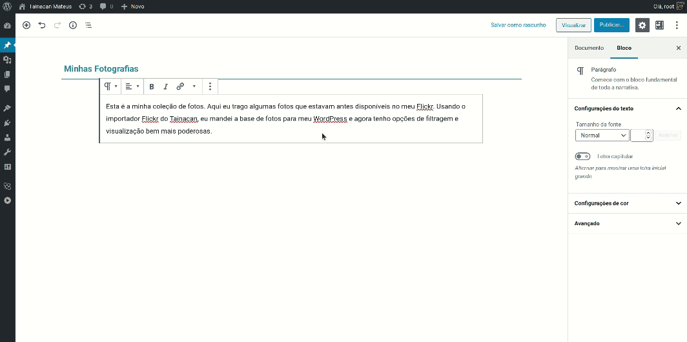

# Bloques de colección

Si su repositorio tiene varias colecciones, puede ser una buena idea presentarlas en la página de inicio o en un post de introducción a la colección. Para estas situaciones, merece la pena utilizar un bloque de colección. Tainacan ofrece actualmente dos de ellos:

1. El [carrusel de colecciones](#carrusel-de-colecciones)
2. La [lista de colecciones](#lista-de-colecciones) _(Estático)_

---

## Carrusel de colecciones

Para presentar varias colecciones en secuencia y dar a su publicación un aspecto más "dinámico", el bloque Carrusel de colecciones es ideal.

### Configuraciones iniciales de los bloques

Para empezar, elija las colecciones que se añadirán al bloque. Las colecciones se añaden a través del modal y se eliminan de la propia lista haciendo clic en el botón "X" que aparece encima de la colección insertada.

Con las colecciones cargadas, puede que notes que el carrusel no se mueve. De hecho, sólo se activa en la versión publicada o de vista previa de la entrada o página. Aquí, en el editor, verás una lista desplazable normal y corriente. Tenga en cuenta que cuando hace clic en una colección, el enlace le lleva a la sección [Lista de objetos de la colección](/es-mx/tainacan-pages#página-de-elementos-del-repositorio) o a su página especialmente configurada. Ahora podemos realizar una serie de ajustes que están disponibles en el panel lateral cuando tenemos el bloque activo.

### Modos de visualización de la colección

Por defecto, el carrusel de colecciones tendrá un aspecto muy diferente al del [Carrusel de elementos](/es-mx/blocks-items#carrossel-de-itens), porque en cada unidad del carrusel aparecen tres imágenes. Estas imágenes son de artículos, en realidad los tres primeros artículos de la colección. Así, el bloque le ofrece una vista previa del aspecto de la colección. Si en lugar de la **rejilla de artículos** quieres mostrar la **miniatura de la colección**, sólo tienes que cambiarlo en la configuración del bloque en la barra lateral del editor.

### Opciones del carrusel

Al igual que con otros bloques, puede elegir si desea mostrar o no el nombre de la colección debajo de la miniatura. Las otras opciones disponibles en el carrusel están relacionadas con la reproducción. Son las siguientes:

- Diapositivas en bucle - Haga que el carrusel vuelva al principio cuando llegue al final de la lista;
- Reproducción automática - Reproduce automáticamente el carrusel;
- Intervalo de tiempo entre cada cambio de colección;
- Posición de las flechas: Cómo deben disponerse las flechas de navegación del carrusel;

 

---

## Lista de colecciones

Con el bloque Lista de colecciones, puede seleccionar manualmente los elementos que desea mostrar en una lista con un salto de línea.

!> Una desventaja es que se trata de un **bloque estático**. Esto significa que las colecciones seleccionadas (nombre e imagen) se guardan en la configuración del bloque en el post y no se actualizan si realizas algún cambio en la colección. Supongamos que eliges algunas colecciones, guardas tu entrada y unos días después cambias el nombre o la imagen de esa colección. Cuando vuelvas al bloque, estos cambios no se reflejarán y tendrás que repetir la configuración. Por eso recomendamos usarlo con precaución y, si es posible, utilizar la opción [Carrusel de colecciones](#carrusel-de-colecciones) en su lugar.

### Configuraciones iniciales del bloque

Para empezar, elija las colecciones que se añadirán al bloque. Las colecciones se añaden a través del modal y se eliminan de la propia lista haciendo clic en el botón "X" que aparece encima de la colección insertada. Cuando haga clic en una colección, el enlace le llevará a la sección [Lista de elementos de la colección](/es-mx/tainacan-pages#páginas-de-elementos-de-una-colección) o a su página especialmente configurada.

Con las colecciones cargadas, podemos realizar algunos ajustes que están disponibles en el panel lateral cuando tenemos el bloque activo.

### Configuraciones de visualización de la colección

Este bloque ofrece dos modos de visualización, disponibles en la barra superior del bloque:

<!-- tabs:start -->

#### ** Rejilla de la colección **

El modo por defecto es la rejilla de colecciones, que mostrará miniaturas de las colecciones (185px _x_ 185px), con sus nombres debajo. En este modo, puedes configurar si quieres mostrar o no el nombre de la colección y si quieres más espacio entre ellas. Recuerde que cuanto mayor sea el espacio, menos colecciones cabrán por línea.

#### ** Lista de colecciones **

La lista de colecciones le ofrece una vista más simplificada, con miniaturas más pequeñas (54px _x_ 54px) y los nombres junto a ellas. En este modo, puedes elegir no mostrar la miniatura, lo que resulta ideal para las colecciones que no tienen imágenes.

<!-- tabs:end -->
