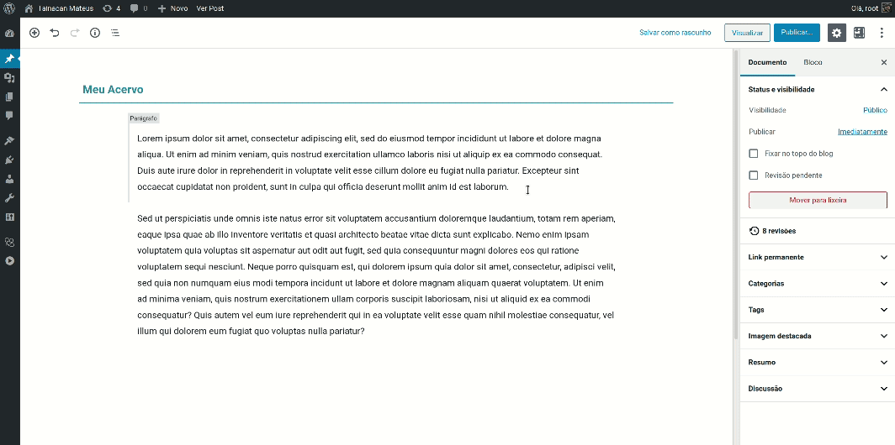

# Bloques de condiciones

Si su repositorio tiene taxonomías de varios términos, puede ser una buena idea presentarlas en la página de inicio o en un post de introducción a la colección. Para estas situaciones, merece la pena utilizar un bloque de términos. Tainacan ofrece actualmente dos de ellos:

1. [Carrusel de condiciones](#carrusel-de-condiciones)
2. [Lista de condiciones](#lista-de-condiciones) _(Estático)_

No se pierda de un bloque similar:

- [Lista de aspectos](/es-mx/blocks-facets#lista-de-aspectos);

---

## Carrusel de condiciones

Para presentar varios términos en secuencia y dar a su publicación un aspecto más "dinámico", el bloque Carrusel de condiciones es ideal.

### Configuraciones iniciales del bloque

Para empezar, elija la Taxonomía desde la que se cargarán las condiciones. Una vez hecho esto, elija los términos que se añadirán al bloque. Puede añadir términos a través del modal y eliminarlos de la propia lista haciendo clic en el botón "X" que aparece encima del término insertado.

Con las condiciones cargadas, puede que notes que el carrusel no se mueve. De hecho, sólo se activa en la versión publicada o de vista previa de la entrada o página. Aquí, en el editor, verá una lista desplazable normal. Tenga en cuenta que al hacer clic en una condición, el enlace le lleva a la sección [Lista de elementos de la condición](/es-mx/tainacan-pages#páginas-de-elementos-de-un-término). Ahora podemos realizar una serie de ajustes que estarán disponibles en el panel lateral cuando tengamos el bloque activo.

### Modos de visualización de términos

Por defecto, el carrusel de condiciones, así como la sección [Carrusel de colecciones](/es-mx/blocks-collections#carrusel-de-colecciones), será muy diferente de [Carrusel de elementos](/es-mx/blocks-items#carrusel-de-elementos), porque aparecen tres imágenes en cada unidad del carrusel. Estas imágenes son de elementos, de hecho, los tres primeros artículos de la lista para este término. Así, el bloque le ofrece una vista previa del aspecto de la lista. Si en lugar de la **Rejilla de artículos** quieres mostrar la  **Imagen de la condición**, sólo tienes que cambiarlo en la configuración del bloque en la barra lateral del editor.

### Opciones del carrusel

Al igual que con otros bloques, puede elegir si desea mostrar o no el nombre de la condición debajo de la imagen. Las demás opciones disponibles en el carrusel están relacionadas con su reproducción. Son las siguientes

- Diapositivas en bucle - Haga que el carrusel vuelva al principio cuando llegue al final de la lista;
- Reproducción automática - Reproduce el carrusel automáticamente;
- Intervalo de tiempo entre cada cambio de término;
- Posición de las flechas: Cómo deben disponerse las flechas de navegación del carrusel;

 

---

## Lista de condiciones

Con el bloque Lista de condiciones, puede seleccionar manualmente los términos que desea mostrar en una lista con un salto de línea.

!> Una desventaja es que se trata de un **bloque estático**. Esto significa que las condiciones seleccionadas (nombre e imagen) se guardan en la configuración del bloque en la entrada y no se actualizan si realizas algún cambio en la configuración de las condiciones. Supongamos que eliges unas condiciones, guardas tu entrada y unos días después cambias el nombre o la imagen de ese término. Cuando vuelvas al bloque, estos cambios no se reflejarán y tendrás que repetir la selección. Por eso recomendamos usarlo con precaución y, si es posible, utilizar la opción [Carrusel de condiciones](#carrusel-de-condiciones) en su lugar.

### Ajustes iniciales del Bloque

Para empezar, elija la Taxonomía desde la que se cargarán los términos. Una vez hecho esto, elija las condiciones que se añadirán al bloque. Puede añadir términos a través del modal y eliminarlos de la propia lista haciendo clic en el botón "X" que aparece encima del término que ha introducido. Cuando haga clic en una condición, el enlace le llevará a la sección [Lista de elementos de la condición](/es-mx/tainacan-pages#páginas-de-elementos-de-una-condición).

Con los elementos cargados, podemos realizar algunos ajustes que están disponibles en el panel lateral cuando tenemos el bloque activo.

### Configuración de la pantalla de condiciones

Este bloque ofrece dos modos de visualización, disponibles en la barra superior del bloque:

<!-- tabs:start -->

#### ** Tabla de condiciones **

El modo por defecto es la cuadrícula de condiciones, que mostrará las imágenes con las condiciones(185px _x_ 185px), con sus nombres debajo. En este modo, puede configurar si desea mostrar o no el nombre de la condición.

#### ** Lista de condiciones **

La lista de condiciones permite una vista más simplificada, con imágenes más pequeñas (54px _x_ 54px) y los nombres junto a ellas. En este modo, puede optar por no mostrar la imagen, lo que resulta ideal para las condiciones que no tienen imágenes.

<!-- tabs:end -->
