# Acciones conjuntas

Tainacan permite realizar "acciones conjuntas". Es posible crear, editar, importar y eliminar elementos de forma masiva con solo unos pocos clics.

## Crear elementos en lotes

Crear elementos conjuntos es diferente que “importar elementos” desde un archivo *.csv*. A diferencia ésta última función, que se ejecuta desde la sección de importadores de Tainacan, la creación conjunta se realiza directamente desde el panel administrativo de Colecciones, mediante la carga de los principales documentos que conformarán la colección.

> Nota: Si tiene una base de elementos estructurados y manejados en un documento de hoja de cálculo, considere usar el `Importador de CSV`.

> Nota:  La diferencia entre las funciones "Crear elementos conjuntos" y "Agregar un elemento" es el proceso de definición del documento principal. Por último, la creación de los metadatos no depende de la existencia de un documento vinculado al elemento. Mientras que para la primera función, el llenado de los metadatos se realiza desde la carga del conjunto de documentos originales.

!>**Atención**: Por defecto, Tainacan considerará el nombre del archivo como el “Título Principal” del elemento.

1. Acceso al panel de control de _WordPress_;

   

2. En la barra lateral izquierda, haz clic en Tainacan.

   

3. Selecciona la “Colección” en la que quieras crear de dos elementos.

   

4. Pulsa `Agregar nuevo` y selecciona la opción `Añadir elementos en lote`.

   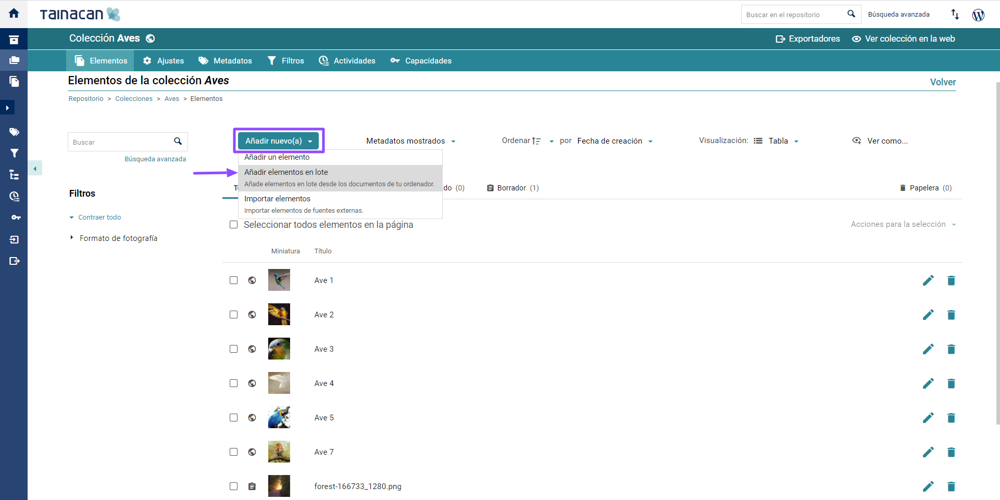

5. Pulsa o arrastra al interior del recuadro los dos elementos que deseas crear para el campo de “Envio de documentos”.

   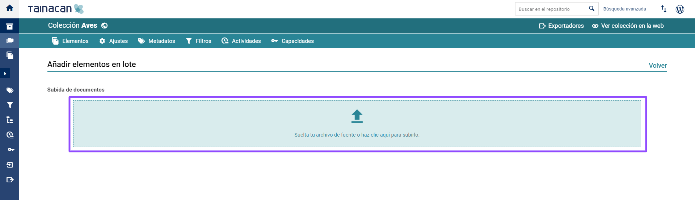

6. Los archivos seleccionados se cargarán automáticamente y el progreso de carga se podrá seguir en tiempo real.

   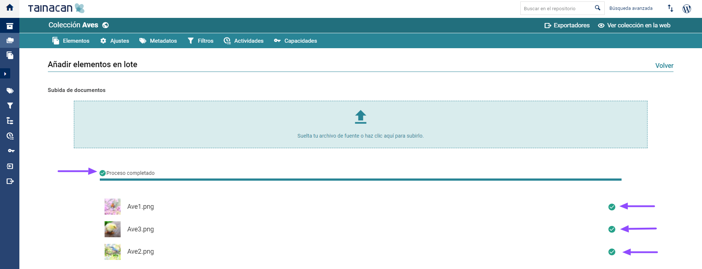

   > **Nota**: Se pueden agregar nuevos archivos multimedia en cualquier momento en esta misma pantalla durante el proceso de envío de documentos.

7. Al finalizar el proceso será posible:

   a. **“Editar elementos en secuencia**” para editar cada soporte individualmente en secuencia. Consulta el apartado: Editar elementos en secuencia.

   b. **“Editar elementos conjuntos”** para editar información común a todos los archivos enviados en esta operación. Consulta el apartado: Editar elementos conjuntos.

   c. **“Cancelar”** para finalizar una operación. Los archivos multimedia que ya están cargados estarán disponibles en la "Biblioteca multimedia" de WordPress.

!>Atención: Todos los valores insertados a través de la edición conjunta se asignan a todos los elementos creados de manera conjunta.

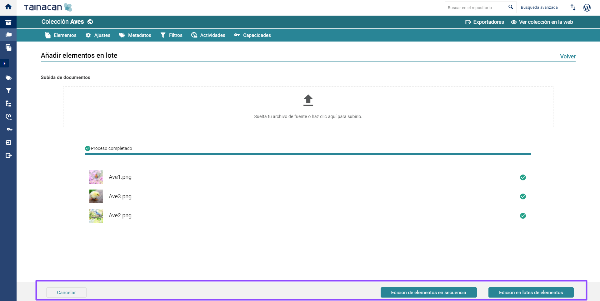

### Editar elementos en lotes

1. Selecciona la “Colección” que contenga los elementos que quieras editar.

   

2. Haz clic en el cuadro de selección (ubicado a la izquierda de las miniaturas de los elementos) para cada uno que desee editar, o pulsa en `Seleccionar todos los elementos de la página`;

   ● También puedes seleccionar todos los elementos de la colección. Para eso, primero da clic en `Seleccionar todos los elementos de la página` y luego en `Seleccionar todos`.

   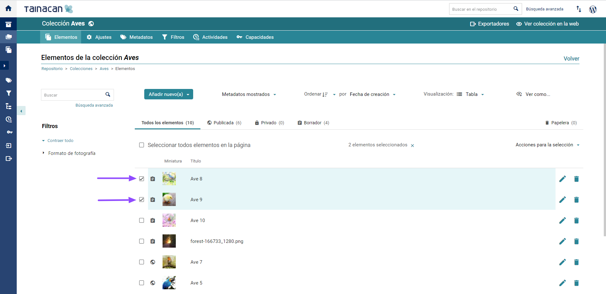

3. A la derecha, haz clic en `Acciones para la selección`.

   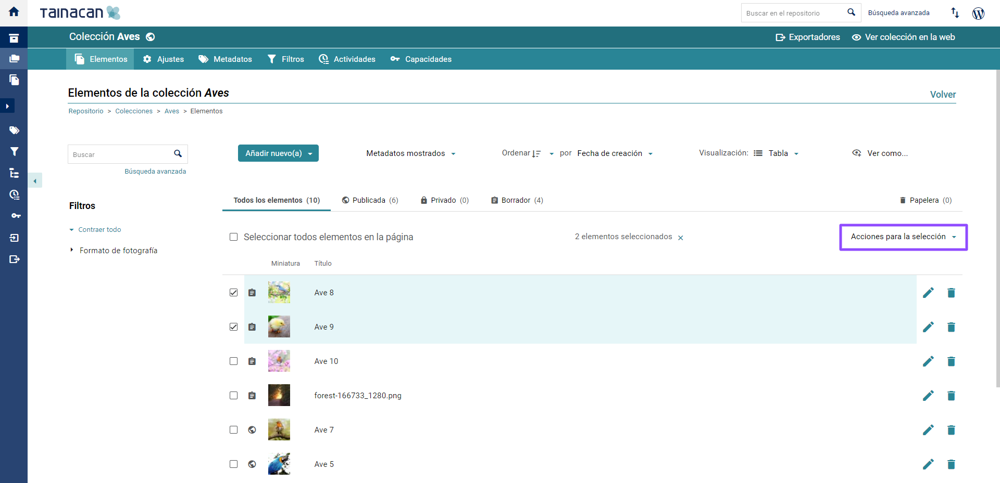

4. Selecciona `Edición en lotes de los elementos seleccionados`.

   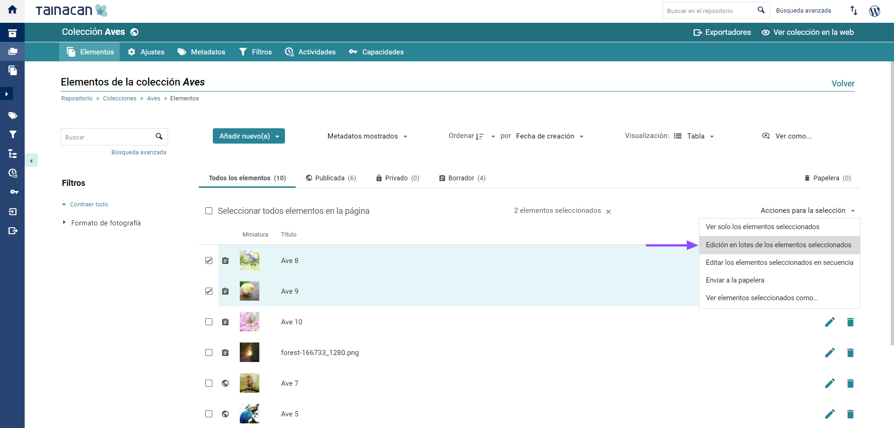

5. Elige los metadatos que quieras editar en la ventana que se muestra.

   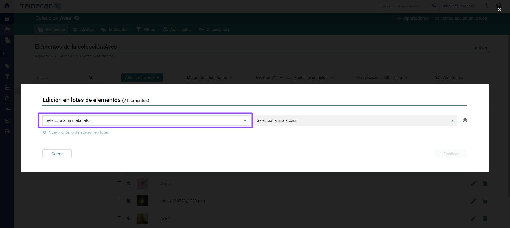

6. Luego, según las opciones y configuraciones del metadato, selecciona una acción:

   ○ **“Añadir valor”**: Para agregar un nuevo valor a un metadato con la configuración `Permitir valores múltiples` habilitada.

   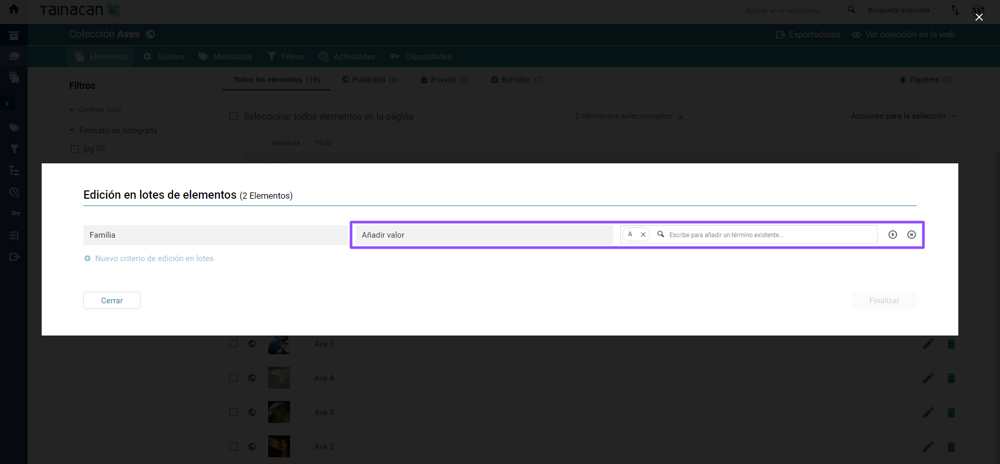

   ○ **“Establecer nuevo valor”**: Para dar un nuevo valor al metadato.

   I. Si existen valores para los elementos seleccionados, se sustituirán por el nuevo valor.

   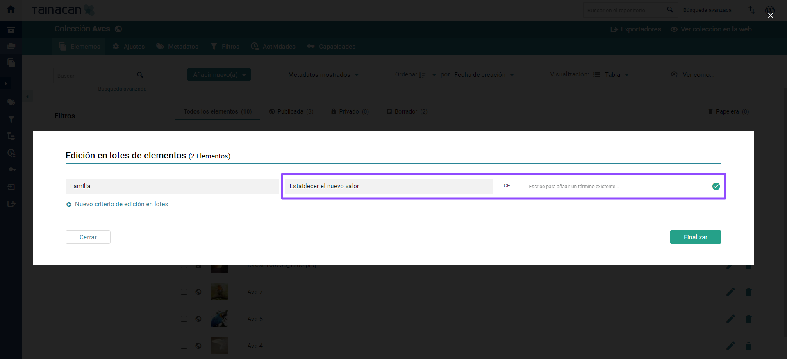

   ○ **“Reemplazar valor”**: Para cambiar un valor existente por otro.

   I. Aparecerá un campo para seleccionar el valor a sustituir y otro campo para introducir un nuevo valor.

   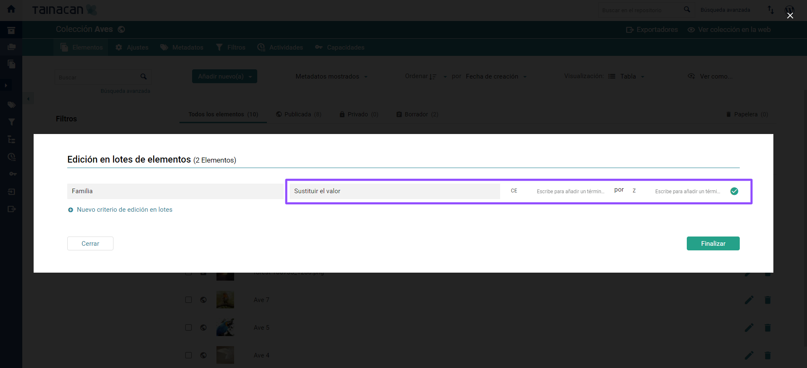

   ○ **“Remover un valor”**: PPara eliminar un valor específico en un metadato con una configuración `Permitir valores múltiples` habilitada.

   I. Se mostrará a la derecha un campo para seleccionar el valor a eliminar.

   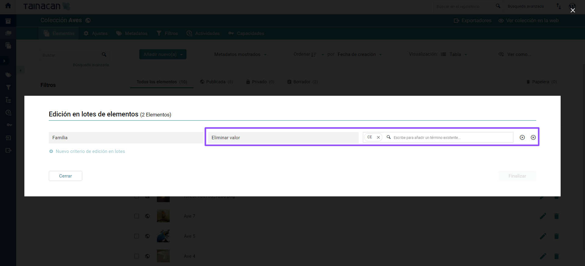

   ○ **“Vaciar valores”**: Para eliminar todos los valores de un metadato.

   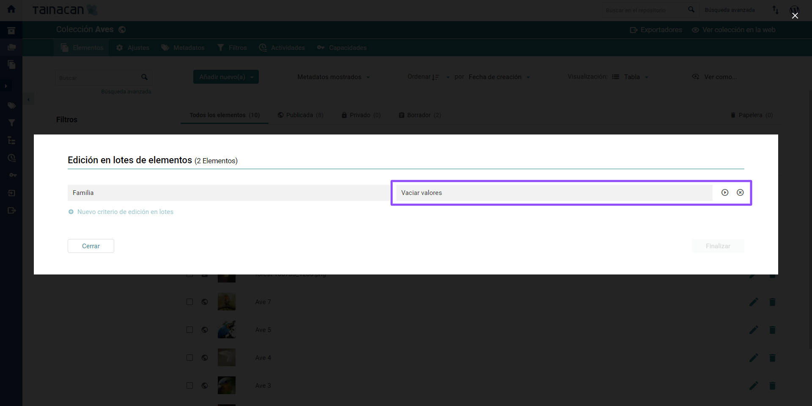

   ○ **“Copiar valor”**: Aparecerá un campo para seleccionar los metadatos de los que se copiará el valor. 

   I. Es importante tener en cuenta que los tipos de metadatos de origen y destino deben ser iguales. La siguiente tabla muestra las restricciones entre los ajustes de metadatos para realizar una copia.

   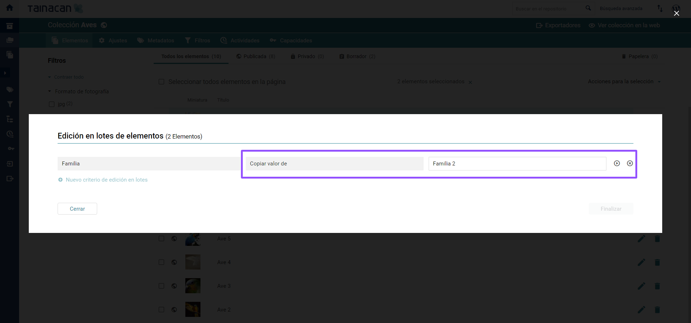

   | Metadato destino                  | Metadato origen                   | ¿Es posible copiar? |
   | --------------------------------- | --------------------------------- | ----------------- |
   | simple                           | simple                           | Si               |
   | múltiple                          | simple                           | Si               |
   | simple                           | múltiple                          | No               |
   | múltiple                          | múltiple                          | Si               |
   | cualquiera                          | compuesto                          | No               |
   | simple                           | hijos simples (metadato compuesto) | Si               |
   | múltiple                          | hijos simples (metadato compuesto) | Si               |
   | hijos simples (metadato compuesto) | simple                           | No               |
   | hijos simples (metadato compuesto) | múltiple                          | No               |

7. Al terminar de configurar los cambios deseados, pulsa el botón de la derecha `reproducir`, para ejecutar la acción.

   ● O da clic en el icono de cancelación para cancelar la acción.

   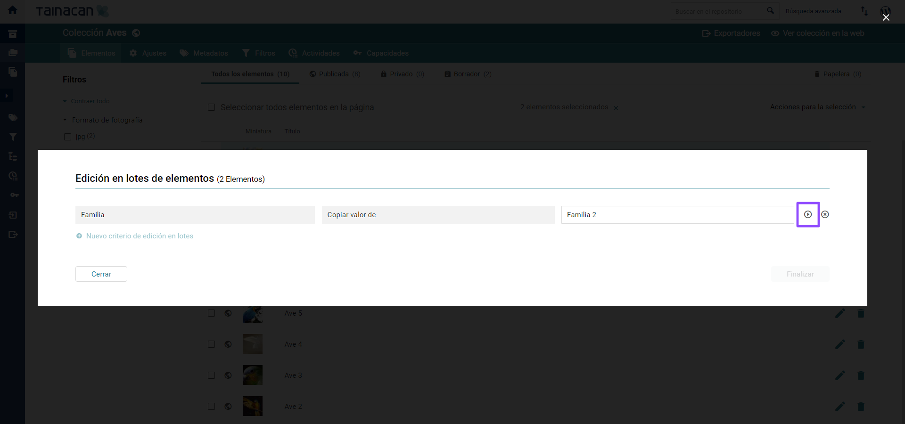

8. Pulsa en `Finalizar` cuando completes las acciones deseadas.

   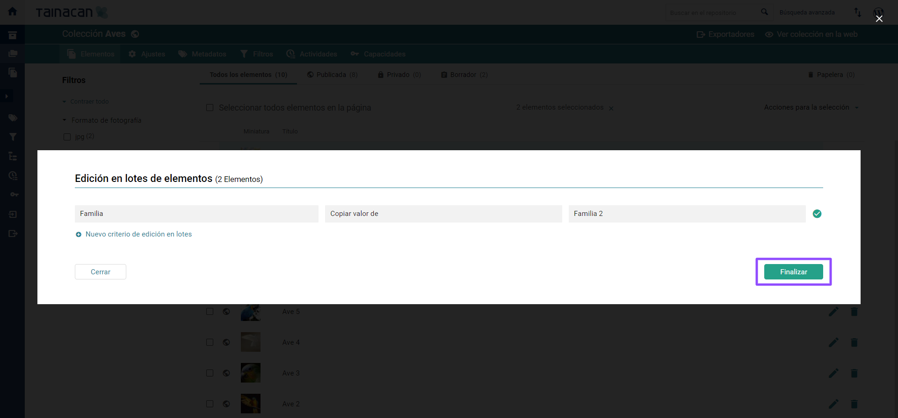

   > **Nota**: Además de los metadatos, en la edición conjunta es posible cambiar las siguientes configuraciones para cada elemento:
   >
   > **“Status”**: ​​Es posible cambiar esta configuración a los valores: “Publicado”, “Privado”, “Borrador” y “Papelera”;
   >
   > **“Permitir comentarios”**: Es posible cambiar esta configuración a los valores: “Abierto” y “Cerrado”

###

---

## Eliminar elementos en lotes

1. Selecciona la “Colección” que contenga los elementos que quieres eliminar.

   

2. Haz clic en el cuadro de selección (situado a la izquierda de las miniaturas de los elementos) de cada uno que desee eliminar, o marca el recuadro `Seleccionar todos los elementos de la página`.

   ● También es posible seleccionar todos los elementos de la colección. Para ello, primero pulsa “Seleccionar todos los elementos de la página” y luego `Seleccionar todos`.

   

3. A la derecha, haz clic en `Acciones para la selección`.

   

4. Elige `Enviar a la papelera` para eliminar los elementos seleccionados.

   ○ Aparecerá una ventana de confirmación, pulsa en `Continuar` para confirmar la operación.

   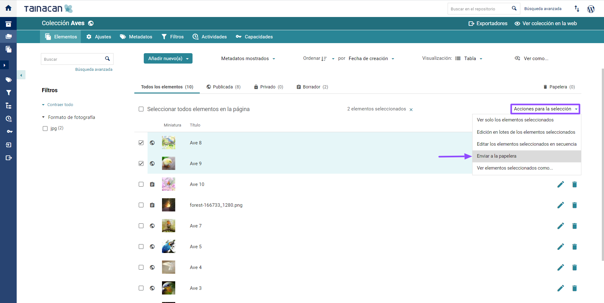

### Eliminar Permanentemente o Recuperar Elementos Conjuntos de la Papelera de Reciclaje

1. Los archivos enviados a una papelera de reciclaje están disponibles en la pestaña `Papelera` de la "Colección".

   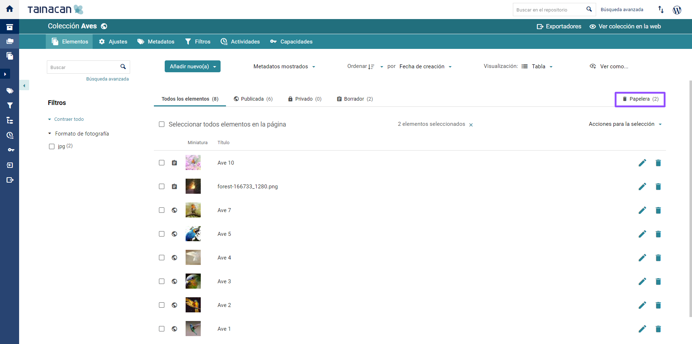

2. Haz clic en el cuadro de selección (situado a la izquierda de las miniaturas de los elementos) de cada uno que quieras eliminar permanentemente o pulsa `Seleccionar todos los ítems en la página`;

   ○ También puedes seleccionar todos los elementos que están en la papelera. Para hacerlo, primero pulsa `Seleccionar todos los elementos de la página` y luego `Seleccionar todos`.

   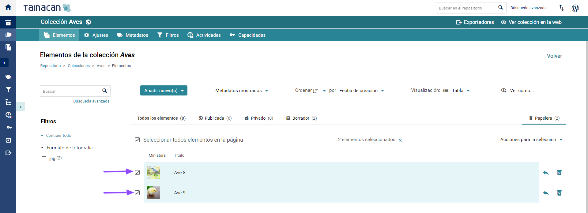

3. A la derecha, pulsa `Acciones para la selección`.

   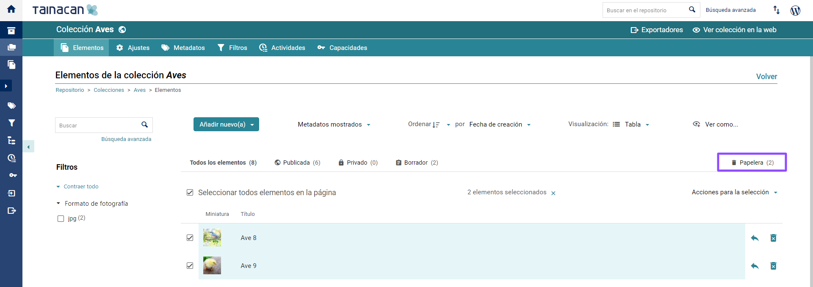

4. Haz clic en `Eliminar permanentemente` para borrar los elementos de forma irreversible.

   !>**Atención**: una vez que un elemento se ha eliminado de forma permanente, no se puede recuperar.

   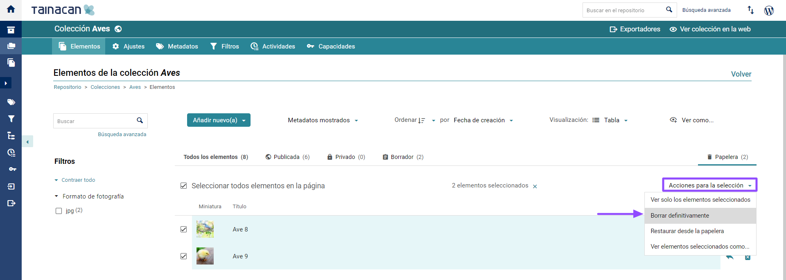

5. Haga clic en `Recuperar del basurero`, para restaurar los elementos seleccionados de una colección.

   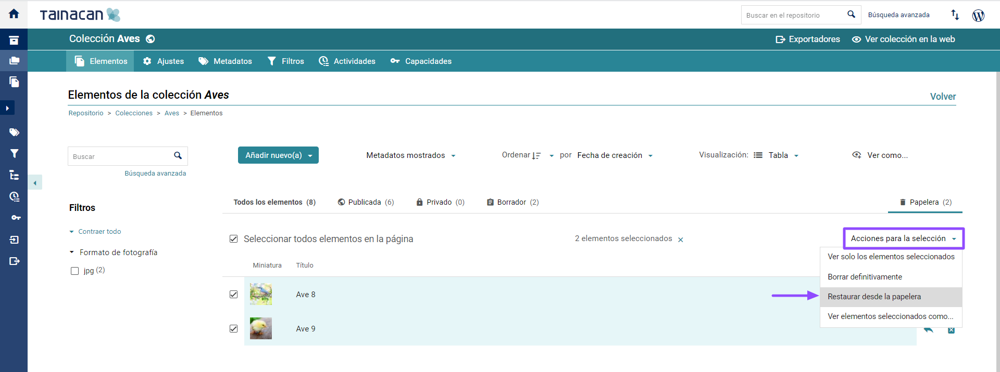

---

## Editar elementos en secuencia

1. Selecciona la “Colección” en la que quieras editar dos elementos.

   

2. Haz clic en el cuadro de selección (situado a la izquierda de las miniaturas de los elementos) de cada uno de los que quieras editar, o pulsa `Seleccionar todos los elementos de la página`.

   ● También puedes seleccionar todos los elementos de la colección. Para hacerlo, primero da clic en `Seleccionar todos los elementos de la página` y, a continuación, en `Seleccionar todo`.

   

3. A la derecha, pulsa `Acciones para la selección`.

   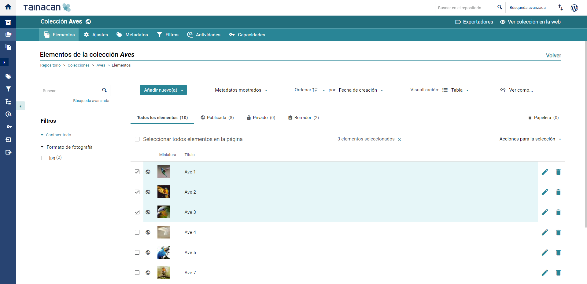

4. Elige `Editar los elementos seleccionados en secuencia`.

   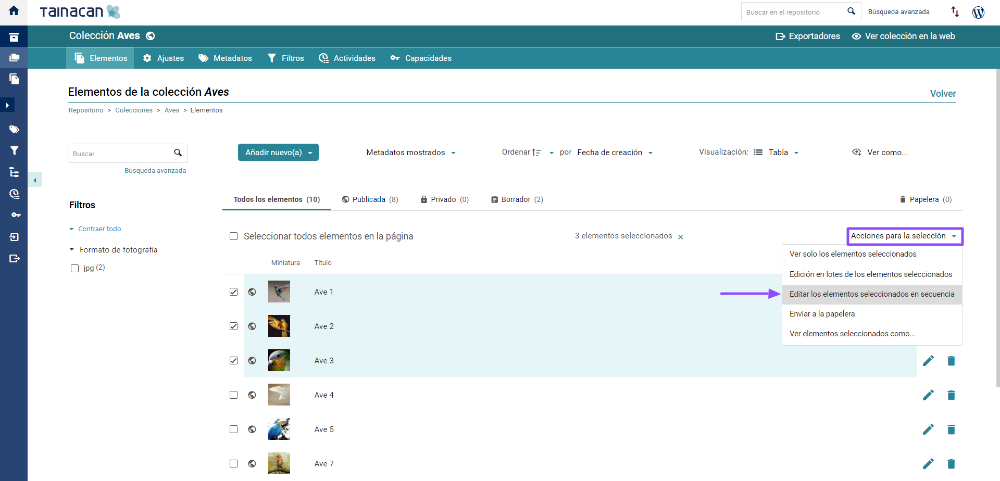

5. Edita los campos que desees.

   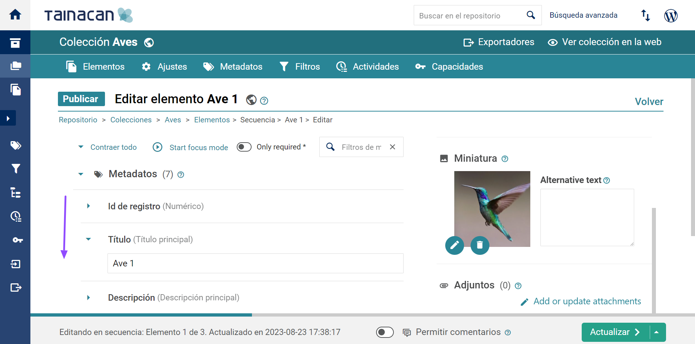

6. En el pie de página se muestra una barra de progreso con la siguiente información:

   ○ "Elemento" actual y total de "elementos";

   ○ Última modificación guardada.

   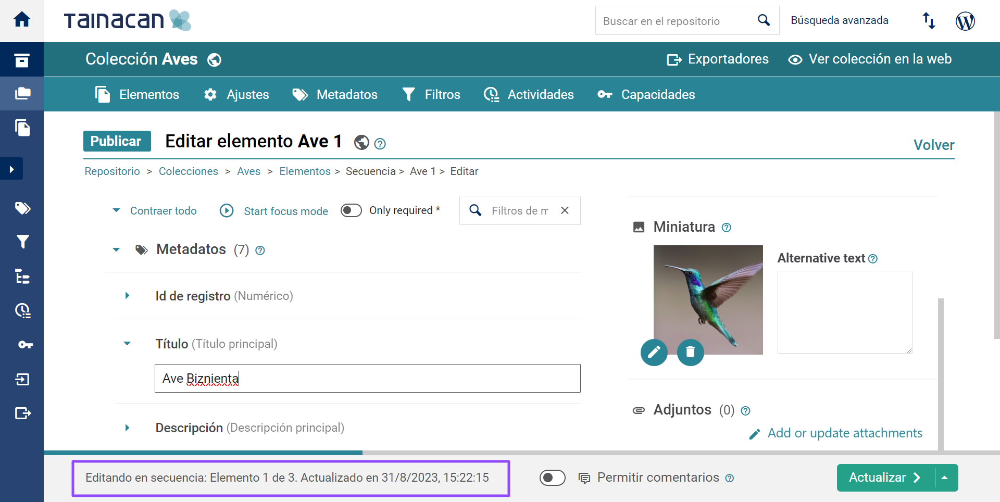

7. Al terminar los cambios en el elemento que se muestra, selecciona:

   ○ **“Actualizar”**: Los cambios realizados en el elemento se guardarán y se mostrará el siguiente elemento para su edición.

   ○ **“Guardar como borrador”**: El elemento cambia su estado a borrador.

   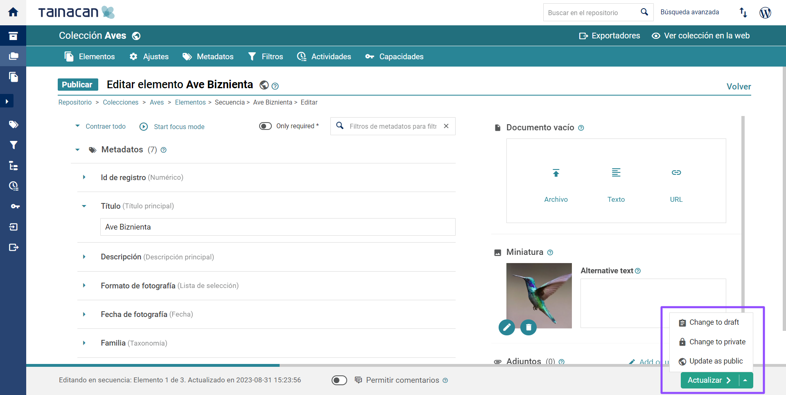

8. Al llegar al último elemento haz clic en `Actualizar` y luego en `Finalizar`.

   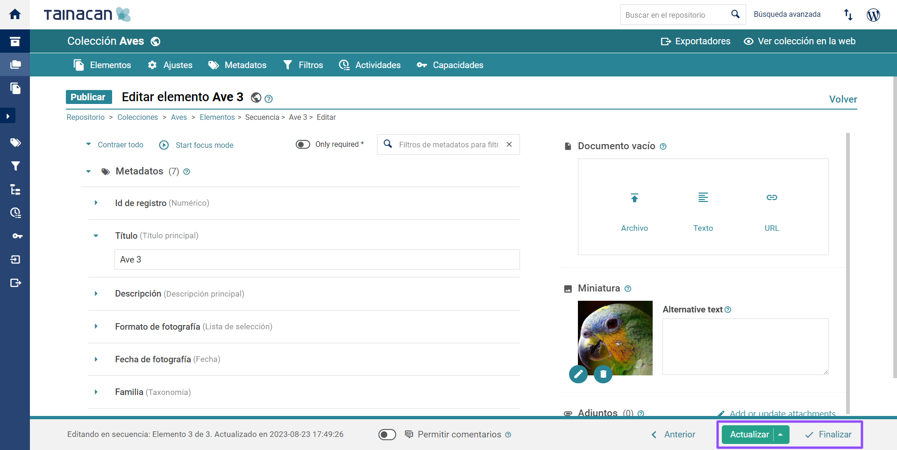

   > Nota: De forma predeterminada, cuando se inicia la edición en secuencia, los metadatos del elemento aparecen colapsados. Para expandirlos y ver los valores de cada uno hay dos maneras: pulsar en `Expandir todo` o en un metadato a la vez.

## Importar elementos

Importa varios elementos con metadatos preconfigurados y valores predefinidos con el [Importador .csv](/es-mx/importers.md#importar-archivo-csv-de-elementos).

---

## Importar Taxonomias

Crea taxonomías con vocabularios controlados y valores jerárquicos utilizando el [Importador de Vocabulario](/es-mx/importers.md#importar-csv-de-vocabularios-taxonomías).
