

	

# Colecciones

Una "colección" es un grupo de "elementos" que comparten un conjunto común de metadatos. Cada elemento subido a tu repositorio digital pertenecerá a una única “colección”.

> Por ejemplo: se puede tener una “colección” de “pinturas” con metadatos como “Título”, “Autor”, “País”, “Técnica”, etc., y otra “colección” de “películas”, con metadatos “Título”, “Director”, “País”, “Duración” y “Género”.

Para cada “colección” puedes configurar un conjunto diferente de metadatos, sin embargo, pueden compartir taxonomías comunes, lo que significa, por ejemplo, que alguien puede buscar elementos de un “País” y obtener resultados de “pinturas” y de “películas” en los resultados.

> Ver la sección [Taxonomías](/es-mx/general-concepts.md#taxonomías) para saber más.

## Crear colecciones

1. Accede al “Panel de control” de WordPress;

   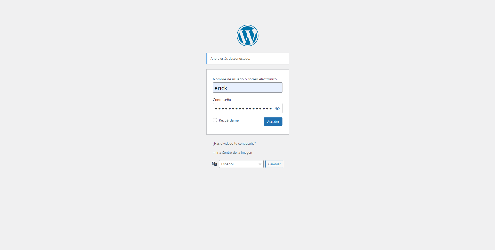

2. En la barra lateral izquierda, haz clic en “Tainacan”;

   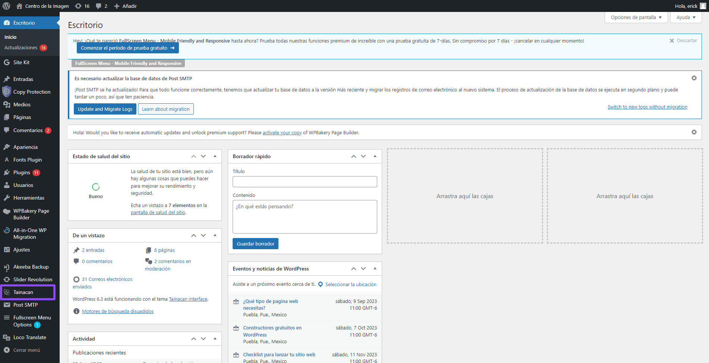

3. Haz clic en "crear colección" en la sección "colecciones".

   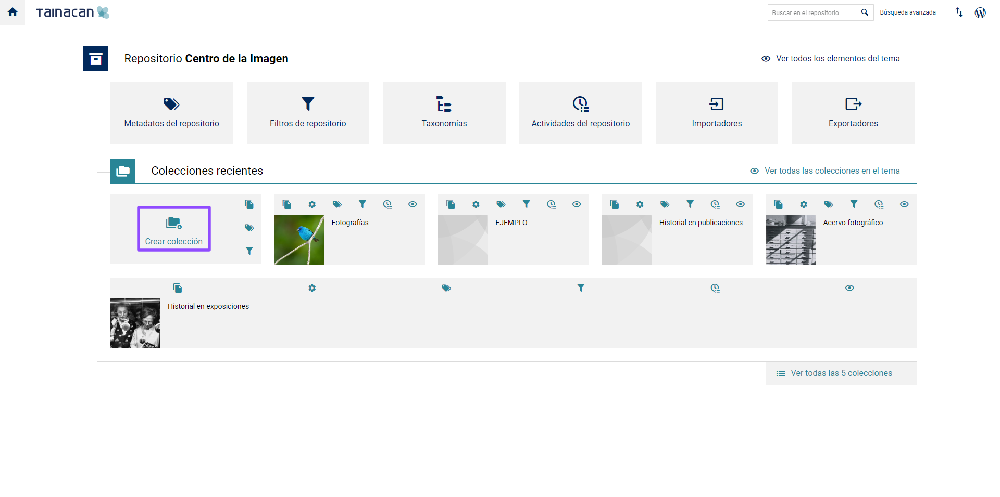

4. Nombra la "colección" en el campo "Nombre”;

   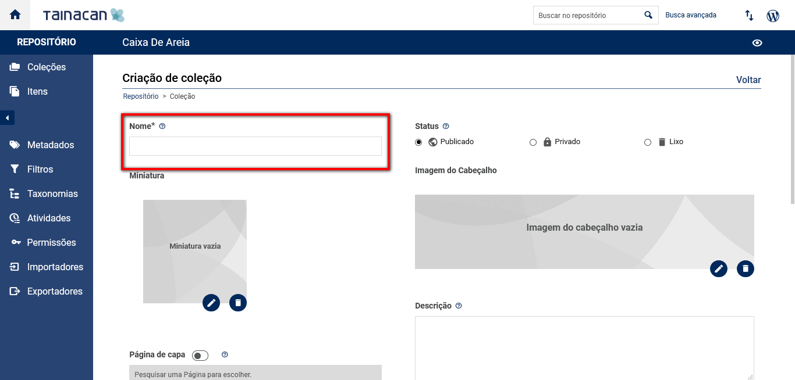

5. Establece el estado de la colección en "publicado", "privado" o "basura". El estado de "colección" define la visibilidad de sus elementos como se indica a continuación:

   ○ **“Publicado”**: las “colecciones” definidas como “publicadas”, pueden ser consultadas por el público con acceso al sitio tan pronto como se crean;

   ○ **“Privado”**: colecciones” con el estado de “privado”, solo pueden ser vistas por quien las creó y por usuarios registrados en tu WordPress que tienen configurado el permiso por defecto. Puedes definir quién puede acceder a tus "colecciones privadas" en "Permisos de usuario";

   ○ **“Basura”**: las “colecciones” en “papelera” serán vistas por los usuarios con permiso de acceso al panel administrativo de Tainacan (por ejemplo: “editores”, “moderadores” y “administradores”). Consulta Permisos de usuario para obtener más información.

   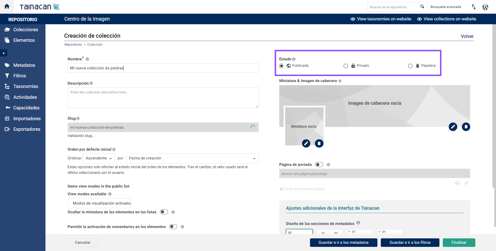

6. Define una “miniatura” y una “imagen de cabecera” con imágenes que representen el contenido que formará parte de esta “colección”:

   ○ La “imagen miniatura” representará la "colección" en diferentes entornos del plugin y del tema del repositorio (igual que una foto de perfil de Facebook);

   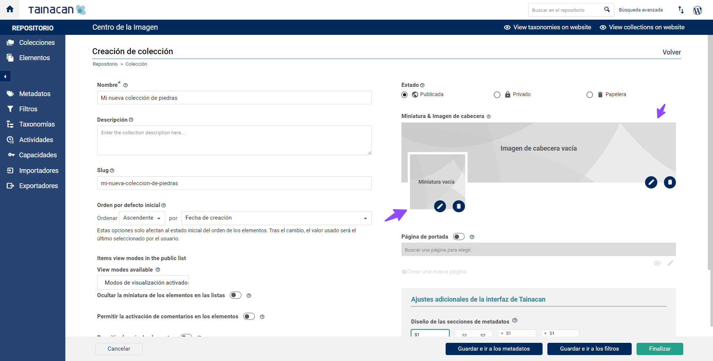

   ○ La “imagen de cabecera”, aparece en la vista "colección", dependiendo de la configuración y el diseño adoptado. El tema Tainacan, por defecto muestra la "imagen de cabecera" en la "página de colección".

   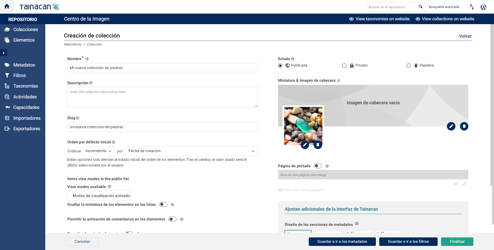

7. Activa la portada y añada la URL específica si está creando un diseño de página personalizado para mostrar su "colección". Esta configuración es opcional;

8. Agrega una descripción del contenido que formará parte de esta “colección”;

   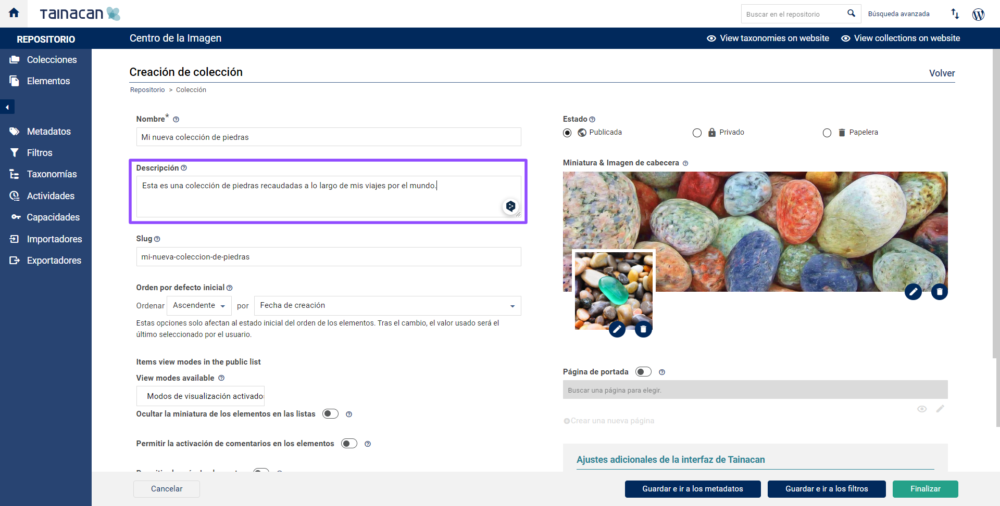

9. Selecciona uno o varios "modos de vista" disponibles en el tema para navegar por la vista "Colección";

   > Nota: Solo los modos seleccionados están disponibles para la "Vista de colección".

   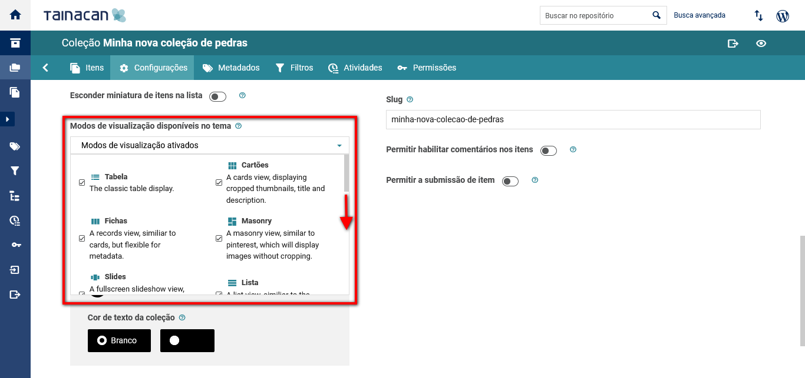

10. Elige un "modo de visualización por defecto" para tu "colección". Puedes seleccionar uno de los modos descritos en el paso 9;

    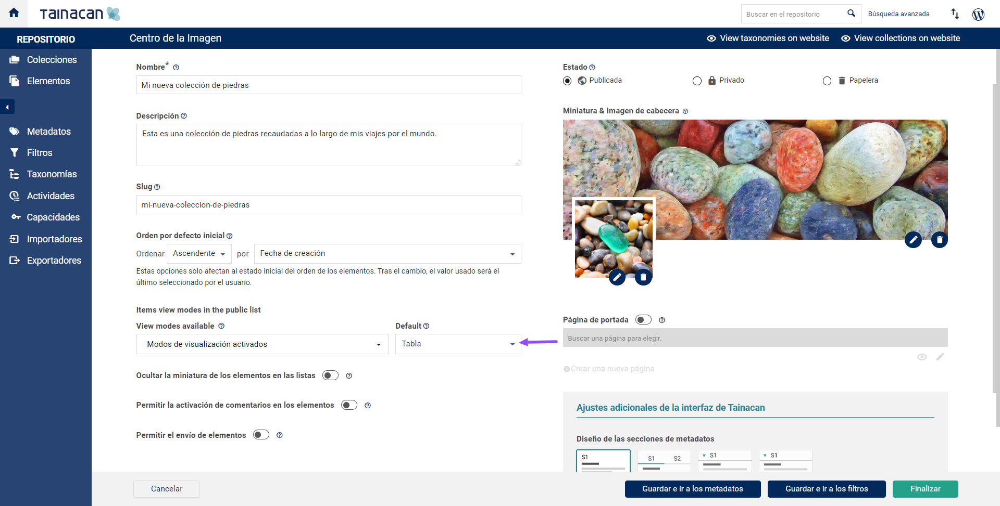

11. Selecciona si deseas "Permitir comentarios" en la "colección". Los comentarios se pueden administrar en la sección de comentarios del panel de control de WordPress. Aprende sobre la gestión de comentarios en la documentación de WordPress;

    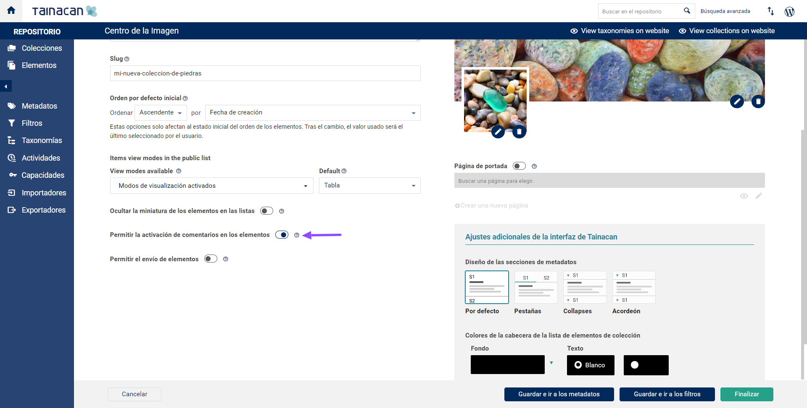

12. El campo “Slug” permite cambiar la URL de esta “colección”. Por defecto se crea a partir del nombre de la “colección”, pero se puede cambiar en este campo;

    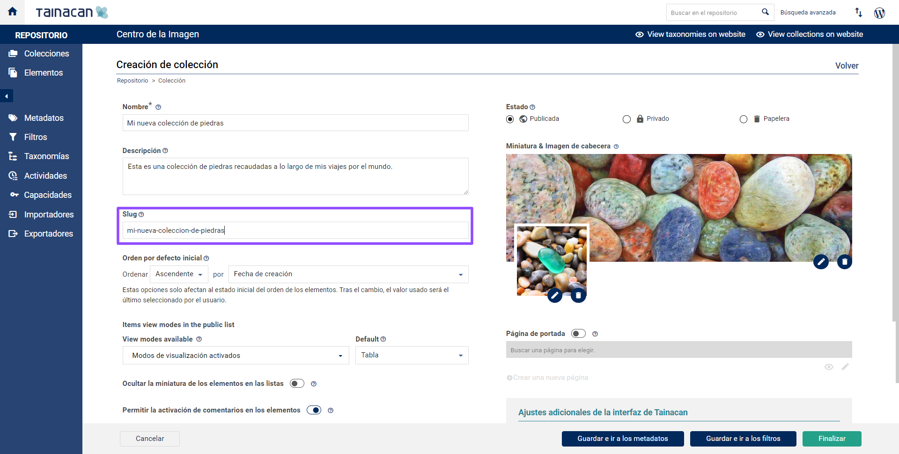

13. Haz clic en “Guardar e ir a Metadatos” para acceder a la configuración de metadatos de esta “colección”. Consulta Metadatos para obtener más información;

    

14. O haz clic en "Guardar e ir a Filtros" para acceder a la configuración de filtros para esta "colección". Consulta Filtros para obtener más información;

    

15. Haz clic en "Finalizar" para terminar de configurar esta nueva "colección".

    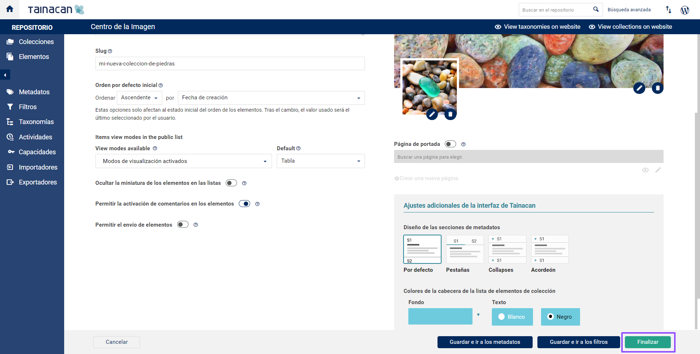

## Editar colecciones

1. Accede al panel de control de _WordPress_;

   

2. En la barra lateral izquierda, haz clic en “Tainacan”;

   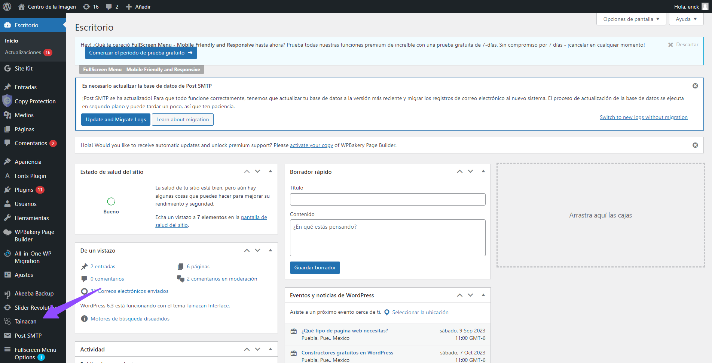

3. Haz clic en "Ver todas las colecciones";

   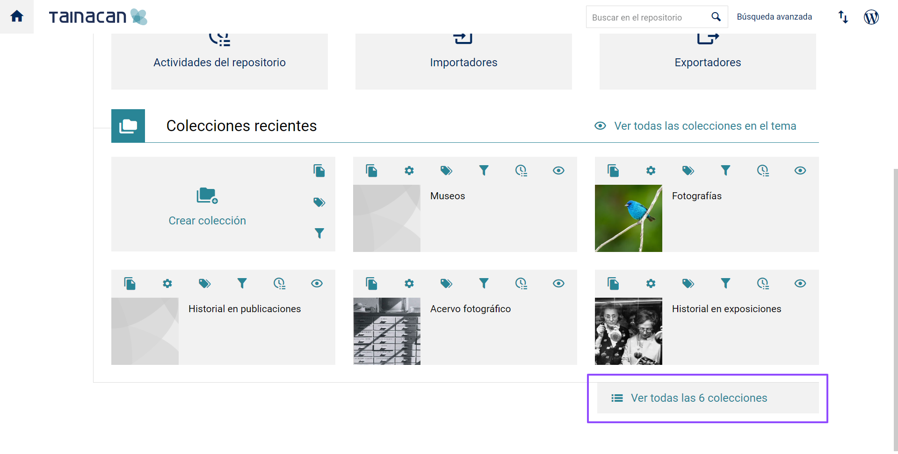

4. En la sección "Colecciones", haz clic en el "ícono de engranaje" a la derecha para editar la "colección" deseada.

   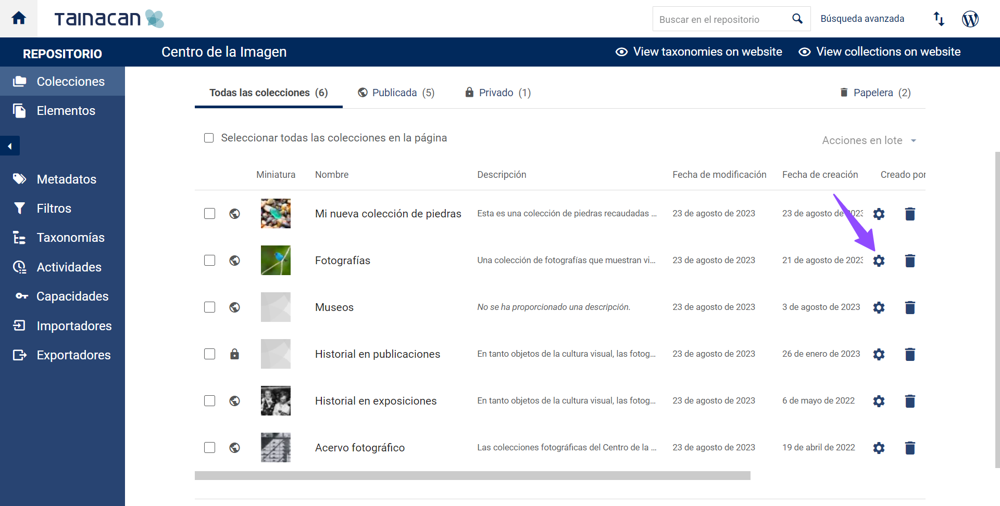

## Eliminar colecciones

1. Accede al panel de control de _WordPress_;

   

2. En la barra lateral izquierda, haz clic en _Tainacan_;

   

3. Haz clic en "Ver todas las colecciones";

   

4. En la lista de colecciones, haz clic en el "icono de papelera" para eliminar la colección deseada;

   

5. Las "colecciones eliminadas" van a la pestaña "Papelera" en "Colecciones".

   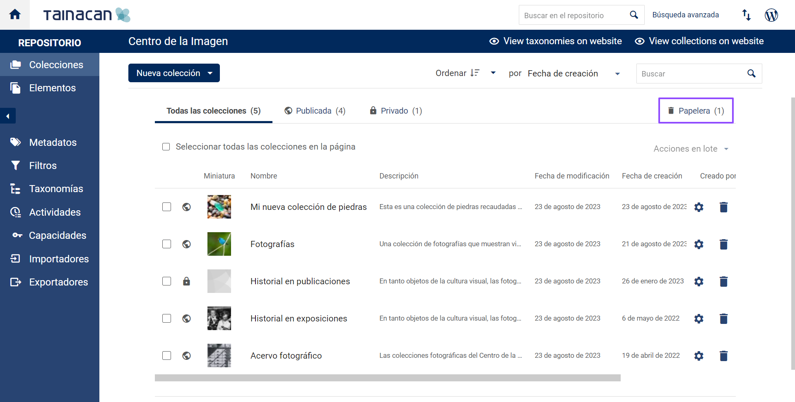

### Eliminar colecciones por lotes

1. Accede al panel de control de _WordPress_;

   

2. En la barra lateral izquierda, haz clic en _Tainacan_;

   

3. Haz clic en "Ver todas las colecciones" para acceder a la lista de "colecciones" en tu repositorio;

   

4. Haz clic en la casilla de verificación (ubicada a la izquierda de las miniaturas de la colección) para elegir las que desees eliminar o haz clic en "Seleccionar todas las colecciones en la página";

   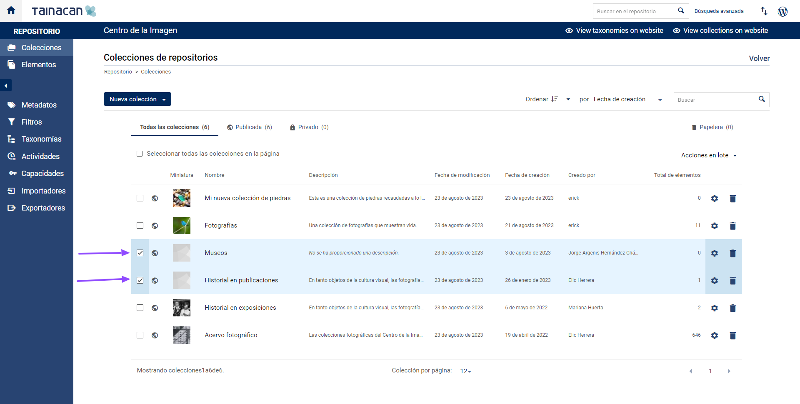

5. Haz clic en "Acciones en lote" y luego haz clic en "Eliminar colecciones seleccionadas"

   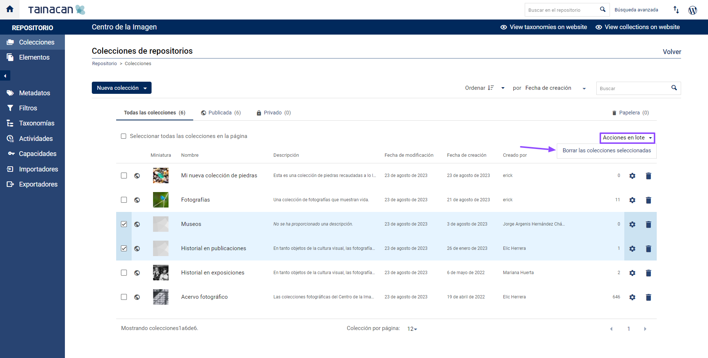

6. Para ver las "colecciones eliminadas" ve a la pestaña "Papelera" en "Colecciones".

   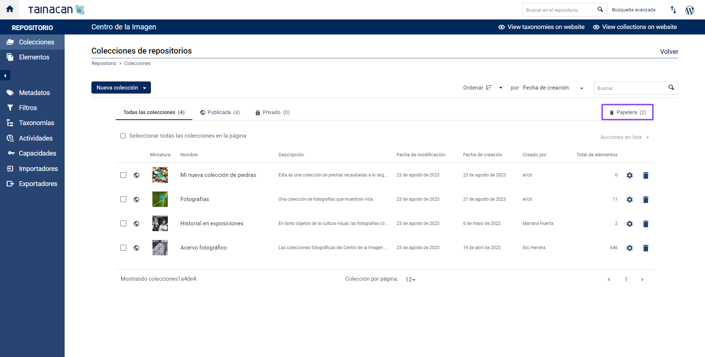

### Recuperar colecciones eliminadas

1. Accede al “panel de control” de WordPress;

   

2. En la barra lateral izquierda, haz clic en “Tainacan”;

   

3. Haz clic en "Ver todas las colecciones" para acceder a la "lista de colecciones" de tu repositorio;

   

4. Para deshacer la eliminación de "colecciones", ve a la pestaña "Papelera";

   

5. En la "lista de colecciones" que se muestra, haz clic en el "ícono de engranaje" a la derecha de la colección deseada;

   

6. Edita la "configuración de la colección" cambiando el estado entre "Publicado" o "Privado" para eliminarlo de la "Papelera":

   ○ **“Publicado”**: El público puede acceder a las "Colecciones" configuradas como "Publicadas" con acceso al sitio tan pronto como se crean;

   ○ **“Privado”**: Las “Colecciones privadas” solo aparecen para su creador y los usuarios registrados de su WordPress, que tienen el conjunto de permisos predeterminado. Puedes definir quién puede acceder a las "colecciones privadas" en Permisos de usuario.

   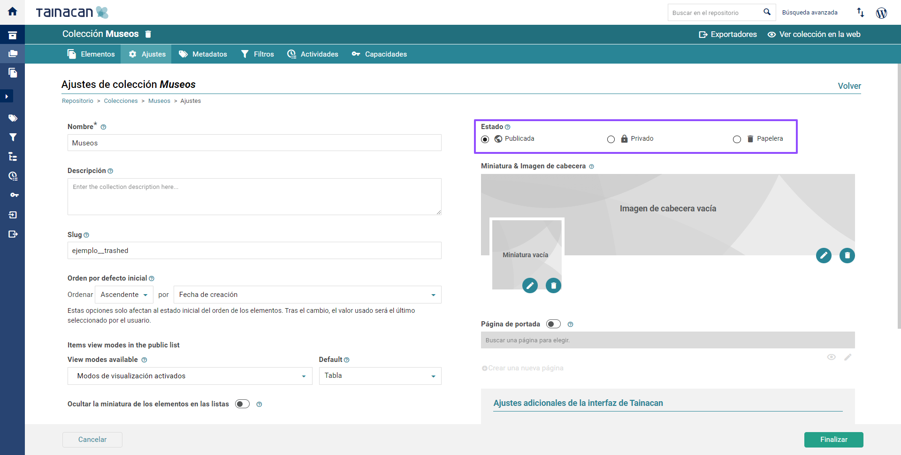

7. Haz clic en "Finalizar" para guardar el cambio.

   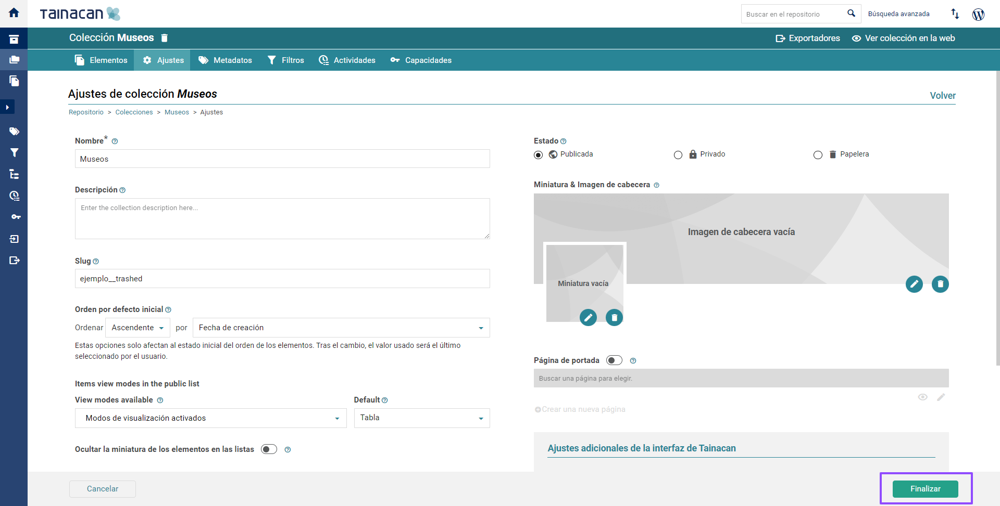

### Eliminar colecciones de forma permanente

1. Accede al “panel de control” de WordPress;

   

2. En la barra lateral izquierda, haz clic en “Tainacan”;

   

3. Haz clic en "Ver todas las colecciones" para acceder a la "lista de colecciones" de tu repositorio;

   

4. Para deshacer la “eliminación de colecciones” accede a la pestaña “Papelera”;

   

5. Haz clic en el "icono de papelera" junto al "icono de engranaje" y luego en "Confirmar para eliminar una colección de forma permanente".

   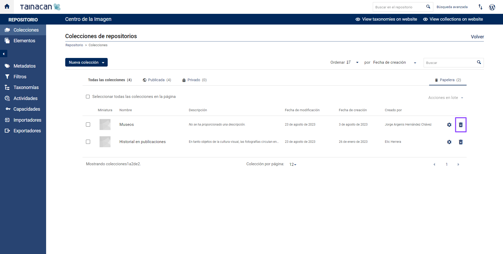
