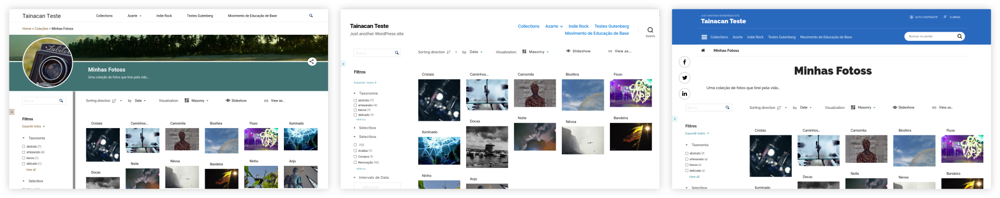
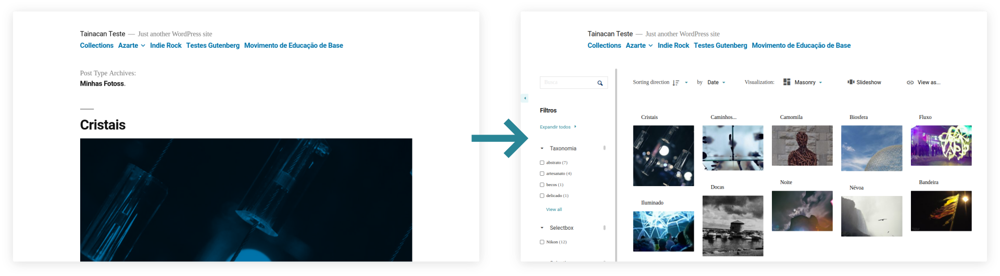

# Creación de temas compatibles

El plugin Tainacan ofrece herramientas para gestionar tu repositorio digital, pero al final, publicarlo en línea es una de las características más importantes a desear. Para evitar _reinventar la rueda_, todo el trabajo de tener menús de navegación, páginas de inicio, etc es manejado por WordPress con su ecosistema de características CMS, plugins y por supuesto, **temas**.

> Los temas son la forma predeterminada que WordPress ofrece para ajustar la apariencia de su sitio web. Pueden mostrar diferentes diseños, fuentes y colores, pero más allá de eso, pueden ofrecer personalizaciones de diferentes tipos.

Considerando eso, el desarrollo del plugin fue hecho _en sincronía_ con la producción de un "tema oficial", planeado para atender a la mayoría de los casos de uso, que es la [Interfaz Tainacan](https://wordpress.org/themes/tainacan-interface/). Sin embargo, si eres un desarrollador y tienes interés en adaptar tu tema para soportar algunas características de Tainacan, eres libre de hacerlo usando las estrategias que se describen en esta sección.



Para darte una idea de lo que es posible, mira este archivo con tres simples líneas añadidas a un _child-theme_ del famoso tema de WordPress [TwentyNineteen](https://wordpress.org/themes/twentynineteen/ ":ignore"):

```php
/** /tainacan/archive-items.php
 *  Implementación personalizada de la lista de artículos de la colección Tainacan
 */
<?php get_header(); ?>
    <?php tainacan_the_faceted_search(); ?>
<?php get_footer(); ?>
```

:

Tenemos un tema hijo de ejemplo hecho para ocuparse de este pequeño ajuste, que puede descargar aquí:

<div style="width: 100%; text-align: center;">
    <a style="margin: 4px; padding: 10px 16px; color: #298596; border: 2px solid #298596; border-radius: 4px;" href="https://github.com/tainacan/tainacan-wiki/raw/master/dev/_assets/some-theme-child.zip">
        Ejemplo de tema hijo
    </a>
</div>

Para utilizarlo, debe renombrar el contenido de sus archivos de acuerdo con su tema padre. Por ejemplo, para hacer el _child-theme_ de WordPress _TwentyNineteen_ antes mencionado, usted debería

1. Renombrar cada "Some Theme" como "Twenty Nineteen";
2. Renombrar cada "some_theme" como "twenty_nineteen";
3. Renombrar cada "some-theme" como "twentynineteen";

El último es el más importante, ya que debe corresponder al _slug_ del tema principal;

Pero hay mucho más que se puede hacer. Así que si usted está interesado en conocer los detalles, aquí está un resumen de cómo usted puede hacer su tema verdaderamente compatible con Tainacan:

- [Creando plantillas personalizadas](/es-mx/dev/custom-templates.md) a una de las [páginas de Tainacan](/es-mx/tainacan-pages.md);
- [Adaptación del componente Vue Items List](/es-mx/dev/the-vue-items-list-component.md);
- [Registrando Modos de Vista Extra personalizados](/es-mx/dev/extra-view-modes.md);
- [Añadir soporte al último Editor de Bloques](/es-mx/dev/theme-gutenberg-support.md) - Características Gutenberg;
