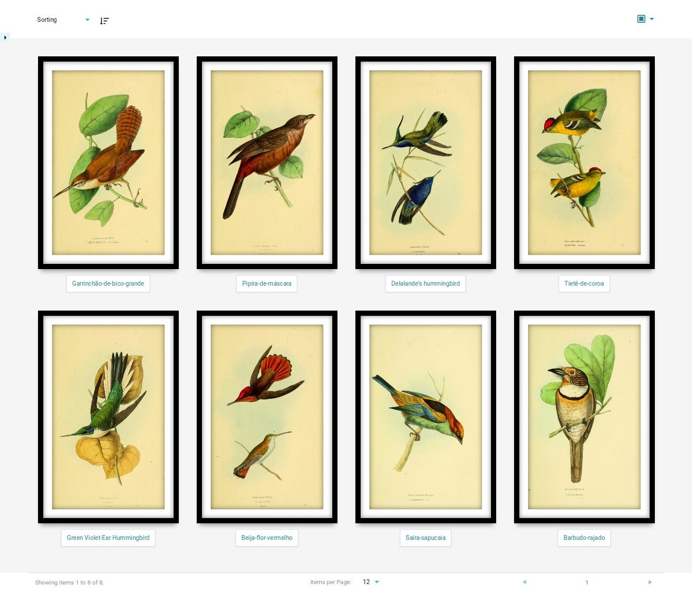

# Modos de vista extra

Los Modos de Vista Extra son una forma de crear sus propias plantillas para la visualización de listas de elementos. Por defecto, Tainacan ofrece los siguientes modos de vista:

- Tabla
- Fichas
- Registros
- Masonry
- Miniaturas (registradas por el tema Tainacan Interface)
- Presentación
- Listas

Cada uno tiene sus especificaciones, pero en caso de que no esté satisfecho con ellos, un desarrollador puede crear fácilmente un plugin para ofrecer una plantilla personalizada para mostrar la lista de elementos.

## Creación de un modo de vista adicional

Como se muestra en [nuestro post para modos de vista extra](http://tainacan.org/2018/06/13/custom-view-modes-how-will-the-world-see-your-collection/), hemos creado [un plugin de muestra](https://wordpress.org/plugins/tainacan-extra-view-modes/) con algunas ideas inspiradoras para modos de vista personalizados, como éste:



Aquí describimos el proceso para crear un plugin de este tipo. Existen dos estrategias:

1. Usar una [plantilla PHP](#estrategia-de-plantillas) para crear la lista de elementos;
2. Uso de un [componente Vue.js](#estrategia-de-componentes) para visualizar la lista de elementos;

El último es más complejo, pero también te da más opciones de personalización e interacción.

!> El siguiente contenido puede entenderse mejor utilizando el código fuente de dos **proyectos de ejemplo que hemos puesto a su disposición [aquí](https://github.com/tainacan/tainacan-extra-view-mode-sample ":ignore")**.

### Estrategia de plantillas

Para registrarse a través de una plantilla, necesitará tres archivos:

1. El archivo _.php_ para registrar el plugin y el modo de visualización;
2. El archivo _.php_ con la plantilla de lista de elementos;
3. El archivo _.css_ con el estilo de la plantilla;

#### Registrando tu plugin

Como en cualquier plugin de WordPress, primero tendrá que crear una cabecera php como se indica a continuación:

```php
<?php
/*
Plugin Name: Tainacan Extra View Mode Demo Template
Plugin URI: https://tainacan.org/
Description: Adds one extra viewmode to be used by your theme
Author: your-name-here
Version: 0.0.1
Text Domain: tainacan-extra-viewmode-demo-template
License: GPLv2 or later
License URI: http://www.gnu.org/licenses/gpl-3.0.html
*/

/** Plugin version */
const TAINACAN_EXTRA_VIEWMODE_DEMO_TEMPLATE_PLUGIN_VERSION = '0.0.1';
```

Sólo el nombre del plugin es obligatorio. Guarde el archivo con un nombre único para su plugin (una buena práctica es utilizar el nombre del plugin, por ejemplo `name-of-your-extra-view-mode-plugin.php`).

El resto del archivo contendrá la función de registro para su modo de vista. Lo discutiremos en detalle más adelante:

```php

/**
 * Aquí registramos los nuevos modos de vista usando el plugin Tainacan
 * función 'tainacan_register_view_mode'. Comprobar si existe también
 * es una forma de asegurarnos de que el propio Tainacan está activo.
 */
add_action( 'after_setup_theme', 'tainacan_extra_viewmode_template_demo_register_templates' );
function tainacan_extra_viewmode_template_demo_register_templates() {

	if ( function_exists( 'tainacan_register_view_mode' ) ) {

		// Registro de los modos de visualización
		tainacan_register_view_mode('demo-1', [
			'label' 			=> 'Demo 1',
			'description' 		=> __('A boring template demo view mode.', 'tainacan-extra-viewmode-template-demo'),
			'icon' 				=> '<span class="icon"><i><svg fill="var(--tainacan-info-color, #555758)" xmlns="http://www.w3.org/2000/svg" height="24" width="24" viewBox="0 0 46 46"><path d="..."/></svg></i></span>',
			'dynamic_metadata' 	=> false,
			'template' 			=> __DIR__ . '/templates/view-mode-demo-1.php',

		]);
	}
};

/**
 * Los modos de vista de plantilla tienen su estilo separado del archivo php
 * así que los ponemos en cola aquí.
 */
add_action( 'wp_print_scripts', 'tainacan_extra_viewmode_template_demo_enqueue_styles' );
function tainacan_extra_viewmode_template_demo_enqueue_styles() {

	// Enqueue template view mode styles
	$baseurl =  plugins_url('', __FILE__);
	wp_enqueue_style( 'tainacan-extra-viewmodes-view-mode-demo-1', $baseurl . '/css/_view-mode-demo-1.css', [], TAINACAN_EXTRA_VIEWMODE_DEMO_TEMPLATE_PLUGIN_VERSION );
};

?>

?> /* End of file */
```

La función `tainacan_register_view_mode` es parte del plugin de Tainacan. Su primer parámetro es un _slug_ único que se utilizará para identificar tu modo de vista. Luego sigue un array de parámetros:

| Tipo   | Nombre                | Descripción                                                                                                                                                                               | Por defecto                                     |
| ------ | ------------------- | ----------------------------------------------------------------------------------------------------------------------------------------------------------------------------------------- | ------------------------------------------- |
| string | etiqueta               | Etiqueta, visible para los usuarios en el desplegable de modos de vista.                                                                                                                                       | Igual que la variable `$slug`                |
| string | icono                | HTML que muestra un icono que representa el modo de vista. Visible para los usuarios en el desplegable de modos de vista.                                                                                         | Ninguno                                        |
| string | descripción         | Descripción, visible sólo para los editores en el admin.                                                                                                                                        | Ninguno                                        |
| string | tipo                | Tipo. Los valores aceptados son "plantilla" o "componente"..                                                                                                                                      | _template_                                  |
| string | plantilla            | Ruta completa al archivo de plantilla a utilizar. Obligatorio si $type es plantilla.                                                                                                          | _theme-path/tainacan/view-mode-`$slug`.php_ |
| string | componente           | Nombre de la etiqueta del componente. El componente web js debe estar incluido y debe aceptar dos props: 1) elementos: la lista de elementos que se van a mostrar; 2) metadatos mostrados: lista de metadatos que se van a mostrar; | _view-mode-`$slug`_                         |
| string | miniatura           | URL completa de una miniatura que representa el modo de vista. Sólo se muestra en Admin.                                                                                                           | Ninguno                                        |
| string | plantilla_estructura   | HTML que muestra una vista previa de los elementos que se van a cargar, como bloques grises que imitan la forma de los elementos.                                                                             | Ninguno                                        |
| bool   | mostrar_paginación     | Mostrar o no los controles de paginación.                                                                                                                                            | `true`                                      |
| bool   | pantalla_completa         | Si el modo de visualización será a pantalla completa o no.                                                                                                                                    | `false`                                     |
| bool   | metadato_dinamico    | Mostrar o no (y utilizar o no) el selector "metadatos mostrados"..                                                                                                             | `false`                                     |
| bool   | estructuras_implementados | Whether the view modes take care of showing it's own Skeleton/Ghost css classes for loading items.                                                                                        | `false`                                     |

El parámetro `type` es uno de los más relevantes aquí. Cuando se pasa una plantilla, se debe proporcionar la ruta del archivo.

<div style="float: right; margin-left: 1rem;">
	
</div>

Los modos de vista como Cards y Grid no permiten a los usuarios elegir qué metadatos deben mostrarse, sino que deciden que sólo algunos sean visibles. Para este tipo de modo de vista, se utiliza el parámetro `dynamic_metadata` como `false`.

Por defecto, se muestra una animación de carga con un círculo giratorio cuando se obtienen los elementos. La mayoría de nuestros modos de vista oficiales anulan esto implementando una llamada lista esqueleto/fantasma, que imita una lista de bloques grises con la forma de los elementos antes de que lleguen. Si tu modo de vista hace eso, debes establecer `implements_skeleton` a true y proporcionar una plantilla HTML con dicha estructura a `skeleton_template`. Tainacan se encargará de renderizar este esqueleto mientras se cargan los elementos.

### Creación de una plantilla de modo de vista adicional

La ruta de archivo indicada en el registro anterior debe apuntar al archivo .php donde vive su plantilla. Probablemente tendrá una estructura similar a la del siguiente ejemplo:

```php
<?php if (have_posts()):  ?>

    <div class="tainacan-demo-1-container">

        <?php while (have_posts()): the_post(); ?>

                <div class="tainacan-demo-1">
                    <a href="<?php the_permalink(); ?>">
                        <?php if ( has_post_thumbnail() ): ?>
                            <?php the_post_thumbnail('tainacan-medium-full'); ?>
                        <?php else: ?>
                            <?php echo ''?>
                        <?php endif; ?>
                    </a>
                    <a href="<?php the_permalink(); ?>">
                        <p class="metadata-title"><?php the_title(); ?></p>
                    </a>
                </div>

        <?php endwhile; ?>

    </div>

<?php else: ?>
    <div class="tainacan-demo-1-container">
        <section class="section">
            <div class="content has-text-gray4 has-text-centered">
                <p>
                    <span class="icon is-large">
                        <i class="tainacan-icon tainacan-icon-48px tainacan-icon-items"></i>
                    </span>
                </p>
                <p><?php echo__('No item found', 'tainacan-extra-viewmode-template-demo') ?></p>
            </div>
        </section>
    </div>
<?php endif; ?>
```

Las clases `tainacan-demo-1-container` y `tainacan-demo-1`, y así sucesivamente deben ser implementadas por usted en su archivo de estilo. Otras clases como `skeleton`, `section` son parte del plugin CSS de Tainacan, y pueden ser usadas si deseas mantener un estándar.

La miniatura se obtiene a través de la función `the_post_thumbnail()`, que acepta como primer parámetro cualquiera de los siguientes:

- `tainacan-small` (40px width, 40px height, cropped);
- `tainacan-medium` (275px width, 275 height, cropped);
- `tainacan-medium-full`, (max. 205px width, max. 1500px height, not cropped );

También estamos cargando una imagen _placeholder_, almacenada dentro de la carpeta del plugin, para mostrarla en caso de que no haya una miniatura para ese elemento.

Puede ver que este modo de vista sólo utiliza el metadato Título. Si quieres mostrar el resto de metadatos, puedes usar la función de ayuda `tainacan_the_metadata()`.

### Estrategia de componentes

La estrategia del componente requiere al menos dos archivos:

1. El archivo _.php_ para registrar el plugin, el modo de vista y el componente;
2. El archivo _.js_ con la definición y el registro del componente _vuejs_;

Pero, debido a las ventajas de tener un archivo separado para el componente vue que tendría que ser incluido en javascript puro, a menudo nos enfrentamos a la siguiente configuración:

1. El archivo _.php_ para registrar el plugin, el modo de vista y el componente;
2. El archivo fuente _.js_ con el registro del componente;
3. El archivo _.bundle.js_ bundled con el registro del componente;
4. El archivo fuente _.vue_, con la plantilla de lista y cualquier lógica o estilo;
5. El archivo _.css_, con el estilo del componente en caso de no usarlo dentro del archivo vue;
6. El archivo _.package.json_ para manejar dependencias y librerías npm de terceros;
7. El archivo _.webpack.config.js_ para definir la estrategia de bundle.

Vayamos paso a paso:

```php
<?php
/*
Plugin Name: Tainacan Extra View Mode Component Demo
Plugin URI: https://tainacan.org/new
Description: Add one extra viewmode to be used by your theme
Author: your-name-here
Version: 0.0.1
Text Domain: tainacan-extra-viewmode-component-demo
License: GPLv2 or later
License URI: http://www.gnu.org/licenses/gpl-3.0.html
*/

/** Plugin version */
const TAINACAN_EXTRA_VIEWMODES_COMPONENT_DEMO_PLUGIN_VERSION = '0.0.1';

/**
 * Modos de vista que están hechos de componentes Vuejs en lugar de php
 * las plantillas tienen que registrarse primero en el plugin
 */
add_action("tainacan-register-vuejs-component", "tainacan_extra_viewmode_component_demo_register_components");
function tainacan_extra_viewmode_component_demo_register_components($helper) {

    if ( function_exists( 'tainacan_register_view_mode' ) ) {

		// Coloca en cola las bibliotecas de terceros o modificadas necesarias para este modo de vista.
		$baseurl =  plugin_dir_url(__FILE__);

        // Registro del componente Vue
        $handle = 'tainacan-demo-2-viewmode';
        $component_script_url = $baseurl . 'components/demo-2-view-mode.bundle.js';
		$helper->register_vuejs_component($handle, $component_script_url, [ 'public' => true, 'deps' => ['wp-i18n'] ], null, true);

		// Registrar el modo de visualización
        tainacan_register_view_mode('demo-2', [
            'label' 				=> 'Demo 2',
			'description' 			=> __('Un aburrido modo de vista de demostración de componentes.', 'tainacan-extra-viewmode-component-demo'),
			'icon' 					=> '<span class="icon"><i><svg fill="var(--tainacan-info-color, #555758)" xmlns="http://www.w3.org/2000/svg" height="24" width="24"><path d="..."/></svg></i></span>',
            'type' 					=> 'component',
			'component' 			=> 'view-mode-demo-2',
			'dynamic_metadata' 		=> true,
			'implements_skeleton' 	=> true
        ]);
    }
}

/**
 * Los modos de vista de plantilla tienen su estilo separado del archivo php
 * así que los ponemos en cola aquí.
 */
add_action( 'wp_print_scripts', 'tainacan_extra_viewmode_component_demo_enqueue_styles' );
function tainacan_extra_viewmode_component_demo_enqueue_styles() {

	// Poner en cola los estilos del modo de vista de plantilla
	$baseurl =  plugins_url('', __FILE__);
	wp_enqueue_style( 'tainacan-extra-viewmodes-view-mode-demo-2', $baseurl . '/css/_view-mode-demo-2.css', [], TAINACAN_EXTRA_VIEWMODES_COMPONENT_DEMO_PLUGIN_VERSION );

};

?>
```

La función de registro es un poco más complicada. Aquí necesitamos hacer referencia al _.js_ empaquetado usando `register_vuejs_component`. Esta función es una envoltura del `wp_enqueue_script()` que está dentro del plugin Tainacan. Por eso también puede pasar dependencias como el paquete `wp-i18n`, que nos dará acceso a las funciones de traducción de WordPress en el lado del cliente.

El nombre de la etiqueta de nuestro componente se pasa a las opciones `'component'` de la función register, y también pasamos `'type' => 'component'`. Ahora, si estás familiarizado con los componentes vue js, sabrás que necesitan ser registrados en la instancia `Vue`, que en este caso es declarada por el propio plugin Tainacan. ¿Cómo funciona esto? Miremos dentro del archivo principal `.js`, que en nuestro código se llama `demo-2-view-mode.js`:

```js
import ViewModeDemo2 from "./demo-2-view-mode.vue";

window.tainacan_extra_components =
  typeof window.tainacan_extra_components != "undefined"
    ? window.tainacan_extra_components
    : {};
window.tainacan_extra_components["view-mode-demo-2"] = ViewModeDemo2;
```

Este simple archivo está accediendo al `window.tainacan_extra_components` y diciendo cual es el código para el componente de modo de vista de la etiqueta `view-mode-demo-2`, de modo que la instancia `Vue` dentro del plugin Tainacan pueda acceder y registrarlo en el lado del cliente también.

!>DEBES mantener el nombre `window.tainacan_extra_components`, ya que es el que usa el plugin para cargar componentes personalizados, y ten cuidado de no anularlo completamente. Otros plugins pueden haber registrado sus componentes allí también.

El componente en sí es importado desde el archivo `.vue`, que mostramos a continuación:

```vue
<template>
  <div class="demo-2-view-mode grid-demo-2">
    <!-- Empty result placeholder -->
    <section v-if="!isLoading && items.length <= 0" class="section">
      <div class="content has-text-gray4 has-text-centered">
        <p>
          <span class="icon is-large">
            <i class="tainacan-icon tainacan-icon-36px tainacan-icon-items" />
          </span>
        </p>
        <p>
          {{ __("No se encontró ningún elemento", "tainacan-extra-viewmode-component-demo") }}
        </p>
      </div>
    </section>

    <!-- SKELETON LOADING -->
    <ul v-if="isLoading" class="grid tainacan-masonry-container">
      <li
        :key="item"
        v-for="item in 12"
        :style="{ 'min-height': randomHeightForMasonryItem() + 'px' }"
        class="skeleton tainacan-masonry-item"
      />
    </ul>

    <ul v-if="!isLoading && items.length > 0" class="grid">
      <li v-for="(item, index) of items" :key="index">
        <a target="_blank" :href="getItemLink(item.url, index)">
          <figure>
            
            <figcaption>
              <h3>
                <span
                  v-for="(column, metadatumIndex) in displayedMetadata"
                  :key="metadatumIndex"
                  v-if="
                    column.display &&
                    column.metadata_type_object != undefined &&
                    column.metadata_type_object.related_mapped_prop == 'title'
                  "
                  v-html="
                    item.metadata != undefined && collectionId
                      ? renderMetadata(item.metadata, column)
                      : item.title
                      ? item.title
                      : `<span class='has-text-gray3 is-italic'>` +
                        $i18n.get('label_value_not_provided') +
                        `</span>`
                  "
                />
              </h3>
              <a
                v-if="isSlideshowViewModeEnabled"
                @click.prevent="starSlideshowFromHere(index)"
              >
                <span class="icon slideshow-icon">
                  <i
                    class="tainacan-icon tainacan-icon-1-125em tainacan-icon-viewgallery"
                  />
                </span>
              </a>
            </figcaption>
          </figure>
        </a>
      </li>
    </ul>
  </div>
</template>

<script>
import qs from "qs";

export default {
  name: "ViewModeDemo2",
  data() {
    return {
      thumbPlaceholderPath:
        tainacan_plugin.base_url + "/assets/images/placeholder_square.png",
      isSlideshowViewModeEnabled: false,
    };
  },
  props: {
    collectionId: Number,
    displayedMetadata: Array,
    items: {
      type: Array,
      default: () => [],
      required: true,
    },
    isLoading: false,
    totalItems: Number,
    isFiltersMenuCompressed: Boolean,
    enabledViewModes: Array,
  },
  computed: {
    __() {
      return wp.i18n ? wp.i18n.__ : (str, ctx) => str;
    },
    queries() {
      let currentQueries = JSON.parse(JSON.stringify(this.$route.query));
      if (currentQueries) {
        delete currentQueries["view_mode"];
        delete currentQueries["fetch_only"];
        delete currentQueries["fetch_only_meta"];
      }
      return currentQueries;
    },
  },
  mounted() {
    console.log(this.items);
    this.isSlideshowViewModeEnabled =
      this.enabledViewModes.findIndex((viewMode) => viewMode == "slideshow") >=
      0;
  },
  methods: {
    getItemLink(itemUrl, index) {
      if (this.queries) {
        // Inserta la información necesaria para la navegación artículo por artículo en páginas individuales
        this.queries["pos"] =
          (this.queries["paged"] - 1) * this.queries["perpage"] + index;
        this.queries["source_list"] = this.$root.termId
          ? "term"
          : !this.$root.collectionId || this.$root.collectionId == "default"
          ? "repository"
          : "collection";
        this.queries["ref"] = this.$route.path;
        return itemUrl + "?" + qs.stringify(this.queries);
      }
      return itemUrl;
    },
    renderMetadata(itemMetadata, metadatum) {
      let metadata =
        itemMetadata && itemMetadata[metadatum.slug] != undefined
          ? itemMetadata[metadatum.slug]
          : false;

      if (!metadata) return "";
      else return metadata.value_as_html;
    },
    randomHeightForMasonryItem() {
      let min = 120;
      let max = 380;

      return Math.floor(Math.random() * (max - min + 1) + min);
    },
    starSlideshowFromHere(index) {
      this.$router
        .replace({
          query: { ...this.$route.query, ...{ "slideshow-from": index } },
        })
        .catch((error) => this.$console.log(error));
    },
  },
};
</script>
```

Observa que este componente maneja muchas más características que la versión de plantilla del modo de vista. Aquí accedemos a props como `displayedMetadata`, `isLoading`, `isFiltersMenuCompressed`, etc... Pero lo más importante sigue siendo el array `items`, que ya encontraremos la forma de renderizar y posteriormente estilizar con css.

Por último, tenemos que empaquetar el _.js_ principal. Para ello, tenemos dos archivos importantes. Primero, el _package.json_, que contiene nuestras dependencias y define el comando build:

```json
{
  "name": "tainacan-extra-viewmode-component-demo",
  "version": "0.0.1",
  "description": "",
  "scripts": {
    "build": "npx webpack demo-2-view-mode.js"
  },
  "author": "",
  "license": "ISC",
  "dependencies": {
    "qs": "^6.9.6"
  },
  "devDependencies": {
    "@babel/core": "^7.8.4",
    "babel-loader": "^8.0.6",
    "vue-loader": "^15.9.0",
    "vue-template-compiler": "^2.6.11",
    "webpack": "^4.44.2",
    "webpack-cli": "^3.3.12",
    "webpack-dev-server": "^3.10.3"
  }
}
```

Dependiendo de tu modo de vista, querrás más paquetes npm de terceros que pueden ser listados aquí, e instalados vía `npm install`. Observa que estamos definiendo el script de compilación y pasando el archivo principal `.js` allí.

Por último, usamos webpack para configurar nuestros cargadores y compiladores:

```js
let path = require("path");
let webpack = require("webpack");
const VueLoaderPlugin = require("vue-loader/lib/plugin");

module.exports = {
  output: {
    path: path.resolve(__dirname, ""),
    filename: "demo-2-view-mode.bundle.js",
  },
  module: {
    rules: [
      {
        test: /\.vue$/,
        loader: "vue-loader",
      },
      {
        test: /\.js$/,
        loader: "babel-loader",
      },
    ],
  },
  node: {
    fs: "empty",
  },
  plugins: [new VueLoaderPlugin()],
};
```

Aquí se define el nombre del archivo empaquetado, que es llamado en nuestro archivo de registro _.php_.

En nuestro repositorio de ejemplo, también tenemos un script `build.sh`, que se encarga de llamar al proceso de instalación y construcción, además de mover los archivos necesarios a tu directorio de plugins si lo deseas. Échale un vistazo para saber más ;)

## Conclusión

Hay muchas cosas que puede hacer para mejorar la visualización de su lista de artículos. Esperemos que nuestros [archivos de ejemplo](https://github.com/tainacan/tainacan-extra-view-mode-samples ":ignore") y nuestro [plugin de demostración](https://wordpress.org/plugins/tainacan-extra-view-modes/ ":ignore") le ayudará a crear el suyo propio. No dudes en contactar con nosotros en el [Foro del Discurso de Tainacan](https://tainacan.discourse.group ":ignore") para tratar cualquier problema!
