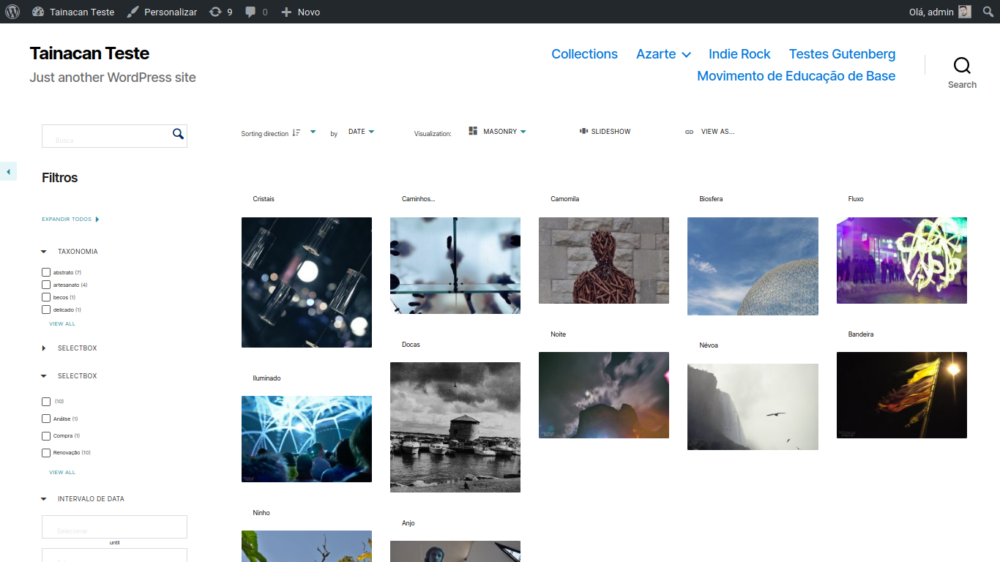
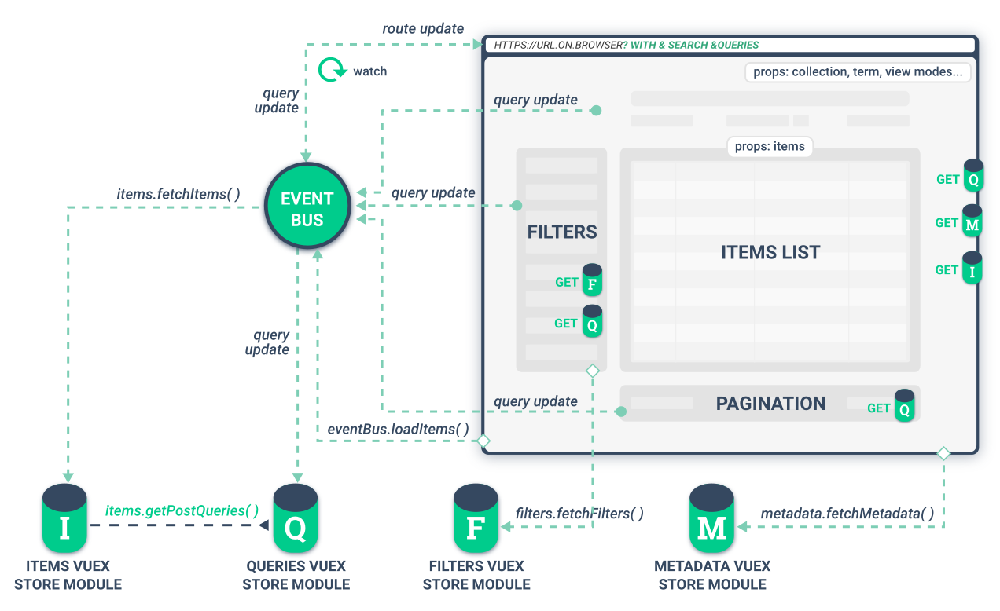

# El componente de lista de elementos Vue

Los desarrolladores de temas interesados en disponer de una lista de elementos *con todas las funciones* -incluidos filtros, búsqueda avanzada y modos de visualización- en determinadas páginas pueden hacer uso de la [helper function](/es-mx/dev/custom-templates#funciones-del-ayudante-de-temas) `tainacan_the_faceted_search()`. Por ejemplo, usémosla en un tema hijo de [TwentyTwenty](https://wordpress.org/themes/twentytwenty/ ':ignore') para ver cómo se muestra una lista de elementos:

```php
/**
 * /tainacan/archive-items.php
 *
 * Implementación personalizada de la lista de artículos de la colección Tainacan
 */
<?php get_header(); ?>
    // ... Carga de la cabecera personalizada, si se desea, probablemente mostrando un banner de la colección
    <?php tainacan_the_faceted_search(); ?>
    // .. Carga el pie de página personalizado, si se desea
<?php get_footer(); ?>
```

Esto nos da lo siguiente una vez que entramos en la página de elementos de una colección:



Parece ser mucho más que el simple `<main id='tainacan-items-page' $props ></main>` devuelto al [final de la función de código fuente de las etiquetas de plantilla](https://github.com/tainacan/tainacan/blob/develop/src/classes/theme-helper/template-tags.php#L280 ':ignore'), ¿verdad? 

> Eso es porque **la lista de elementos es una interfaz del lado del cliente, generada por [Vue.js](https://vuejs.org/ ':ignore')** y código Javascript. Aprovecha la mayor parte del código usado por el plugin para mostrar la misma lista en el *panel de administración*, para proporcionar una rica interfaz de búsqueda facetada. También es una gran demostración de lo que se puede hacer consumiendo [Tainacan JSON API](https://tainacan.org/api-docs/ ':ignore'), ya que utiliza la API para llamadas REST cada vez que es necesaria una actualización en el componente. 

Sin embargo, como te habrás dado cuenta, *no todo es perfecto*, algunos ajustes css que pueden ser necesarios debido a cómo el tema padre se ocupa de las fuentes. Explicamos cómo manejar esto [en una página separada](/es-mx/dev/customizing-the-items-list.md). Por ahora, entremos en los detalles de cómo funciona este componente.

### La lógica del componente Vue

Como desarrollador de temas, no necesitas aprender Vue para usar esta interfaz, pero es importante ver cómo funciona si quieres personalizarla, especialmente su css. El siguiente diagrama nos ayudará en esta misión:



El componente Vue [ThemeSearch]() es un contenedor que contiene todos los componentes que se ven en la figura. Recibe "props", que son la información pasada a la etiqueta `main` generada por `tainacan_the_faceted_search()`. Estos "props" son esenciales para renderizar el resto:

* El `collection-id` para la lista de elementos de la colección;
* El `term-id` y `taxonomy` para la lista de términos;
* El `default-view-mode` y la matriz `enabled-view-modes` para informar a la lista de elementos de qué modos de vista deben estar disponibles de acuerdo con la configuración de la colección;

Una vez conocidas estas variables, se construye el componente y el EventBus, responsable de gestionar la ruta URL y las consultas, generará una larga lista de params y los pasará a la URL de la página. En este primer momento hay numerosas informaciones que cargar, procedentes de diferentes fuentes, representadas en el diagrama por los "Módulos de almacenamiento". Por nombrar algunos:

* Los **filtros** de la colección se solicitan a la API y el resultado se almacena en el Módulo de Filtros, que es consultado por el componente [FiltersItemsList]();
* Los **metadatos** de la colección se solicitan a la API y el resultado se almacena en el módulo de metadatos, que es consultado por el componente ThemeSearch. Esta información se utiliza en compañía de los props para construir elementos como el "Desplegable de Metadatos Mostrados" y el "Modo de Vista". También informa al Evento qué metadatos de elementos deben ser recuperados;
* Los propios **elementos** se obtienen de la API y se sirven como props al componente **ItemsList**, que puede ser un componente Vue del plugin o una plantilla HTML registrada como [Extra View Mode](/es-mx/dev/extra-view-modes.md).
* También se puede proporcionar otra información al componente a través de la variable global `tainacan_plugin` disponible para el plugin. Almacena principalmente información relativa a la preferencia del usuario si está registrado. Por ejemplo, un usuario puede haber establecido que el "número de elementos por página" sea 96 en lugar de 12.

Todo esto se mantiene sincronizado con la URL mediante el EventBus, para garantizar que si un usuario copia el enlace y lo pega en otro navegador, todo se carga correctamente. La comunicación de los componentes es necesaria para detalles como la actualización de las facetas una vez recargada la lista de elementos o aplicado un filtro.
