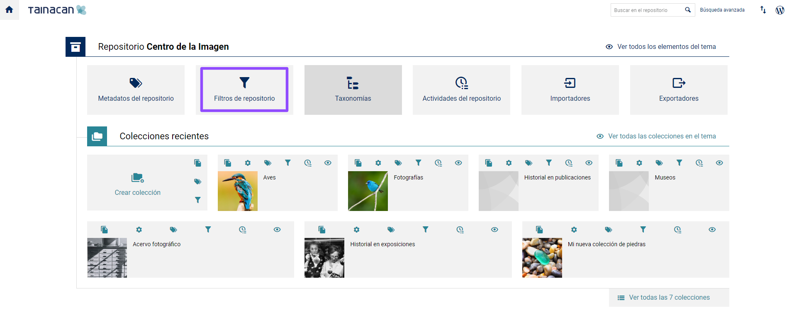
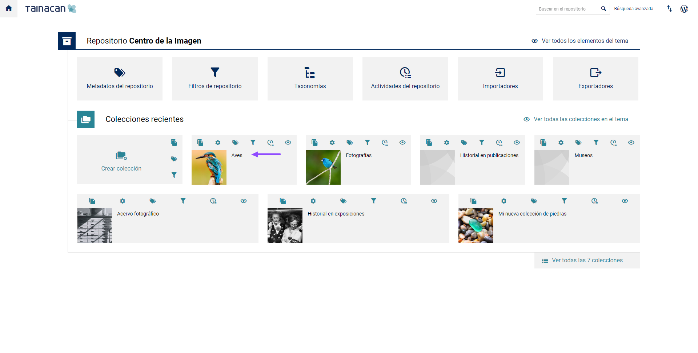
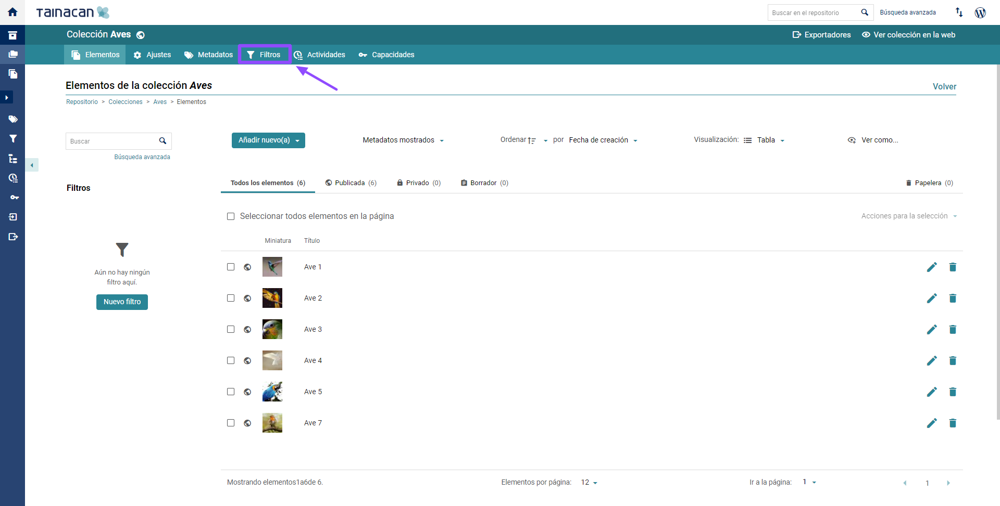
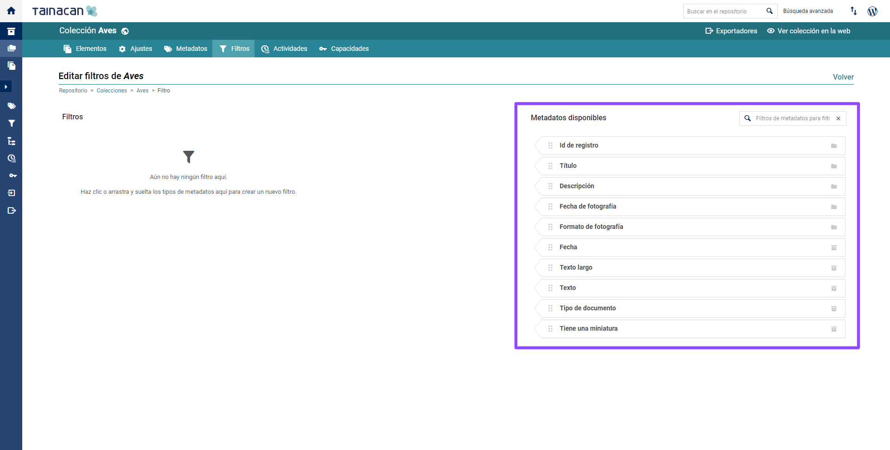
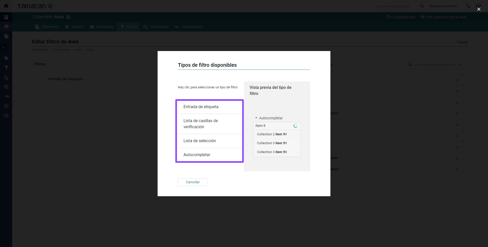
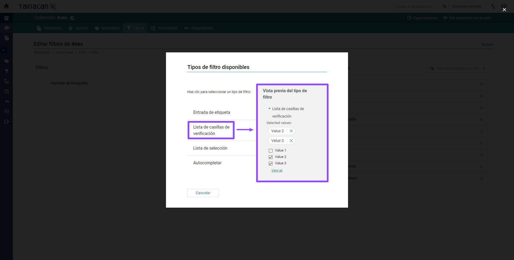
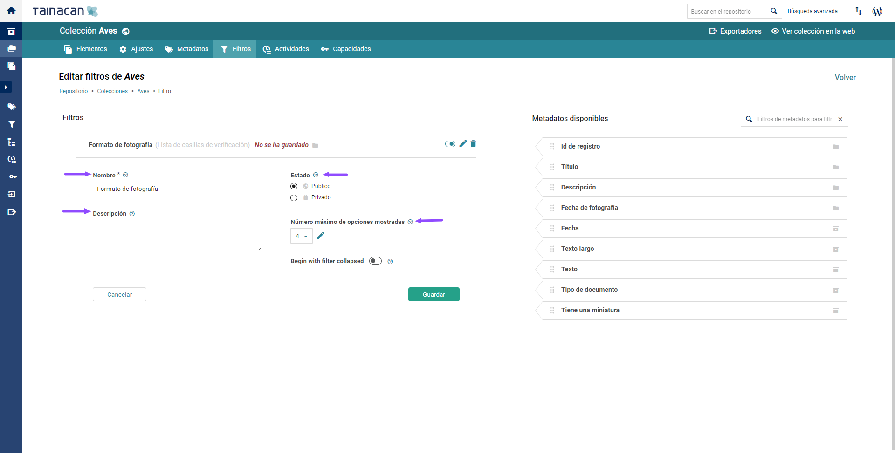
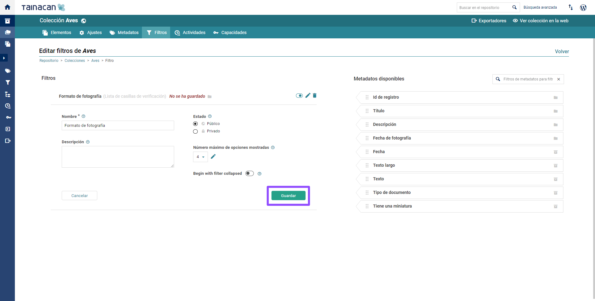

	

# Filtros

Para cada _"colección"_ es posible elegir cuáles de sus _"metadatos"_ se utilizarán como _"filtro"_ para los resultados de una búsqueda facetada en la vista de la _"colección"_. Los requisitos previos para el uso de _"filtros"_ en el repositorio son:

- Crear “[_metadatos_](/es-mx/metadata.md)” a nivel de _"repositorio"_ o de _"colección"_;
- Rellenar los campos de metadatos de los “[_elementos_](/es-mx/items)”;
- Hecho lo anterior, se [pueden configurar filtros](/es-mx/filters.md#configurar-filtros) al nivel de _"repositorio"_ o de _"colección”_.

Los _“filtros”_ permiten al usuario cambiar la vista de los _"elementos"_ de una _"colección"_ a partir de los _“metadatos”_ que se configuraron como _"filtros"_.

---

## Características generales de los filtros

- Todos los _"metadatos"_ creados o heredados por la _"colección"_ están disponibles para configurarlos como _"filtros"_;
- Los _“metadatos a nivel de repositorio”_ se representan con el _“icono de repositorio”_;
- Los _“metadatos a nivel de colección”_ (o heredados de una colección) se representan con el _"icono de colección"_;

* Por defecto, Tainacan dispone de dos _"filtros"_ independientes, que se pueden habilitar en la _“sección filtros”_. Estos son:
  - **“Tipo de documento”**: Es posible filtrar los _"elementos"_ que tienen vinculado algún documento principal;
  - **“Tiene miniatura”**: Es posible filtrar los _"elementos"_ que tienen o no una miniatura.

- Los valores de los _“metadados”_ de cada _"elemento"_ aparecerán como opción de selección en cada _"filtro"_, según las configuraciones del _“tipo de metadatos”_;
- Actualmente, Tainacan cuenta con **nueve tipos de metadatos**, pero pueden desarrollarse nuevos filtros de acuerdo a las necesidades individuales de cada instalación y agregarse al núcleo de Tainacan. Ver el artículo sobre [desarrollo de plugins](/es-mx/dev/) para saber más.

## Tipos de filtros

Cada _“tipo de metadato”_ ofrece diferentes _“tipos de filtros”_, como ser verá a continuación:

### Filtros disponibles para cada tipo de metadatos

#### "Texto":

● Lista de selección (selectbox);

● Autocompletar (autocomplete);

● Inserción de términos (taginput);

● Casillas de selección múltiple (casilla de verificación).

#### "Texto largo":

● Lista de selección (selectbox);

● Autocompletar (autocomplete);

● Inserción de términos (taginput);

● Casillas de selección múltiple (casilla de verificación).

#### "Numérico":

● Intervalo numérico (Custom_Interval);

● Numérico;

● Lista de intervalos numéricos.

#### "Fecha":

● Intervalo de fechas (Custom_Interval);

● Fecha

#### "Lista de selección":

● Lista de selección (selectbox);

● Autocompletar (autocomplete);

● Inserción de términos (taginput);

● Casillas de selección múltiple (casilla de verificación).

#### "Taxonomías":

● Inserción de términos (taginput);

● Casillas de selección múltiple (casilla de verificación).

#### "Relación":

● Autocompletar (autocomplete);

● Inserción de términos (taginput);

● Selección múltiple (checkbox).

#### "Usuario":

● Inserción de términos (taginput).

> Nota: Al seleccionar un _“tipo de filtro”_ para su creación, se mostrará una pantalla de ejemplo para ilustrar las características de cada tipo de entrada de valor del _"filtro"_.
>
> Nota: Los _“metadatos compuestos”_ no tienen filtro, solo los _"metadatos hijos"_ pueden tener filtros configurados. En la _“sección de filtros”_, en la lista de metadatos disponibles se pueden identificar con la etiqueta _“hijo del compuesto”_.

## Configurar filtros

1. Accede al Panel de Control de _WordPress_;

   

2. En la barra lateral izquierda, haz clic en _“Tainacan”_:

   

3. Filtros a nivel de _“repositorio”_:

   ○ Haz clic en "Filtros de repositorio" para configurar los "filtros" que heredarán todas las "colecciones". Deben estar diseñados para permitir la navegación a partir de información global con vocabularios controlados. Por ejemplo: “Tipo de archivo”, “Fecha de registro del elemento”, “Estado de conservación”, etc.

   

4. Filtros a nivel de **colecciones**.

   ○ Los “filtros a nivel de colección” solo se aplican a los “elementos” creados en una “colección” determinada. La vista de “filtros de colección” también hereda los “filtros a nivel de repositorio”;

   ○ Crea o elige la "colección" en la que deseas crear nuevos filtros. Consulta "Crear colección" y "Crear metadatos" para obtener más información.

   

   I. En la barra superior de la “colección” seleccionada haz clic en “Filtros”;

   

   II. Para crear “filtros a nivel de colección” es necesario haber creado previamente “metadatos” en la respectiva “colección” (ver Crear metadatos), y entonces estos “metadatos” estarán disponibles para ser configurados como “filtros”.

5. En la pantalla de _“edición de filtros”_ (a _"nivel de repositorio”_ o a _"nivel de colección”_), se pueden ver los _"metadatos"_ ya creados en el repositorio o colección, que aparecen en la lista de la derecha, en la sección _“Metadatos disponibles”_. En esta lista, es posible ver los _"tipos de metadatos"_ ya creados y disponibles para la creación de _"filtros"_.

## Crear filtros

No hay ninguna diferencia en el proceso de creación de _"filtros a nivel de repositorio"_ o _"filtros a nivel de colección"_. Recuerda que debes especificar el nivel de acceso (públido o privado) que tendrá el _"filtro"_.

1. Elige un _“metadato”_ de la lista de _“Metadatos disponibles”_;

   

2. Selecciona y arrastra hacia la izquierda un _“metadato”_ para la creación del _"filtro"_:

   I. Aparecerá una pantalla para elegir el “tipo de filtro”. Los “tipos de filtros” varían en función de los “tipos de metadatos”. Consulta Tipos de filtros disponibles o Tipos de metadatos para obtener más información;

   

   II. Puedes obtener una vista previa de cómo se verá cada "filtro" en la página de la "colección". Para hacerlo, pasa el ratón por encima de cada tipo disponible para los “metadatos” seleccionados, como se ve en la imagen anterior.

   

3. Selecciona el _"tipo de filtro"_ deseado. Se abrirá una pantalla de configuración del _"filtro"_. Rellena los campos:

   - Asigna un nombre al _"filtro"_ (por defecto, el _"nombre del filtro"_ es igual al de su respectivo _“metadato”_);
   - Crea una descripción para el _"filtro"_;
   - Selecciona el _"estatus del filtro"_:
     - **“Público”**: el filtro aparecerá para todos en la vista _"colección"_;
     - **“Privado”**: el filtro aparece solo para los editores de la _"colección"_ en la vista de la colección desde el _"panel de administración"_.

   > **Nota:** Los ajustes disponibles para cada _"filtro"_ creado varían según el _“tipo de filtro”_ y el _“tipo de metadatos”_. En caso de duda, haz clic en el _"icono de signo de interrogación"_ para obtener más información.

   

4. Da clic en _"Guardar"_;

   

5. Una vez guardado, el _"filtro"_ creado aparecerá en la barra lateral izquierda de la vista _"colección"_.

## Editar filtros

### A nivel de repositorio:

● Si estás en la pantalla de inicio de Tainacan, haz clic en "Filtros del repositorio" o, si estás en la página de "colecciones", en la barra lateral haz clic en "Filtros":

■Haz clic en el _"icono de lápiz"_ ubicado al lado del título del _"filtro"_;

■Cambia los campos deseados;

> · **Nota**:
>
> ○ Solo es posible editar el “Título”, la “Descripción” y el “Estatus” de los filtros existentes;
>
> ○ Para cambiar el tipo de un “filtro”, es necesario eliminar el filtro existente y crear uno nuevo con la configuración deseada.

■Haz clic en _"Guardar"_.

<iframe
    width="560"
    height="513" 
    src="https://www.youtube.com/embed/B1u8INbY4FU" title="YouTube video player"
    frameborder="0"
    allow="accelerometer; autoplay; encrypted-media; gyroscope; picture-in-picture"
    allowfullscreen>
</iframe>

### A nivel de colección

> Nota:
>
> Los “filtros heredados” (aquellos creados a nivel de repositorio) se pueden deshabilitar;
>
> Los "Filtros deshabilitados" no se mostrarán en la vista de colección.

● En la barra superior de la "colección" seleccionada, haz clic en "Filtros":

■ Identifica el “filtro” que deseas modificar;

■ Haz clic en el “icono de lápiz” ubicado junto al título del “filtro”;

■ Modifica los campos deseados.

> Nota:
>
> Solo es posible modificar el “Título”, “Descripción” y “Estatus” de los filtros existentes;
>
> Para cambiar el tipo de un “filtro” es necesario eliminar el filtro y crear uno nuevo con la configuración deseada.

■ Haz clic en “Guardar”.

● Para deshabilitar un "filtro", haz clic en el "icono de selección", junto a los iconos de “lápiz" y de "papelera", ubicados junto al título del "filtro".

<iframe
    width="560"
    height="513" 
    src="https://www.youtube.com/embed/l7Wo48tL_8c" title="YouTube video player"
    frameborder="0"
    allow="accelerometer; autoplay; encrypted-media; gyroscope; picture-in-picture"
    allowfullscreen>
</iframe>

## Eliminar filtros

!>**Atención:** Al hacer clic en el _"icono de papelera"_, el _"filtro"_ se elimina inmediatamente. Si no deseas ver momentáneamente un _“filtro activo”_, es mejor simplemente deshabilitarlo _"a nivel de colección"_.

### A nivel de repositorio

1. Si estás en la pantalla de inicio de Tainacan, haz clic en _“Filtros de repositorio”_ o, si estás en la página _"colecciones"_, en la barra lateral, haz clic en \*“filtros”**\*:**
   1. Identifica el _"filtro"_ que deseas eliminar;
   2. Haz clic en el _"icono de papelera"_ ubicado al lado del título del _"filtro"._

<iframe
    width="560"
    height="513" 
    src="https://www.youtube.com/embed/VCtoRrnRxjo" title="YouTube video player"
    frameborder="0"
    allow="accelerometer; autoplay; encrypted-media; gyroscope; picture-in-picture"
    allowfullscreen>
</iframe>

### A nivel de colección

1. En la barra superior de la _"colección"_ seleccionada, haz clic en \*“Filtros”**\*:**
   1. Identifica el _"filtro"_ que quieres modificar;
   2. Haz clic en el _"icono de papelera"_ ubicado al lado del título del _"filtro"_

<iframe
    width="560"
    height="513" 
    src="https://www.youtube.com/embed/K65AhIu8zao" title="YouTube video player"
    frameborder="0"
    allow="accelerometer; autoplay; encrypted-media; gyroscope; picture-in-picture"
    allowfullscreen>
</iframe>

> **Nota: **El _"borrado del filtro"_ solo afecta la navegabilidad de la visualización de la  _“colección"_. Esta operación solo la pueden deshacer los administradores. Consulta el [Registro de actividades](/es-mx/activities) para obtener más información. El _"filtro"_ dejará de existir automáticamente si se desactivan o eliminan sus respectivos _“metadatos”_.

- Para _“recuperar”_ un _"filtro"_ borrado, basta con crearlo de nuevo.
