<div style="float: right; margin-left: 1rem;">
	
</div>


# Importadores

Los importadores son los recursos que permiten optimizar el proceso de creación y actualización de elementos en las colecciones de Tainacan. También permiten importar “vocabularios controlados” y “taxonomías”.

<!-- tabs:start -->

#### ** Importador CSV **

## Importar archivo .CSV de elementos

Si bien es posible capturar manualmente la información de ítems en Tainacan, cuando ya se tiene la información, se puede importar directamente a una colección desde un archivo en formato *.csv*.

> Véase también cómo [importar taxonomías](#importar-csv-de-vocabularios-taxonomías) para crear "vocabularios controlados" o realizar una "importación de tesauros".

### Parámetros del archivo .CSV

El archivo a enviar debe ser un *.csv estándar*, en el que cada línea contenga la información de un elemento, y cada columna contenga los valores para cada metadato específico. Además, la primera línea debe contener los títulos de las columnas.

**Ejemplo:**

| Columna de elementos | Columna de metadatos 1 | Columna de metadatos 2 |
| -------------------- | -------------------- | -------------------- |
| Elemento 1  | Valor de metadatos 1  | Valor de metadatos 2  |
| Elemento 2  | Valor de metadatos 1  | Valor de metadatos 2  |

Cuando el usuario inicia el proceso de *importación*, debe elegir la codificación en la que se guardó el archivo *.csv* (generalmente se guarda en UTF-8), el carácter de separación de columnas y el carácter de compartimiento de celdas. Estas opciones se configuran cuando el usuario crea el archivo *.csv* utilizando un programa de edición de hojas de cálculo (como Microsoft Excel o LibreOffice Calc).

En esta sección, el usuario también introducirá el carácter (o caracteres) utilizado para separar múltiples valores dentro de una sola celda (se recomienda utilizar el símbolo de barra doble: “||“).

Después de configurar el importador y seleccionar la "colección de destino", se envía el archivo *.csv* y el usuario tiene la posibilidad de asignar las columnas presentes en el *.csv* a los metadatos presentes en la "colección de destino".

Si los metadatos no fueron creados previamente en la colección, el usuario puede crear y mapear los metadatos en esta misma pantalla, o elegir la opción `Crear Metadatos` en el mapeador. Si se selecciona esta opción, Tainacan creará automáticamente los metadatos cuando se ejecute el importador.

> **NOTA:** Consulta [cómo crear metadatos automáticamente](#crear-metadatos-automáticamente) en la sección a continuación para saber cómo decirle a Tainacan el tipo y los atributos de los metadatos que debe crear.

#### Columnas Especiales

Cada columna del archivo *.csv* debe asignarse a un metadato en la colección de destino. Sin embargo, hay columnas especiales que se pueden usar para configurar otros aspectos del elemento. Por ejemplo, el estado del elemento se puede configurar como "público", "borrador" o "privado".

Las columnas especiales que se pueden utilizar son:

* `special_item_status` - Informa el estado del elemento**. Los valores posibles son:
* `draft` (borrador)
* `private` (privado)
* `publish` (público)
* `special_item_id` - Informa el **ID del elemento** en la base de datos de Tainacan. Esta función es útil para volver a importar elementos y permitirle decidir si desea actualizar los elementos existentes o ignorarlos y agregar nuevos elementos.
* `special_document` - Permite al usuario adjuntar el documento del ítem (es decir, el archivo o archivos que acompañan a ese registro). Véase [Importación de archivos y adjuntos](#importar-archivos-y-adjuntos).
*`special_attachments` - Permite al usuario adjuntar los archivos. Véase [Importación de archivos y adjuntos](#importar-archivos-y-adjuntos)
*`special_comment_status` - Permite al usuario informar si los elementos pueden recibir comentarios o no. Los valores posibles son: "open" (abierto para comentarios) ó "closed" (cerrado para comentarios).

> **Nota**: Si en los ajustes de la "colección" no está activada la función "Permitir comentarios", no será posible que un usuario haga comentarios sobre un "ítem", por más que se haya importado utilizando el valor "abierto" para esta columna especial.

**Ejemplo**:

| special_item_id | Columna de Metadato 1 | Columna de Metadato 2 | special_item_status | special_document                  | special_atachments                 |
| --------------- | -------------------- | -------------------- | ------------------- | --------------------------------- | ---------------------------------- |
| 001             | Valor de Metadato 1  | Valor de Metadato 2  | publish             | url:http://exemplo.br/abcd        | file:http://seusite.br/anexo1.frmt |
| 002             | Valor de Metadato 1  | Valor de Metadato 2  | draft               | file:http://seusite.br/item2.frmt | url:http://exemplo.br/abcd         |
| 003             | Valor de Metadato 1  | Valor de Metadato 2  | private             | text:texto de ejemplo             | file:http://seusite.br/anexo3.frmt |

#### Importar archivos y adjuntos

Se pueden importar más archivos que están relacionados con los elementos del *archivo .csv*, usando columnas especiales.

Utiliza `special_document` para definir el archivo principal que corresponde a cada elemento y `special_attachments` para agregar uno o más archivos adjuntos.

Los valores para `special_document` pueden ser:

* url
* file
* text

Ejemplo:

```
nombre, special_document
una imagen, archivo: http://example.com/image.jpg
un video de youtube, url: http://youtube.com/?w=123456
un texto, texto: Este es un texto de ejemplo
```

Los valores de "special_attachments" son solo una lista de archivos. Si deseas añadir muchos archivos adjuntos, utiliza el carácter separador que haya definido en la opción "separador de celdas multivalor" de tu archivo *.csv*. En ambos casos, puedes apuntar a un archivo utilizando una *URL*, o simplemente el nombre del archivo. Para apuntar al nombre del archivo, debes configurar esta opción para que Tainacan localice los archivos en el servidor. También puedes enviarlos directamente (por FTP, por ejemplo) y Tainacan los añadirá a tus elementos.

Ejemplo:

```
Nombre, special_attachments
Una imagen, http://example.com/image.jpg
Múltiples imágenes: http://example.com/image.jpg%7C%7Chttp://example.com/image2.jpg%7C%7Chttp://example.com/image3.jpg
Imágenes enviadas por FTP, micarpeta/imagen.jpg||micarpeta/imagen2.jpg
```

Los “special_attachments” tienen dos variaciones, en presencia del campo especial “special_item_id”:

- `special_attachments|REPLACE`: reemplaza los archivos adjuntos existentes con la lista de archivos informados en el _.csv_;
- `special_attachments|APPEND`: opción predeterminada utilizada para agregar archivos a elementos adjuntos;

---

#### Crear metadatos automáticamente

Cuando el usuario mapea (asigna) las columnas que se encuentran en el archivo *.csv* a los "metadatos" presentes en la colección de destino, es posible seleccionar la opción `Crear metadatos`, entonces el importador creará los metadatos automáticamente durante el procesamiento del archivo *.csv*.

Por defecto, los metadatos creados serán de tipo `Texto` y `Público`, pero es posible informar a Tainacan el tipo y otras opciones de los metadatos al inicio del archivo *.csv*.

En la primera línea, donde se define el nombre de cada columna, se puede añadir alguna información que será utilizada por el importador para crear el `metadatum_id`.

Cada información sobre el metadato debe estar separada por el carácter "`|`".

El primer dato debe ser el *nombre del metadato* y, a continuación, el *tipo de metadato*.

Los tipos de metadatos actualmente soportados de forma nativa son:

* `text` - Texto
* `textarea` - Texto largo
* `taxonomy` - Taxonomía: cuando se utilice este tipo, se creará una nueva taxonomía.
* `date` - Fecha: los valores deben ser informados en el formato AAAA-MM-DD (2018-01-01). Por lo tanto, solo se debe configurar un metadato como “fecha” si se dispone de la información completa (año, mes, día). En caso contrario, conviene más configurarlo como metadato de texto.
* `numeric` - Numérico
* `selectbox` - Seleccionar cuadro
* `user` - Usuario
* `relationship` - Relación con otro elemento de la misma colección o de una colección diferente. Los valores deben ser el ID del elemento relacionado.
- `compound([*nome do metadado*|*tipo do metadado*,...])` - Metadatos compuestos: la lista de metadatos que componen los metadatos compuestos debe utilizar la misma sintaxis que se usa para definir metadatos simples.

Por ejemplo:

```
Nombre,Asunto|taxonomia,Fecha de creación|fecha, Calificación|compuesto,Descripción|texto,Puntuación|numerico
```

#### Configuración de metadatos de tipo taxonomía

Si una de las columnas del archivo CSV tiene valores para un metadato de tipo taxonomía y esta taxonomía tiene una jerarquía, la forma de expresar esta jerarquía es usando el signo `>>`.

Por ejemplo:

```
Nombre, categoría
Nombre del elemento, Categoría padre>>Categoría hija>>Categoría nieta. 
Por ejemplo, si tuviéramos una taxonomía de lugar para indicar el país, la ciudad y el municipio o alcaldía de creación de una obra, la taxonomía quedaría expresada así: País>>Ciudad>>Municipio (por ejemplo: México>>Ciudad de México>>Tlalpan)
```

> Recuerda que esta notación solo funcionará si esta columna está asignada a un metadato de tipo **taxonomía**, o si estás utilizando la técnica **Crear metadatos automáticamente** explicada anteriormente, y esta columna está marcada como metadato de **taxonomía**.

También es posible utilizar el “Importador de Vocabulario” y, en un segundo paso, importar los elementos. Si sigues este camino, la jerarquía ya estará ensamblada, y en tu *.csv* de elementos no será necesario representar la taxonomía completa, basta con ingresar el término del último nivel. *En este caso, el ejemplo anterior se vería así*:

```
Nombre, categoría
Nombre del elemento, categoría nieta
```

#### Instrucciones para metadatos

Después del tipo de metadatos, también se pueden ingresar otras instrucciones:

* `multiple` - Múltiple: para metadatos que permiten múltiples valores
* `required` - Obligatorio: para metadatos obligatorios
* `display_yes` - Mostrar en la lista: habilite los metadatos en la vista.
* `display_no` - No mostrar en la lista: oculta los metadatos a la vista.
* `display_never` - Nunca mostrar metadatos en la vista previa.
* `status_public` - Estado público: metadatos visibles para todos
* `status_private` - Estado privado: metadatos visibles solo para los editores
* `collection_key_yes` - Configurar los valores de estos metadatos como únicos: los valores de estos metadatos no se repiten en los elementos de esta colección.

### Importar CSV a Tainacan

1. Accede al panel de control de *WordPress*;

   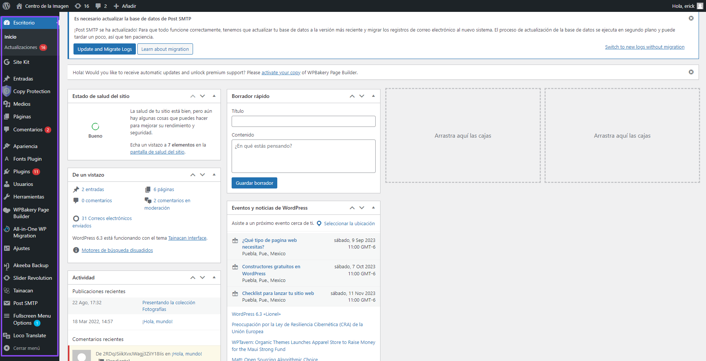

2. En la barra lateral izquierda, haz clic en Tainacan;

   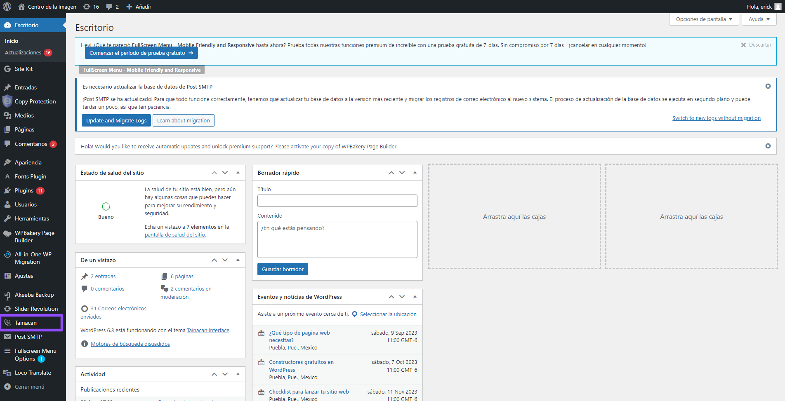

3. Accede a la sección **Importadores**;

   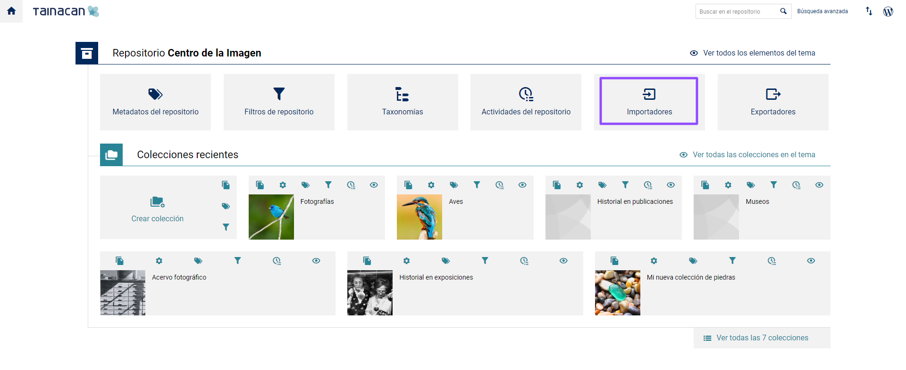

4. En la sección **Importadores disponibles**, selecciona `CSV`;

   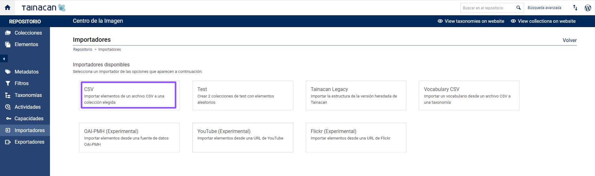

5. Carga el archivo *.csv* en el campo archivo de origen;

   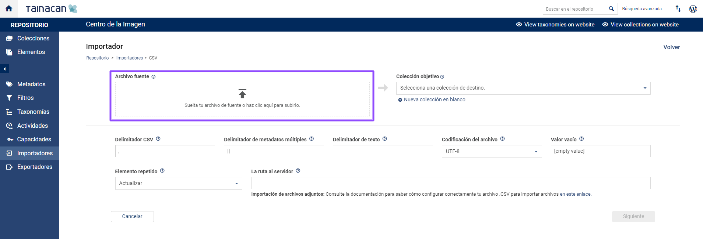

6. Selecciona o crea una "Colección de destino" para indicar dónde se crearán los elementos;

   \*.Si seleccionas “crear una nueva colección en blanco”, al terminar de crear la “colección”, te dirigirá nuevamente al `Importador`.

   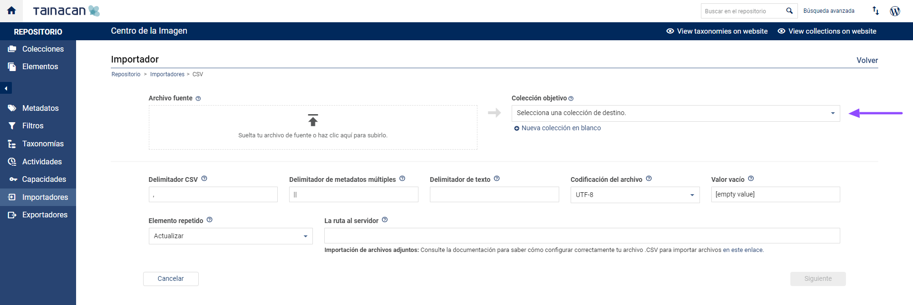

7. Configure los siguientes campos de acuerdo con la configuración realizada en su archivo *.csv*:

* **Delimitador csv**: carácter que separa los valores;
* **Delimitador de metadatos de valores múltiples**: carácter que separa valores dentro de una misma celda;
* **Delimitador de texto**: carácter que delimita todos los valores dentro de una misma celda;
* **Codificación del archivo**: parámetro que determina la codificación de los valores de texto en el archivo (generalmente UTF-8, en todo caso, asegúrate de que el archivo *.csv* esté codificado de acuerdo con las opciones disponibles en el importador);
* **Valor vacío**: expresión utilizada en el archivo *.csv* para representar los metadatos que se limpiarán al actualizar los elementos ya existentes en una colección. La expresión predeterminada es [valor vacío].

   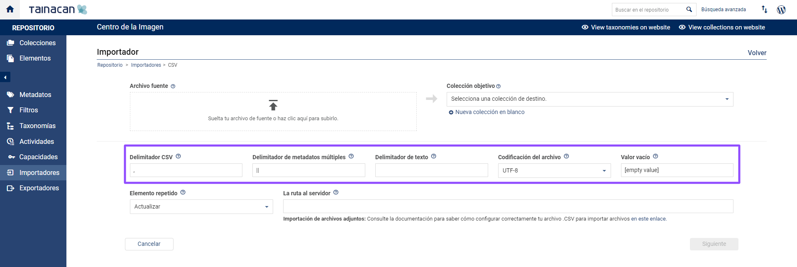

8. Configura estos campos según tus preferencias para la importación:

* **Elemento repetido**: Determina el comportamiento de Tainacan al identificar elementos idénticos en el proceso de importación. Selecciona Actualizar para que el elemento reciba los valores del archivo *.csv* o selecciona Ignorar para que no se modifique el elemento que ya existe en la colección;
* **Ruta al servidor**: El Importador permite insertar varios elementos en una colección directamente desde un archivo *.csv*. Consulta [Importador csv](#Importación-de-archivos-y-adjuntos) para obtener información sobre cómo configurar el archivo *.csv* correctamente.

   I. Como se especifica en la documentación, apunta la URL en el campo de ruta al servidor.

   

9. Haz clic en siguiente;

   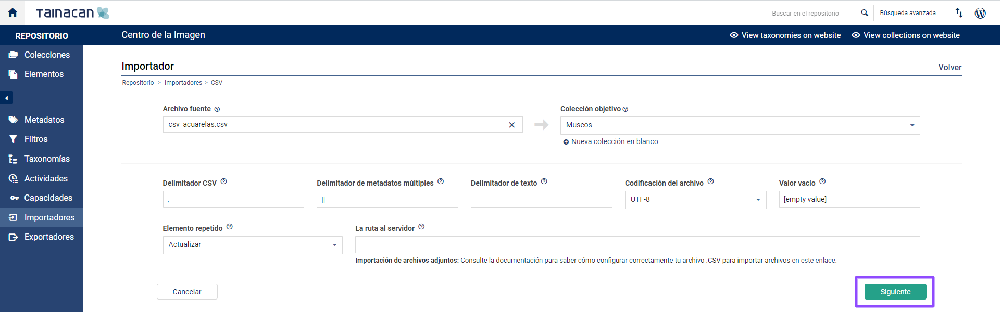

10. En la pantalla Mapeo de metadatos es posible realizar el proceso de emparejamiento entre los metadatos previamente configurados en el *.csv*;

    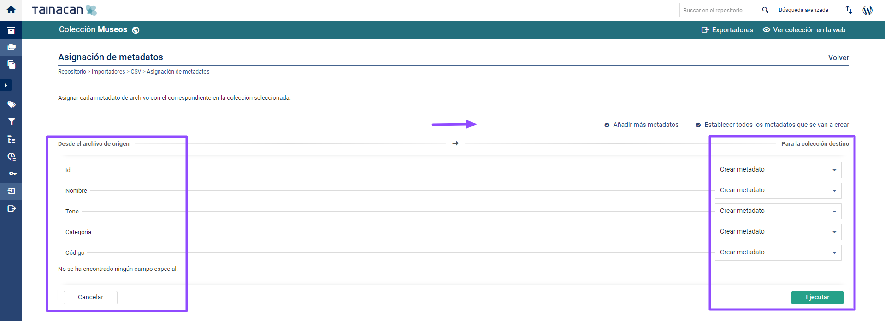

11. Selecciona los metadatos identificados en *.csv* (a la izquierda) y su correspondiente de la colección de destino (a la derecha) en Tainacan;

    <iframe
        width="560"
        height="513" 
        src="https://www.youtube.com/embed/201a_2snaVQ" title="YouTube video player"
        frameborder="0"
        allow="accelerometer; autoplay; encrypted-media; gyroscope; picture-in-picture"
        allowfullscreen>
    </iframe>

    ● Si algún metadato todavía no existe en la colección, selecciona `Crear metadatos`.

    ○ Si desea crearlos todos a la vez, haz clic en `Marcar todos los metadatos` para crear.

    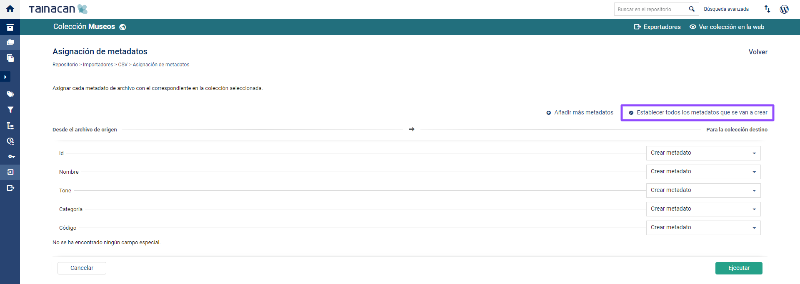

12. Para crear nuevos metadatos en la colección, selecciona `Agregar más metadatos`. Consulta la sección `Metadatos` para obtener más información sobre la creación y los `tipos de metadatos` existentes;

    !>**Atención**: En este proceso, los "metadatos" del archivo ".csv" no se crearán si no apuntan a un metadato en la colección de destino.

    !>**Atención**: La información de cada “metadato” en cada “ítem” depende de la creación de sus respectivos metadatos en este proceso.

    !>**Atención**: Una vez creado, no es posible cambiar el “Tipo de Metadato”. Por ejemplo, no es posible cambiar un "metadato" de tipo "Texto" a "Texto largo" o "Numérico" o a "Fecha".

    !>Consulta Descripción general de metadatos para obtener más información.

13. Cuando hayas terminado, haz clic en Ejecutar para iniciar el proceso de importación;

    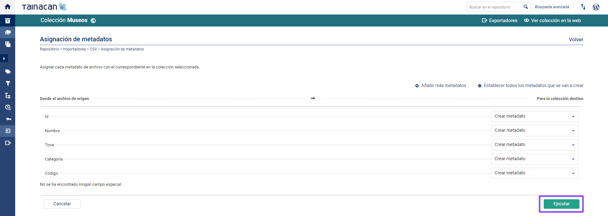

14. Serás redirigido a la pantalla `Actividades del repositorio` donde podrás seguir el progreso del proceso de importación. Esta pantalla muestra todos los procesos de importación ya realizados en esta instalación, desde el más reciente hasta el más antiguo. Una vez finalizado el proceso, se mostrará el `archivo de registro` y, en caso de errores, el `archivo de registro de errores`;

    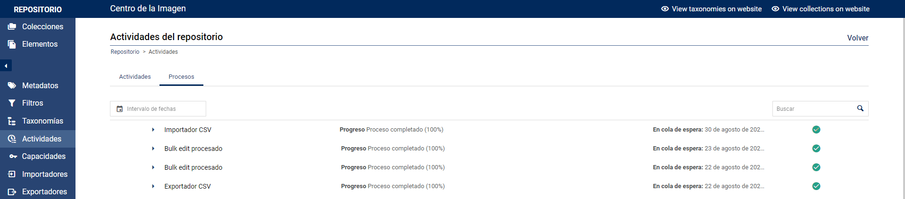

15. Una vez que el proceso de importación se haya completado con éxito, ve a la colección de destino de la importación y verifica si los metadatos, elementos y valores son los esperados.

#### ** Importador de vocabularios **

### Importar CSV de vocabularios (Taxonomías)

Este importador permite a los usuarios agregar términos a una taxonomía. Esta herramienta es útil para importar vocabularios controlados a una instalación de Tainacan.

---

#### Cómo configurar CSV

El formato de archivo para la importación de vocabulario es *.csv* - valores separados por comas.

Para cada término puedes ingresar el nombre del término y su definición, por ejemplo:

Término 1, Definición del Término 1

Término 2, Definición del Término 2

Término 3, Definición del Término 3

También es posible informar de la jerarquía. Para ello, deja vacías las celdas de la izquierda, indicando el nivel de jerarquía entre estos términos.

La hoja de cálculo debería parecerse a este ejemplo:

|         |                      |                       |                                |
| ------- | -------------------- | --------------------- | ------------------------------ |
| Término 1 | Definición del término 1 |                       |                                |
| Término 2 | Definición del término 2 |                       |                                |
|         | 1 Primer Hijo del término 2   | Definición de este término |                                |
|         | 2 Primer Hijo del término 2  | Definición de este término |                                |
|         |                      | 1 Nieto del hijo 2     | Definición del nieto del 2 |
| Término 3 | Definición del término 3 |                       |                                |
| Término 4 | Definición del término 4 |                       |                                |

Esa misma hoja de cálculo, cuando se guarda en formato *.csv*, debería verse como este ejemplo:

```
Término 1, Definición del término 1,
Término 2, Definición del término 2,
,Primer Hijo del término 2, Definición de este término,
,Segundo Hijo del término 2, Definición de este término,
,,Nieto, Definición del nieto
Término 3, Definición del término 3,,
Término 4, Definición del término 4,,
```

#### Envía el CSV a Tainacan

Una vez que hayas terminado de crear el archivo *.csv* con los términos deseados, sigue estos pasos:

1. Accede al panel de control de _WordPress_;

   

2. En la barra lateral izquierda, haz clic en Tainacan;

   

3. Accede a la sección **Importadores**;

   

4. En la sección **Importadores disponibles**, selecciona *Vocabulario CSV*;

   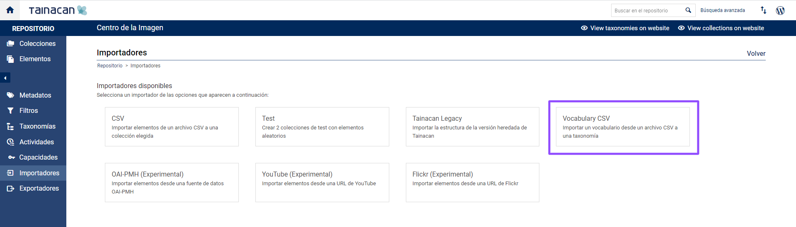

5. Configura el campo “Delimitador CSV” de acuerdo con el carácter delimitador de tu archivo *.csv*;

   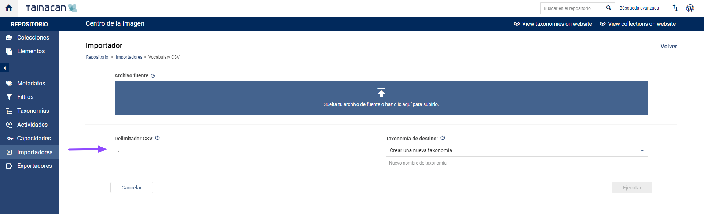

6. Selecciona el archivo *.csv* para cargar;

   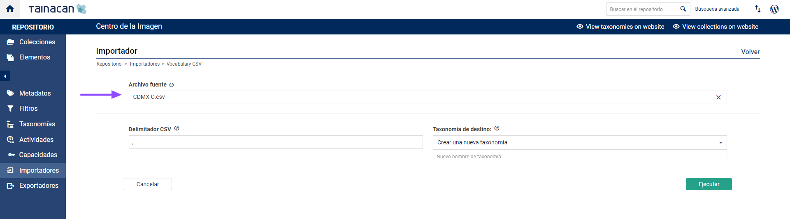

7. Crea o elige la *Taxonomía* de destino. Consulta Taxonomías para obtener más información;

   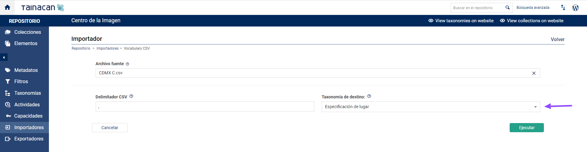

8. Haz clic en *Ejecutar*;

   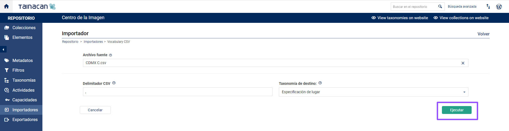

9. Serás redirigido a la pantalla *Actividades del repositorio*, donde podrás seguir el progreso del proceso de importación. Esta pantalla muestra todos los procesos de importación ya realizados en esta instalación, desde el más reciente hasta el más antiguo. Cuando finalice el proceso, se mostrará el archivo de registro y, en caso de errores, el archivo de registro de errores;

10. Una vez que el proceso de importación de vocabulario se complete con éxito, ve a la sección *Taxonomías* y revisa que la *Taxonomía* y los *Términos* se hayan importado como se esperaba.

### Importador de prueba

El Importador de prueba es una herramienta útil para los usuarios que quieran probar las características de Tainacan, ya sea para conocer mejor de lo que es capaz, o para seguir un script de prueba previo al lanzamiento. Con él, podemos *crear colecciones* con *elementos*, *metadatos* y *filtros* genéricos rápidamente.

A diferencia de los importadores de CSV, en realidad no estamos importando datos de una fuente externa, sino que dejamos que Tainacan los cree todos. Así que la configuración es bastante sencilla:

1. Accede al panel de control de _WordPress_;

   

2. En la barra lateral izquierda, haz clic en Tainacan;

   

3. Accede a la sección *Importadores*;

   

4. En la sección *Importadores disponibles*, selecciona *Prueba*;

   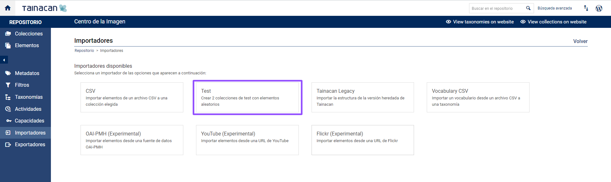

5. Rellena los primeros campos como desees. Si se crea una segunda *colección*, los *metadatos de relación* pueden vincular sus elementos;

   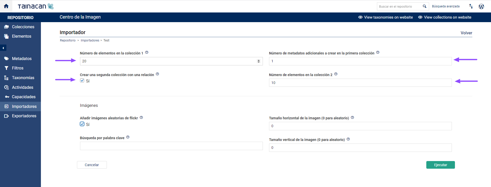

6. Si quieres importar imágenes de LoremFlickr a tus elementos, puedes configurar dimensiones específicas (alto x ancho) o dejar 0 para que sean aleatorias. También puedes definir un *término* de búsqueda para *filtrar* el contenido de las imágenes.

   a. Aunque diversas, las imágenes proporcionadas por LoremFlickr son de tamaño muy pequeño. Esto significa que aunque no se definan parámetros, pueden venir pequeñas y comportarse de forma inesperada en algunos *modos de visualización*, si estos esperan recortes mayores que el mínimo creado por el *importador*.

   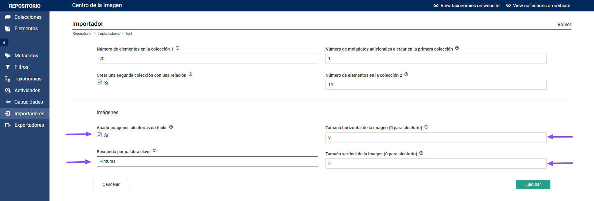

7. Realiza la importación haciendo clic en *Ejecutar*;

   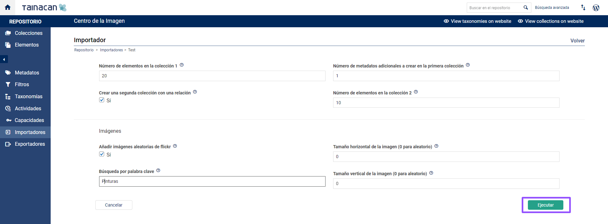

8. Una vez que el "proceso de importación se haya completado con éxito, ve a las *colecciones* creadas y verifica si los metadatos, elementos y valores son los esperados.

   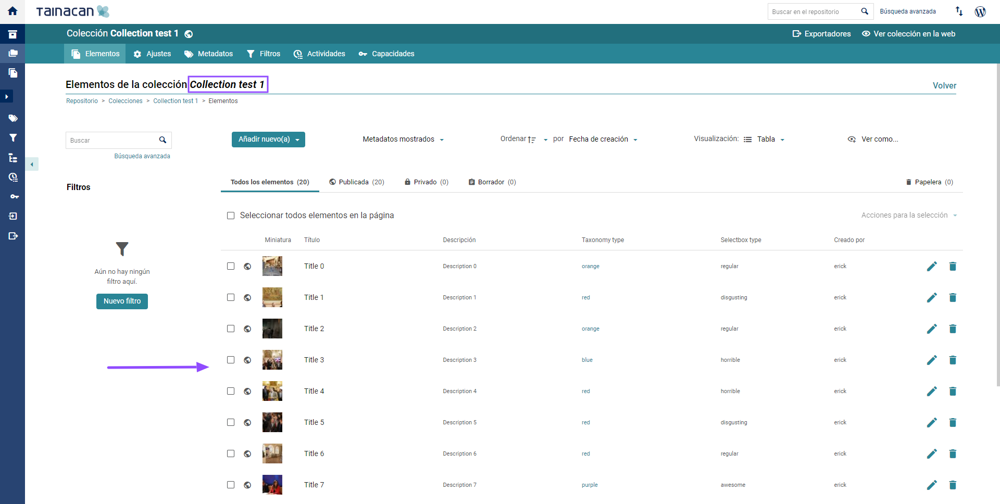

<!-- tabs:end -->
