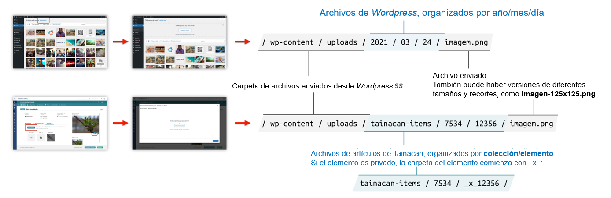

# Inserir e editar arquivos

?> _TODO_ Esta página está en _portugués brasileño_ solo hasta ahora. **Si puede, ayúdenos a traducirlo al _español_.**

Apesar de poder ser uma URL para uma fonte externa, um item no Tainacan costuma ter seu Documento configurado como um arquivo, tal como uma imagem, vídeo, áudio ou PDF, que fica armazenado no banco de dados do WordPress. Além disso, pode se ter anexos - também arquivos - que oferecem mais informações sobre este item. Nesta página cobriremos alguns processos que podem ser feitos para submissão destes arquivos, adição em massa de itens a partir de arquivos e a edição de imagens diretamente pelo painel do _WordPress_;

## Entendendo o fluxo de submissão

Todas os arquivos utilizados no Tainacan também podem ser visualizados na _“Biblioteca de Mídia do WordPress”_, mas existem diferenças entre o fluxo de inserção feito pela bilioteca de mídias e pelo próprio Tainacan. A imagem a seguir nos auxilia a entender um pouco o que acontece por trás dos panos:

Ao se enviar uma arquivo diretamente para a _“Biblioteca de Mídia do WordPress”_, este arquivo é armazenado na estrutura de pastas de uploads do _WordPress_, seguindo um sistema de pastas como o demonstrado, onde os arquivos estão organizados por data. Esta organização pode ser alterada no próprio _WordPress_ ou por uso de plugins.

?> Quando se adiciona um Documento ou Anexo para algum item do Tainacan, porém, o envio no modal de mídias que o Tainacan abre faz com que o arquivo seja armazenado em uma outra estrutura, que usa dos IDs da coleção e do item atual. Por conta disso, ao se abrir um modal de mídias a partir da tela de edição de itens do Tainacan, **só serão mostrados ali arquivos que possuem vínculo com o item e a opção de enviar novos**.

Desta maneira podemos garantir por exemplo, controle de privacidade dos arquivos (que ainda pode ser melhorado como [explicado neste artigo](/es-mx/optimization#blindando-o-wordpress)). Note que os itens privados terão um início diferente: \_x\_.

!> Surge desta organização o impedimento de que mais de um arquivo seja usado por dois itens, por exemplo. Isto é importante porém, pois sem esta restrição a privacidade dos mesmos não poderia ser garantida, já que um item poderia ser público e outro privado.

Portanto:

1. Para um arquivo ser utilizado pelo item, ele precisa ser enviado específicamente para este item.
2. Um arquivo enviado diretamente para a _“Biblioteca de Mídia do WordPress”_ só pode ser referenciado no item através do seu link público, porém não "
   pertencerá" ao item;

É comum o desejo de se usar arquivos enviados para a biblioteca de mídias em itens porque este espaço costuma ter acesso imediato, ao se entrar no admin do WordPress. Além disto, enviar item a item vários arquivos pode ser tedioso, porém temos dois caminhos para ser resolver isso, que mencionamos mais a frente: a [adição em massa de itens a partir de arquivos](#adição-em-massa-de-arquivos) e [importação de arquivos e anexos via CSV](/es-mx/importers#importar-arquivos-e-anexos);

## Biblioteca de mídia do WordPress

Como mencionado, todos os arquivos utilizados no Tainacan ficam armazenados na _“Biblioteca de Mídia do WordPress”_, onde também podem ser feitas edições em arquivos que forem imagens.

### Inserir imagens

1. Acesse o _“painel de controle”_ do _WordPress_;

2. Na barra lateral esquerda, clique em _“Mídia”_ e então em _“Biblioteca”_;

3. Na tela da _“Biblioteca de mídia”_ clique em _“Adicionar nova”_ no canto superior esquerdo;

4. Arraste ou selecione a _“imagem”_ que deseja adicionar.

   

### Editar imagens

1. Acesse o painel de controle do _WordPress_;

2. Na barra lateral esquerda clique em `Mídia` e então em `Biblioteca`;

3. Selecione a imagem que deseja editar;

4. Clique em `Editar imagem`;

5. Realize as edições desejadas:

   **“Recortar”**;

   **“Rotacionar para a esquerda”**;

   **“Rotacionar para a direita”**;

   **“Virar na vertical”**;

   **“Virar na horizontal”**;

   **“Redimensionar a imagem”**;

   **“Recorte da imagem”**.

---

## Inserir imagem ao item

As imagens podem ser inseridas diretamente ao item, sem que antes sejam adicionadas a Biblioteca de mídia. Existem três formas de realizar essa ação:

- **Inserir a imagem individualmente em cada item;**
- **Inserir imagens em sequência em um conjunto de itens;**
- **Inserir imagens em massa.**

A ação de inserir imagens individualmente é indicada para os casos em que existem poucos itens em que imagens serão adicionadas. A inserção de imagens em sequência é adequada para um conjunto de itens, que pode abranger de dois até todos os itens de uma mesma página. Já a inserção de imagens em massa visa abranger uma grande quantidade de itens.

### Inserir imagem individualmente

1. Acesse o painel de controle do _WordPress_;

   

2. Na barra lateral esquerda, clique em _“Tainacan”_;

   

3. Selecione uma coleção;

4. Selecione o _“item”_ desejado e clique em _“Editar item”_;

   

5. Clique em _“Arquivo”_;

   

6. Selecione uma _“imagem”_ que já se encontra na _“Biblioteca de mídia”_ ou envie uma _“imagem”_ do seu computador;

   <iframe
       width="560"
       height="513" 
       src="https://www.youtube.com/embed/M24K-V_FmMw" title="YouTube video player"
       frameborder="0"
       allow="accelerometer; autoplay; encrypted-media; gyroscope; picture-in-picture"
       allowfullscreen>
   </iframe>

7. Clique em _“Selecionar arquivo”_;

   No _“rodapé da página”_ é exibida uma barra de progresso com as informações referentes:

   - Última vez que as alterações realizadas foram salvas.

   <iframe
       width="560"
       height="513" 
       src="https://www.youtube.com/embed/Eshy6yVO8Nw" title="YouTube video player"
       frameborder="0"
       allow="accelerometer; autoplay; encrypted-media; gyroscope; picture-in-picture"
       allowfullscreen>
   </iframe>

8. No canto inferior direito da tela clique em:

- **“Enviar para a lixeira”**, para que o _“item”_ seja enviado para a lixeira;
- **“Voltar para rascunho”**, para que o _“item”_ tenha seu _status_ alterado para _“rascunho”_;
- **“Atualizar”**, para confirmar as alterações realizadas no “item”;

### Inserir imagem em sequência

1. Acesse o _“painel de controle”_ do WordPress;

   

2. Na barra lateral esquerda, clique em _“Tainacan”_;

   

3. Selecione uma _“coleção”_;

4. Clique nas _“caixas de seleção”_ dos _“itens”_ que deseja editar;

   I. Todos os “itens” da página podem ser selecionados ao clicar em “Selecionar todos os itens da página”.

   <iframe
       width="560"
       height="513" 
       src="https://www.youtube.com/embed/SWJlSRaveZ4" title="YouTube video player"
       frameborder="0"
       allow="accelerometer; autoplay; encrypted-media; gyroscope; picture-in-picture"
       allowfullscreen>
   </iframe>

5. Clique em “Ações em massa” e então em “Editar itens selecionados em sequência”;

   

6. Clique em “Arquivo”

   

7. Selecione uma “imagem” que já se encontra na “Biblioteca de mídia” ou envie uma “imagem” do seu computador;

8. Clique em “Selecionar arquivo”;

   I. No “rodapé da página” é exibida uma barra de progresso com as informações referentes:

   i. Item atual e total de itens;

   ii. Última vez que as alterações realizadas foram salvas;

   <iframe
       width="560"
       height="513" 
       src="https://www.youtube.com/embed/M24K-V_FmMw"
       frameborder="0"
       allow="accelerometer; autoplay; encrypted-media; gyroscope; picture-in-picture"
       allowfullscreen>
   </iframe>

9. No canto inferior direito da tela, clique em:

   I. “Anterior”, para voltar ao “item” anterior;

   II. “Salvar como Rascunho”, para que o “item” exibido tenha seu status alterado para “rascunho”;

   III. “Atualizar”, para confirmar as alterações realizadas no “item” e ir para o próximo.

   

### Adição em massa de arquivos

> Consulte [Importando arquivos e anexos](/es-mx/importers#importar-arquivos-e-anexos) para aprender como inserir imagens em massa.
