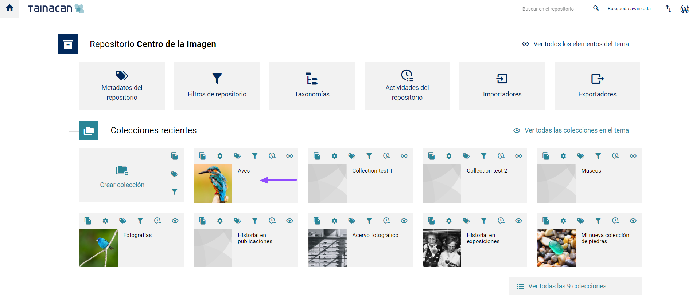
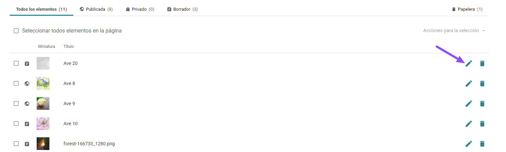
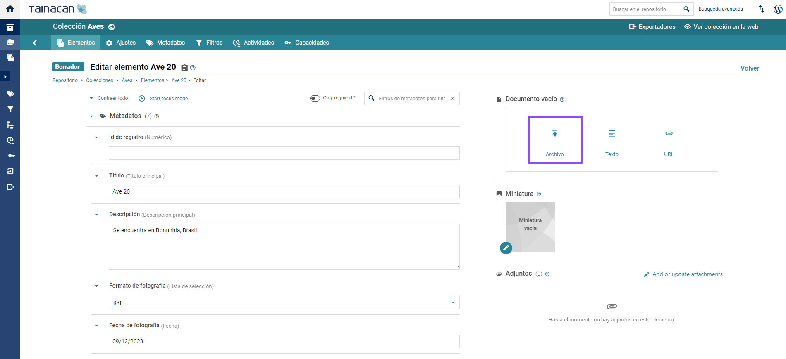
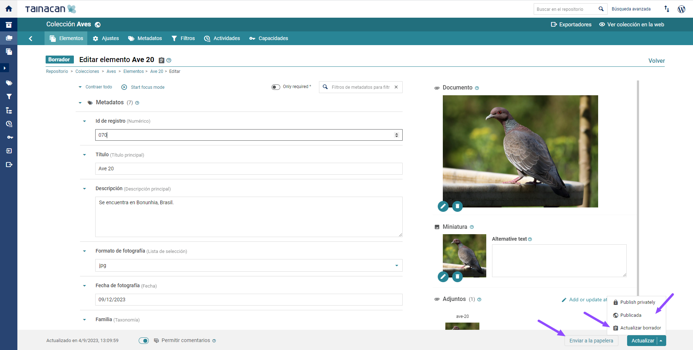
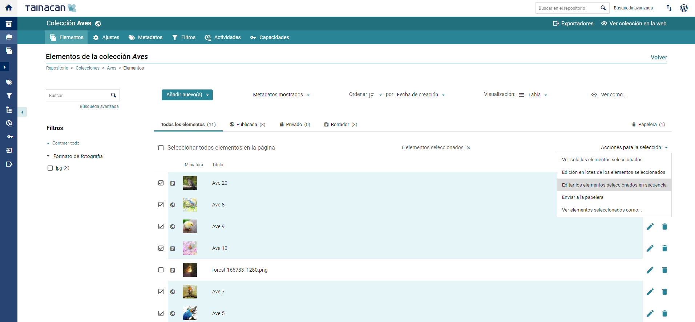
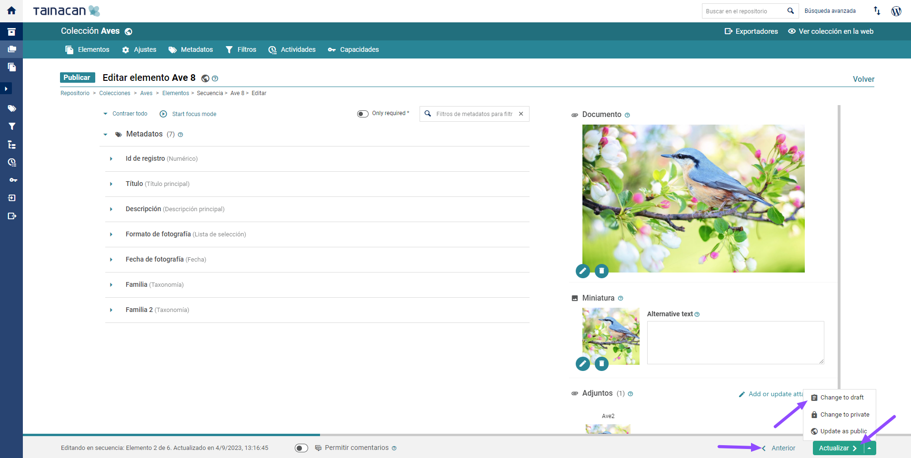

# Insertar y editar archivos

Aunque puede ser una URL para una fuente externa, un elemento en Tainacan suele tener su Documento configurado como un archivo, como una imagen, vídeo, audio o PDF, que se almacena en la base de datos de WordPress. Además, se pueden tener anexos - también archivos - que ofrecen más información sobre este artículo. En esta página cubriremos algunos procesos que se pueden realizar para enviar estos archivos, añadir elementos de forma masiva desde archivos y editar imágenes directamente desde el panel de WordPress;

## Comprender el flujo de envío

Todos los archivos utilizados en Tainacan pueden verse también en la "Mediateca de WordPress", pero existen diferencias entre el flujo de inserción realizado por la mediateca y por el propio Tainacan. La siguiente imagen nos ayuda a entender lo que ocurre entre bastidores:

Cuando se sube un archivo directamente a la "Mediateca de WordPress", éste se almacena en la estructura de carpetas de subida de WordPress, siguiendo un sistema de carpetas como el que se muestra, donde los archivos se organizan por fecha. Esta organización puede modificarse en el propio WordPress o mediante plugins.

?> Sin embargo, cuando se añade un Documento o Adjunto a un ítem de Tainacan, al enviarlo en el    modal multimedia que abre Tainacan, el archivo se almacena en otra estructura que utiliza los IDs de la colección y del elemento actual. Debido a esto, al abrir un modal multimedia desde la pantalla de edición de los elementos de Tainacan, **sólo se mostrarán allí los archivos relacionados con el elemento y la opción de enviar nuevos.**.

De esta forma podemos garantizar, por ejemplo, el control de la privacidad de los archivos (que aún puede mejorarse [como se explica en este artículo](/es-mx/optimization#blindando-wordpress)). Toma en cuenta que los elementos privados tendrán un comienzo diferente: \_x\_.

!> Esta organización impide, por ejemplo, que dos elementos utilicen más de un archivo. Sin embargo, esto es importante porque sin dicha restricción no se podría garantizar su privacidad, ya que un elemento podría ser público y otro privado.

Por lo tanto:

1. Para que el elemento utilice un archivo, debe cargarse específicamente para ese elemento.
2. Un archivo subido directamente a la "Mediateca de WordPress" sólo puede ser referenciado en el artículo a través de su enlace público, pero no "
   pertenecerá" al artículo;

Es común querer usar archivos cargados en la biblioteca de medios en los elementos porque este espacio generalmente es inmediatamente accesible al iniciar sesión en el administrador de WordPress. Además, enviar varios archivos elemento por elemento puede ser tedioso, pero tenemos dos formas de solucionar esto, que mencionaremos más adelante: [agregar elementos de forma masiva desde archivos](#añadir-un-conjunto-de-archivos) e [importar archivos y archivos adjuntos a través de CSV](/es-mx/importers#importar-archivos-y-adjuntos);

## Biblioteca de medios de WordPress

Como se mencionó, todos los archivos utilizados en Tainacan se almacenan en el“Biblioteca multimedia de WordPress”, donde también se pueden realizar ediciones de los archivos que son imágenes.

### Insertar imágenes

1. Accede al _“Panel de control”_ de _WordPress_;

2. En la barra lateral izquierda, haz clic en _“Media”_ y luego en _“Biblioteca”_;

3. En la pantalla _“Biblioteca de medios”_, haz clic en _“Añadir nuevo”_ en la esquina superior izquierda;

4. Arrastra o selecciona la _“imagen”_ que quieres añadir.

   

### Editar imágenes

1. Accede al panel de control de _WordPress_;

2. En la barra lateral izquierda, haz clic en `Medios` y, a continuación, en `Biblioteca`;

3. Selecciona la imagen que quieras editar;

4. Da clic en `Editar imagem`;

5. Realiza las ediciones deseadas:

   **“Recortar”**;

   **“Girar a la izquierda”**;

   **“Girar a la derecha”**;

   **“Voltear vertical”**;

   **“Voltear horizontal”**;

   **“Redimensionar imagen”**;

   **“Recortar imagen”**.

---

## Insertar imagen en un elemento

Las imágenes se pueden insertar directamente en el elemento sin necesidad de agregarlas primero a la biblioteca multimedia. Hay tres formas de realizar esta acción:

- **Insertar la imagen individualmente en cada elemento;**
- **Insertar imágenes en secuencia en un conjunto de elementos;**
- **Insertar imágenes de forma masiva.**

La acción de insertar imágenes individualmente está indicada para casos en los que hay pocos elementos en los que se van a añadir imágenes. La inserción de imágenes en secuencia es adecuada para un conjunto de elementos, que puede ir desde dos hasta todos los elementos en la misma página. La inserción de imágenes de forma masiva pretende abarcar un gran número de artículos.

### Insertar imagen individualmente

1. Accede al panel de control de _WordPress_;

   

2. En la barra lateral izquierda, haz clic en _“Tainacan”_;

   

3. Selecciona una colección;

   

5. Selecciona el _“ítem”_ deseado y haz clic en _“Editar elemento”_;

   

6. Pulsa en" _“Archivo”_;

   

7. Selecciona una _“imagen”_ que ya esté en la _“Mediateca”_ o carga una _“imagen”_ desde tu computadora;

   <iframe
       width="560"
       height="513" 
       src="https://www.youtube.com/embed/M24K-V_FmMw" title="YouTube video player"
       frameborder="0"
       allow="accelerometer; autoplay; encrypted-media; gyroscope; picture-in-picture"
       allowfullscreen>
   </iframe>

8. Pulsa en _“Seleccionar Archivo”_;

   En el _“pie de página”_  aparecerá una barra de progreso con la información pertinente:

   - Última vez que se guardaron los cambios realizados.

   <iframe
       width="560"
       height="513" 
       src="https://www.youtube.com/embed/Eshy6yVO8Nw" title="YouTube video player"
       frameborder="0"
       allow="accelerometer; autoplay; encrypted-media; gyroscope; picture-in-picture"
       allowfullscreen>
   </iframe>

9.  En la esquina inferior derecha de la pantalla, haga clic en:

- **“Enviar a la papelera de reciclaje”**,  para que el _“elemento”_ se envíe a la papelera de reciclaje;
- **“Volver al borrador”**, para que el _“elemento”_ cambie su _estado_ a _“borrador”_;
- **“Actualizar”**, para confirmar los cambios realizados en el “elemento”;

### Insertar imagen en secuencia

1. Accede al _“Panel de control”_ de WordPress;

   

2. En la barra lateral izquierda, haz clic en _“Tainacan”_;

   

3. Seleccione una _“colección”_;

4. Haz clic en las _“casillas de verificación”_ de los _“elementos”_ que deseas editar;

   I. Se pueden seleccionar todos los “elemento“ de la página haciendo clic en “Seleccionar todos los elementos de la página“.

   <iframe
       width="560"
       height="513" 
       src="https://www.youtube.com/embed/SWJlSRaveZ4" title="YouTube video player"
       frameborder="0"
       allow="accelerometer; autoplay; encrypted-media; gyroscope; picture-in-picture"
       allowfullscreen>
   </iframe>

5. Haz clic en “Acciones para la selección” y luego en “Editar los elementos seleccionados en secuencia”;

   

6. Haz clic en “Archivo”

   

7. Selecciona una “imagen” que ya esté en la “Biblioteca de medios” o carga una “imagen” desde su computadora;

8. Haz clic en “Seleccionar archivo”;

   I. En el “pie de página“ aparecerá una barra de progreso con información sobre:

   i. Elemento actual y Elementos totales;

   ii. Última vez que se guardaron los cambios realizados;

   <iframe
       width="560"
       height="513" 
       src="https://www.youtube.com/embed/M24K-V_FmMw"
       frameborder="0"
       allow="accelerometer; autoplay; encrypted-media; gyroscope; picture-in-picture"
       allowfullscreen>
   </iframe>

9. En la esquina inferior derecha de la pantalla, haga clic en:

   I. “Anterior”, para volver al ”elemento” anterior;

   II. “Guardar como borrador“, para que el “elemento“ cambie su estado a “borrador“.

   III. “Actualizar”, para confirmar los cambios realizados en el “elemento“ y pasar al siguiente.

   

### Añadir un conjunto de archivos

> Ver [Importando archivos y adjuntos](/es-mx/importers#importar-archivos-y-adjuntos) para aprender a insertar imágenes de forma masiva.
