# Envío de elementos

La [versión _0.17_](/es-mx/releases#tainacan-beta-017) de Tainacan incorpora la posibilidad de abrir colecciones para el envío público de elementos (también denominado _autodepósito_). Esto significa que los usuarios sin privilegios administrativos, o incluso los visitantes del sitio, pueden ahora crear ellos mismos elementos en una colección, **ampliando así las posibilidades de una colección colaborativa generada por varias personas**.

Tras bambalinas el envío de elementos no es más que llevar el [formulario de creación de elementos](/es-mx/items#crear-elementos), con los [metadatos configurados en la colección](/es-mx/metadata#tipos-de-metadatos), a una página pública del sitio. Esto se hace a través de un [bloque gutenberg](/es-mx/gutenberg-blocks) y alguna configuración extra. En estas páginas, explicaremos cómo configurar el formulario público de envío de artículos. Luego abordaremos:

1. Los ajustes necesarios para la [configuración de la colección](#configuración-de-la-colección);
2. El proceso de [creación de bloque de formulario](#creación-del-bloque-de-envío-de-elementos);
3. Algunos [ajustes avanzados](#configuración-avanzada-de-bloques) al bloque;
4. Protección contra ataques a sitios web [usando la verificación  _reCAPTCHA_](#verificación-recaptcha-en-el-formulario);
5. Algunas [preguntas frecuentes](#preguntas-frecuentes) sobre esta función;

## Configuración de la colección

En la página de configuración de toda “Colección”, hay un campo que permite activar el “envío de elementos”.

1. Accede a la colección en la que quieras habilitar el "envío de elementos" y pulsa en "Ajustes".

   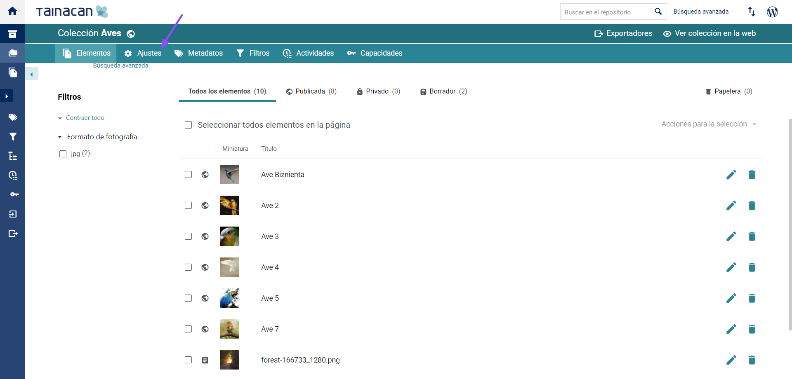

2. En la esquina inferior derecha, habilita la función "Permitir envío de elementos".

   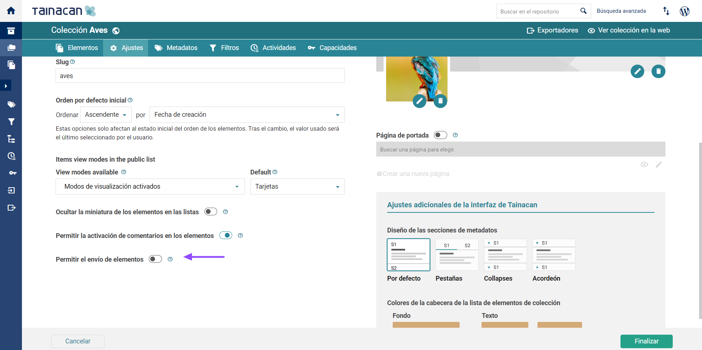

3. Con este campo habilitado, la colección se puede incluir en el bloque de envío de elementos, del que hablaremos en breve. Al habilitar la función, aparecen nuevas opciones, como se muestra en la siguiente captura de pantalla:

   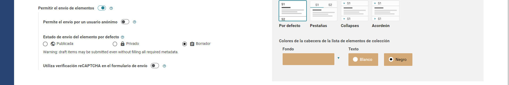

**“Permitir el envío por parte de usuarios anónimos”**: se refiere a qué usuarios pueden enviar este formulario. Por defecto, cualquier persona que visite el sitio, aunque no se encuentre registrada en el sistema WordPress. Si se activa, incluso las personas que nunca han iniciado sesión en el sitio podrán enviar información.

Si te interesa abrir tu colección a usuarios anónimos, es importante comprender que los "elementos" no tendrán registro de "quién" los creó. En el sistema administrativo, el campo “Creado por” sólo contendrá la información “anónimo”. Puede ser útil, en este caso, crear un metadato que identifique al autor del envío, por ejemplo, un “Metadato de tipo Texto” llamado “Nombre de usuario”, marcado como obligatorio.

**“Estado por defecto”**: Cada elemento creado por el formulario tendrá un “Estado por defecto”. Para garantizar que los elementos puedan validarse antes de formar parte de la colección pública, se recomienda mantener su estado como "Privado" o "Borrador". La principal diferencia es que los "elementos borrador" no tienen que estar completos, por lo que no se ha realizado toda la validación de los "metadatos obligatorios", por ejemplo. Los "elementos privados" sólo los verán los usuarios registrados con permiso para ello, posiblemente los revisores de su flujo de aprobación de elementos. 

**“Use la verificación reCAPTCHA en el formulario de envío”**: Finalmente, como con cualquier formulario en la web, es importante proteger el sitio de ataques de usuarios malintencionados. Hemos detallado más la funcionalidad de la opción "Usar la verificación reCAPTCHA en el formulario de envío" en una sección separada.

## Creación del bloque de envío de elementos

Para que tu formulario esté disponible a los visitantes del sitio, necesitas crear una página o entrada en tu "panel de administración" de WordPress. Como se explica con más detalle en nuestra página de Bloques Gutenberg, este es el nuevo "editor de contenido de WordPress" donde puedes nombrar la página o incluso incluir contenido para presentar tu formulario al usuario, como un título y un texto explicativo.

1. Accede al “panel de control” de WordPress;

   

2. En la barra lateral izquierda, haz clic en “Entradas” (si deseas insertar el bloque en unentrada) o “Páginas” (si deseas insertar el bloque en una página);

   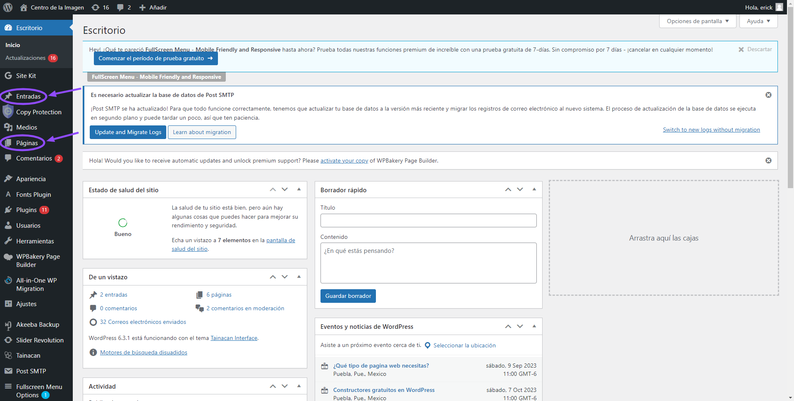

3. Una vez hecho esto, la búsqueda del bloque _“Formulario de envío de elementos”_ en la lista de bloques, te permitirá insertar el formulario;

   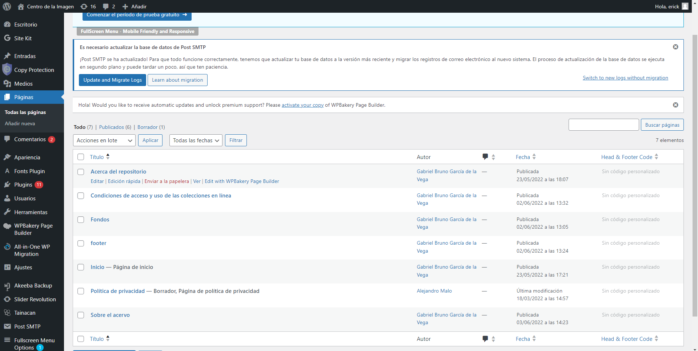

4.  Inicialmente, el bloque viene vacío, porque espera que configures qué _“recopilación”_ esta forma se refiere.. Al hacer clic en el botón _“Seleccione la Colección de destino”_,  el modal mostrado mostrará solo el _“colecciones”_ configurado para aceptar la presentación pública de _“elementos“_, como mencionado en [la sección anterior](#configuración-de-la-colección);

   <iframe
       width="560"
       height="513" 
       src="https://www.youtube.com/embed/m7B1Axx00bk" title="YouTube video player"
       frameborder="0"
       allow="accelerometer; autoplay; encrypted-media; gyroscope; picture-in-picture"
       allowfullscreen>
   </iframe>

5. Una vez elegida la _“colección”_, el bloque se llenará con una _“visualización previa”_ del aspecto que tendrá el formulario. Para ver realmente el formulario en acción, es necesario hacer clic en _“Vista previa”_ o _“Publicar la página”_;

   <iframe
       width="560"
       height="513" 
       src="https://www.youtube.com/embed/PacoTywllQs" title="YouTube video player"
       frameborder="0"
       allow="accelerometer; autoplay; encrypted-media; gyroscope; picture-in-picture"
       allowfullscreen>
   </iframe>

6. Después de llenar los datos, dependiendo de la configuración de la colección, el formulario puede publicarse directamente o pasar a la pestaña _“borrador”_ de la _“colección”_. En esta pestaña se puede evaluar y configurar como público, si se aprueba, en el panel Tainacan.

## Configuración avanzada de bloques

El _“bloque de envío”_ tiene algunos ajustes adicionales.

Haga clic en el “_loque de envío de elementos”_ y, a continuación, en el _“engranaje”_ de la esquina superior derecha de la pantalla; el panel lateral derecho del editor mostrará una serie de _“ajustes del bloque”_;

<iframe
    width="560"
    height="513" 
    src="https://www.youtube.com/embed/5AKOazA13tM" title="YouTube video player"
    frameborder="0"
    allow="accelerometer; autoplay; encrypted-media; gyroscope; picture-in-picture"
    allowfullscreen>
</iframe>

**“Mensaje de retorno de envío”:** Configure los campos de retorno para el usuario una vez completado el formulario. El primero se refiere al mensaje que se mostrará cuando el _“elemento”_ se haya enviado correctamente en el formulario.

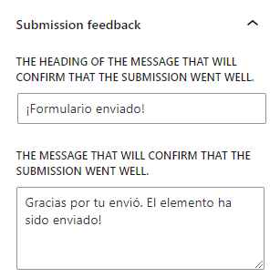

Por defecto, esta información aparece como en la siguiente imagen:

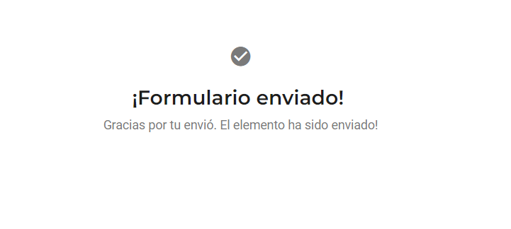

Este puede ser un buen lugar para informar, por ejemplo, que el envío se está evaluando por el equipo administrativo y que, si se aprueba, el _“elementos”_ estará disponible en el listado de _“elementos de la colección”_.

### Etiqueta de sesión

Como puede verse en la vista previa del bloque, el _“formulario de envío de elementos”_  tiene cuatro secciones principales, en el siguiente orden:

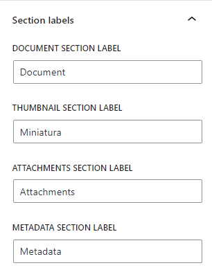

1. El “Documento del elemento principal”, que puede ser un archivo, texto sin formato o una dirección en línea a través de un enlace URL.
2. La “Miniatura”, , que representará al elemento en los listados y que por defecto se genera automáticamente a partir del "Documento", y puede ser enviada por el usuario.
3. La “lista de Anexos”, que pueden ser uno o varios archivos relacionados de algún modo con el "elemento".
4. La “lista de Metadados” que constituye la información general del "elementos" y muestra los datos requeridos por el formulario.

Estas etiquetas pueden tener sentido en la interfaz de administración de Tainacan, pero es posible que prefieras usar términos más amigables para tu audiencia. Por ejemplo, tal vez "Información" sea más clara que "Metadatos" y "Archivos adicionales" sea mejor que "Adjuntos". Así que en esta sección ofrece la posibilidad de cambiar estas etiquetas. También puedes optar por dejarlas en blanco, lo que ocultará estas separaciones entre las secciones, dando una sensación de unidad a los campos del formulario.

### Entrada de metadatos

En el panel "Entrada de metadatos", puede ver todos los campos que se han configurado en la pantalla de "metadatos" de la configuración de la colección.

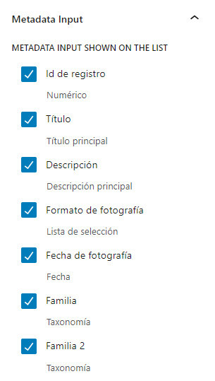

Aquí puedes ocultar algunos metadatos que no consideres pertinente que aparezcan en este formulario. Por ejemplo, un campo que contenga la información de si ese elemento ha sido aprobado después de la revisión ciertamente no necesita estar en el formulario público. Ten en cuenta, no obstante, que si los metadatos en cuestión son "obligatorios", no pueden desactivarse, ya que ello impediría su envío.

### Elementos de formulario

Este panel agrupa todas las funcionalidades de "ocultar/mostrar" de los elementos del formulario que no sean los "metadatos". Usando estas opciones, puedes acercar el diseño de tu formulario a uno más simple en tu sitio web, en vez del complejo y rico componente que se encuentra en el "panel de administración" de Tainacan:

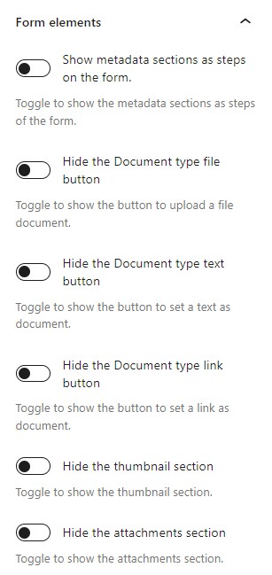

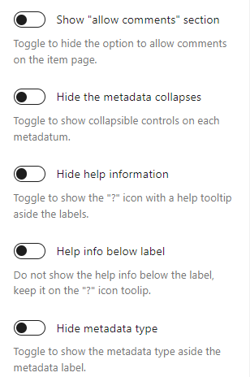

1. **“Ocultar cualquier botón redondo para elegir el tipo de documento”**: Al ocultar los tres, la sesión con la etiqueta dejará de existir. Ocultando dos de los tres, el formulario dejará de mostrar los botones redondos y mostrará inmediatamente el campo para insertar el documento del único tipo restante:

   a. **“Documento de tipo archivo”**;

   b. **“Tipo de documento texto plano”**;

   c. **“Tipo de documento URL”**;

2. **“Ocultar la sección de miniaturas”**: útil si optas por confiar en el proceso de generación automática del documento o si sus elementos son en su mayoría de texto y no necesitan una imagen.

3. **“Ocultar la sección de Adjuntos”**: si sus elementos no lo necesitan.

4. **Mostrar el botón "Permitir comentarios"**: Este es el único elemento del formulario de elementos que inicialmente se encuentra oculto por defecto. En el raro caso que quieras que el usuario, por sí mismo, decida si su ítem puede recibir comentarios o no, habilita esta opción.

5. **“Ocultar detalles de metadatos”**: Toda la lista de metadatos tiene flechitas al lado de los nombres y líneas debajo de las entradas, que indica los detalles, botones que al pulsarlos ocultan esos metadatos para un mejor aprovechamiento del espacio. Si prefiere que esta característica no aparezca, utilice esta opción. Probablemente es lo ideal si su formulario tiene pocos metadatos.

6. **“Ocultar los botones de ayuda”**: Junto a todos los metadatos y las secciones del formulario, se encuentra un pequeño botón redondo con un signo de interrogación que ofrece al usuario un "globo con consejos de captura". Estas pistas provienen de la configuración de cada metadato, del campo de descripción. Si consideras que la información no es necesaria, puedes desactivarlos con esta opción.

7. **“Ocultar el tipo de metadatos”**: El campo “metadatos” de cada formulario tiene, junto a su etiqueta, un texto más claro que indica el “tipo de metadatos” (texto, relación, número, taxonomía…). Esta información puede no ser de interés en el formulario público, por lo que se puede deshabilitar aquí.

### Colores y Tamaño

Por último, es posible cambiar parte de la apariencia del formulario. Aunque la estética de los componentes puede variar en función del "tema" utilizado, es posible realizar algunos ajustes en este panel. Puede ser conveniente cambiar el tamaño de la fuente base (la fuente utilizada en el "panel de administración" suele ser más pequeña que la que se encuentra en las entradas y páginas) y, por supuesto, los colores en general. Los colores son, básicamente, variaciones de gris para mostrar líneas y texto, y dos colores primarios, que proceden de la interfaz Azul Turquesa de Tainacan. Son importantes para los "enlaces", los "botones", los "globos de ayuda" y los "elementos sobre los que pasa el ratón". Merece la pena ver los efectos resultantes en la vista previa del bloque para hacerse una idea.

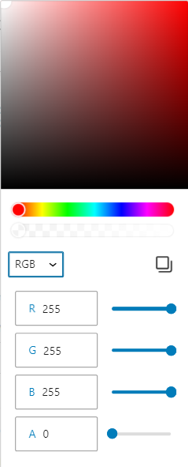

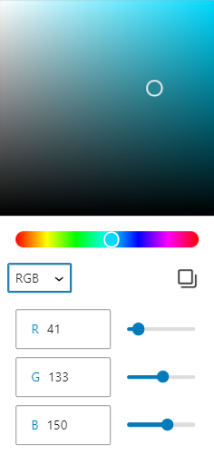

## Verificación reCAPTCHA en el formulario

Es muy común, en sitios que tienen “formularios” como estos, que usuarios maliciosos ataquen el servidor. Una de las formas más comunes de hacer esto es mediante el uso de robots (scripts automatizados) que envían información al "formulario" varias veces, ya sea con el objetivo de difundir SPAM o para sobrecargar el servidor y posiblemente dejarlo fuera de servicio.

Para proteger su sitio de este tipo de ataque, recomendamos especialmente el uso de un mecanismo de verificación que pueda validar los "envíos" realizados por usuarios reales. Aunque existen varias soluciones para ello, nosotros ofrecemos integrada en el plugin la que consideramos una de las más sencillas y eficaces, el reCAPTCHA de Google. Seguro ya lo has visto en algún formulario web, en el que tenías que pulsar la casilla y realizar algún reto para seguir adelante con el envío. Se necesitan dos pasos para hacerlo funcionar en tu "formulario de envío de artículos":

1. [Acceso al panel de control](#configuración-de-recaptcha-en-su-sitio-web) para obtener la clave reCAPTCHA;
2. [Acceso al panel de control](#habilitar-la-colección-para-usar-recaptcha) para el uso de los mismos;

### Configuración de reCAPTCHA en su sitio web

1. Accede al “Panel de administración” de WordPress. Hay un submenú del plugin Tainacan específico para esto, el "Envío de elementos".

   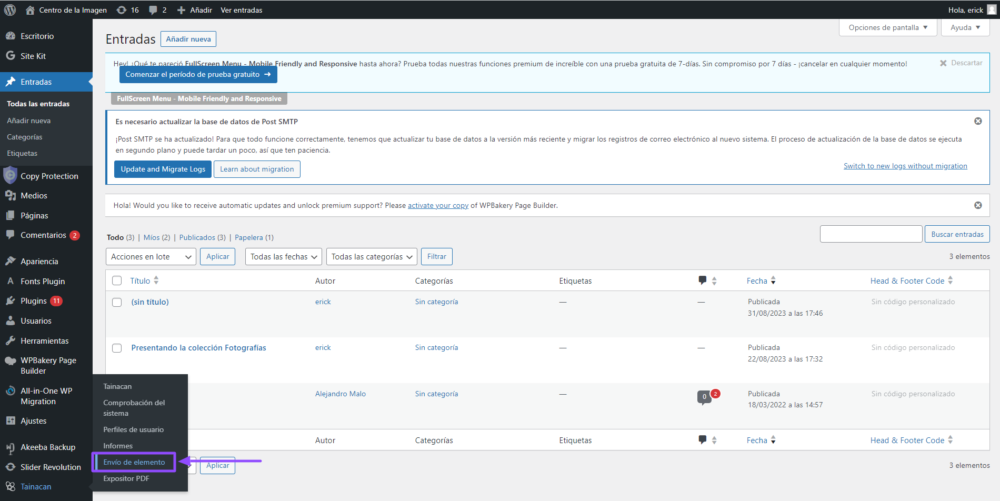

2. En esta página, encontrará dos campos que deben completarse: la "clave del sitio" y la "palabra secreta del sitio"

   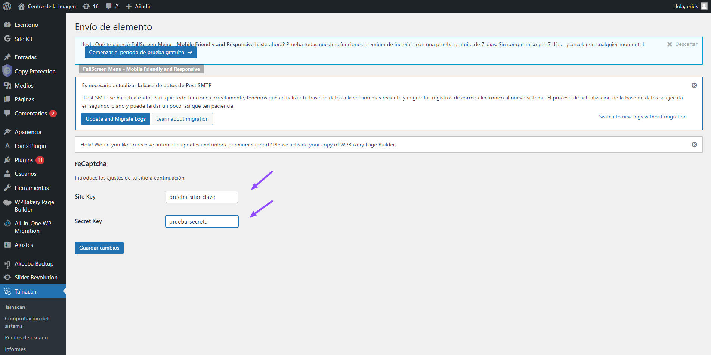

Ambos campos se obtienen en el sitio web de reCAPTCHA al registrar el sitio web en este enlace: https://www.google.com/recaptcha/admin/enterprise. No olvides hacer clic en "Guardar cambios" al completar este paso.

### Habilitar la colección para usar reCAPTCHA

En la configuración relacionada con el formulario de envío dentro del formulario de recolección, habilita la opción que dice "Usar la verificación reCAPTCHA en el formulario de envío". Una vez hecho esto, guarda la colección.

> Ten en cuenta que si ya habías creado un bloque de envío antes de realizar esta configuración, deberás eliminarlo y rehacer la inserción del bloque;

## Preguntas frecuentes

### ¿Dónde configuro qué preguntas aparecerán en el formulario?

El formulario de envío de elementos no es más que un mapeo del formulario de edición de elementos existente en su colección. Por lo tanto, para configurar qué campos estarán en él, debe editar los metadatos de su colección. En la página de metadatos, puede cambiar el orden de los metadatos, las etiquetas, las descripciones y particularidades, como que sean obligatorios o no. Puede encontrar más información [en esta página](/es-mx/metadata).

### ¿Cómo configurar un flujo de validación para envíos?

No hay un identificador específico que diga "Este elemento proviene de una confirmación". Por defecto, los elementos enviados a través del formulario irán a la pestaña de la lista de elementos en relación con el [estado establecido en la colección](#configuración-de-la-colección). De esta forma se garantiza que no se hagan públicos inmediatamente y que puedan ser revisados y aprobados antes. Es posible, eso sí, crear un metadato privado de tipo Selección o Taxonomía (que no aparezca en el formulario) y que le ayude a identificar posibles subetapas de un flujo de aprobación (como "En revisión", "Falta revisión"), antes de que se apruebe definitivamente.

### No puedo crear nuevos términos desde el formulario, ¿por qué?

Por ahora, no es posible crear nuevos términos de "metadatos de tipo taxonomía" directamente desde el "formulario de envío de artículos". Esta limitación existe porque las "Taxonomías" son configuraciones "a nivel de repositorio" y necesitan una capa extra de seguridad para que usuarios externos no traigan problemas a sus vocabularios controlados. No obstante, la funcionalidad está abierta a debate para un mayor desarrollo.

### Quiero un formulario con campos no relacionados con la colección. ¿Es posible?

El módulo de envío de ítems está orientado a los ítems de las colecciones de Tainacan. Si quieres obtener una información de tu usuario y no consideras que esa información sea de una colección concreta de tu repositorio, quizás lo que necesites es un plugin de formulario para tu sitio. Existen [varios disponibles para WordPress](https://es.wordpress.org/plugins/search/form/ ":ignore") que incluso se pueden insertar en la misma página del bloque de envío de artículos, pero dejando en claro que se trata de información separada.

### Ya utilizo un plugin reCAPTCHA. ¿Hay alguna integración con el envío de artículos?

De hecho, hay [algunos complementos que ya habilitan reCAPTCHA](https://es.wordpress.org/plugins/search/reCaptcha/ ":ignore") en la mayoría de los formularios de su sitio. Sin embargo, estos plugins no se integran automáticamente en Taiancan. Sin embargo, una vez que los utilice, puede aprovechar la clave del sitio y la palabra secreta generada para ellos y copiar y pegar en los [campos de configuración](#configuración-de-recaptcha-en-su-sitio-web), por lo que todos estarán protegidos por el menor mecanismo e incluso puede realizar un seguimiento de las estadísticas de ataque y protecciones en el panel de administración de Google reCAPTCHA.
