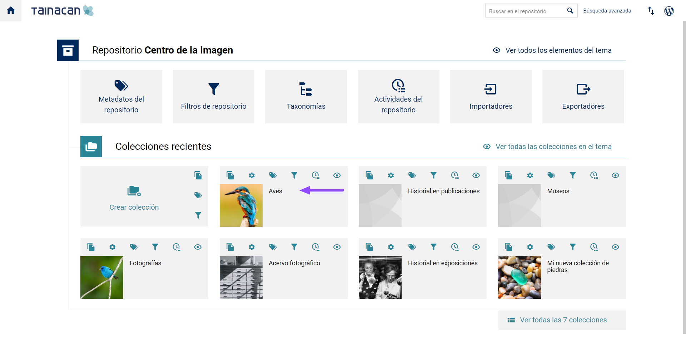
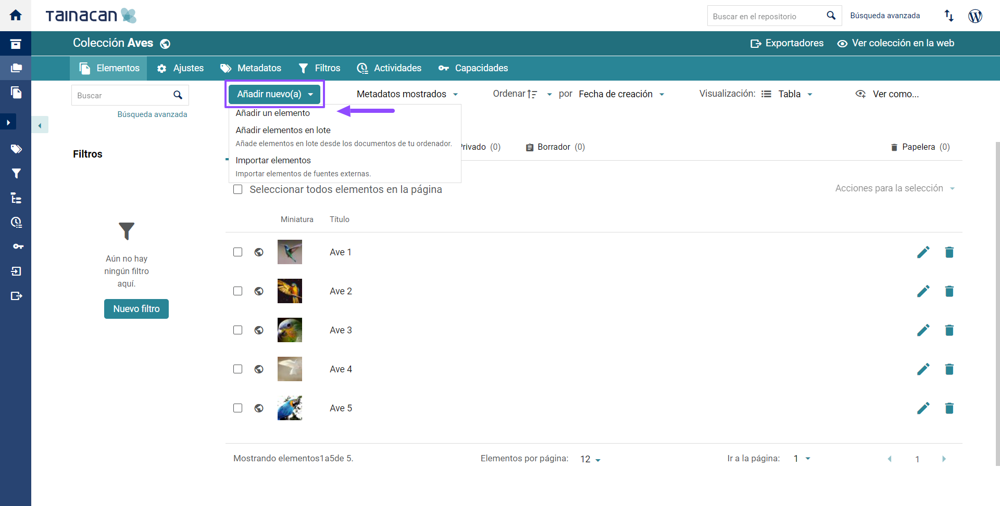
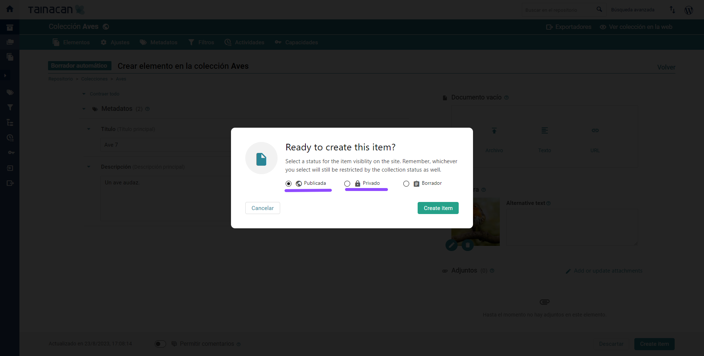
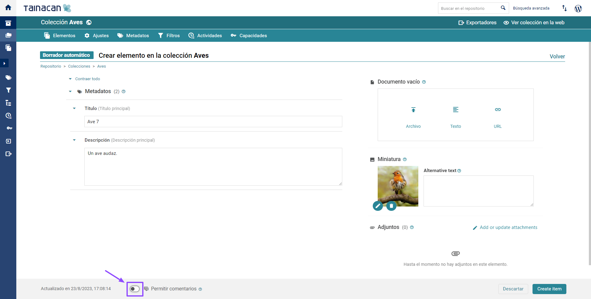
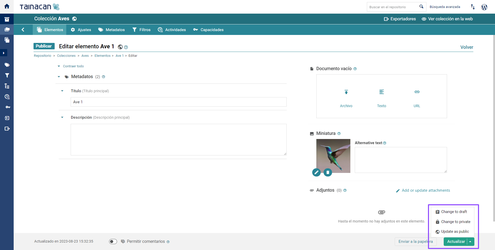
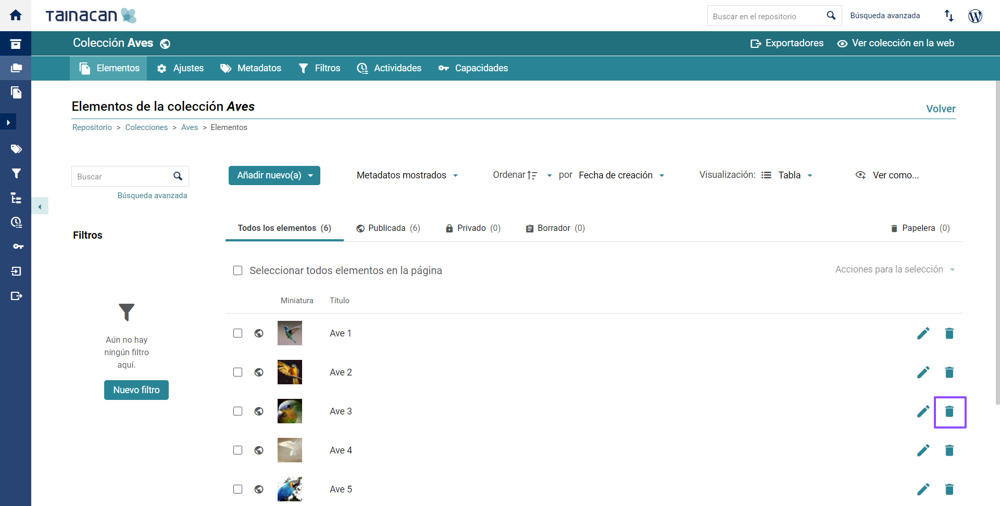
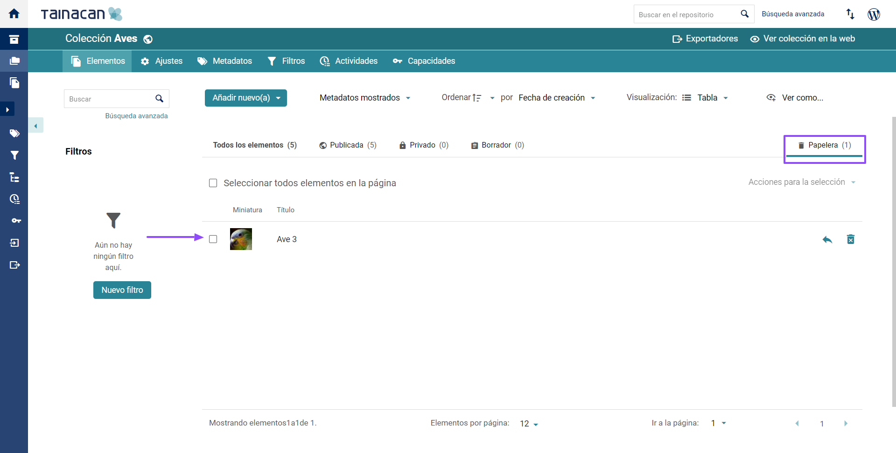
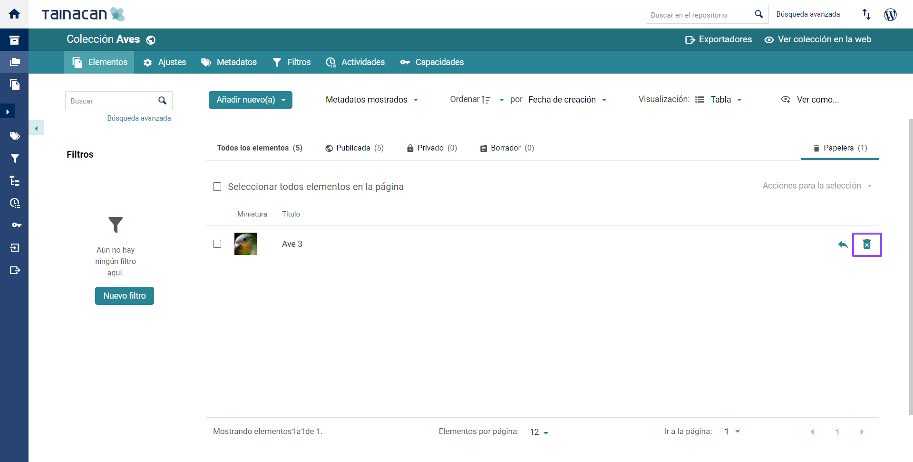

	

# Elementos

Los **ítems** (llamados también “elementos”) son los contenidos reales del repositorio de Tainacan, que están representados por pinturas, películas, libros, etc. En Tainacan, los “ítems” están organizados por “colecciones” y cada **colección** tiene un conjunto de metadatos, los cuales se configuran de acuerdo a las características de los “ítems” que formarán parte de ella.

> En la jerga de WordPress, cada “elemento” se considera como una “publicación” y el tipo de publicación representa su “colección”.

El “elemento” es el conjunto formado por un documento (puede ser un “archivo de imagen, video o audio”, un “texto” o una “URL”), sus metadatos y cualquier documento adjunto (si lo hubiera).

<!-- tabs:start -->

#### ** Crear **
## Crear elementos

1. Accede al panel de control de _WordPress_;

   

2. En la barra lateral izquierda, haz clic en “Tainacan”;

   

3. En la sección "Colecciones", haz clic en la "colección" deseada;

   

4. Haz clic en “Agregar nuevo” en la esquina superior izquierda y selecciona la opción deseada:

   ● Haz clic en "Agregar un elemento" para enviar solo un "elemento";

   

   ● Haz clic en "Agregar ítems en bloque" para agregar un conjunto de ítems. Consulta Acciones masivas para obtener más información;

   ● Haz clic en "Importar ítems" para agregar un gran lote de "elementos" mediante la importación de un archivo en formato .csv. Consulta Acciones masivas para obtener más información;

5. Elige el tipo de soporte documental que tendrá el “ítem o elemento”:

   ● **“Archivo”**: Carga archivos de  "imágenes", "audios", "archivos de texto", "videos", etc., desde tu computadora, o selecciónalo de la "biblioteca de medios" de WordPress. Consulta este artículo de compatibilidad de archivos de WordPress para obtener más información;

   <iframe
       width="560"
       height="513" 
       src="https://www.youtube.com/embed/LSNu9qV-htM" title="YouTube video player"
       frameborder="0"
       allow="accelerometer; autoplay; encrypted-media; gyroscope; picture-in-picture"
       allowfullscreen>
   </iframe>

   ● **“Texto sin formato”**: Un campo para ingresar texto sin formato;

   <iframe
       width="560"
       height="513" 
       src="https://www.youtube.com/embed/v_wOBFRtb1Y" title="YouTube video player"
       frameborder="0"
       allow="accelerometer; autoplay; encrypted-media; gyroscope; picture-in-picture"
       allowfullscreen>
   </iframe>

   ● **“URL”**: Permite la incorporación de enlaces multimedia (embed) de varios sitios, como YouTube, Vimeo, etc.;

   <iframe
       width="560"
       height="513" 
       src="https://www.youtube.com/embed/fh5KLS70Z-o" title="YouTube video player"
       frameborder="0"
       allow="accelerometer; autoplay; encrypted-media; gyroscope; picture-in-picture"
       allowfullscreen>
   </iframe>

6. Establece una miniatura para el "elemento"

   > Nota: Los documentos principales en formato “PDF”, “imágenes”, “videos”y “URL” generan su propia miniatura automáticamente.

   > Nota: Incluso en estos casos, es posible cambiar la miniatura de forma manual.
   >
   > i. Haz clic en el "icono de lápiz" en el cuadrado que ilustra la miniatura;
   >
   > ii. Selecciona el archivo de la "biblioteca de medios" o cárgalo desde tu computadora.

7. Determina el estatus del elemento:

   ● **“Público”**: El "ítem" puede ser visto por todos;

   > ○ Nota: El control de visibilidad del "ítem" para el público externo se define por el "estatus de la colección" (“publicada” o en estado de “borrador”).

   ● **“Privado”:** El "ítem" solo es visible para los editores de la colección. Consulta Permisos de usuario para obtener más información.

   

8. Define si el “ítem” puede recibir comentarios;

   a. Solo es posible permitir o no permitir comentarios sobre los “ítems” si la función está activada en la configuración de la colección;

   b. Los comentarios se pueden administrar en la sección de comentarios del "panel de control de WordPress". Puedes obtener más información en la documentación de WordPress;

   

9. Rellena los campos disponibles en la sección de metadatos:

   a. Cada "colección" ofrecerá un conjunto de metadatos para completar de acuerdo con la configuración de metadatos del repositorio y de la "colección". Consulta Metadatos y colecciones para obtener más información;

   b. Los metadatos configurados como "obligatorios", no permitirán que el "ítem" se guarde como "borrador" o "publicado", si no se completan. Consulta Metadatos y colecciones para obtener más información.

   <iframe
       width="560"
       height="513" 
       src="https://www.youtube.com/embed/o8--OSPVm1Y" title="YouTube video player"
       frameborder="0"
       allow="accelerometer; autoplay; encrypted-media; gyroscope; picture-in-picture"
       allowfullscreen>
   </iframe>

10. Para terminar la "creación de ítems", elige entre las siguientes opciones:

    **● “Crear elemento”**: El “ítem” será agregado en la “colección”;

    ● **“Guardar como borrador”**: El “ítem” agregado solo estará disponible en la sección “Borrador” de la “colección” (visible solo para quienes tengan permisos de administración en el repositorio);

    ● **“Descartar”**: La creación del “ítem” se interrumpe y los campos rellenados no se guardarán.

    

#### ** Editar **
## Editar elementos

1. Accede al panel de control de WordPress;

   

2. En la barra lateral izquierda, haz clic en “Tainacan”;

   

3. En la sección "colecciones", haz clic en la "colección" deseada;

   

4. Haz clic en el "icono de lápiz" ubicado junto a la información del "ítem" que deseas editar:

   ● Puedes usar filtros o el campo de búsqueda para encontrar el "elemento";

   ● Todos los campos del "elemento" se pueden cambiar, incluidos "documento", "archivos adjuntos" y "miniatura";

   ● Los "elementos" no se pueden migrar de una "colección" a otra.

   

5. Para terminar de editar el “ítem”, elige entre las siguientes opciones:

   ● **“Actualizar”**: Se guardarán los cambios en el "elemento";

   ● **“Enviar a la papelera”**: El “elemento” será enviado a la papelera;

   ● **“Volver a borrador”**: El "elemento" se convertirá en "Borrador".

   

#### ** Eliminar **
## Eliminar elementos

1. Accede al panel de control de WordPress;

   

2. En la barra lateral izquierda, haz clic en “Tainacan”;

   

3. En la sección "colecciones", haz clic en la "colección" deseada;

   

4. Haz clic en el "icono de papelera" ubicado junto a la información del "ítem" que deseas eliminar. Puede usar "filtros" o el "campo de búsqueda" para ubicar el "ítem”:

   > Nota: La “eliminación de ítems” también implica la “eliminación de documentos”, “información de metadatos” y “archivos adjuntos”.

   !>**Atención**: Elimina el "ítem" solo si estás seguro de que no habrá una pérdida grave de información. Consulta Registro de actividad para obtener más información.

   

### Restaurar elementos de la papelera

Cuando eliminas un "ítem" de una"colección" en Tainacan, se envía a la papelera de reciclaje. Sin embargo, antes de eliminar permanentemente un "ítem", puedes restaurarlo desde la papelera de reciclaje. Para recuperar elementos de la papelera de reciclaje de forma masiva, consulta la sección Acciones masivas.

1. Los archivos enviados a la papelera están disponibles en la pestaña _"Papelera"_ de la colección;

   

2. Haz clic en la flecha ubicada a la izquierda del _"icono de papelera"_ de cada _"elemento"_ que quieres restaurar. Al restaurar un _"elemento"_ de la papelera de reciclaje, vuelve a su estado anterior, _"publicado"_ o _"privado"_.

   

### Borrar permanentemente

Cuando eliminas un _"elemento"_ de una _"colección"_ en Tainacan, se envía a la papelera de reciclaje. Sin embargo, antes de eliminarlo permanentemente, puedes restaurarlo desde la papelera de reciclaje. Para eliminar de forma masiva los _"elementos"_ que están en la papelera de reciclaje, consulta la sección Acciones masivas.

1. Los archivos enviados a la papelera están disponibles en la pestaña _"Papelera" de la "colección"_;

   

2. Haz clic en el _"icono de papelera"_, ubicado a la derecha de la información en el _"elemento"_. Si eliminas permanentemente un _"elemento"_, no será posible recuperarlo.

   
   
<!-- tabs:end -->
