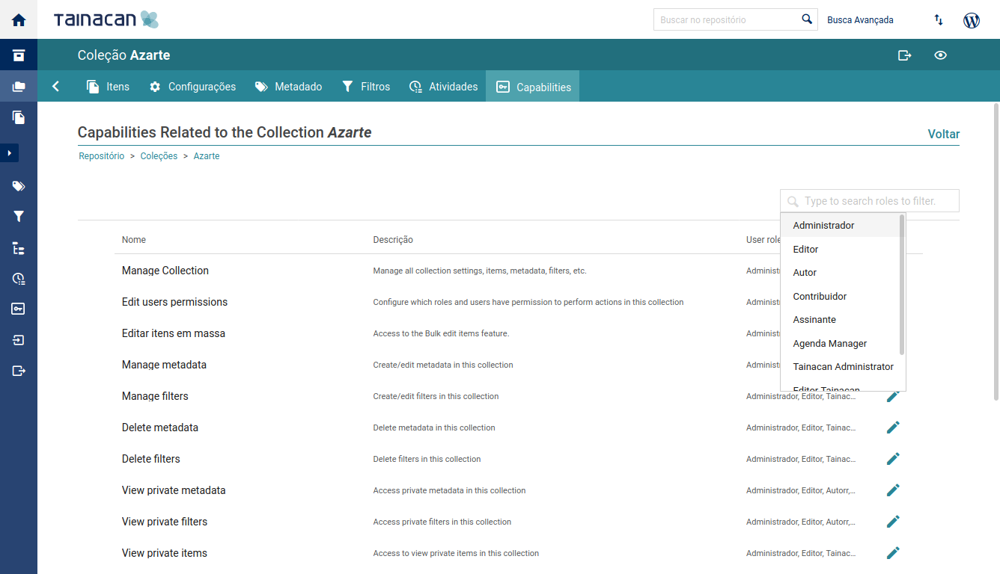
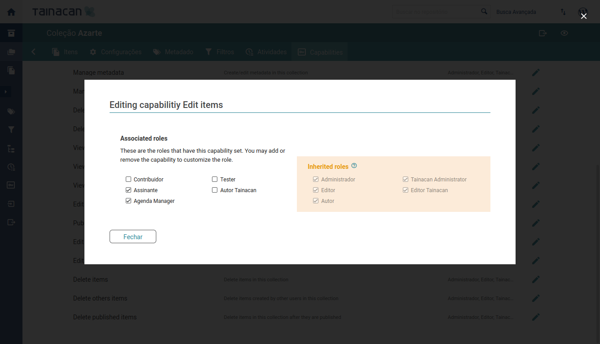

# Administrar permisos específicos

A partir de la versión 0.15 de Tainacan, cuando accedes al Panel de Administración de Tainacan, puedes acceder a la pantalla de configuración de Permisos, tanto a nivel de repositorio como a nivel de colección:

Esta pantalla lista todos los permisos que tienen algo que ver con ese repositorio o colección. También puede filtrar la lista por roles de usuario que tengan ese permiso.

Al editar un permiso, puedes ver qué roles lo tienen. Los roles están separados en dos grupos:

- **Roles heredados** son aquellos que no tienen específicamente este permiso, pero tienen otro permiso, de mayor importancia, que afecta a este permiso. Por ejemplo, los Administradores suelen tener el permiso "Gestionar Tainacan", que les exime de tener configurado cualquier otro permiso, ya que este permiso garantiza el acceso a todos los demás. Para eliminar este tipo de permiso, es necesario desmarcar primero el permiso más importante, y luego configurar cuáles son los específicos que deben tener.
- **Funciones asociadas** son aquellas que pueden o no estar asociadas a este permiso.

Para acceder a estas pantallas, el usuario debe tener un rol con el permiso [Gestionar permisos de usuario](/es-mx/capabilities#repositorio-general) o [Gestionar los permisos de los usuarios de la colección](/es-mx/capabilities#colección)
