

	

# Metadatos

En Tainacan, los _"elementos"_ se organizan a través de _"colecciones"_ y cada _"colección"_, puede tener _"metadatos"_ específicos o compartir _"metadatos"_ entre sí.  Los "metadatos" se utilizan para describir los _"elementos"_ con vistas a la recuperación.

>Los _"metadatos"_ definen las características, parámetros y especificidades de la información que se insertará junto con el documento digital durante el envío de _"elementos"_ a las _"colecciones"_. Es similar, por ejemplo, a la configuración de los campos que formarán parte de un _“formulario"_, o a los campos de una _“ficha de museo”_.

Cada _“metadato”_ tiene un conjunto de configuraciones posibles: ¿Es un _“metadato obligatorio”_? ¿Sus _"valores"_ son únicos para cada _"elemento"_ (como en el caso del número de inventario, por ejemplo)? ¿Acepta _“valores múltiples”_ (varios autores, por ejemplo)?

En este artículo, describimos:

- Las [características generales de los metadatos](#características-generales-de-los-metadatos), presentes em todos os tipos;
- Cómo crear metadatos, ya sea [nivel de repositorio](#crear-metadatos) o [nivel de colección](#crear-metadatos-a-nivel-de-colección);
- Los [tipos de metadatos](#tipos-de-metadatos) y sus particularidades;
- Cómo [editar metadatos](#editar-metadatos) existentes;
- Cómo [eliminar metadatos](#eliminar-metadatos);

En otros artículos, también puedes ver información relevante como:

- Cómo organizar largas listas de metadatos con la función [Secciones de metadatos](/es-mx/metadata-sections.md);
- Cómo editar varios metadatos a la vez con [Acciones Masivas](/es-mx/bulk-actions.md);
- Cómo importar y exportar _“metadatos predefinidos”_. [Ver Importadores](/es-mx/importers.md);

---

## Características generales de los metadatos

- Por defecto, todas las _"colecciones"_ tienen los _"metadatos"_ de _"Título"_ y _"Descripción"_, que no se pueden borrar, pero pueden _"editarse" o"deshabilitarse"_. Estos _"metadatos"_ se utilizan en algunos listados dentro de Tainacan para representar el _"elemento"_;
- _“Metadatos heredados”_ que pueden ser _“habilitados"_ o _"deshabilitados"_, lo que implica que se van a mostrar para ser llenados al enviar un nuevo _"elemento"_ o no, y también su presencia o ausencia (con sus respectivos datos) durante la visualización de las _"colecciones"_ y de los _"elementos"_;
- **Los _“metadatos a nivel de repositorio”_ son heredados por todas las _"colecciones"_** del repositorio. Aparecen marcados con “_heredado_” delante del nombre;
- Una vez que se ha creado un metadato, no se puede cambiar su tipo. Por ejemplo, no se puede cambiar un metadato del tipo _"Texto"_ a _"Texto largo"_, o _"Numérico"_ o a _"Fecha"_, después de su creación;
- Los _"metadatos"_ que no han sido heredados del repositorio se pueden eliminar y muestran un "icono de papelera" delante de ellos. Ver [eliminar metadatos](#eliminar-metadatos) para obtener más información.

Tainacan no tiene una _“plantilla o modelo de metadatos predeterminado”_, sino diferentes _"tipos de metadatos"_ que pueden elegirse para satisfacer las necesidades del usuario durante la configuración de su colección digital. La correcta elección del _“tipo de metadato”_ ayudará al llenado de la información y, en consecuencia, en la recuperación más precisa de los _"elementos"_.

Los _"metadatos"_ pueden crearse automáticamente durante la importación masiva de datos, o manualmente durante la creación de la _"colección"_ mediante el _"panel administrativo"_.

## Crear metadatos

Los _"metadatos"_ pueden crearse manualmente a nivel de ""repositorio" o a nivel de "colección"". Los _"metadatos"_ creados a nivel de _"repositorio"_ son heredados por todas las _"colecciones"_.

Los _“metadatos a nivel de repositorio"_ deben estar pensados para permitir la inserción de información global, es decir, común al menos a una gran parte del repositorio. Por ejemplo: _“Número de registro”_, _“Tipo de archivo”_, _“Fecha de registro del elemento”_, _“Estado de conservación”_, etc.

Las nuevas _"colecciones"_ también pueden crearse con una plantilla de _"metadatos predefinidos"_ o importarse de fuentes externas. Las _"colecciones"_ creadas con _"metadatos predefinidos"_ se basan en un conjunto de _"metadatos predefinidos"_ durante su creación, y pueden gestionarse del mismo modo que otras _"colecciones"_.

​Desde la versión 0.6 de Tainacan, hay una opción para crear _"colecciones"_ con un conjunto de _"metadatos"_ del modelo _“Dublin Core”_.

Se pueden desarrollar nuevos conjuntos de _"metadatos"_ según las necesidades individuales de cada instalación, y/o añadirlos a Tainacan. Consulta [desarrollo de plugins](es-mx/dev/) para conocer más información sobre el desarrollo de Tainacan.

1. Inicia sesión en WordPress con tu _"nombre de usuario"_ y _"contraseña"_;

   

2. En el _“panel administrativo”_ da clic en _“Tainacan”_;

   

3. Da clic en _“Metadatos del repositorio”_;

   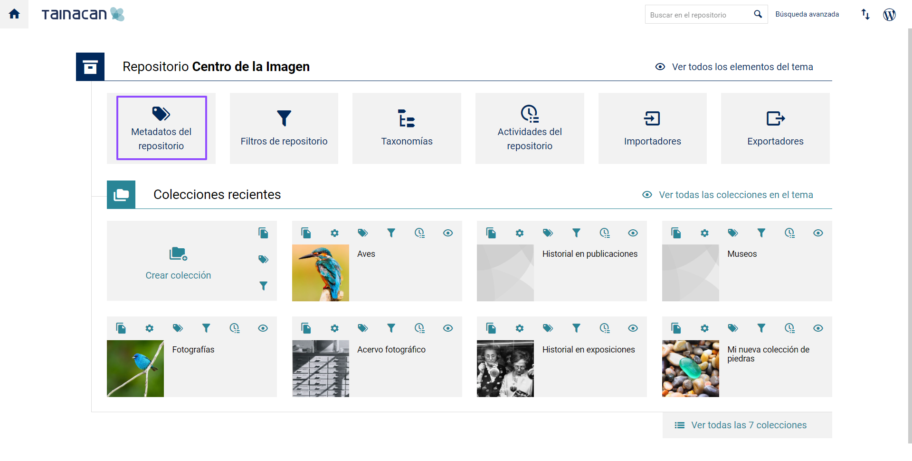

4. Para crear un nuevo metadato, simplemente elige el _“tipo de metadato”_ del listado que aparece en la columna de la derecha, arrástralo y suéltalo al final de la lista de metadatos que ya están creados. El nuevo metadato aparecerá en último lugar de la lista de metadatos del repositorio.  También puedes utilizar la función de arrastrar y soltar para _“ordenar los metadatos”_ durante su creación.

## Crear metadatos a nivel de colección

- Los "metadatos" a nivel de "colección" solo se aplican a los "elementos" creados en esta "colección". Se aplican también en las colecciones "hijas" de esta colección;
- Crea o elige la "colección" en la que deseas "crear nuevos metadatos". Consulta Crear colección para obtener más información;

1. Inicia sesión en WordPress con tu _"nombre de usuario"_ y _"contraseña"_;

   

2. En el _“panel administrativo”_ da clic en _“Tainacan”_;

   

3. Crea una _"colección"_ como se indica en la sección _“Crear colecciones”_;

4. Entra a la _“colección”_ que creaste y haz clic en _“Metadatos”_;

   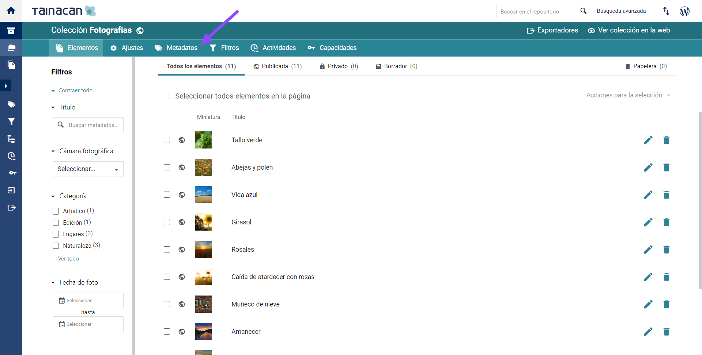

5. Para _"crear nuevos metadatos"_, simplemente elige el tipo de metadato que quieres crear y arrástralo a la lista de la izquierda, donde ya están los _“metadatos por defecto”_ de la colección.  El nuevo metadato aparecerá en último lugar en esta lista. También puedes utilizar la función de arrastrar y soltar para acomodar los metadatos en el orden que prefieras. Ver [tipos de metadatos](/es-mx/metadata.md#tipos-de-metadatos) para conocer cuál es el _“metadato”_ más adecuado para cada tipo de información;

6. Cada _“metadato”_ tiene que configurarse individualmente, eligiendo los ajustes y funciones posibles. A continuación describimos las funciones generales que se pueden configurar en prácticamente todos los metadatos. Consulta el área de metadatos para aprender a utilizar ajustes específicos (enlace);

   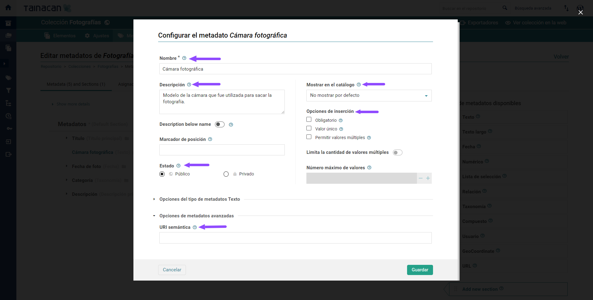

   **“Nombre”**: Aquí hay que escribir el nombre del metadato, por ejemplo: _“Título”_, _“Creador”_, _"Estado de conservación"_, etc;

   **“Descripción”**: Breve descripción, útil para describir o explicar cómo debe llenarse este metadato. Durante el llenado, quien esté capturando la información podrá ver la descripción si pasa el cursor sobre el signo de interrogación que está al lado del metadato;

   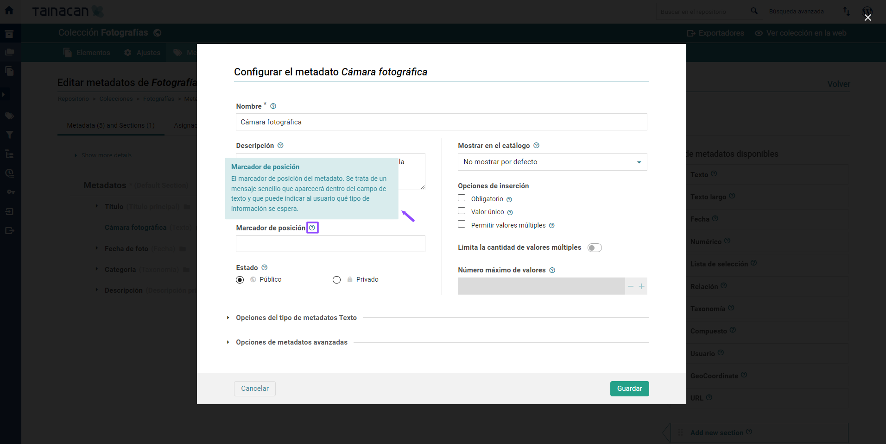

   **“Marcador de posición”**: Campo utilizado por metadatos con campo de texto para dar una breve instrucción sobre cómo llenarlo. Se trata de un mensaje sencillo que aparecerá dentro del campo de texto y que puede indicar al usuario qué tipo de información se espera. Por ejemplo: _“Escriba su nombre completo aquí…”_.

   **“Estado”**: Determina el nivel de privacidad del metadato, es decir, nos permite configurar metadatos que solo estarán visibles para los administradores de la colección, pero no para los visitantes. Es muy útil cuando se registra información sensible (por ejemplo, avalúos, datos de localización de las otras, etc.) También nos sirve para configurar información que solo podrán ver quienes tengan un rol específico en la colección. Ver [Permisos de usuario](/es-mx/users.md) para más detalle. Los dos estados que pueden configurarse son;

   ​ ■ “Público”: Se muestran junto con el _“elemento”_, dependiendo del nivel de privacidad de este _“elemento”_ y de la _“colección”_ a la que pertenece;

   ​ ■ “Privado”: solo se muestra a los administradores, editores y moderadores de la _"colección"_. Ver [Permisos de usuario](/es-mx/users.md) para conocer más detalle.

   **“Mostrar en listado”**: Determina si el _“metadato”_ se muestran por defecto en la vista previa de los ítems:

   ​ ■ “Mostrar por defecto”: los _“metadatos”_ se muestran por defecto en la página de vista de la _“colección”_ (dependiendo del tipo de vista previa) y en la vista previa del _“elemento”_;

   ​ ■ “No mostrar por defecto”: los _“metadatos”_ no se muestran de forma predeterminada en la vista de _“colección”_, pero el usuario puede seleccionarlos para que se muestren en la página de la colección (dependiendo del tipo de vista) y también en la vista previa del _“elemento"_;

   ​ ■ “No mostrar nunca”: los _“metadatos”_ no se muestran en la vista previa de la _“colección”_ ni pueden ser selecciondos por el usuario para mostrarse en esta vista previa. De cualquier forma, los metadatos son visibles en la vista previa del elemento. Hay que cambiar el _“estado del metadato”_ para cambiar su nivel de privacidad.

   **“Opciones de llenado”**:

   ​ ■ “Obligatorio”: determina si es obligatorio llenar este “metadato”. Si no se ha llenado un metadato obligatorio, no se puede enviar el elemento a la colección;

   ​ ■ “Único o Múltiple”: Determina si los “metadatos” permiten la inserción de un solo valor o de múltiples valores, como, por ejemplo, “metadatos” sobre “Color”, “Material”, etc;

   ​ ■ “Valor único”: indica que el valor ingresado en este metadato no debe repetirse en otros “elementos” del repositorio (para “metadatos” creados a nivel de repositorio) o en la misma “colección” (para “metadatos creados a nivel de colección”).

   **“URL semántica”**: URL de la descripción semántica del _“metadato”_. Su configuración es opcional;

   Dependiendo del _“tipo de metadato”_, puede haber otras especificaciones para configurar. Ver [tipos de metadatos](/es-mx/metadata.md#tipos-de-metadatos) para más detalles.

7. Después de completar y configurar los metadatos, da clic en _“Guardar”_, o en _"Cancelar"_ para abortar la misión. Una vez guardados, los _“metadadatos”_ creados aparecerán como un campo a rellenar al enviar y editar nuevos _"elementos"_.

## Tipos de Metadatos

A continuación, describimos cada uno de los _"tipos de metadatos"_ disponibles y sus configuraciones.

### Texto sin formato

Conocido también como _“texto corto”_, se recomienda el uso de este metadato para información que consista en un texto breve en formato libre y sin saltos de línea. No tiene un número límite de caracteres, pero solo permite insertar un texto corrido, sin separación de párrafos;

### Área de texto

Conocido también como _“texto largo”_, este metadato se usa para insertar texto en formato libre. Permite la inserción de párrafos;

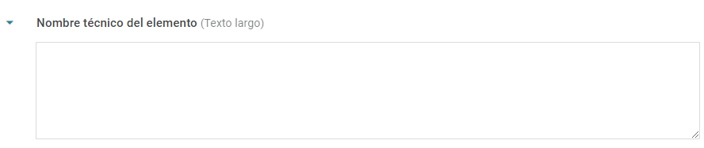

### Fecha

Para _"metadatos"_ de fechas completas en el formato _“DD/MM/AAAA”_. Si no tiene la fecha completa, se sugiere elegir otros campos para ingresar fechas, como _"metadato numérico"_ o _"metadato de texto corto"_. Cuando se usa el metadato de tipo _“fecha”_, permite la recuperación de _"elementos"_ por intervalos de tiempo en dos tipos de filtros. Revisa los filtros disponibles para cada tipo de metadatos para obtener más información;

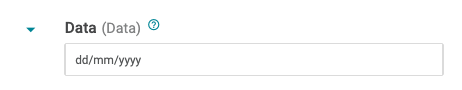

### Numérico

Para _"metadatos"_ que contienen solo números. Este tipo de _“metadato”_ permite la recuperación de _"elementos"_ por intervalos. Revisa los filtros disponibles para cada tipo de metadatos para obtener más información;

​■**Ajustes adicionales**

Intervalos: Puede configurar la cantidad a incrementar/decrementar haciendo clic en los botones de control mientras completa el formulario del _“metadado”_. Por ejemplo: si utilizas un _“metadato numérico”_ como "Década", puedes establecer el cambio de intervalo en 10. En el llenado, al hacer clic en las flechas, el valor se incrementará de 10 en 10.

<iframe    width="560"    height="513"     src="https://www.youtube.com/embed/_hRrB6wVY7k" title="YouTube video player"    frameborder="0"    allow="accelerometer; autoplay; encrypted-media; gyroscope; picture-in-picture"    allowfullscreen></iframe>

### Lista de selección

Se usa para _"metadatos"_ que tienen un pequeño conjunto de términos controlados. A diferencia de la _"taxonomía"_, los términos no se convierten en un enlace en la página del _"elemento"_ y no tienen su propia página;

​■**Ajustes adicionales**:

​Los términos se añaden en el campo _"Opciones"_. Para añadir más valores, basta con escribir el término y hacer clic en **“enter”**.

<iframe    width="560"    height="513"     src="https://www.youtube.com/embed/-UoNKi7KfBw" title="YouTube video player"    frameborder="0"    allow="accelerometer; autoplay; encrypted-media; gyroscope; picture-in-picture"    allowfullscreen></iframe>

!>**Atención**: Para crear nuevos términos en la lista de selección, es necesario que el usuario tenga permiso para editar los “metadatos” en cuestión. Los “metadatos” de la lista de selección no permiten la creación de nuevos términos durante el llenado, estos términos necesitan ser configurados previamente.

### Taxonomías

Los _"metadatos de tipo **Taxonomía**"_ utilizan una _"taxonomía"_ creada de antemano. Este tipo de _"metadatos"_ es especialmente útil para información estructurada a partir de un "vocabulario controlado", permitiendo incluso la jerarquización de términos. A continuación se detallan los pasos para configurar un metadato del tipo _"Taxonomía"_.

​■**Ajustes adicionales**

​Como se indicó anteriormente, es necesario crear primero la _“Taxonomía”_. Esta se utilizará durante el proceso de creación de un _“Metadatos de taxonomía”_:

1.Crea la _“taxonomía”_. Ver [crear taxonomías](/es-mx/taxonomies.md#crear-taxonomias) para tener más detalles;

2.Crea un _“metadato”_ del tipo _“Taxonomía”_. Consulta Crear metadatos para obtener más información;

3.En el área de _"edición de metadatos"_, selecciona la _"taxonomía"_ deseada para rellenar los valores de los _"metadatos"_;

<iframe    width="560"    height="513"     src="https://www.youtube.com/embed/bDy0FQFolAs" title="YouTube video player"    frameborder="0"    allow="accelerometer; autoplay; encrypted-media; gyroscope; picture-in-picture"    allowfullscreen></iframe>

4.Elige el tipo de entrada de información que se desplegará para rellenar los valores de los _"metadatos"_;

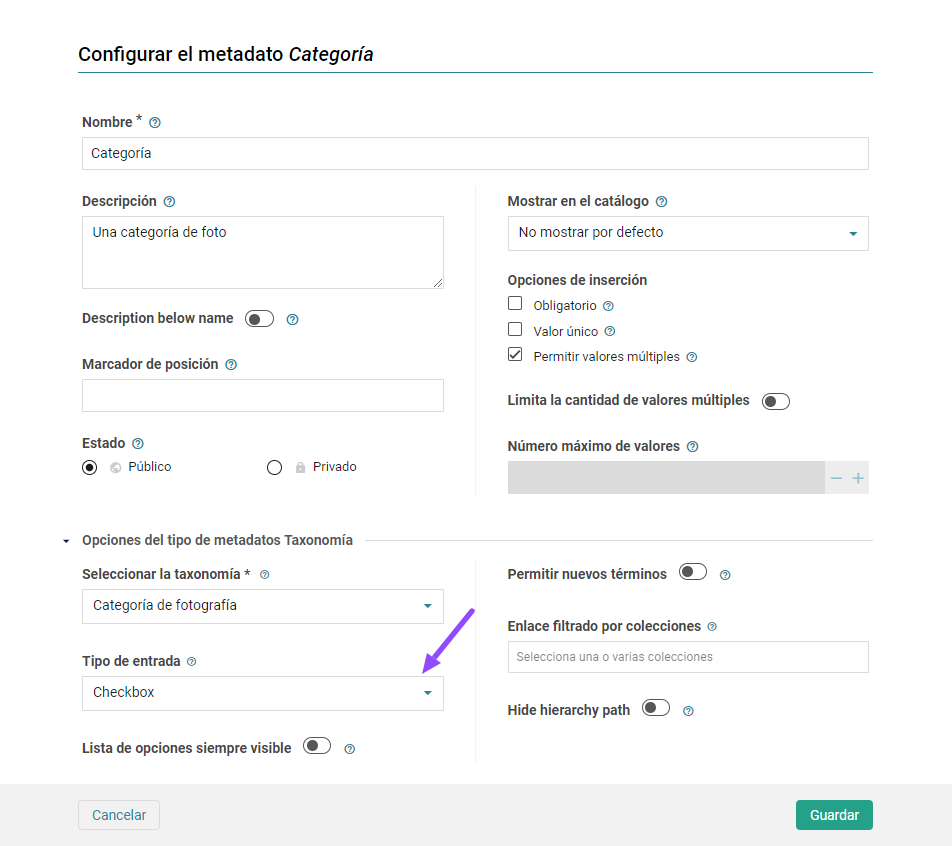

​■**Entrada de tipo**  **etiqueta**:

En este tipo de entrada, al usuario solo se le ofrece un cuadro de búsqueda. Los términos pueden explorarse escribiendo y buscando;

<iframe    width="560"    height="513"     src="https://www.youtube.com/embed/RUaAFqM_XmE" title="YouTube video player"    frameborder="0"    allow="accelerometer; autoplay; encrypted-media; gyroscope; picture-in-picture"    allowfullscreen></iframe>

■**Entrada de tipo** **"Casilla de verificación”:**

Este tipo de entrada ajuda o usuário a saber quais são os termos disponíveis para escolha em uma determinada _“Taxonomia”_. Os termos podem ser explorados em ordem alfabética ou por meio de digitação e busca;

<iframe    width="560"    height="513"     src="https://www.youtube.com/embed/6-3nRtvMvXQ" title="YouTube video player"    frameborder="0"    allow="accelerometer; autoplay; encrypted-media; gyroscope; picture-in-picture"    allowfullscreen></iframe>

5.Marca la opción _"Lista de opciones siempre visible"_ si quieres que, durante el llenado, la lista de opciones esté siempre visible. Esta opción solo está disponible para la entrada de tipo _"Casilla de verificación";_

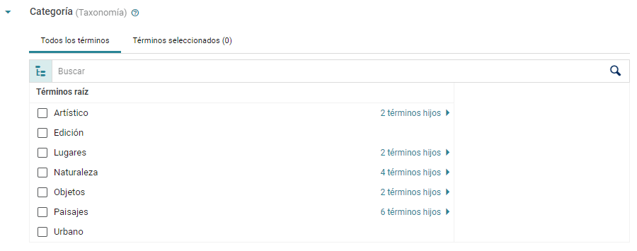

6.Si es necesario, activa _"Permitir nuevos términos"_ para autorizar la creación de nuevos términos para la _"Taxonomía"_ durante el registro de "elementos".

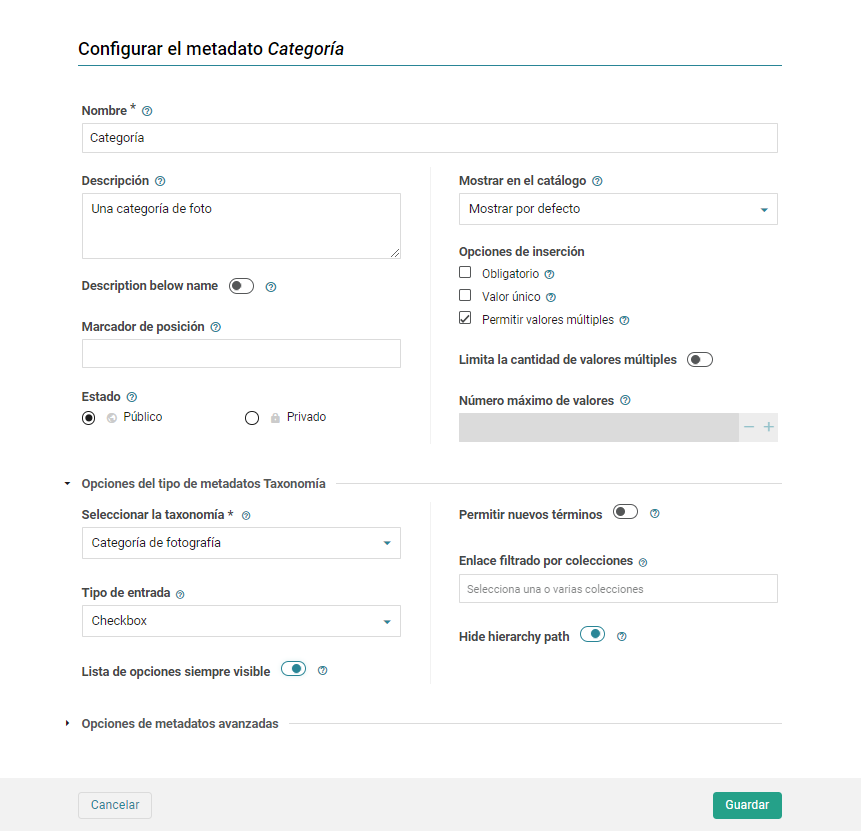

■**“Enlace filtrado a la colección”**

Los términos de una _"taxonomía"_ se convierten en elementos, esto ofrece al usuario la posibilidad de hacer una búsqueda facetada de la colección (es decir, seleccionar un término para hacer la búsqueda). Por ejemplo: en una ficha de una moneda de oro, haciendo clic en el enlace que hace referencia al término _"oro"_ el visitante tendrá acceso a todos los _"elementos"_ que se clasificaron con el mismo material. Como una _"Taxonomía"_ puede ser compartida entre diferentes _"colecciones"_ en Tainacan, se puede configurar si el enlace del _"elemento"_ dará acceso a ítems de otras colecciones o solo de la colección a la que pertenece el elemento.

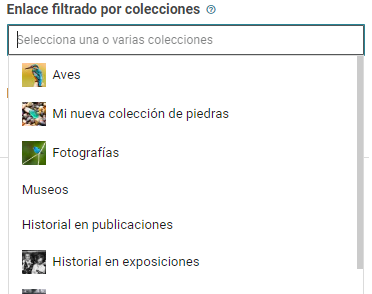

### Metadato de relación

Los _"metadatos de relación"_ permiten establecer una conexión entre elementos de una misma colección o entre elementos de colecciones diferentes, es decir, asignan un elemento de una colección como valor para su relleno;

​■**“Ajustes adicionales”**

1.Selecciona la _"colección relacionada"_ para señalar el origen de la lista de _"elementos"_ que aparecerán cuando se haga la captura de los _"metadatos"_;

2.Cuando se selecciona una _"colección"_, la sección _"Metadatos para la búsqueda"_ permite elegir los metadatos de esta _"colección"_ que ayudarán a localizar los _"elementos"_ durante el llenado de estos _"metadatos"_;

3.Habilita _"permitir elementos repetidos"_ para que el mismo _"elemento"_ de la _"colección relacionada"_ se asigne como valor de los _"metadatos"_ en diferentes _"elementos"_.

<iframe
      width="560"
      height="513" 
      src="https://www.youtube.com/embed/z1lc9X9GMTE" title="YouTube video player"
      frameborder="0"
      allow="accelerometer; autoplay; encrypted-media; gyroscope; picture-in-picture"
      allowfullscreen>
</iframe>

### Metadato compuesto

Los _"metadatos compuestos"_ son aquellos cuyo valor no puede representarse aisladamente por un solo campo. Por ejemplo, una dirección puede estar compuesta por campos _"texto"_, _"número"_ e incluso _"listas de control"_. Estos campos o _"metadatos"_ internos del compuesto se denominan _"Metadatos hijos"_.

Es importante diferenciar este concepto de un _“Sesión de metadatos”_, cuyo propósito es solo organizar datos _"agrupados"_. No lo utilices para una simple separación visual. En el caso de los _"metadatos compuestos"_, es posible tener multivalores compuestos, es decir, una lista de valores formada por diferentes subvalores que se relacionan entre sí.

Al usar _“metadatos compuestos”_, es importante tomar en cuenta que:

● No es posible tener una _"Taxonomía"_ como _"metadatos hijo"_;

● No se puede marcar un _"metadato compuesto"_ como _"Obligatorio"_ o _"Valor único"_. Este atributo se marcará en los hijos. Sin embargo, si el _"metadato compuesto"_ se marca como _"Acepta múltiples valores"_, sus hijos no podrán marcarse como _"Obligatorio"_;

● Los _"metadatos hijos"_ no pueden marcarse como _"Multivalor"_, y no tienen opciones de vista (_"Ver en lista"_), estos ajustes corresponden al padre;

● Los  _"metadatos compuestos"_ no estan disponibles como una opción para "Búsqueda avanzada" o "Edición masiva", solo sus _"metadatos hijos"_.

​■**Ajustes adicionales:**

1.Inmediatamente después de crear un _“metadato compuesto”_, se forma un área de creación de hijos debajo de su formulario. Arrastre los tipos de _"metadatos"_ deseados a esta área para crear hijos;

2.Ten en cuenta que la clasificación funciona internamente entre los hijos, pero una vez creada, no es posible cambiar los metadatos a _“sin hijos”_.

<iframe
      width="560"
      height="513" 
      src="https://www.youtube.com/embed/x-iUm3pbOmQ" title="YouTube video player"
      frameborder="0"
      allow="accelerometer; autoplay; encrypted-media; gyroscope; picture-in-picture"
      allowfullscreen>
</iframe>

### Metadatos de tipo usuario

Los _"metadatos de tipo usuario"_ permiten asignar a un usuario de WordPress como valor para su llenado. Con él se pueden vincular usuarios a _"elementos"_ y definir un significado para dicho vínculo, normalmente utilizado para fines de gestión.

§ Si deseas que el campo se rellene inicialmente con el valor del "Autor del ítem" actual (el usuario que lo creó), marca la opción "Por defecto es el autor del artículo".

> **Nota:** La selección de la opción anterior no hace que los metadatos de los elementos _"existentes"_ sean rellenados automáticamente. Para ello, puedes utilizar el método _"copiar"_ en _“edición masiva”_, pasando los datos a los _"metadatos de usuario"_ procedentes del atributo _"Creado por"_, que equivale al _"autor del elemento"_.

Actualmente, Tainacan cuenta con nueve tipos de _“metadatos por defecto”_, pero [se puede desarrollar](https://tainacan.github.io/tainacan-wiki/#/dev/creating-metadata-type) de acuerdo a las necesidades individuales de cada instalación y ser agregados al núcleo de Tainacan. Revisar el artículo sobre [desarrollo de complementos](es-mx/dev/) para saber más.

## Editar metadatos

Como se detalla en la sección de creación de metadatos, estos se pueden crear a _"nivel de repositorio"_ (y serán heredados por todas las colecciones) o a nivel de _"colección"_.  Por lo tanto, también se pueden editar en estos dos niveles.

### Edición a nivel de repositorio

1. Accede al _"Panel de control"_ de WordPress;

   

2. En la barra lateral izquierda, haz clic en _"Tainacan"_;

   

3. Da click en _“Metadatos del repositorio”_ (metadatos que heredan todas las colecciones);

   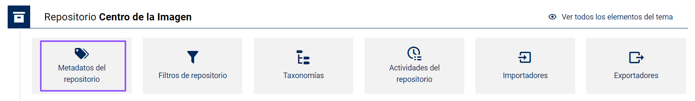

   !>**Atención**: Modificaciones en la configuración de _“metadatos a nivel de repositorio”_ que se hagan después de haber capturado datos, pueden afectar los datos ya completados y la información sobre los elementos que se crearán o ya se han creado en todo el repositorio.

4. Da clic en el _"icono de lápiz"_ a la derecha del _“metadato”_ que deseas editar;

   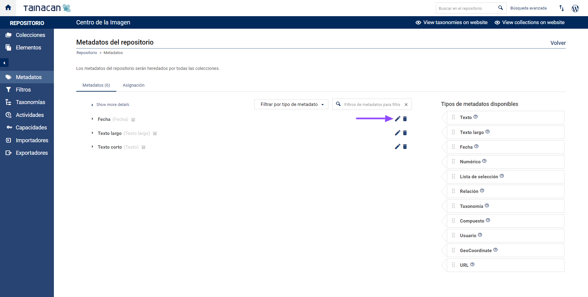

5. Cuando termines de hacer cambios, haz clic en _"Guardar"_ o en _"Cancelar"_ si no quieres conservar esa modificación;

   !>**Atención**: Una vez creado, no se puede cambiar el _“Tipo de Metadato”_.  Es decir, no se puede cambiar un _“metadato”_  del tipo _"Texto"_ para convertirlo en _"Texto largo"_ o _"Numérico"_ o _“Fecha"_. Por eso es importante definir desde el inicio el tipo que tendrá cada metadato. Si en algún momento es necesario modificar el tipo de un metadato, habrá que eliminarlo y crearlo de nuevo con el tipo correcto.

### Edición a nivel de colecciones

1. Accede al _"Panel de control"_ de WordPress;

   

2. En la barra lateral izquierda, haz clic en _"Tainacan"_;

   

3. Da clic en la _“colección”_ que deseas editar;

   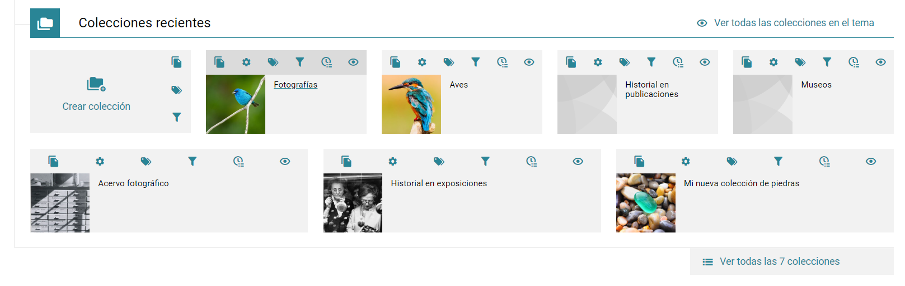

4. Da clic en _"metadatos"_;

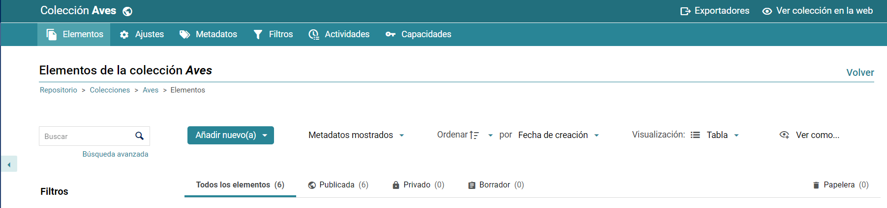

5. Da clic en el  _"icono de lápiz"_ para editar el _“metadato”;_

   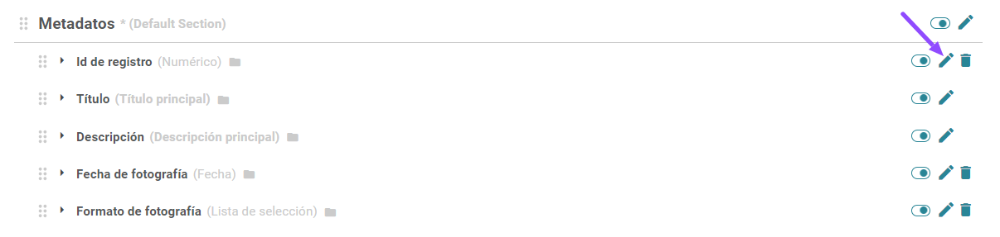

!>**Atención**: Una vez creado, no se puede cambiar el _“Tipo de Metadato”_.  Es decir, no se puede cambiar un _“metadato”_  del tipo _"Texto"_ para convertirlo en _"Texto largo"_ o _"Numérico"_ o _“Fecha"_. Por eso es importante definir desde el inicio el tipo que tendrá cada metadato. Si en algún momento es necesario modificar el tipo de un metadato, habrá que eliminarlo y crearlo de nuevo con el tipo correcto.

## Eliminar metadatos

Borrar _“Metadatos a nivel de repositorio”_:

1. Accede al _"Panel de control"_ de WordPress;

   

2. En la barra lateral izquierda, haz clic en _"Tainacan"_;

   

3. Da clic en _“Metadatos del repositorio”_ (metadatos que heredan todas las colecciones);

   

4. Da clic en el _“icono de papelera”_ a la derecha del _“metadato”_ que deseas eliminar;

   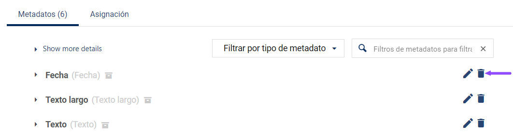

!>**Atención*: Al hacer clic en el _"icono de papelera"_, los metadatos se eliminan inmediatamente. Esta operación no se puede deshacer. Eliminar _“metadatos a nivel de repositorio”_ afectará todos los datos ya rellenados y la información de los _"elementos"_ que se han creado en todo el repositorio. Antes de borrar un _“metadato”_, se recomienda deshabilitarlo temporalmente (hasta que se tenga la certeza de que el borrado no supondrá pérdida de información). Borra el _“metadato”_ solo si estás seguro de que no habrá una pérdida grave de información. Ver [registro de actividad](/es-mx/activities) para saber más.

### Eliminar metadatos a nivel de “Colecciones”

1. Accede al _"Panel de control"_ hacer WordPress;

   

2. En la barra lateral izquierda, haz clic en _"Tainacan"_;

   

3. Da clic en la _"colección"_ que deseas editar;

   

4. Da clic en _“metadatos”;_

   

5. Da clic en el _"icono de papelera"_ que está al lado del _“metadato”_ para eliminarlo;

   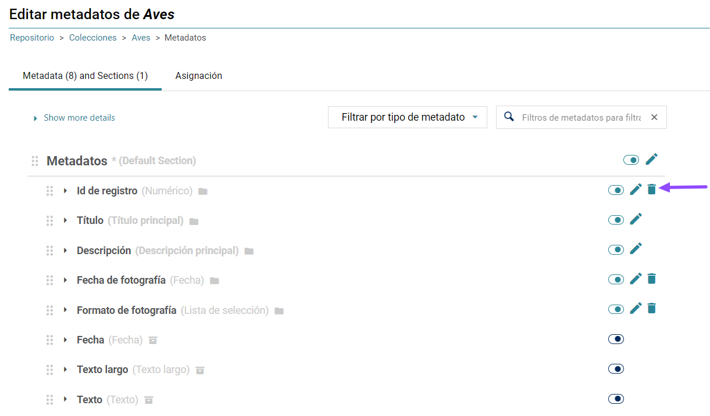

!>**Atención:** Borrar _“Metadatos a nivel de colección”_ afecta la información de todos los _"elementos"_ creados en esta _“colección”_. En la pantalla de edición de _“Metadatos”_ (a nivel de repositorio o a nivel de colección), es posible visualizar los _“metadatos ya creados”_ (o heredados) en la columna de la izquierda. La exclusión de un _“metadato”_ implica también la exclusión de sus valores en todos los _"elementos"_ que tienen este _“metadato”_. Antes de borrarlo, se recomienda que solo se deshabilite (hasta que se tenga la certeza de que el borrado no supondrá pérdida de información). Para _“deshabilitar un metadato”_, simplemente haz clic en el botón junto al _"bolígrafo de edición"_, esto ocultará el _“metadato”_ y todos sus valores, pero se recuperarán si se habilita de nuevo.

