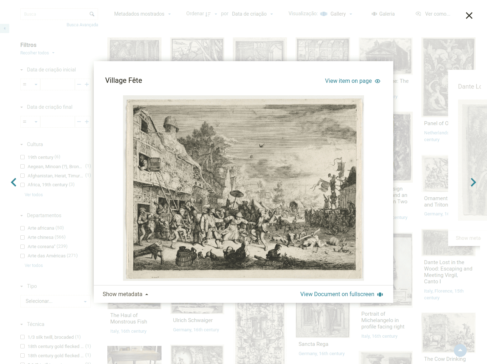
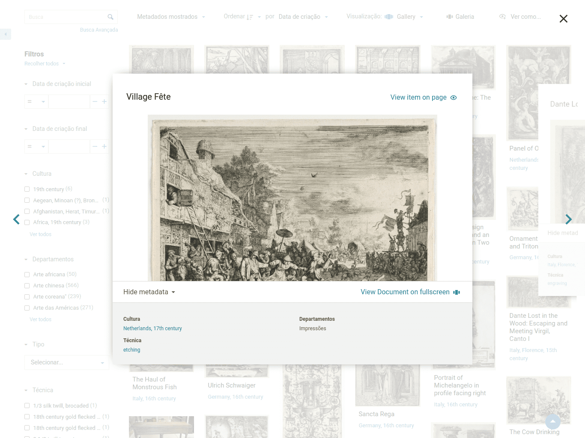
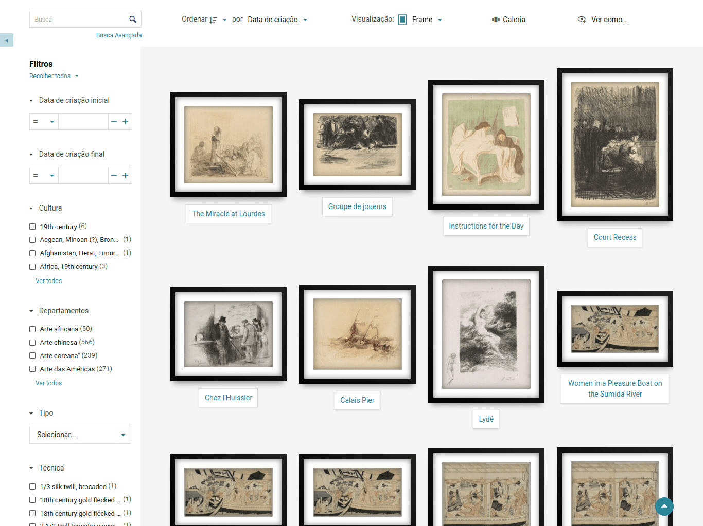
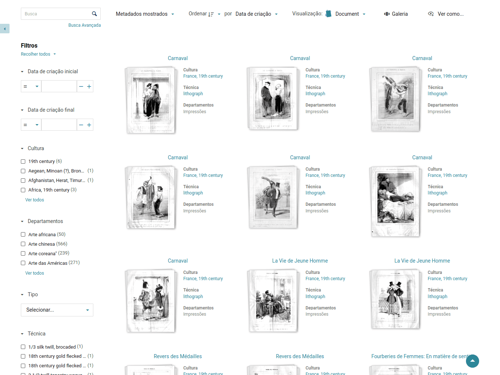
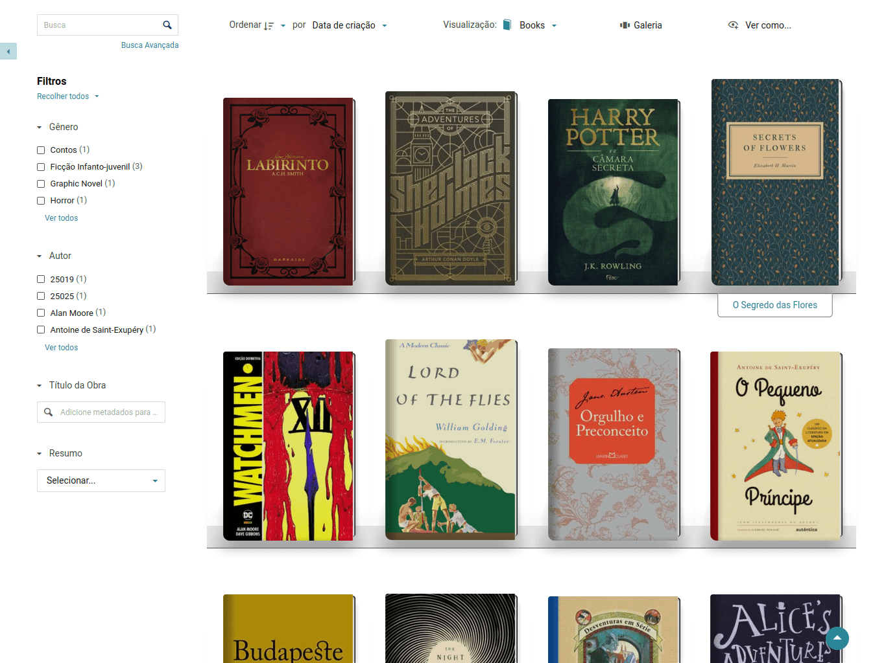

# Plugin: Modos de Visualização Extras

?> _TODO_ Esta página está en _portugués brasileño_ solo hasta ahora. **Si puede, ayúdenos a traducirlo al _español_.**

Este plugin adiciona 8 modos de visualização extras para as configurações da sua Coleção.

## Introdução

Por padrão, toda coleção do Tainacan pode mostrar a lista de itens com sete modos de visualização:

- Tabela
- Cartões
- Fichas
- Masonry
- Miniaturas (se usado o tema Tainacan Interface)
- Lista
- Tela Cheia (Galeria)

A maioria destes está disponível do lado administrativo também. Este plugin instala modos de visualização extra que serão vistos na parte pública, ou seja, no tema da sua instalação, no site em si. Eles não seguem o padrão do design do Tainacan. Foram criados nos primeiros dias de desenvolvimento do Tainacan como uma maneira de demonstrar a possibilidade deste tipo de customização e servem como um bom primeiro passo para quem quer aprender a [criar seus próprios modos de visualização customizados](/dev/extra-view-modes). Mais detalhes podem ser vistos no [post de lançamento do plugin](https://tainacan.org/blog/2021/02/04/novo-plugin-modos-de-visualizacao-extra/).

Os novos modos disponíveis são:

1. **Galeria** - Um modo estilo Masonry, mas que exibe dois metadados e abre uma visão ampliada da imagem em modal.
2. **Mosaico** - Um simples mosaico de miniaturas de itens sem margem.
3. **Moldura** - Uma visualização alinhada ao centro de minaturas com molduras, similar a exposições em galerias.
4. **Exibição** - Um modo tipo ficha com moldura, onde imagens e metadados são expandidos ao se passar o mouse.
5. **Álbuns** - Miniaturas exibidas como se fossem capas de álbuns e um disco dentro.
6. **Documento** - Fichas com estilo de papéis empilhados, voltados para divulgar artigos.
7. **Livros** - Uma visualização que imita a capa de livros, voltada para bibliotecas.
8. **Polaroid** - Uma irregular visualização de fotos com molduras estilo polaroid.

## Instalação

Na sua página de plugins do _WordPress_, procure por "Tainacan" e ative o "plugin Tainacan Modos de Visualização Extra". Você também vai encontrar ele [neste link](https://br.wordpress.org/plugins/tainacan-extra-view-modes/). Dalí, basta instalar com o clique de um botão.

Se você preferir, pode também baixar o arquivo [.zip](https://github.com/tainacan/tainacan-extra-viewmodes/releases) do [repositório do GitHub repository](https://github.com/tainacan/tainacan-extra-viewmodes) e seguir as instruções de instalação descritas em [nossa sessão sobre instalar plugins](/es-mx/plugins#instalando-os-plugins).

Ative o plugin na sessão de plugins do painel administrativo do _WordPress_.

## Configuração

Vá para a página de configuração da sua coleção. Procure pela sessão de Modos de Visualização Disponíveis e marque aqueles que você deseja que estejam disponíveis na lista do tema:

## Uso

E é isso! Agora você pode ver sua lista de diferentes maneiras. A seguir temos capturas de tela com os diferentes modos:

